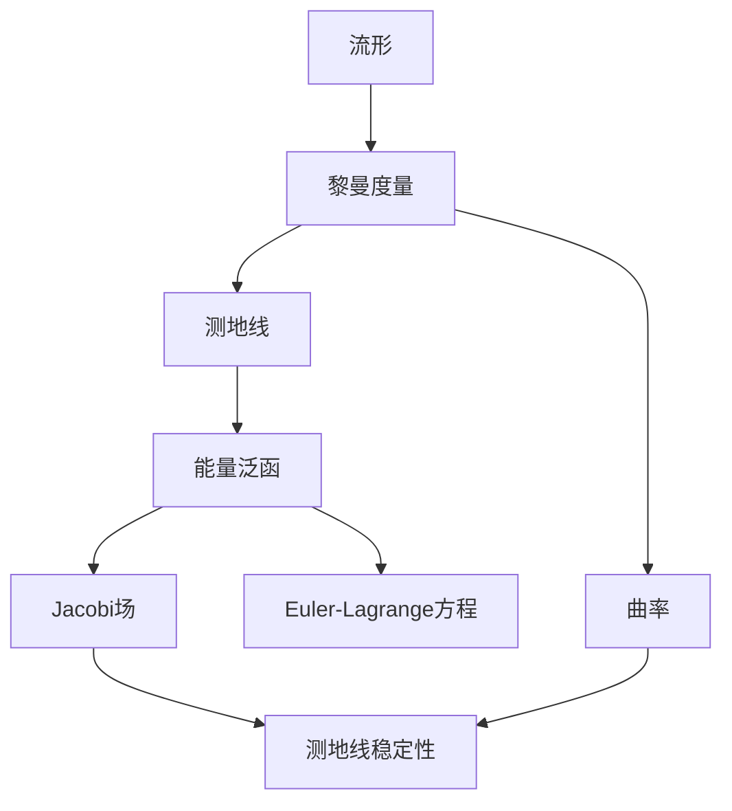

# 流形拓扑学：能量泛函的二次变分与Jacobi场

## 1. 背景介绍
### 1.1 流形拓扑学概述
#### 1.1.1 流形的定义与分类
#### 1.1.2 流形上的拓扑结构
#### 1.1.3 流形的应用领域
### 1.2 能量泛函与变分法
#### 1.2.1 能量泛函的定义
#### 1.2.2 变分法基本原理
#### 1.2.3 变分法在物理学中的应用
### 1.3 Jacobi场理论
#### 1.3.1 Jacobi场的定义
#### 1.3.2 Jacobi场的性质
#### 1.3.3 Jacobi场在微分几何中的应用

## 2. 核心概念与联系
### 2.1 流形上的黎曼度量
#### 2.1.1 黎曼度量的定义
#### 2.1.2 黎曼度量诱导的曲率
#### 2.1.3 黎曼流形的例子
### 2.2 测地线与测地线方程
#### 2.2.1 测地线的定义
#### 2.2.2 测地线方程的推导
#### 2.2.3 测地线的性质
### 2.3 能量泛函与测地线的关系
#### 2.3.1 能量泛函的几何意义
#### 2.3.2 测地线是能量泛函的极值点
#### 2.3.3 能量泛函的Euler-Lagrange方程
### 2.4 Jacobi场与测地线稳定性
#### 2.4.1 Jacobi场描述测地线的变分
#### 2.4.2 共轭点与测地线的稳定性
#### 2.4.3 Jacobi场与黎曼曲率的关系



## 3. 核心算法原理具体操作步骤
### 3.1 计算流形上的测地线
#### 3.1.1 测地线方程的数值求解
#### 3.1.2 测地线射线法
#### 3.1.3 快速行进法
### 3.2 计算Jacobi场
#### 3.2.1 Jacobi场方程的推导
#### 3.2.2 Jacobi场的数值求解
#### 3.2.3 Jacobi场与测地线偏差的关系
### 3.3 能量泛函二次变分的计算
#### 3.3.1 二次变分的定义
#### 3.3.2 Jacobi算子与指标形式
#### 3.3.3 共轭点的判定

## 4. 数学模型和公式详细讲解举例说明
### 4.1 流形上的测地线方程
在局部坐标 $(x^1,\cdots,x^n)$ 下，测地线方程为：

$$
\frac{d^2x^i}{dt^2}+\Gamma^i_{jk}\frac{dx^j}{dt}\frac{dx^k}{dt}=0
$$

其中 $\Gamma^i_{jk}$ 为 Christoffel 符号，由黎曼度量 $g_{ij}$ 决定：

$$
\Gamma^i_{jk}=\frac{1}{2}g^{il}(\partial_j g_{lk}+\partial_k g_{jl}-\partial_l g_{jk})
$$

### 4.2 Jacobi场方程
设 $\gamma(t)$ 为测地线，$J(t)$ 为沿 $\gamma(t)$ 的 Jacobi 场，则 Jacobi 场方程为：

$$
\frac{D^2 J}{dt^2}+R(J,\dot{\gamma})\dot{\gamma}=0
$$

其中 $\frac{D}{dt}$ 为沿测地线的协变导数，$R$ 为黎曼曲率张量。

### 4.3 能量泛函的二次变分
设 $\gamma(t,s)$ 为测地线的变分，能量泛函为：

$$
E(\gamma)=\frac{1}{2}\int_a^b g_{\gamma(t)}(\dot{\gamma}(t),\dot{\gamma}(t))dt
$$

能量泛函在测地线处取得极值，其二次变分为：

$$
E''(0)=\int_a^b \left(g_{\gamma(t)}(\frac{D J}{dt},\frac{D J}{dt})-g_{\gamma(t)}(R(J,\dot{\gamma})\dot{\gamma},J)\right)dt
$$

其中 $J(t)$ 为测地线 $\gamma(t)$ 的 Jacobi 场。

## 5. 项目实践：代码实例和详细解释说明
下面以 Python 语言和 NumPy 库为例，演示如何数值求解测地线方程和 Jacobi 场方程。

### 5.1 测地线方程的数值求解
```python
import numpy as np

def christoffel_symbols(g):
    """计算黎曼度量 g 的 Christoffel 符号"""
    n = g.shape[0]
    Gamma = np.zeros((n,n,n))
    g_inv = np.linalg.inv(g)
    for i in range(n):
        for j in range(n):
            for k in range(n):
                for l in range(n):
                    Gamma[i,j,k] += g_inv[i,l]*(g[l,j,k]+g[j,l,k]-g[j,k,l])/2
    return Gamma

def geodesic_equation(g, x0, v0, t):
    """数值求解测地线方程"""
    Gamma = christoffel_symbols(g)
    def f(t, y):
        x, v = y[:n], y[n:]
        dxdt = v
        dvdt = -np.einsum('ijk,j,k->i', Gamma, v, v)
        return np.concatenate((dxdt, dvdt))
    y0 = np.concatenate((x0, v0))
    sol = scipy.integrate.solve_ivp(f, (t[0],t[-1]), y0, t_eval=t)
    return sol.y[:n], sol.y[n:]
```

### 5.2 Jacobi场方程的数值求解
```python
def jacobi_field_equation(g, R, gamma, J0, t):
    """数值求解 Jacobi 场方程"""
    def f(t, J):
        x, v = gamma(t)
        DJDt = np.zeros_like(J)
        DJDt[:n] = J[n:]
        DJDt[n:] = -np.einsum('ijkl,j,k,l->i', R, J[:n], v, v)
        return DJDt
    sol = scipy.integrate.solve_ivp(f, (t[0],t[-1]), J0, t_eval=t)
    return sol.y[:n], sol.y[n:]
```

以上代码中，`g` 为黎曼度量，`R` 为黎曼曲率张量，`gamma` 为测地线，`x0`、`v0` 为测地线的初始位置和速度，`J0` 为 Jacobi 场的初值，`t` 为时间参数。通过数值积分求解常微分方程组，可以得到测地线和 Jacobi 场在不同时刻的值。

## 6. 实际应用场景
### 6.1 计算机视觉中的图像配准
在计算机视觉中，图像配准是将不同视角、不同时间拍摄的图像对齐的过程。其中一种方法是将图像视为高维流形，通过测地线将图像之间的差异最小化，从而实现配准。

### 6.2 机器学习中的流形学习
在机器学习中，流形学习是一类重要的非线性降维方法。通过学习数据点之间的测地线距离，可以发现数据的内在低维流形结构，从而实现降维和可视化。

### 6.3 物理学中的广义相对论
广义相对论将时空视为四维黎曼流形，引力场对应于时空的曲率。测地线方程描述了自由粒子在引力场中的运动轨迹，而 Jacobi 场则刻画了测地线的稳定性和引力场的性质。

## 7. 工具和资源推荐
### 7.1 数学软件
- Mathematica：强大的符号计算和可视化工具，内置了微分几何和张量分析的函数库。
- Maple：另一款常用的数学软件，也支持微分几何和张量分析。
- SageMath：基于 Python 的开源数学软件，结合了多种开源数学库的功能。

### 7.2 编程库
- NumPy：Python 的数值计算基础库，支持高效的数组操作和线性代数运算。
- SciPy：基于 NumPy 的科学计算库，提供了常微分方程求解、优化等算法。
- TensorFlow：Google 开源的深度学习框架，支持张量运算和自动微分。
- PyTorch：Facebook 开源的深度学习框架，提供了动态计算图和自动微分功能。

### 7.3 学习资源
- 书籍：
  - 《微分几何入门与广义相对论》（吴崇试）
  - 《黎曼几何初步》（陈维桓）
  - 《Modern Differential Geometry of Curves and Surfaces with Mathematica》（Alfred Gray）
- 课程：
  - MIT 18.965 Geometry of Manifolds
  - USTC 《黎曼几何与广义相对论》
- 论文：
  - Besse, A. L. (2007). Einstein manifolds. Springer Science & Business Media.
  - Jost, J. (2008). Riemannian geometry and geometric analysis. Springer Science & Business Media.

## 8. 总结：未来发展趋势与挑战
流形拓扑学与能量泛函、Jacobi 场等概念的结合，为研究动力系统的稳定性、优化问题的几何结构等提供了新的视角。当前该领域的主要发展趋势包括：

- 流形上的最优传输理论，将测地线扩展到测地线概率测度，研究密度分布之间的最优耦合与传输。
- 流形优化算法，利用黎曼几何的结构设计更高效的优化算法，如黎曼梯度下降、黎曼共轭梯度法等。
- 流形网络表示学习，利用流形结构学习图数据和网络数据的低维表示，刻画节点的相似性。

同时，该领域也面临着一些挑战：

- 高维数据的流形结构难以有效表示和学习，需要更高效的流形学习算法。
- 非光滑、不完备流形上的分析理论有待进一步发展，以处理更一般的数据类型。
- 将流形学习与深度学习等方法进行更紧密的结合，发挥两者的优势，是一个有待探索的方向。

总之，流形拓扑学与能量泛函、Jacobi 场的研究仍大有可为，有望在数据分析、人工智能等领域产生更多新的成果。

## 9. 附录：常见问题与解答
### Q1: 测地线一定是能量泛函的极小值吗？
A1: 测地线虽然是能量泛函的驻点，但不一定都是极小值。在某些情况下，测地线可能是鞍点或极大值。测地线的稳定性可以用 Jacobi 场和共轭点来刻画。

### Q2: Jacobi 场可以用来做什么？
A2: Jacobi 场主要有以下用途：
- 判断测地线的稳定性，即测地线对初始条件的扰动的敏感程度。
- 求解测地线的共轭点，刻画测地线的聚焦性质。
- 作为测地线变分的一阶近似，用于求解最优控制问题等。

### Q3: 能量泛函的二次变分有什么意义？
A3: 能量泛函的二次变分给出了测地线邻域内曲线的能量与测地线能量的差异，反映了测地线的稳定性。当二次变分为正时，测地线是稳定的极小值；当二次变分为负时，测地线是不稳定的。通过研究二次变分，可以分析测地线的 Morse 指标，刻画流形的拓扑性质。

作者：禅与计算机程序设计艺术 / Zen and the Art of Computer Programming