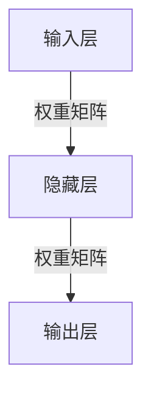
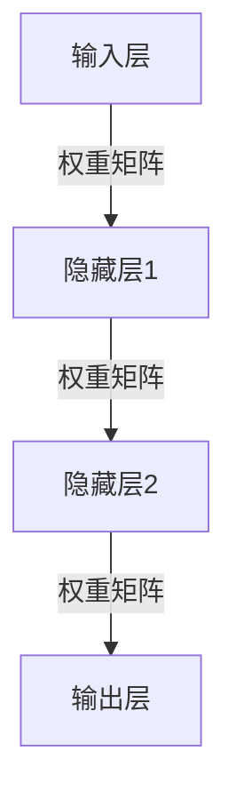
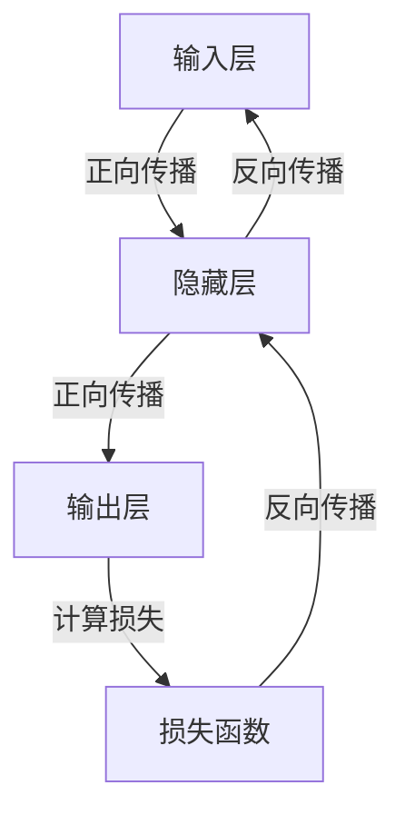

# 深度学习原理与代码实例讲解

## 1. 背景介绍

### 1.1 人工智能的发展历程

人工智能(Artificial Intelligence, AI)是当代科技领域最具革命性和颠覆性的技术之一。自20世纪50年代诞生以来,AI不断发展壮大,已经渗透到我们生活的方方面面。从最初的专家系统、机器学习算法,到近年来的深度学习技术,AI的能力不断提升,应用领域也在不断扩大。

### 1.2 深度学习的兴起

深度学习(Deep Learning)是机器学习的一个新的研究热点,它模仿人脑的机制来解释数据,通过对数据进行表征学习,体现出了在存储容量、处理速度、识别准确率等方面的优势。自2012年以来,深度学习在计算机视觉、自然语言处理、语音识别等领域取得了突破性进展,成为AI领域最有影响力的技术之一。

### 1.3 深度学习的重要性

深度学习已经成为人工智能的核心驱动力量,在工业、医疗、金融、交通等诸多领域发挥着重要作用。掌握深度学习的原理和实践技能,对于从事AI相关工作的人员来说,是必不可少的。本文将全面介绍深度学习的核心概念、算法原理、数学模型,并结合实例代码进行讲解,旨在帮助读者理解和掌握这一重要技术。

## 2. 核心概念与联系

### 2.1 神经网络

神经网络(Neural Network)是深度学习的核心基础,它模仿生物神经系统的结构和工作原理,通过对大量数据的训练,学习数据的内在规律。一个典型的神经网络由输入层、隐藏层和输出层组成,每一层由多个神经元(节点)构成。



### 2.2 前馈神经网络

前馈神经网络(Feedforward Neural Network)是最基本的神经网络结构,信息只能单向传播,从输入层经过隐藏层到达输出层。常见的前馈神经网络包括多层感知器(Multilayer Perceptron, MLP)和卷积神经网络(Convolutional Neural Network, CNN)等。



### 2.3 反向传播算法

反向传播算法(Backpropagation Algorithm)是训练神经网络的核心算法,它通过计算损失函数对网络中每个权重的梯度,并沿着反方向传播误差,不断调整权重和偏置参数,使得神经网络能够学习到最优的参数值。



### 2.4 激活函数

激活函数(Activation Function)是神经网络中的非线性函数,它引入了非线性特性,使得神经网络能够拟合更加复杂的函数。常见的激活函数包括Sigmoid函数、Tanh函数、ReLU(Rectified Linear Unit)函数等。

```mermaid
graph TD
    A[输入] -->|线性变换| B[加权求和]
    B -->|非线性变换| C[激活函数]
    C -->|输出|
```

### 2.5 优化算法

优化算法(Optimization Algorithm)用于更新神经网络中的参数,以最小化损失函数。常见的优化算法包括梯度下降(Gradient Descent)、动量优化(Momentum)、RMSProp、Adam等。选择合适的优化算法对于神经网络的训练效率和收敛性能至关重要。

### 2.6 正则化

正则化(Regularization)是一种用于防止神经网络过拟合的技术,它通过在损失函数中加入惩罚项,限制模型的复杂度,提高模型的泛化能力。常见的正则化方法包括L1正则化(Lasso Regression)、L2正则化(Ridge Regression)、Dropout等。

### 2.7 深度学习框架

深度学习框架(Deep Learning Framework)提供了便捷的编程接口和工具,简化了深度学习模型的构建、训练和部署过程。常见的深度学习框架包括TensorFlow、PyTorch、Keras、MXNet等。选择合适的框架对于高效开发深度学习应用程序至关重要。

## 3. 核心算法原理具体操作步骤

### 3.1 前馈神经网络

前馈神经网络是深度学习中最基本的网络结构,它的工作原理如下:

1. 初始化网络权重和偏置参数,通常采用小的随机值。
2. 输入数据经过输入层,传递到第一个隐藏层。
3. 在每个隐藏层,对输入数据进行加权求和运算,并通过激活函数引入非线性特性。
4. 经过多个隐藏层的处理后,数据到达输出层,输出层的输出即为网络的预测结果。
5. 计算预测结果与真实标签之间的损失函数值。
6. 通过反向传播算法,计算每个权重参数对损失函数的梯度,并采用优化算法(如梯度下降)更新权重参数。
7. 重复步骤2-6,直至损失函数收敛或达到指定的训练轮数。

以下是一个使用Python和PyTorch构建简单前馈神经网络的示例代码:

```python
import torch
import torch.nn as nn

# 定义网络结构
class FeedforwardNet(nn.Module):
    def __init__(self, input_size, hidden_size, output_size):
        super(FeedforwardNet, self).__init__()
        self.fc1 = nn.Linear(input_size, hidden_size)
        self.relu = nn.ReLU()
        self.fc2 = nn.Linear(hidden_size, output_size)

    def forward(self, x):
        out = self.fc1(x)
        out = self.relu(out)
        out = self.fc2(out)
        return out

# 创建网络实例
net = FeedforwardNet(input_size=10, hidden_size=20, output_size=5)

# 定义损失函数和优化器
criterion = nn.CrossEntropyLoss()
optimizer = torch.optim.SGD(net.parameters(), lr=0.01)

# 训练网络
for epoch in range(100):
    # 获取输入数据和标签
    inputs, labels = ...

    # 前向传播
    outputs = net(inputs)
    loss = criterion(outputs, labels)

    # 反向传播
    optimizer.zero_grad()
    loss.backward()
    optimizer.step()

    # 打印损失
    print(f'Epoch {epoch+1}, Loss: {loss.item()}')
```

### 3.2 卷积神经网络

卷积神经网络(Convolutional Neural Network, CNN)是一种专门用于处理图像数据的神经网络结构,它通过卷积操作和池化操作来提取图像的特征,具有较强的空间不变性。CNN的工作原理如下:

1. 输入图像数据经过卷积层,通过滤波器(卷积核)对图像进行卷积操作,提取局部特征。
2. 经过激活函数引入非线性特性。
3. 池化层对特征图进行下采样,减小特征图的维度,提高计算效率。
4. 重复卷积层和池化层的操作,提取不同层次的特征。
5. 最后通过全连接层对提取的特征进行分类或回归。
6. 计算损失函数,通过反向传播算法更新网络参数。

以下是一个使用PyTorch构建简单卷积神经网络的示例代码:

```python
import torch
import torch.nn as nn

# 定义网络结构
class ConvNet(nn.Module):
    def __init__(self):
        super(ConvNet, self).__init__()
        self.conv1 = nn.Conv2d(3, 16, kernel_size=3, padding=1)
        self.relu = nn.ReLU()
        self.pool = nn.MaxPool2d(2, 2)
        self.conv2 = nn.Conv2d(16, 32, kernel_size=3, padding=1)
        self.fc = nn.Linear(32 * 8 * 8, 10)

    def forward(self, x):
        out = self.conv1(x)
        out = self.relu(out)
        out = self.pool(out)
        out = self.conv2(out)
        out = self.relu(out)
        out = self.pool(out)
        out = out.view(-1, 32 * 8 * 8)
        out = self.fc(out)
        return out

# 创建网络实例
net = ConvNet()

# 定义损失函数和优化器
criterion = nn.CrossEntropyLoss()
optimizer = torch.optim.SGD(net.parameters(), lr=0.001)

# 训练网络
for epoch in range(10):
    # 获取输入数据和标签
    inputs, labels = ...

    # 前向传播
    outputs = net(inputs)
    loss = criterion(outputs, labels)

    # 反向传播
    optimizer.zero_grad()
    loss.backward()
    optimizer.step()

    # 打印损失
    print(f'Epoch {epoch+1}, Loss: {loss.item()}')
```

### 3.3 循环神经网络

循环神经网络(Recurrent Neural Network, RNN)是一种专门用于处理序列数据(如文本、语音等)的神经网络结构,它通过引入循环连接,允许信息在序列中传递,捕捉序列数据的时间依赖性。RNN的工作原理如下:

1. 初始化隐藏状态和单元状态(对于LSTM)。
2. 在每个时间步,将当前输入和上一时间步的隐藏状态(或单元状态)作为输入,通过RNN单元(如简单RNN单元或LSTM单元)计算当前时间步的隐藏状态(或单元状态)和输出。
3. 重复步骤2,直到处理完整个序列。
4. 根据需求,可以使用最后一个时间步的隐藏状态(或单元状态)进行分类或回归,或者将所有时间步的输出进行解码。
5. 计算损失函数,通过反向传播算法更新网络参数。

以下是一个使用PyTorch构建简单LSTM网络的示例代码:

```python
import torch
import torch.nn as nn

# 定义网络结构
class LSTMNet(nn.Module):
    def __init__(self, input_size, hidden_size, output_size):
        super(LSTMNet, self).__init__()
        self.hidden_size = hidden_size
        self.lstm = nn.LSTM(input_size, hidden_size, batch_first=True)
        self.fc = nn.Linear(hidden_size, output_size)

    def forward(self, x):
        out, _ = self.lstm(x)
        out = out[:, -1, :]  # 取最后一个时间步的隐藏状态
        out = self.fc(out)
        return out

# 创建网络实例
net = LSTMNet(input_size=10, hidden_size=20, output_size=5)

# 定义损失函数和优化器
criterion = nn.CrossEntropyLoss()
optimizer = torch.optim.Adam(net.parameters(), lr=0.001)

# 训练网络
for epoch in range(100):
    # 获取输入序列数据和标签
    inputs, labels = ...

    # 前向传播
    outputs = net(inputs)
    loss = criterion(outputs, labels)

    # 反向传播
    optimizer.zero_grad()
    loss.backward()
    optimizer.step()

    # 打印损失
    print(f'Epoch {epoch+1}, Loss: {loss.item()}')
```

## 4. 数学模型和公式详细讲解举例说明

### 4.1 神经网络模型

神经网络模型可以表示为一个函数 $f$,它将输入数据 $\mathbf{x}$ 映射到输出 $\mathbf{y}$,即:

$$\mathbf{y} = f(\mathbf{x}; \mathbf{W}, \mathbf{b})$$

其中 $\mathbf{W}$ 表示网络中的权重参数, $\mathbf{b}$ 表示偏置参数。

对于一个具有 $L$ 层的前馈神经网络,其输出可以表示为:

$$\mathbf{y} = f_L(\mathbf{W}_L f_{L-1}(\mathbf{W}_{L-1} \cdots f_1(\mathbf{W}_1 \mathbf{x} + \mathbf{b}_1) + \mathbf{b}_{L-1}) + \mathbf{b}_L)$$

其中 $f_l$ 表示第 $l$ 层的激活函数,如ReLU函数:

$$\text{ReLU}(x) = \max(0, x)$$

### 