# 物理学中的群论：张量表示的直乘分解

## 1.背景介绍

在物理学中,我们经常会遇到各种张量表示,它们描述了粒子或场的内在自由度。例如,电磁场可以用一个二阶张量来表示,而自旋 1/2 粒子的波函数则是一个4分量的Dirac 旋量。这些张量表示通常会在某些对称性群的作用下保持不变。

群论为我们提供了一种有效的工具来研究这些对称性,并将复杂的张量表示分解为不可约表示的直和。这种直乘分解不仅有助于我们理解系统的对称性,而且在实际计算中也可以极大地简化问题。

## 2.核心概念与联系

### 2.1 群与群表示

群是一种代数结构,由一个非空集合和一个在该集合上定义的二元运算组成,并满足结合律、幺元存在和逆元存在的条件。群论研究群的性质及其在数学和物理学中的应用。

群表示是一个从群到矩阵群的同态映射,它将群元素映射为矩阵,并保持群运算的结构。每个不可约表示对应于群的一个不可分解的子空间。通过将群表示分解为不可约表示的直和,我们可以简化计算并揭示系统的对称性。

### 2.2 张量表示

在物理学中,我们常常使用张量来描述粒子或场的内在自由度。张量是一种具有多个分量的数学对象,可以用矩阵或多维数组来表示。例如,一个二阶张量可以用一个 3x3 的矩阵来表示,而一个四分量的 Dirac 旋量则对应于一个四维向量。

张量表示通常会在某些对称性群的作用下保持不变。例如,电磁场的张量表示在洛伦兹变换群的作用下是不变的,而自旋 1/2 粒子的波函数在 SU(2) 群的作用下是不变的。

### 2.3 直乘分解

直乘分解是将一个张量表示分解为不可约表示的直和的过程。具体来说,如果一个群表示 $\rho$ 可以写成不可约表示 $\rho_i$ 的直和:

$$\rho = \rho_1 \oplus \rho_2 \oplus \cdots \oplus \rho_n$$

那么我们就说 $\rho$ 可以直乘分解为 $\rho_i$。直乘分解不仅有助于我们理解系统的对称性,而且在实际计算中也可以极大地简化问题。

## 3.核心算法原理具体操作步骤

直乘分解的核心算法原理可以概括为以下几个步骤:

1. **构造群表示矩阵**: 对于给定的群和张量表示,我们首先需要构造出相应的群表示矩阵。这通常可以通过计算群元素在张量表示空间中的作用来实现。

2. **寻找不变子空间**: 接下来,我们需要在张量表示的矢量空间中寻找不变子空间,即在群作用下保持不变的子空间。这可以通过计算群表示矩阵的本征向量和本征值来实现。

3. **分解为不可约表示**: 一旦找到了不变子空间,我们就可以将原始的张量表示分解为这些不变子空间上的不可约表示的直和。每个不可约表示对应于一个不可分解的不变子空间。

4. **简化计算**: 最后,我们可以利用直乘分解的结果来简化相关的计算。由于不可约表示通常具有较小的维数,因此在不可约表示空间中进行计算往往比在原始的张量表示空间中更加高效。

以下是一个具体的示例,说明如何对一个四分量的 Dirac 旋量进行直乘分解:

1. 构造 SU(2) 群的表示矩阵,即 $2 \times 2$ 的 Pauli 矩阵。

2. 计算 Pauli 矩阵在四分量 Dirac 旋量空间中的作用,得到 $4 \times 4$ 的群表示矩阵。

3. 求解群表示矩阵的本征值和本征向量,发现存在两个二维不变子空间。

4. 将四分量 Dirac 旋量分解为这两个二维不可约表示的直和。

5. 在这两个二维不可约表示空间中进行相关的计算,可以大大简化问题。

## 4.数学模型和公式详细讲解举例说明

在上一节中,我们介绍了直乘分解的核心算法原理。现在,让我们来看一些具体的数学模型和公式,并通过例子加深理解。

### 4.1 群表示

设 $G$ 是一个群,而 $V$ 是一个复线性空间。如果存在一个同态映射 $\rho: G \rightarrow GL(V)$,使得对于任意的 $g_1, g_2 \in G$ 和 $v \in V$,都有:

$$\rho(g_1g_2)v = \rho(g_1)\rho(g_2)v$$

那么我们就说 $\rho$ 是 $G$ 在 $V$ 上的一个线性表示。特别地,如果 $V$ 是一个有限维复线性空间,而 $\rho(g)$ 是一个矩阵,那么我们就称 $\rho$ 为 $G$ 的一个矩阵表示。

例如,对于 SU(2) 群,我们可以构造出它在二维复线性空间 $\mathbb{C}^2$ 上的矩阵表示,即著名的 Pauli 矩阵:

$$\rho(g) = \begin{pmatrix}
a & b \\
c & d
\end{pmatrix}, \quad ad - bc = 1$$

其中 $a, b, c, d$ 是复数,满足单位行列式的条件。

### 4.2 不可约表示

如果一个群表示 $\rho$ 在某个非平凡的子空间 $W \subset V$ 上也是一个表示,那么我们就说 $W$ 是 $\rho$ 的一个子表示。如果 $\rho$ 没有非平凡的子表示,那么我们就称 $\rho$ 为不可约表示。

不可约表示具有以下重要性质:

1. 任何有限维群表示都可以分解为不可约表示的直和。
2. 同一个不可约表示在不同的等价表示中出现的次数是相同的。
3. 不可约表示完全由它的最高权重向量确定。

因此,研究一个群的不可约表示就等价于研究这个群的所有不可约表示。

### 4.3 直乘分解

设 $\rho$ 是一个群 $G$ 在线性空间 $V$ 上的表示。如果存在 $V$ 的一组子空间 $V_i$,使得:

1. $V = V_1 \oplus V_2 \oplus \cdots \oplus V_n$
2. 对任意 $g \in G$,有 $\rho(g)V_i \subset V_i$

那么我们就说 $\rho$ 可以分解为不可约表示 $\rho_i$ 的直和,即:

$$\rho = \rho_1 \oplus \rho_2 \oplus \cdots \oplus \rho_n$$

其中 $\rho_i$ 是 $\rho$ 在 $V_i$ 上的子表示。

例如,对于四分量 Dirac 旋量的表示,我们可以将它分解为两个二维不可约表示的直和,即:

$$\rho = \rho_+ \oplus \rho_-$$

其中 $\rho_+$ 和 $\rho_-$ 分别对应于正、负能量解。

### 4.4 Young 框图

Young 框图是一种可视化工具,用于表示直积表示的分解。它由一些左右对齐的框组成,每一行的框数不多于上一行。每个框代表一个指标,而每一行的框数则对应于该指标的取值范围。

例如,对于一个二阶张量 $T_{ij}$,我们可以用一个 Young 框图来表示它的对称性:

```mermaid
graph LR
    A[&#8198;&#8198;]
    B[&#8198;&#8198;]
```



这个 Young 框图表示 $T_{ij}$ 在两个指标 $i$ 和 $j$ 对换时保持不变。而对于一个三阶张量 $T_{ijk}$,我们可以用以下 Young 框图来表示它的对称性:

```mermaid
graph LR
    A[&#8198;&#8198;&#8198;]
    B[&#8198;&#8198;]
    C[&#8198;]
```



这个 Young 框图表示 $T_{ijk}$ 在前两个指标 $i$ 和 $j$ 对换时保持不变,但在第三个指标 $k$ 与前两个指标对换时改变符号。

Young 框图为我们提供了一种直观的方式来表示张量的对称性,并且在直乘分解中也扮演着重要的角色。

## 5.项目实践:代码实例和详细解释说明

为了更好地理解直乘分解的概念和应用,让我们来看一个具体的代码实例。在这个例子中,我们将计算 SU(2) 群在四分量 Dirac 旋量空间上的表示,并将其分解为不可约表示的直和。

我们将使用 Python 和 NumPy 库来实现这个例子。首先,我们定义 SU(2) 群的生成元,即 Pauli 矩阵:

```python
import numpy as np

# Pauli matrices
sigma_x = np.array([[0, 1], [1, 0]])
sigma_y = np.array([[0, -1j], [1j, 0]])
sigma_z = np.array([[1, 0], [0, -1]])
```

接下来,我们构造 SU(2) 群在四分量 Dirac 旋量空间上的表示矩阵:

```python
# Representation of SU(2) on the Dirac spinor space
rho_x = np.kron(sigma_x, np.eye(2))
rho_y = np.kron(sigma_y, np.eye(2))
rho_z = np.kron(sigma_z, np.eye(2))
```

这里我们使用了 NumPy 的 `kron` 函数来计算克罗内克积,从而得到 $4 \times 4$ 的表示矩阵。

现在,我们可以计算这些表示矩阵的本征值和本征向量,以找到不变子空间:

```python
# Eigenvalues and eigenvectors
eigenvalues, eigenvectors = np.linalg.eigh(rho_z)
print("Eigenvalues:", eigenvalues)
print("Eigenvectors:", eigenvectors)
```

输出结果显示,存在两个二维不变子空间,对应于本征值 $\pm 1$ 的本征向量。因此,我们可以将四分量 Dirac 旋量的表示分解为两个二维不可约表示的直和:

```python
# Decomposition into irreducible representations
psi_plus = eigenvectors[:, 0:2]
psi_minus = eigenvectors[:, 2:4]

print("Positive energy solution:", psi_plus)
print("Negative energy solution:", psi_minus)
```

这个例子展示了如何在代码中实现直乘分解的过程。通过计算群表示矩阵的本征值和本征向量,我们可以找到不变子空间,并将原始的表示分解为不可约表示的直和。这种分解不仅有助于我们理解系统的对称性,而且在实际计算中也可以大大简化问题。

## 6.实际应用场景

直乘分解在物理学中有着广泛的应用,尤其是在量子力学、粒子物理和凝聚态物理等领域。以下是一些典型的应用场景:

### 6.1 原子和分子的能级结构

在原子和分子中,电子的运动受到原子核和其他电子的库仑作用的影响。这种相互作用具有一定的对称性,可以用某些群来描述。通过将电子的波函数分解为不可约表示的直和,我们可以得到原子或分子的能级结构,并预测它们的光谱线。

### 6.2 晶体中的电子能带结构

在固体晶体中,电子的运动受到周期性离子势的影响。这种周期性可以用平移对称群来描述。通过将电子的波函数分解为不可约表示的直和,我们可以得到晶体中的能带结构,从而解释固体的电学和光学性质。

### 6.3 粒子物理中的规范理论

在粒子物理中,我们经常会遇到各种规范理论,如量子电动力学和量子色动力学。这些理论中的