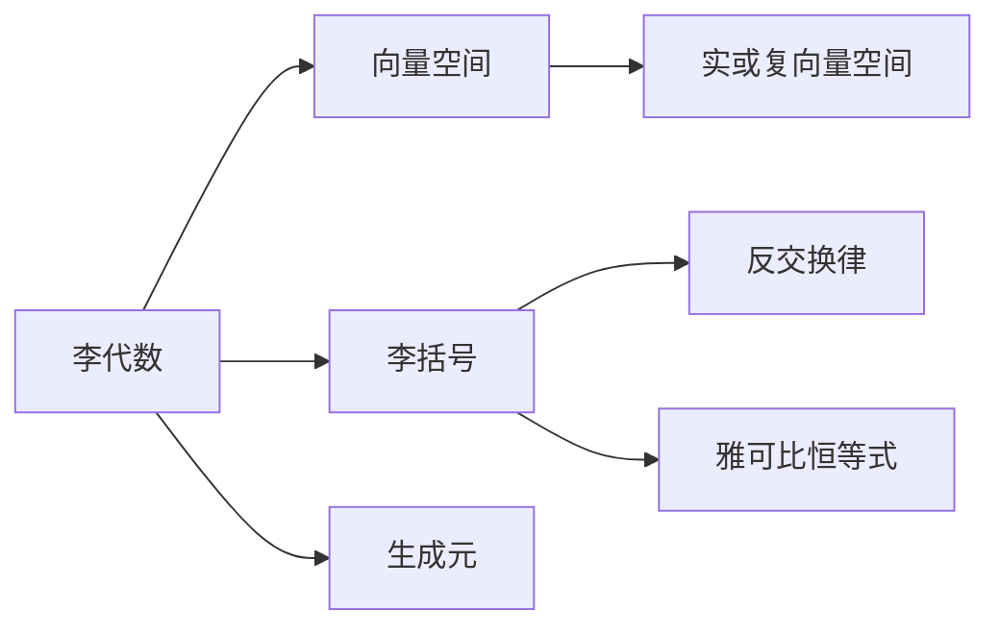
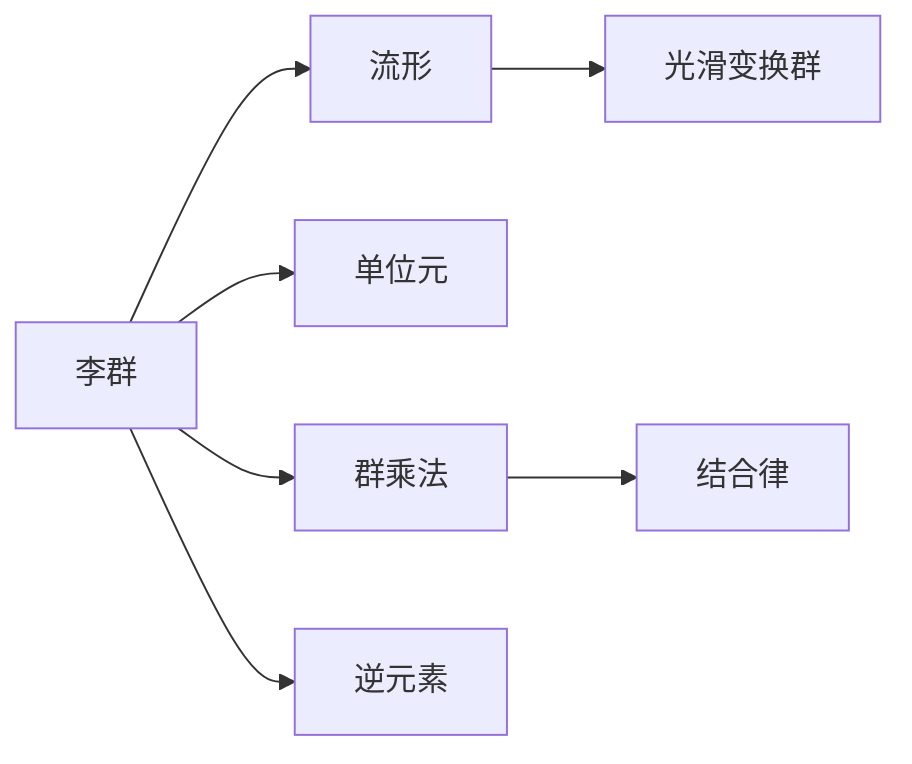
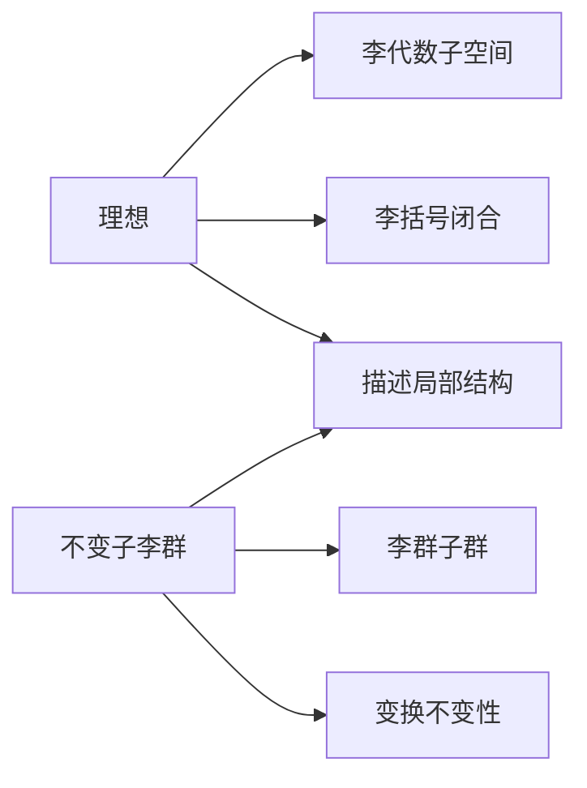

# 物理学中的群论：李代数的理想和李群的不变子李群

## 1.背景介绍

在现代物理学中,群论扮演着非常重要的角色。群论不仅为研究对称性提供了强有力的数学工具,而且还为量子力学、相对论和粒子物理学等领域奠定了坚实的理论基础。其中,李代数和李群是群论中两个关键概念,它们在描述连续对称性和相互作用时发挥着核心作用。

### 1.1 群论在物理学中的重要性

群论为物理学家提供了一种研究对称性的有力工具。对称性是自然界中普遍存在的一种基本特征,它不仅体现在宏观世界中,也贯穿于微观粒子的运动规律之中。通过研究对称性,我们可以揭示自然界的本质规律,并建立更精确、更统一的物理理论。

在量子力学中,对称性原理是构建理论的基石之一。例如,电子的自旋是由空间旋转对称性所决定的,而量子力学中的守恒定律也源自于相应的连续对称性。在相对论中,洛伦兹不变性是描述时空对称性的关键,它导致了著名的狭义相对论效应。

### 1.2 李代数和李群的重要性

李代数和李群为研究连续对称性提供了强有力的数学框架。与有限群不同,李群是一种连续无穷维的群,它可以精确描述物理系统中的连续对称性变换,如旋转、平移和洛伦兹变换等。

李代数是一种特殊的代数结构,它与李群存在着内在的联系。李代数为研究李群的结构和性质提供了有效的代数工具。通过研究李代数的理想和李群的不变子李群,我们可以深入理解物理系统中的对称性和守恒定律。

## 2.核心概念与联系

### 2.1 李代数

李代数是一种非交换代数,它由一个向量空间和一个满足特定性质的二元运算(称为李括号)组成。李代数的基本概念包括:

- 向量空间:李代数是一个实或复向量空间。
- 李括号:李代数中的二元运算,满足反交换律和雅可比恒等式。
- 生成元:通过有限个生成元及其线性组合,可以生成整个李代数。

李代数的一个重要性质是它与李群存在着紧密的联系。每个李群都对应一个李代数,而李代数则描述了李群在单位元附近的局部结构。

### 2.2 李群

李群是一种连续无穷维的群,它是流形上的一个光滑变换群。李群的基本概念包括:

- 流形:李群是定义在流形上的一个光滑变换群。
- 单位元:李群中存在单位元,即恒等变换。
- 群乘法:李群中的元素可以进行群乘法运算,并满足结合律。
- 逆元素:每个李群元素都存在逆元素,使得元素与其逆元素的乘积为单位元。

李群与李代数之间存在着紧密的联系。每个李群都对应一个李代数,而李代数则描述了李群在单位元附近的局部结构。通过研究李代数,我们可以揭示李群的许多重要性质。

### 2.3 理想与不变子李群

理想和不变子李群是李代数和李群中两个重要的概念,它们对于研究对称性和守恒定律具有重要意义。

- 理想:李代数的一个子空间,对于李括号运算是闭合的,即任何元素与理想中的元素做李括号运算,结果仍在理想中。
- 不变子李群:李群的一个子群,对于李群的变换是不变的,即任何李群元素与不变子李群中的元素做群乘法运算,结果仍在不变子李群中。

理想和不变子李群之间也存在着紧密的联系。每个不变子李群都对应一个理想,而理想则描述了不变子李群在单位元附近的局部结构。通过研究理想和不变子李群,我们可以揭示物理系统中的对称性和守恒定律。

## 3.核心算法原理具体操作步骤

### 3.1 构造李代数

构造一个李代数的基本步骤如下:

1. 确定向量空间:选择一个实或复向量空间作为李代数的基础。
2. 定义李括号:在向量空间上引入一个二元运算,满足反交换律和雅可比恒等式。
3. 验证性质:检验所定义的李括号是否满足李代数的基本性质,如线性性、反交换律和雅可比恒等式。
4. 确定生成元:找到一组生成元,通过它们及其线性组合可以生成整个李代数。

例如,我们可以在三维实向量空间 $\mathbb{R}^3$ 上定义一个李括号:

$$[x,y] = x \times y$$

其中 $\times$ 表示向量外积运算。可以验证,这个李括号满足反交换律和雅可比恒等式,因此它定义了一个三维实李代数,通常被称为 $\mathfrak{so}(3)$ 或旋转李代数。

### 3.2 构造李群

构造一个李群的基本步骤如下:

1. 确定流形:选择一个适当的流形作为李群的基础。
2. 定义群乘法:在流形上引入一个二元运算,满足结合律和单位元存在性。
3. 验证性质:检验所定义的群乘法是否满足李群的基本性质,如结合律、单位元存在性和逆元素存在性。
4. 确定生成元:找到一组生成元,通过它们及其有限乘积可以生成整个李群。

例如,我们可以在三维实向量空间 $\mathbb{R}^3$ 上定义一个李群,通常被称为 $SO(3)$ 或三维旋转群。它由所有三维正交矩阵组成,群乘法为矩阵乘法。这个李群描述了三维空间中的所有旋转变换。

### 3.3 求解理想

求解一个李代数的理想的基本步骤如下:

1. 确定子空间:找到李代数中的一个子空间。
2. 验证闭合性:检验这个子空间对于李括号运算是否闭合,即任何元素与子空间中的元素做李括号运算,结果仍在子空间中。
3. 确定理想:如果子空间满足闭合性,则它就是一个理想。
4. 求解所有理想:通过系统的方法,找到李代数中的所有理想。

例如,在三维实李代数 $\mathfrak{so}(3)$ 中,由于任何向量与零向量的外积都是零向量,因此零向量子空间 $\{0\}$ 是一个理想。事实上,在任何李代数中,零向量子空间都是一个理想,被称为平凡理想。

### 3.4 求解不变子李群

求解一个李群的不变子李群的基本步骤如下:

1. 确定子群:找到李群中的一个子群。
2. 验证不变性:检验这个子群对于李群的变换是否不变,即任何李群元素与子群中的元素做群乘法运算,结果仍在子群中。
3. 确定不变子李群:如果子群满足不变性,则它就是一个不变子李群。
4. 求解所有不变子李群:通过系统的方法,找到李群中的所有不变子李群。

例如,在三维旋转群 $SO(3)$ 中,由于任何旋转矩阵与单位矩阵相乘都等于该旋转矩阵本身,因此单位矩阵子群 $\{I\}$ 是一个不变子李群。事实上,在任何李群中,单位元子群都是一个不变子李群,被称为平凡不变子李群。

## 4.数学模型和公式详细讲解举例说明

### 4.1 李代数的数学模型

李代数可以用一个有限维向量空间 $\mathfrak{g}$ 和一个满足特定性质的二元运算 $[\cdot,\cdot]$ 来表示,即 $(\mathfrak{g}, [\cdot,\cdot])$。这个二元运算被称为李括号,它满足以下性质:

1. 反交换律:

$$[x,y] = -[y,x]$$

2. 雅可比恒等式:

$$[x,[y,z]] + [y,[z,x]] + [z,[x,y]] = 0$$

3. 线性性:

$$[\alpha x + \beta y, z] = \alpha [x,z] + \beta [y,z]$$

其中 $x,y,z \in \mathfrak{g}$, $\alpha,\beta$ 是标量。

李代数的一个重要性质是它与李群存在着紧密的联系。每个李群都对应一个李代数,而李代数则描述了李群在单位元附近的局部结构。具体来说,如果 $G$ 是一个李群,那么它的李代数 $\mathfrak{g}$ 是由 $G$ 在单位元处的所有切向量组成的向量空间,李括号则由群乘法在单位元处的导数定义。

### 4.2 李群的数学模型

李群是一种连续无穷维的群,它是定义在流形上的一个光滑变换群。一个李群 $G$ 可以用一个流形 $M$ 和一个满足特定性质的二元运算 $\cdot$ 来表示,即 $(M, \cdot)$。这个二元运算被称为群乘法,它满足以下性质:

1. 结合律:

$$\forall x,y,z \in G, (x \cdot y) \cdot z = x \cdot (y \cdot z)$$

2. 单位元存在性:存在一个单位元 $e \in G$,对于任何 $x \in G$,都有 $e \cdot x = x \cdot e = x$。
3. 逆元素存在性:对于任何 $x \in G$,都存在一个逆元素 $x^{-1} \in G$,使得 $x \cdot x^{-1} = x^{-1} \cdot x = e$。

李群与李代数之间存在着紧密的联系。每个李群都对应一个李代数,而李代数则描述了李群在单位元附近的局部结构。具体来说,如果 $G$ 是一个李群,那么它的李代数 $\mathfrak{g}$ 是由 $G$ 在单位元处的所有切向量组成的向量空间,李括号则由群乘法在单位元处的导数定义。

### 4.3 理想的数学模型

在李代数 $(\mathfrak{g}, [\cdot,\cdot])$ 中,一个理想是指一个子向量空间 $\mathfrak{i} \subset \mathfrak{g}$,对于任何 $x \in \mathfrak{g}$, $y \in \mathfrak{i}$,都有:

$$[x,y] \in \mathfrak{i}$$

也就是说,理想对于李括号运算是闭合的。

理想具有以下重要性质:

1. 平凡理想:零向量子空间 $\{0\}$ 总是一个理想,被称为平凡理想。
2. 理想和:如果 $\mathfrak{i}_1$ 和 $\mathfrak{i}_2$ 都是 $\mathfrak{g}$ 的理想,那么它们的和 $\mathfrak{i}_1 + \mathfrak{i}_2$ 也是一个理想。
3. 理想交:如果 $\mathfrak{i}_1$ 和 $\mathfrak{i}_2$ 都是 $\mathfrak{g}$ 的理想,那么它们的交 $\mathfrak{i}_1 \cap \mathfrak{i}_2$ 也是一个理想。

理想与李群的不变子李群之间存在着紧密的联系。每个不