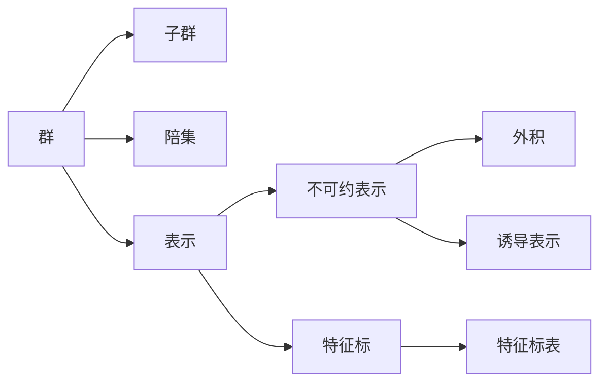

# 物理学中的群论：置换群不可约表示的外积

## 1. 背景介绍
### 1.1 群论在物理学中的应用
#### 1.1.1 对称性与守恒律
#### 1.1.2 基本粒子的分类
#### 1.1.3 晶体结构的分析
### 1.2 置换群及其表示理论
#### 1.2.1 置换群的定义与性质
#### 1.2.2 置换群的表示
#### 1.2.3 不可约表示及其重要性

## 2. 核心概念与联系
### 2.1 群、子群与陪集
### 2.2 表示与不可约表示
### 2.3 特征标与特征标表
### 2.4 外积与诱导表示
### 2.5 Mermaid流程图


## 3. 核心算法原理具体操作步骤
### 3.1 构造置换群的不可约表示
#### 3.1.1 Young图与Young表
#### 3.1.2 填充Young表
#### 3.1.3 生成不可约表示矩阵
### 3.2 计算不可约表示的外积
#### 3.2.1 克罗内克积
#### 3.2.2 约化外积表示
#### 3.2.3 Clebsch-Gordan系数

## 4. 数学模型和公式详细讲解举例说明
### 4.1 置换群的定义与记号
### 4.2 表示矩阵与特征标
#### 4.2.1 表示矩阵的定义
$$\rho:G \rightarrow GL(V)$$
#### 4.2.2 特征标的计算
$$\chi_{\rho}(g)=\mathrm{Tr}(\rho(g))$$
### 4.3 不可约表示的外积
#### 4.3.1 外积的定义
$$(\rho_1 \otimes \rho_2)(g)=\rho_1(g) \otimes \rho_2(g)$$
#### 4.3.2 Clebsch-Gordan系数
$$|j_1,m_1\rangle \otimes |j_2,m_2\rangle = \sum_{J=|j_1-j_2|}^{j_1+j_2}\sum_{M=-J}^{J} C_{j_1m_1j_2m_2}^{JM}|J,M\rangle$$

## 5. 项目实践：代码实例和详细解释说明
### 5.1 SymPy中的置换群与表示
#### 5.1.1 创建置换群
```python
from sympy.combinatorics import Permutation, PermutationGroup
S3 = PermutationGroup(Permutation(1,2), Permutation(1,2,3))
```
#### 5.1.2 生成不可约表示
```python
from sympy.physics.quantum.represent import represent
rho = represent(S3, S3.irreps[1])
```
### 5.2 计算不可约表示的外积
#### 5.2.1 克罗内克积
```python
from sympy.physics.quantum.tensorproduct import TensorProduct
rho1 = represent(S3, S3.irreps[1]) 
rho2 = represent(S3, S3.irreps[2])
rho_prod = TensorProduct(rho1, rho2)
```
#### 5.2.2 约化外积表示
```python
from sympy.physics.quantum.cg import CG
J1, J2 = S3.irreps[1], S3.irreps[2]
for J in J1*J2:
    print(f"({J1},{J2})->({J})")
    for M1 in J1.mvals:
        for M2 in J2.mvals:
            for M in J.mvals:
                cg = CG(J1,M1,J2,M2,J,M).doit()
                if cg != 0:
                    print(f"<{J1},{M1}|<{J2},{M2}|{J},{M}> = {cg}")
```

## 6. 实际应用场景
### 6.1 量子力学中的角动量耦合
#### 6.1.1 自旋角动量耦合
#### 6.1.2 轨道角动量耦合
### 6.2 基本粒子物理中的味对称性
#### 6.2.1 夸克模型与SU(3)味对称性
#### 6.2.2 重子八重态与十重态
### 6.3 晶体物理中的空间群

## 7. 工具和资源推荐
### 7.1 数学软件
- Mathematica
- SymPy
- GAP(Groups, Algorithms, Programming)
### 7.2 教材与参考书
- 《Group Theory in Physics》 by Wu-Ki Tung
- 《Lie Groups, Lie Algebras, and Representations》 by Brian C. Hall
- 《Symmetries and Group Theory in Particle Physics》 by Giovanni Costa, Gianluigi Fogli

## 8. 总结：未来发展趋势与挑战
### 8.1 群论在物理学新领域的应用
#### 8.1.1 拓扑绝缘体与拓扑超导体
#### 8.1.2 量子计算与量子纠错码
### 8.2 计算群论的新进展
#### 8.2.1 机器学习在表示论中的应用
#### 8.2.2 并行计算与大规模群论计算

## 9. 附录：常见问题与解答
### 9.1 为什么不可约表示如此重要？
不可约表示是研究群表示的基础，任意表示都可以分解为不可约表示的直和。不可约表示之间的关系（如外积分解）揭示了群的深层结构，在物理学的对称性分析中有广泛应用。

### 9.2 置换群的不可约表示与Young图、Young表的关系是什么？
置换群的不可约表示可以用Young图来标记。Young图每一行的长度对应一个分划，而不同的Young表（填充数字的方式）则对应于同一个不可约表示空间中的不同基向量。由此可以构造出置换群不可约表示的矩阵形式。

### 9.3 外积与直积有何区别？
外积（Kronecker积）是将两个向量空间的元素对应相乘，构成一个新的向量空间，其维数是原来两个空间维数的乘积。群表示的外积遵循相应的运算法则。而直积是对两个群做笛卡尔乘积，构成一个新的群，其阶数是原来群阶数的乘积。两个群表示的直积定义为其在直积群上的表示。


作者：禅与计算机程序设计艺术 / Zen and the Art of Computer Programming