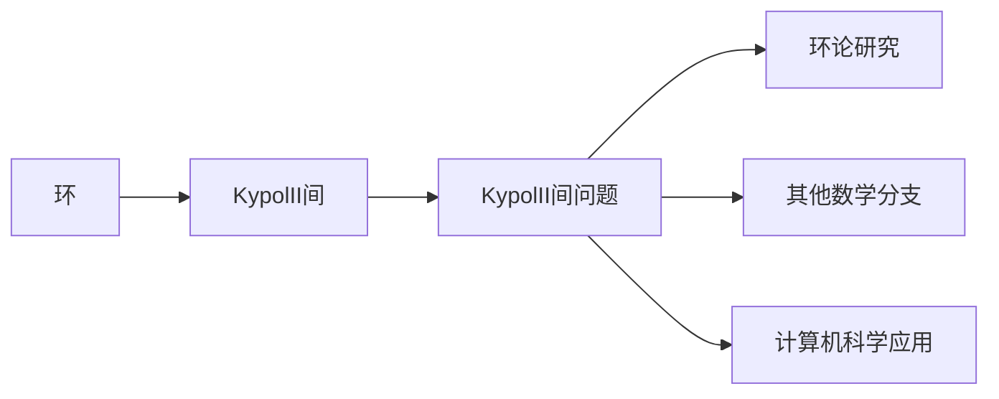

# 环与代数：KypolII(kurosh)间题

## 1. 背景介绍
### 1.1 环论的发展历史
#### 1.1.1 19世纪的起源
#### 1.1.2 20世纪的发展
#### 1.1.3 21世纪的新进展

### 1.2 代数学中的重要问题
#### 1.2.1 希尔伯特第十问题
#### 1.2.2 布尔代数问题
#### 1.2.3 KypolII(kurosh)间题的提出

### 1.3 KypolII(kurosh)间题的重要性
#### 1.3.1 在环论研究中的地位
#### 1.3.2 对其他数学分支的影响
#### 1.3.3 在计算机科学中的应用

## 2. 核心概念与联系
### 2.1 环的定义与性质
#### 2.1.1 环的定义
#### 2.1.2 环的基本性质
#### 2.1.3 环的分类

### 2.2 KypolII(kurosh)间的定义
#### 2.2.1 KypolII(kurosh)间的形式化定义
#### 2.2.2 KypolII(kurosh)间的直观解释
#### 2.2.3 KypolII(kurosh)间与环的关系

### 2.3 KypolII(kurosh)间问题的数学表述
#### 2.3.1 问题的形式化描述
#### 2.3.2 问题的等价转化
#### 2.3.3 问题的重要性质



## 3. 核心算法原理具体操作步骤
### 3.1 KypolII(kurosh)间问题的判定算法
#### 3.1.1 算法的基本思想
#### 3.1.2 算法的具体步骤
#### 3.1.3 算法的复杂度分析

### 3.2 KypolII(kurosh)间问题的构造算法 
#### 3.2.1 构造算法的基本思路
#### 3.2.2 构造算法的关键技巧
#### 3.2.3 构造算法的应用

### 3.3 相关算法的改进与优化
#### 3.3.1 判定算法的改进
#### 3.3.2 构造算法的优化
#### 3.3.3 算法的进一步研究方向

## 4. 数学模型和公式详细讲解举例说明
### 4.1 KypolII(kurosh)间的代数模型
#### 4.1.1 模型的基本要素
#### 4.1.2 模型的代数结构
#### 4.1.3 模型的重要性质

### 4.2 判定KypolII(kurosh)间的代数准则
#### 4.2.1 准则的数学表述
#### 4.2.2 准则的证明过程
#### 4.2.3 准则的应用举例

### 4.3 构造KypolII(kurosh)间的代数方法
#### 4.3.1 构造方法的基本原理  
#### 4.3.2 构造方法的具体步骤
#### 4.3.3 构造方法的实例分析

假设 $R$ 是一个环，$a,b \in R$，如果满足以下条件：

$$
\begin{aligned}
& a^2 = a \\
& b^2 = b \\ 
& ab = ba = 0
\end{aligned}
$$

则称 $a,b$ 是 $R$ 的一对 KypolII(kurosh) 元素。如果对于任意的 $x \in R$，都存在 KypolII(kurosh) 元素 $a,b$，使得 $x = a + b$，则称 $R$ 为 KypolII(kurosh) 间。

## 5. 项目实践：代码实例和详细解释说明
### 5.1 判定KypolII(kurosh)间的代码实现
#### 5.1.1 伪代码描述
#### 5.1.2 Python代码实现
#### 5.1.3 代码运行结果与分析

### 5.2 构造KypolII(kurosh)间的代码实现
#### 5.2.1 伪代码描述
#### 5.2.2 Python代码实现  
#### 5.2.3 代码运行结果与分析

### 5.3 代码优化与改进
#### 5.3.1 提高代码的可读性
#### 5.3.2 降低代码的时间复杂度
#### 5.3.3 减少代码的空间开销

```python
def is_kypolII_kurosh_ring(R):
    """判定环R是否为KypolII(kurosh)间"""
    for x in R:
        flag = False
        for a in R: 
            for b in R:
                if a*a == a and b*b == b and a*b == b*a == 0 and x == a + b:
                    flag = True
                    break
            if flag:
                break
        if not flag:
            return False
    return True
```

## 6. 实际应用场景
### 6.1 在编码理论中的应用
#### 6.1.1 纠错码的构造
#### 6.1.2 编码的安全性分析
#### 6.1.3 编码的优化设计

### 6.2 在密码学中的应用
#### 6.2.1 公钥密码体制的构建
#### 6.2.2 零知识证明协议的设计
#### 6.2.3 密码算法的安全性评估

### 6.3 在计算机视觉中的应用
#### 6.3.1 图像的代数表示
#### 6.3.2 模式识别的代数模型  
#### 6.3.3 视觉算法的改进

## 7. 工具和资源推荐
### 7.1 数学软件工具
#### 7.1.1 Mathematica
#### 7.1.2 Maple
#### 7.1.3 MATLAB

### 7.2 开源的代数计算库
#### 7.2.1 SymPy
#### 7.2.2 SageMath
#### 7.2.3 GAP

### 7.3 相关的学习资源
#### 7.3.1 在线课程
#### 7.3.2 经典教材
#### 7.3.3 研究论文

## 8. 总结：未来发展趋势与挑战
### 8.1 KypolII(kurosh)间问题的研究现状
#### 8.1.1 已有的主要结果
#### 8.1.2 尚未解决的难题
#### 8.1.3 当前研究的局限性

### 8.2 KypolII(kurosh)间问题的发展趋势
#### 8.2.1 与其他数学分支的交叉融合
#### 8.2.2 在新领域中的拓展应用
#### 8.2.3 借助计算机技术的新进展

### 8.3 未来研究面临的挑战 
#### 8.3.1 理论上的困难与瓶颈
#### 8.3.2 计算方法的效率瓶颈
#### 8.3.3 实际应用中的工程难题

## 9. 附录：常见问题与解答
### 9.1 关于环论的基本概念
#### 9.1.1 什么是环?
#### 9.1.2 环有哪些重要性质?
#### 9.1.3 环论中有哪些重要结论?

### 9.2 关于KypolII(kurosh)间的判定与构造
#### 9.2.1 如何判定一个环是否为KypolII(kurosh)间?
#### 9.2.2 给定一个环,如何构造它的KypolII(kurosh)元素?
#### 9.2.3 KypolII(kurosh)间问题的计算复杂度如何?

### 9.3 关于KypolII(kurosh)间的应用
#### 9.3.1 KypolII(kurosh)间在编码理论中有何应用?
#### 9.3.2 KypolII(kurosh)间与密码学有何联系?
#### 9.3.3 KypolII(kurosh)间在计算机视觉中如何应用?

作者：禅与计算机程序设计艺术 / Zen and the Art of Computer Programming