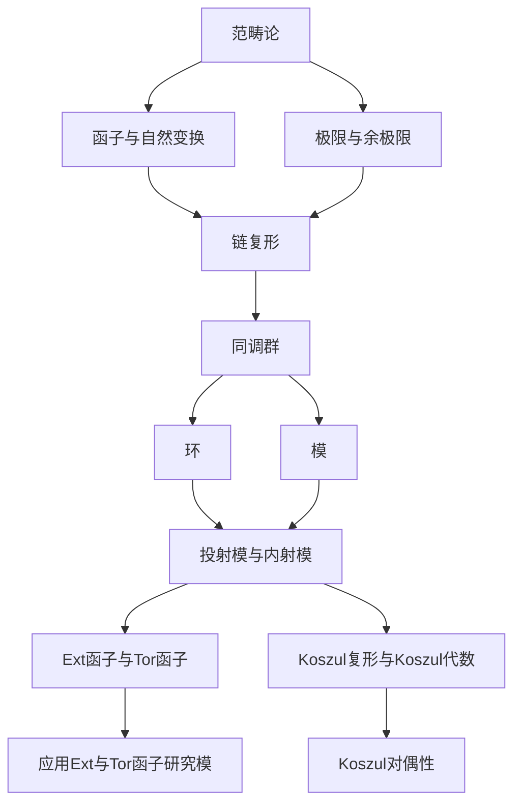

# 环与代数：同调代数简介

## 1.背景介绍
### 1.1 代数学的发展历程
#### 1.1.1 古典代数学
#### 1.1.2 近代抽象代数学
#### 1.1.3 现代同调代数学
### 1.2 同调代数的起源与发展
#### 1.2.1 拓扑学中的同调理论
#### 1.2.2 从拓扑到代数的过渡 
#### 1.2.3 同调代数的诞生与应用

## 2.核心概念与联系
### 2.1 范畴论基础
#### 2.1.1 范畴的定义与性质
#### 2.1.2 函子与自然变换
#### 2.1.3 极限与余极限
### 2.2 链复形与同调
#### 2.2.1 链复形的构造
#### 2.2.2 链映射与链同伦
#### 2.2.3 同调群的定义与计算
### 2.3 环、模与复形
#### 2.3.1 环的定义与性质
#### 2.3.2 模的概念与分类
#### 2.3.3 投射模与内射模
#### 2.3.4 环上复形与同调

## 3.核心算法原理具体操作步骤
### 3.1 计算同调群的一般步骤
#### 3.1.1 构造链复形
#### 3.1.2 计算每一维的循环群与边缘群
#### 3.1.3 计算每一维的同调群
### 3.2 长正合列与五引理
#### 3.2.1 正合列的定义
#### 3.2.2 长正合列的构造
#### 3.2.3 五引理及其应用
### 3.3 谱序列计算方法
#### 3.3.1 谱序列的基本概念
#### 3.3.2 Serre谱序列
#### 3.3.3 Leray-Serre谱序列
#### 3.3.4 Grothendieck谱序列

## 4.数学模型和公式详细讲解举例说明
### 4.1 环、模与同调代数
#### 4.1.1 环与模的基本性质
#### 4.1.2 投射模与内射模的刻画
#### 4.1.3 环上同调代数的计算
### 4.2 Ext函子与Tor函子
#### 4.2.1 Ext函子的定义与性质
#### 4.2.2 Tor函子的定义与性质 
#### 4.2.3 Ext与Tor函子的应用
### 4.3 Koszul复形与Koszul代数
#### 4.3.1 Koszul复形的构造
#### 4.3.2 Koszul代数的定义与性质
#### 4.3.3 Koszul对偶性

## 5.项目实践：代码实例和详细解释说明
### 5.1 用Python实现同调群计算
#### 5.1.1 构造链复形的数据结构
#### 5.1.2 实现边缘算子与同调算子
#### 5.1.3 计算同调群的Python代码
### 5.2 用Sage计算Ext与Tor
#### 5.2.1 Sage中的环与模
#### 5.2.2 用Sage计算Ext群
#### 5.2.3 用Sage计算Tor群
### 5.3 用Macaulay2研究Koszul代数
#### 5.3.1 Macaulay2中的环与模
#### 5.3.2 构造Koszul复形
#### 5.3.3 验证Koszul对偶性

## 6.实际应用场景
### 6.1 代数拓扑中的应用
#### 6.1.1 基本群与纽覆盖空间
#### 6.1.2 高维球面与流形的分类
#### 6.1.3 纽结理论与纽结不变量
### 6.2 代数几何中的应用
#### 6.2.1 交叉理论与交叉复形
#### 6.2.2 层上同调与Grothendieck纯度定理
#### 6.2.3 Hodge理论与混合Hodge结构
### 6.3 物理学中的应用
#### 6.3.1 规范场论与陈类
#### 6.3.2 弦理论与镜像对称
#### 6.3.3 拓扑量子场论

## 7.工具和资源推荐
### 7.1 学习资源推荐
#### 7.1.1 经典教材与参考书
#### 7.1.2 在线课程与视频资源
#### 7.1.3 学术论文与研究综述
### 7.2 计算机代数系统
#### 7.2.1 Sage数学软件
#### 7.2.2 Macaulay2
#### 7.2.3 GAP与MAGMA
### 7.3 其他相关工具
#### 7.3.1 Kenzo与Linbox
#### 7.3.2 Homological Algebra Programming(HAP) 
#### 7.3.3 Perseus与JavaPlex

## 8.总结：未来发展趋势与挑战
### 8.1 同调代数的前沿研究方向
#### 8.1.1 高阶范畴与高阶同调代数
#### 8.1.2 微分分次代数与L无穷代数
#### 8.1.3 模形式与椭圆上同调
### 8.2 计算同调代数的挑战
#### 8.2.1 大规模复杂系统的同调计算
#### 8.2.2 并行计算与分布式算法
#### 8.2.3 机器学习与人工智能方法
### 8.3 同调代数的应用前景
#### 8.3.1 组合拓扑与组合同调
#### 8.3.2 计算机视觉与图像处理
#### 8.3.3 生物信息学与药物设计

## 9.附录：常见问题与解答
### 9.1 范畴论基础问题解答
### 9.2 同调代数计算问题解答
### 9.3 Ext与Tor函子问题解答
### 9.4 Koszul代数问题解答
### 9.5 同调代数应用问题解答

同调代数是现代数学的一个重要分支,它以抽象代数为基础,利用同调群等代数工具研究拓扑空间、流形、代数簇等几何对象的性质。同调代数在拓扑学、代数几何、物理学等领域有广泛应用,是连接几何与代数的桥梁。

在拓扑学中,同调群刻画了拓扑空间中的"洞"的代数性质。通过计算基本群、同伦群、同调群等代数不变量,可以分类和刻画拓扑空间。例如用欧拉示性数、Betti数、扭率等刻画流形,用Jones多项式、HOMFLY多项式等刻画纽结。

在代数几何中,交叉理论利用同调代数研究代数簇的奇点、交点和奇异性。Hodge理论利用复流形上的Hodge分解和混合Hodge结构研究代数簇的拓扑性质。Grothendieck纯度定理揭示层上同调与代数簇的内在联系。

在物理学中,规范场论利用纤维丛上的联络和陈类研究粒子的内禀对称性。弦理论中的镜像对称现象可用Calabi-Yau流形上的变周期和Fukaya范畴刻画。拓扑量子场论利用流形上的Floer同调研究低维流形不变量。

下图概括了同调代数的核心概念与逻辑联系:



在实际计算同调群时,一般步骤如下:

1. 将拓扑空间、代数簇等对象抽象为链复形。
2. 计算每一维的循环群 $Z_n$ 和边缘群 $B_n$。 
3. 计算同调群 $H_n=Z_n/B_n$。

例如对于一个单纯复形 $X$,可定义其链群 $C_n(X)$ 为 $n$ 维单纯形生成的自由群,边缘算子 $\partial_n: C_n(X)\to C_{n-1}(X)$ 将 $n$ 维单纯形映射为其边界的交错和。循环群 $Z_n(X)=\ker \partial_n$,边缘群 $B_n(X)=\operatorname{im} \partial_{n+1}$,同调群 $H_n(X)=Z_n(X)/B_n(X)$。

对于环 $R$ 上的链复形 $C_\bullet=(C_n,\partial_n)$,其中每个 $C_n$ 都是 $R$-模,边缘算子满足 $\partial_n \partial_{n+1}=0$,则同理可定义环上同调 $H_n(C_\bullet)=\ker \partial_n/\operatorname{im}\partial_{n+1}$。

长正合列是计算同调群的有力工具。如果有链复形的短正合列:
$$
0 \to A_\bullet \to B_\bullet \to C_\bullet \to 0
$$
则存在长正合列:
$$
\cdots \to H_n(A_\bullet) \to H_n(B_\bullet) \to H_n(C_\bullet) \to H_{n-1}(A_\bullet) \to \cdots
$$
利用五引理,在已知部分同调群的情况下,可以推出另一些同调群。

谱序列是计算同调群的另一个强大工具。例如Serre谱序列可计算纤维丛的同调群,Leray-Serre谱序列可计算流形芽层上同调,Grothendieck谱序列可计算层上同调。谱序列本质上是将同调群的计算转化为逐次计算每一页的微分。

对于环 $R$ 上的模 $M,N$,可定义Ext函子 $\operatorname{Ext}_R^n(M,N)$ 和Tor函子 $\operatorname{Tor}_n^R(M,N)$,它们度量了模之间的同调性质。例如 $\operatorname{Ext}_R^1(M,N)$ 刻画了模的扩张,而 $\operatorname{Tor}_1^R(M,N)$ 刻画了模的挠率。

Koszul复形与Koszul代数在研究二次代数、二次对偶、正则序列等方面有重要作用。对于域 $k$ 上的有限维二次代数 $A=T(V)/(R)$,其中 $R\subset V\otimes V$,可定义其Koszul复形 $K_\bullet(A)$。若 $K_\bullet(A)$ 是正合的,称 $A$ 为Koszul代数。Koszul代数的一个重要性质是其Ext代数 $E(A)$ 与二次对偶代数 $A^!$ 同构。

同调代数在计算机代数系统中有广泛实现。例如在Sage中可方便地创建链复形、计算同调群、计算Ext和Tor等。以下Sage代码计算圆环 $S^1\times S^1$ 上的同调群:

```python
sage: C = simplicial_complexes.Torus()
sage: C.homology()
{0: 0, 1: Z x Z, 2: Z}
```

这表明 $H_0(S^1\times S^1)\cong \mathbb{Z},H_1(S^1\times S^1)\cong \mathbb{Z}^2,H_2(S^1\times S^1)\cong \mathbb{Z}$。

Macaulay2是研究交换代数、代数几何的常用软件。以下Macaulay2代码验证了 $\mathbb{Q}[x,y]/(x^2,y^2)$ 是Koszul代数:

```
i1 : R = QQ[x,y];
i2 : I = ideal(x^2,y^2);
i3 : A = R/I;
i4 : res A
o4 = R^1 <-- R^2 <-- R^1 <-- 0
         0      1      2      3
o4 : ChainComplex
```

从free resolution可知 $A$ 的Koszul复形是正合的,因此其为Koszul代数。

展望未来,同调代数仍有许多开放问题和发展方向:

- 高阶范畴与高阶同调代数将范畴论推广到更高维,研究高维范畴、无穷范畴、导出范畴等的同调性质。
- 微分分次代数与L无穷代数将同调代数与丰富的代数结构(如A无穷结构、L无穷结构等)相结合,在弦拓扑、镜像对称等领域有重要应用。
- 模形式与椭圆上同调利用椭圆曲线、模形式