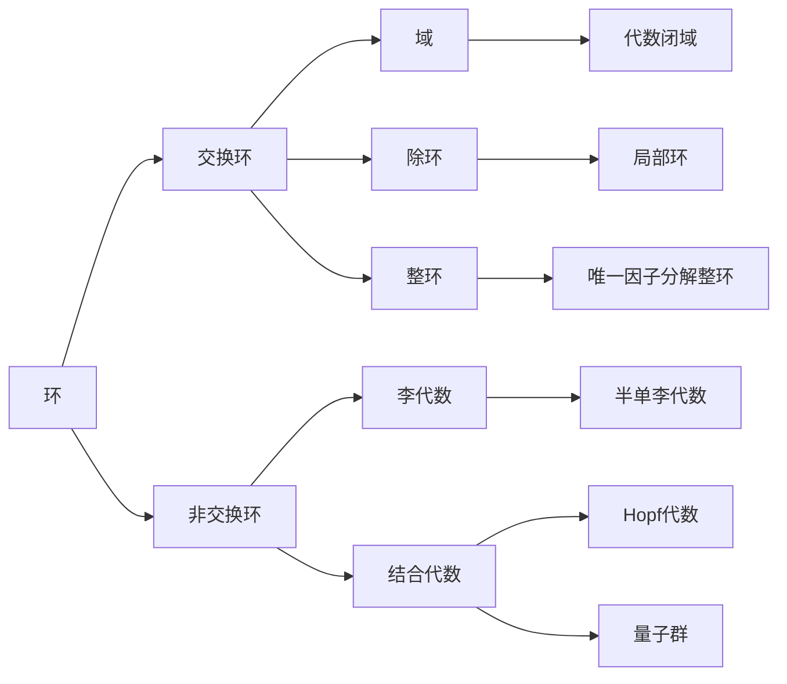

# 环与代数：无限代数的若干问题

## 1.背景介绍
### 1.1 代数结构概述
### 1.2 环论的发展历程
#### 1.2.1 早期发展
#### 1.2.2 现代环论
#### 1.2.3 无限代数的兴起
### 1.3 无限代数研究意义

## 2.核心概念与联系
### 2.1 环的定义与性质
#### 2.1.1 环的定义
#### 2.1.2 交换律、结合律、分配律
#### 2.1.3 单位元、零因子
### 2.2 域、除环与整环
#### 2.2.1 域的定义与性质
#### 2.2.2 除环的定义与性质 
#### 2.2.3 整环的定义与性质
### 2.3 模与理想
#### 2.3.1 模的定义与性质
#### 2.3.2 子模与商模
#### 2.3.3 理想的定义与性质
### 2.4 无限代数基本概念
#### 2.4.1 无限维向量空间
#### 2.4.2 无限生成代数
#### 2.4.3 无限表示论

## 3.核心算法原理具体操作步骤
### 3.1 Gröbner 基的构造算法
#### 3.1.1 单项式序的选取
#### 3.1.2 多项式的除法算法
#### 3.1.3 Buchberger 算法
### 3.2 有限表示判定算法
#### 3.2.1 Noether 归纳化简
#### 3.2.2 Hilbert 级数的计算
#### 3.2.3 表示有限性判别
### 3.3 同调代数计算方法
#### 3.3.1 复形与同调
#### 3.3.2 投射分解与内射分解
#### 3.3.3 同调代数的计算

## 4.数学模型和公式详细讲解举例说明
### 4.1 Hilbert 级数与生成函数
#### 4.1.1 Hilbert 级数的定义
$$H(A,t)=\sum_{i=0}^{\infty} (\dim A_i) t^i$$
#### 4.1.2 生成函数与母函数
#### 4.1.3 Hilbert 级数的性质
### 4.2 Ext 函子与 Tor 函子
#### 4.2.1 函子的定义
#### 4.2.2 Ext 函子的定义与性质
$$\mathrm{Ext}_R^n(M,N)=H^n(\mathrm{Hom}_R(P_*,N))$$
#### 4.2.3 Tor 函子的定义与性质 
$$\mathrm{Tor}_n^R(M,N)=H_n(P_*\otimes_R N)$$
### 4.3 Koszul 复形
#### 4.3.1 Koszul 代数的定义
#### 4.3.2 Koszul 复形的构造
#### 4.3.3 Koszul 对偶性

## 5.项目实践：代码实例和详细解释说明
### 5.1 Macaulay2 软件介绍
### 5.2 使用 Macaulay2 计算 Gröbner 基
```Macaulay2
R = QQ[x,y,z];
I = ideal(x^3-y^2,x^2*y-z^2);
gens gb I
```
### 5.3 使用 Macaulay2 计算模的投射分解
```Macaulay2 
R = ZZ/32003[a..d];
M = coker matrix{{a,b,c},{c,d,a},{b,c,d}};
res M
```
### 5.4 使用 Macaulay2 计算 Ext 与 Tor
```Macaulay2
R = QQ[a..d];
I = ideal(a^3,b^3,c^3,d^3); 
M = R^1/I;
Ext(M,M)
Tor(M,M) 
```

## 6.实际应用场景
### 6.1 代数几何中的应用
#### 6.1.1 代数簇与理想
#### 6.1.2 Hilbert 多项式与维数
### 6.2 编码理论中的应用
#### 6.2.1 循环码的构造
#### 6.2.2 BCH 码与 Reed-Solomon 码
### 6.3 组合数学中的应用
#### 6.3.1 组合恒等式
#### 6.3.2 母函数与生成函数

## 7.工具和资源推荐
### 7.1 计算机代数系统
#### 7.1.1 Macaulay2
#### 7.1.2 Singular
#### 7.1.3 CoCoA
### 7.2 在线资源
#### 7.2.1 arXiv
#### 7.2.2 MathSciNet
#### 7.2.3 数学学习网站
### 7.3 经典专著
#### 7.3.1 《Commutative Algebra》 - Atiyah & MacDonald
#### 7.3.2 《Introduction to Commutative Algebra》- Matsumura 
#### 7.3.3 《Infinite Dimensional Lie Algebras》- Kac

## 8.总结：未来发展趋势与挑战
### 8.1 同调代数与导出范畴
### 8.2 量子群与量子代数
### 8.3 非交换代数几何
### 8.4 计算机科学中的应用前景

## 9.附录：常见问题与解答
### 9.1 为什么要研究无限维代数？ 
### 9.2 环论与数论有何联系？
### 9.3 如何系统学习代数学？
### 9.4 计算机代数系统能解决哪些问题？



无限代数是一个庞大而深刻的数学分支，它源于经典的有限维代数理论，但又有其独特的研究视角和方法。本文试图从环论出发，探讨无限代数中的若干基本问题，如无限维向量空间、无限生成代数、表示论等，并介绍一些重要的理论工具如Gröbner基、Hilbert级数、Ext与Tor函子等。同时，文章还结合Macaulay2软件，给出了一些具体的代码实例，以帮助读者加深理解。

无限代数在现代数学和理论物理中有着广泛的应用，如代数几何、编码理论、量子群论等。这些领域的发展也反过来促进了无限代数理论的进一步完善。展望未来，无限代数还有许多亟待探索的问题，如导出范畴、非交换代数几何等。随着计算机科学的发展，无限代数在信息技术领域也有望得到更多应用。

总之，无限代数是一片广阔而富饶的数学沃土，它的研究不仅能深化我们对代数结构的认识，也为其他学科提供了有力的理论工具。作为数学工作者，我们应该以开放的心态去接纳新的思想和方法，在传承经典的同时，不断开拓创新，将这一领域推向新的高度。

作者：禅与计算机程序设计艺术 / Zen and the Art of Computer Programming