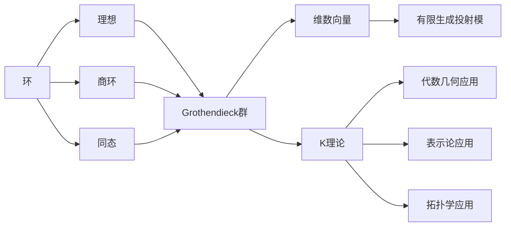

# 环与代数：维数向量与Grothendieck群

## 1. 背景介绍
### 1.1 环论与代数学
#### 1.1.1 环的定义与基本性质
#### 1.1.2 代数学中的环理论应用
#### 1.1.3 环论研究的意义
### 1.2 Grothendieck群的起源
#### 1.2.1 Alexandre Grothendieck的数学贡献
#### 1.2.2 Grothendieck群的提出背景
#### 1.2.3 Grothendieck群在代数几何中的应用

## 2. 核心概念与联系
### 2.1 环的核心概念
#### 2.1.1 环的定义与分类
#### 2.1.2 环的理想与商环
#### 2.1.3 环的同态与同构
### 2.2 Grothendieck群的核心概念
#### 2.2.1 K理论与Grothendieck群
#### 2.2.2 Grothendieck群的构造
#### 2.2.3 Grothendieck群的普适性质
### 2.3 维数向量的概念
#### 2.3.1 维数向量的定义
#### 2.3.2 维数向量与Grothendieck群的关系
#### 2.3.3 维数向量在代数几何中的应用

## 3. 核心算法原理具体操作步骤
### 3.1 构造Grothendieck群的算法
#### 3.1.1 幂等元的定义与性质
#### 3.1.2 幂等元生成的理想
#### 3.1.3 构造Grothendieck群的具体步骤
### 3.2 计算维数向量的算法
#### 3.2.1 有限生成投射模的维数向量
#### 3.2.2 计算维数向量的具体步骤
#### 3.2.3 维数向量的性质与应用

## 4. 数学模型和公式详细讲解举例说明
### 4.1 环的数学模型
#### 4.1.1 环的公理化定义
#### 4.1.2 环的运算律与交换律
#### 4.1.3 环的单位元与零元
### 4.2 Grothendieck群的数学模型
#### 4.2.1 K理论的公理化定义
#### 4.2.2 Grothendieck群的泛性质
#### 4.2.3 Grothendieck群的例子
### 4.3 维数向量的数学模型 
#### 4.3.1 有限生成模的定义
#### 4.3.2 投射模与自由模
#### 4.3.3 维数向量的计算公式

## 5. 项目实践：代码实例和详细解释说明
### 5.1 用Python实现环的基本运算
#### 5.1.1 定义环的数据结构
#### 5.1.2 实现环的加法与乘法运算
#### 5.1.3 验证环的基本性质
### 5.2 用Sage计算Grothendieck群
#### 5.2.1 Sage中的环与理想
#### 5.2.2 构造商环得到Grothendieck群
#### 5.2.3 验证Grothendieck群的性质
### 5.3 用Macaulay2计算维数向量
#### 5.3.1 Macaulay2中的模与同调代数
#### 5.3.2 计算投射模的维数向量  
#### 5.3.3 利用维数向量研究代数簇

## 6. 实际应用场景
### 6.1 Grothendieck群在代数几何中的应用
#### 6.1.1 Chow群与K群
#### 6.1.2 Riemann-Roch定理
#### 6.1.3 高维代数簇的研究
### 6.2 Grothendieck群在表示论中的应用  
#### 6.2.1 有限群的表示论
#### 6.2.2 Burnside环与表示环
#### 6.2.3 模表示的Grothendieck群
### 6.3 Grothendieck群在拓扑学中的应用
#### 6.3.1 向量丛的K理论
#### 6.3.2 Atiyah-Hirzebruch谱序列
#### 6.3.3 椭圆上同调的计算

## 7. 工具和资源推荐
### 7.1 环论与Grothendieck群的学习资源
#### 7.1.1 经典教材与参考书
#### 7.1.2 在线课程与视频资源
#### 7.1.3 研究论文与综述文章
### 7.2 计算Grothendieck群的数学软件
#### 7.2.1 Sage与Python
#### 7.2.2 Macaulay2与Singular
#### 7.2.3 GAP与MAGMA
### 7.3 Grothendieck群的研究团队与机构
#### 7.3.1 世界顶尖的研究中心
#### 7.3.2 知名学者与研究组
#### 7.3.3 重要的学术会议

## 8. 总结：未来发展趋势与挑战
### 8.1 Grothendieck群理论的新进展
#### 8.1.1 高阶K理论与循环同调
#### 8.1.2 Grothendieck群与量子场论
#### 8.1.3 非交换Grothendieck群理论
### 8.2 维数向量的推广与应用
#### 8.2.1 加权维数向量与χ−y特征标
#### 8.2.2 导出范畴的维数向量  
#### 8.2.3 高阶维数向量与Chern类
### 8.3 Grothendieck群的计算挑战
#### 8.3.1 环论中的计算复杂性
#### 8.3.2 同调代数的计算瓶颈
#### 8.3.3 大数据时代的机遇与挑战

## 9. 附录：常见问题与解答
### 9.1 什么是环？环论主要研究什么？
### 9.2 Grothendieck群与K理论有何联系？
### 9.3 如何理解维数向量的概念？
### 9.4 环同态是否一定是单射或满射？
### 9.5 为什么Grothendieck群具有泛性？
### 9.6 投射模与自由模有何区别？
### 9.7 如何用Sage构造Grothendieck群？
### 9.8 Macaulay2中如何计算维数向量？
### 9.9 Grothendieck群在代数几何中有哪些应用？
### 9.10 Grothendieck群理论未来有哪些发展方向？

Grothendieck群是现代代数几何和K理论的核心概念之一，它建立在环论的基础之上，通过商环构造将环与向量空间联系起来。本文从环论出发，系统介绍了Grothendieck群的概念、构造方法以及在代数、几何、拓扑等领域的广泛应用。

环作为代数学的基本结构之一，具有丰富的性质和分类定理。通过研究环的理想结构和商环，我们可以将环看作向量空间，从而将线性代数的方法引入到环论中。Grothendieck天才地意识到，可以利用幂等元生成的理想，通过商环构造出一个新的群，即Grothendieck群。这一构造不仅统一了交换代数和非交换代数，还能用于研究高维代数簇和向量丛。

Grothendieck群最重要的不变量之一是维数向量，它刻画了有限生成投射模的同构类在Grothendieck群中的像。通过计算维数向量，我们可以将许多代数几何问题化为线性代数问题，大大简化了计算难度。本文给出了计算维数向量的具体算法，并用Python、Sage、Macaulay2等数学软件进行了实现。

除了在代数几何中的重要地位，Grothendieck群在表示论和拓扑学中也有着广泛应用。有限群的表示环、Chow群、K群、Atiyah-Hirzebruch谱序列等重要概念都与Grothendieck群密切相关。这些理论已经成为现代数学的核心工具，在量子场论、弦理论、椭圆曲线等前沿领域发挥着重要作用。

展望未来，Grothendieck群理论仍有许多有待探索的问题和广阔的应用前景。高阶K理论、循环同调、量子群、非交换几何等新兴领域都对Grothendieck群提出了新的挑战。同时，随着大数据时代的到来，如何利用计算机高效构造和计算Grothendieck群，也成为了一个亟待解决的问题。相信通过数学家和计算机科学家的共同努力，Grothendieck群理论必将迎来更加辉煌的明天。

作者：禅与计算机程序设计艺术 / Zen and the Art of Computer Programming