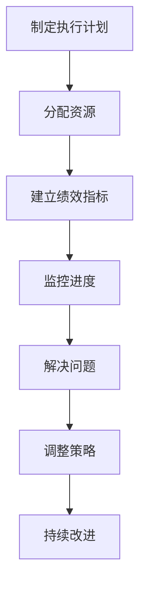

# 督促、跟踪和指导公司科技战略的执行，确保按照战略规划的方向前进，各项计划得到有效的落实

## 1.背景介绍

在当今瞬息万变的商业环境中，科技无疑已成为推动企业发展的核心动力。企业必须制定明确的科技战略,并将其贯彻执行,才能保持竞争优势。然而,制定战略固然重要,但真正决定企业成败的是战略执行的效率和质量。

作为公司的技术领导者,CTO(首席技术官)在确保科技战略的有效执行方面扮演着关键角色。CTO需要监督和指导整个过程,确保各项计划按部就班地推进,并及时解决执行过程中出现的任何问题或障碍。

## 2.核心概念与联系

### 2.1 科技战略

科技战略是企业发展的总体规划,它明确了公司在技术领域的长期目标、优先事项和资源分配。科技战略应与公司的整体商业战略保持一致,并为实现商业目标提供技术支持。

### 2.2 战略执行

战略执行是将战略规划转化为具体行动的过程。它包括制定详细的执行计划、分配资源、建立绩效指标、监控进度等多个步骤。有效的战略执行对于实现战略目标至关重要。

### 2.3 CTO的角色

作为技术领导者,CTO在战略执行过程中扮演着至关重要的角色。CTO需要确保技术团队的工作与公司的整体战略保持一致,并协调各部门之间的合作。同时,CTO还需要监督执行进度,解决技术问题,并向高层管理人员报告进展情况。

## 3.核心算法原理具体操作步骤

为了有效地执行科技战略,CTO可以遵循以下核心步骤:



### 3.1 制定执行计划

根据科技战略的目标和优先事项,CTO需要制定详细的执行计划。这个计划应该包括具体的任务、里程碑、时间表和责任人。执行计划应该明确每个阶段的目标,并确保各项工作按照预定计划有序进行。

### 3.2 分配资源

执行计划需要相应的资源支持,包括人力、财力和技术资源。CTO需要根据计划的需求,合理分配资源,确保每个项目都有足够的资源支持。同时,CTO还需要协调不同部门之间的资源共享,提高资源利用效率。

### 3.3 建立绩效指标

为了评估执行进度和效果,CTO需要建立明确的绩效指标。这些指标应该与战略目标相关,并且可以量化和测量。常见的绩效指标包括项目进度、质量、成本、客户满意度等。

### 3.4 监控进度

在执行过程中,CTO需要持续监控各项计划的进度。这可以通过定期会议、进度报告和数据分析等方式实现。如果发现任何偏离预期的情况,CTO需要及时采取纠正措施。

### 3.5 解决问题

执行过程中难免会遇到各种技术、人员或资源方面的问题。CTO需要及时识别这些问题,并与相关团队协作寻找解决方案。有时候,CTO可能需要调整原有计划或资源分配,以应对突发情况。

### 3.6 调整策略

随着时间的推移和环境的变化,原有的战略可能需要进行调整。CTO需要密切关注市场趋势和技术发展,并根据需要对战略进行适当的修改。任何重大调整都应该经过充分的评估和讨论。

### 3.7 持续改进

战略执行是一个持续的过程,需要不断地学习和改进。CTO应该总结执行过程中的经验教训,并将这些经验应用于未来的战略规划和执行中。同时,CTO还需要鼓励团队持续学习和创新,以保持公司在技术领域的领先地位。

## 4.数学模型和公式详细讲解举例说明

在监控战略执行进度时,CTO可以利用一些数学模型和公式来量化和评估进展情况。以下是一些常见的模型和公式:

### 4.1 项目进度评估

$$
进度率 = \frac{已完成工作量}{总工作量} \times 100\%
$$

进度率是评估项目进度的一个重要指标。它反映了项目已完成的工作量占总工作量的百分比。通过监控进度率,CTO可以及时发现落后的项目,并采取相应的措施。

### 4.2 资源利用率

$$
资源利用率 = \frac{实际使用资源量}{可用资源总量} \times 100\%
$$

资源利用率反映了资源的使用效率。CTO需要确保资源得到充分利用,避免浪费。如果资源利用率过低,可能需要调整资源分配策略。

### 4.3 成本控制

$$
实际成本 = 直接成本 + 间接成本
$$

$$
成本偏差 = 实际成本 - 预算成本
$$

成本控制是战略执行中的一个重要方面。CTO需要密切关注项目的实际成本,并将其与预算成本进行比较。如果存在较大的成本偏差,则需要采取措施控制成本。

### 4.4 风险评估

$$
风险值 = 发生概率 \times 影响程度
$$

在执行过程中,CTO需要评估各种潜在风险,并制定相应的风险缓解策略。风险值可以通过发生概率和影响程度的乘积来计算,从而确定风险的优先级。

## 5.项目实践:代码实例和详细解释说明

为了更好地监控和管理战略执行过程,CTO可以利用各种软件工具和编程技术。以下是一些常见的实践:

### 5.1 项目管理工具

项目管理工具可以帮助CTO跟踪项目进度、分配任务、管理资源等。常见的项目管理工具包括Jira、Trello、Asana等。以下是一个使用Jira进行项目管理的示例:

```java
// 创建一个新项目
Project project = jiraClient.createProject("StrategyExecution", "Strategy Execution Project");

// 创建一个新的任务
Issue issue = jiraClient.createIssue(project.getKey(), "Task", "Implement new feature");

// 分配任务给特定用户
jiraClient.assignIssue(issue.getKey(), "john.doe");

// 更新任务状态
jiraClient.transitionIssue(issue.getKey(), "In Progress");

// 获取项目进度报告
List<Issue> issues = jiraClient.getIssuesFromFilter("project = StrategyExecution");
int totalIssues = issues.size();
int completedIssues = 0;
for (Issue i : issues) {
    if (i.getStatus().getName().equals("Done")) {
        completedIssues++;
    }
}
double progressRate = (double) completedIssues / totalIssues * 100;
System.out.println("Project progress rate: " + progressRate + "%");
```

### 5.2 数据分析和可视化

CTO可以利用数据分析和可视化技术来更好地理解和呈现战略执行的进展情况。以下是一个使用Python和Matplotlib库进行数据可视化的示例:

```python
import matplotlib.pyplot as plt

# 模拟项目进度数据
project_names = ['Project A', 'Project B', 'Project C', 'Project D', 'Project E']
progress_rates = [75, 40, 90, 65, 55]

# 创建条形图
plt.figure(figsize=(8, 6))
plt.bar(project_names, progress_rates)
plt.xlabel('Project')
plt.ylabel('Progress Rate (%)')
plt.title('Project Progress Tracking')

# 添加数据标签
for i, v in enumerate(progress_rates):
    plt.text(i, v + 2, str(v) + '%', ha='center', fontweight='bold')

# 显示图形
plt.show()
```

### 5.3 自动化和脚本

CTO还可以利用编程技术来自动化一些重复性任务,提高效率。以下是一个使用Python自动化发送周报的示例:

```python
import smtplib
from email.mime.text import MIMEText

# 构建周报内容
report = """
项目进展周报

项目A:
- 完成了新功能的开发
- 修复了一些已知问题

项目B:
- 进度落后,需要加快进度

总体进度: 65%

下周计划:
- 项目A开始测试阶段
- 项目B加派人手加快进度
"""

# 发送邮件
msg = MIMEText(report)
msg['Subject'] = "项目进展周报"
msg['From'] = "cto@company.com"
msg['To'] = "executives@company.com"

s = smtplib.SMTP('localhost')
s.send_message(msg)
s.quit()
```

通过上述实例,我们可以看到CTO可以利用各种编程技术和工具来提高战略执行的效率和质量。不同的工具和技术可以根据具体需求进行选择和组合使用。

## 6.实际应用场景

有效执行科技战略对于各行各业的企业都至关重要。以下是一些典型的应用场景:

### 6.1 软件公司

对于软件公司而言,科技战略通常围绕着产品开发和技术创新。CTO需要确保各个产品线按计划推进,同时推动新技术的研究和应用。例如,一家软件公司可能会制定战略,计划在未来几年内开发一款基于人工智能的新产品。CTO需要监督这个项目的执行,确保其按时完成并符合质量标准。

### 6.2 制造业

在制造业中,科技战略往往关注于提高生产效率、降低成本和优化供应链。CTO需要推动自动化、物联网和大数据等技术在生产环节中的应用。例如,一家汽车制造商可能会制定战略,计划在未来几年内实现生产线的完全自动化。CTO需要监督这一过程,确保自动化系统的顺利部署和运行。

### 6.3 金融服务业

金融服务业对安全性和合规性有着极高的要求,因此科技战略往往围绕着这些方面。CTO需要确保公司的IT基础设施、数据存储和交易系统符合最新的安全和合规标准。例如,一家银行可能会制定战略,计划在未来几年内升级其核心交易系统,以提高安全性和效率。CTO需要监督这一过程,确保新系统的顺利上线和运行。

### 6.4 医疗健康行业

在医疗健康行业,科技战略通常关注于提高医疗质量、降低成本和促进创新。CTO需要推动电子健康记录、远程医疗和医疗影像等技术的应用。例如,一家医疗机构可能会制定战略,计划在未来几年内建立一个基于云计算的电子健康记录系统。CTO需要监督这一过程,确保系统的安全性和可用性。

无论是哪个行业,CTO都扮演着至关重要的角色,确保公司的科技战略得到有效执行。通过制定详细的执行计划、分配资源、监控进度和解决问题,CTO可以确保公司按照既定的方向前进,实现技术创新和业务增长。

## 7.工具和资源推荐

为了有效执行科技战略,CTO可以利用各种工具和资源。以下是一些推荐:

### 7.1 项目管理工具

- Jira: 一款功能强大的项目管理和问题跟踪工具,适用于各种规模的团队和项目。
- Trello: 一款基于看板的项目管理工具,简单易用,适合小团队使用。
- Asana: 一款集成了多种功能的项目管理工具,包括任务分配、日历、报告等。

### 7.2 协作和沟通工具

- Slack: 一款团队协作和沟通工具,支持即时消息、文件共享和集成第三方应用程序。
- Microsoft Teams: 一款由微软推出的团队协作工具,集成了聊天、视频会议、文件共享等功能。
- Zoom: 一款流行的视频会议工具,适用于远程会议和在线培训。

### 7.3 数据分析和可视化工具

- Power BI: 一款由微软推出的商业智能工具,提供数据可视化和分析功能。
- Tableau: 一款领先的数据可视