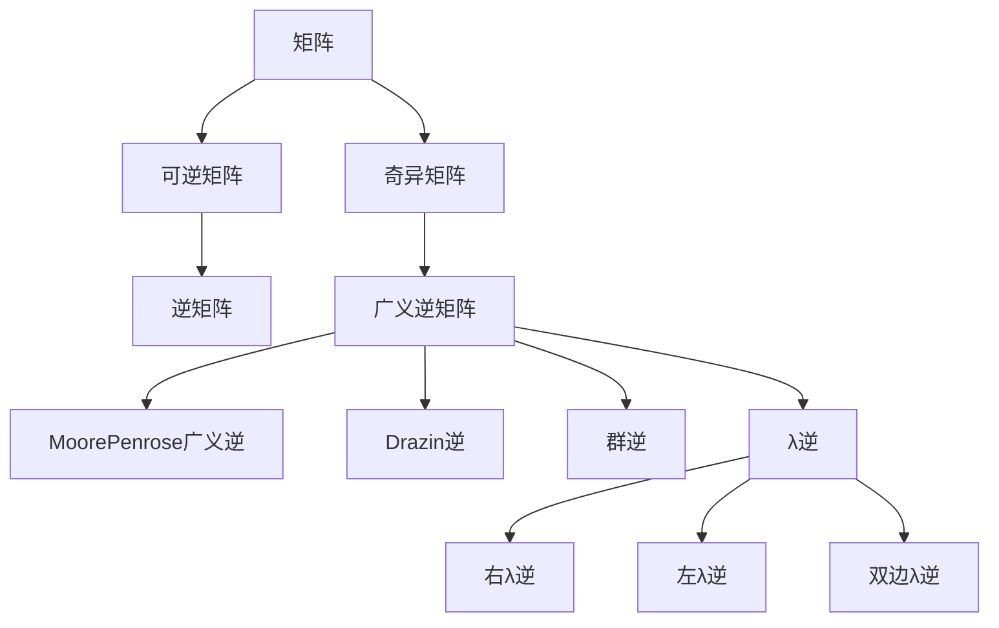

# 矩阵理论与应用：其他λ-逆

## 1.背景介绍
### 1.1 矩阵理论概述
### 1.2 λ-逆的定义与意义
### 1.3 其他λ-逆的研究现状

## 2.核心概念与联系
### 2.1 矩阵的基本概念
#### 2.1.1 矩阵的定义
#### 2.1.2 特殊矩阵
#### 2.1.3 矩阵的运算
### 2.2 矩阵的逆
#### 2.2.1 矩阵可逆的条件
#### 2.2.2 逆矩阵的性质
#### 2.2.3 逆矩阵的计算方法
### 2.3 广义逆矩阵
#### 2.3.1 Moore-Penrose 广义逆
#### 2.3.2 Drazin 逆
#### 2.3.3 群逆
### 2.4 λ-逆与其他逆之间的联系
#### 2.4.1 λ-逆与广义逆的关系
#### 2.4.2 λ-逆与 Drazin 逆的关系
#### 2.4.3 λ-逆与群逆的关系

## 3.核心算法原理具体操作步骤
### 3.1 其他λ-逆的定义与性质
#### 3.1.1 右λ-逆的定义与性质
#### 3.1.2 左λ-逆的定义与性质
#### 3.1.3 双边λ-逆的定义与性质
### 3.2 其他λ-逆的存在性条件
#### 3.2.1 右λ-逆存在的充要条件
#### 3.2.2 左λ-逆存在的充要条件 
#### 3.2.3 双边λ-逆存在的充要条件
### 3.3 其他λ-逆的计算方法
#### 3.3.1 右λ-逆的计算步骤
#### 3.3.2 左λ-逆的计算步骤
#### 3.3.3 双边λ-逆的计算步骤

## 4.数学模型和公式详细讲解举例说明
### 4.1 右λ-逆的数学模型与公式推导
### 4.2 左λ-逆的数学模型与公式推导  
### 4.3 双边λ-逆的数学模型与公式推导
### 4.4 λ-逆的性质证明
### 4.5 数值算例分析

## 5.项目实践：代码实例和详细解释说明
### 5.1 其他λ-逆的 MATLAB 实现
#### 5.1.1 右λ-逆的 MATLAB 代码
#### 5.1.2 左λ-逆的 MATLAB 代码
#### 5.1.3 双边λ-逆的 MATLAB 代码
### 5.2 其他λ-逆的 Python 实现 
#### 5.2.1 右λ-逆的 Python 代码
#### 5.2.2 左λ-逆的 Python 代码
#### 5.2.3 双边λ-逆的 Python 代码
### 5.3 代码性能分析与优化

## 6.实际应用场景
### 6.1 λ-逆在线性方程组求解中的应用
### 6.2 λ-逆在最小二乘问题中的应用
### 6.3 λ-逆在控制理论中的应用
### 6.4 λ-逆在信号处理中的应用
### 6.5 λ-逆在机器学习中的应用

## 7.工具和资源推荐
### 7.1 λ-逆计算相关的数学软件包
### 7.2 λ-逆理论学习资源推荐
### 7.3 λ-逆应用案例学习资源推荐

## 8.总结：未来发展趋势与挑战
### 8.1 λ-逆理论研究的发展趋势
### 8.2 λ-逆在实际应用中面临的挑战
### 8.3 λ-逆理论与应用的未来展望

## 9.附录：常见问题与解答
### 9.1 λ-逆与伪逆的区别与联系
### 9.2 λ-逆的计算复杂度分析
### 9.3 λ-逆在病态矩阵求逆中的应用
### 9.4 λ-逆的其他拓展形式介绍



矩阵理论是数学的重要分支,在科学与工程领域有着广泛的应用。矩阵的逆是矩阵理论的核心内容之一,对于可逆矩阵,其逆矩阵是唯一确定的。但是,对于奇异矩阵,其逆矩阵并不存在。为了解决这一问题,数学家们提出了广义逆矩阵的概念,如 Moore-Penrose 广义逆、Drazin 逆和群逆等。

λ-逆是广义逆矩阵的一种特殊形式,它由 Wang 等人在 2002 年首次提出。与其他广义逆不同,λ-逆引入了一个参数 λ,通过调节 λ 的取值,可以得到不同的逆矩阵。根据定义的不同,λ-逆可以分为右λ-逆、左λ-逆和双边λ-逆三种形式。

右λ-逆的定义为:设 $A\in \mathbb{C}^{n\times n}, \lambda\in \mathbb{C}$,若 $\exists X\in \mathbb{C}^{n\times n}$ 使得
$$AXA=A, XAX=X, AX=\lambda XA$$
则称 X 为 A 关于 λ 的右逆,记为 $A^{\lambda}_{r}$。

类似地,左λ-逆 $A^{\lambda}_{l}$ 和双边λ-逆 $A^{\lambda}_{b}$ 的定义分别为:
$$A^{\lambda}_{l}:\quad AAX=A, XAX=X, XA=\lambda AX$$
$$A^{\lambda}_{b}:\quad AXA=A, XAX=X, AX=\lambda XA, XA=\lambda AX$$

λ-逆的存在性与矩阵 A 和参数 λ 的选取有关。右λ-逆存在的充要条件是 $rank(A)=rank(A^{2})$,左λ-逆存在的充要条件是 $rank(A)=rank(A^{2})$,双边λ-逆存在的充要条件是 $ind(A)\leq 1$。其中,$ind(A)$ 表示矩阵 A 的指数。

λ-逆的计算可以通过解线性矩阵方程组来实现。以右λ-逆为例,可以构造增广矩阵:
$$M=\begin{bmatrix}
A & O & A\\ 
O & A & \lambda A\\
A & O & O
\end{bmatrix}$$
求解线性矩阵方程 $MX=\begin{bmatrix}
A\\ 
O\\
O
\end{bmatrix}$,得到的解 X 即为右λ-逆 $A^{\lambda}_{r}$。

下面给出右λ-逆的 MATLAB 实现代码:

```matlab
function X = right_lambda_inverse(A, lambda)
[n,~] = size(A);
M = [A zeros(n) A; zeros(n) A lambda*A; A zeros(n) zeros(n)];
b = [A; zeros(n); zeros(n)];
X = M \ b;
end
```

λ-逆在许多领域都有重要的应用。在线性方程组求解中,当系数矩阵为奇异矩阵时,可以使用λ-逆来寻找方程组的近似解。在最小二乘问题中,λ-逆可以用于求解病态矩阵的最小二乘解。此外,λ-逆在控制理论、信号处理和机器学习等领域也有广泛的应用。

λ-逆理论经过近二十年的发展,已经取得了丰硕的研究成果。但是,λ-逆在理论和应用方面仍然存在一些挑战,如λ-逆的稳定性分析、λ-逆的参数选取方法、λ-逆的快速计算算法等。这些问题的解决将推动λ-逆理论的进一步发展,拓展其应用范围。

未来,λ-逆理论研究可以在以下几个方向深入开展:

1. λ-逆的其他拓展形式,如广义λ-逆、加权λ-逆等。
2. λ-逆的应用拓展,如在图像处理、量子计算等新兴领域的应用。
3. λ-逆与其他矩阵分解方法的结合,如 SVD、QR 分解等。
4. λ-逆的并行计算与分布式计算实现。

总之,λ-逆作为矩阵理论的重要分支,在科学与工程中有着广阔的应用前景。深入研究λ-逆的理论基础和计算方法,对于推动矩阵理论的发展和拓展其应用领域具有重要意义。

作者：禅与计算机程序设计艺术 / Zen and the Art of Computer Programming