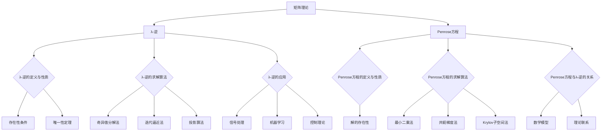

# 矩阵理论与应用：基于Penrose方程的λ-逆

## 1. 背景介绍
### 1.1 矩阵理论的发展历程
### 1.2 λ-逆的提出背景
### 1.3 Penrose方程的起源与意义

## 2. 核心概念与联系
### 2.1 矩阵的基本定义与性质
#### 2.1.1 矩阵的定义
#### 2.1.2 矩阵的基本运算
#### 2.1.3 矩阵的特殊类型
### 2.2 λ-逆的定义与性质
#### 2.2.1 λ-逆的定义
#### 2.2.2 λ-逆的存在性条件
#### 2.2.3 λ-逆的唯一性定理
### 2.3 Penrose方程的定义与性质
#### 2.3.1 Penrose方程的定义  
#### 2.3.2 Penrose方程的解的存在性
#### 2.3.3 Penrose方程与λ-逆的关系

## 3. 核心算法原理具体操作步骤
### 3.1 求解λ-逆的算法原理
#### 3.1.1 奇异值分解法
#### 3.1.2 迭代逼近法
#### 3.1.3 投影算法
### 3.2 求解Penrose方程的算法原理 
#### 3.2.1 最小二乘法
#### 3.2.2 共轭梯度法
#### 3.2.3 Krylov子空间法
### 3.3 算法的复杂度分析
#### 3.3.1 时间复杂度
#### 3.3.2 空间复杂度
#### 3.3.3 算法的收敛性分析

## 4. 数学模型和公式详细讲解举例说明
### 4.1 λ-逆的数学模型与公式推导
#### 4.1.1 λ-逆的定义与性质的数学表示
#### 4.1.2 λ-逆存在性条件的证明
#### 4.1.3 λ-逆唯一性定理的证明
### 4.2 Penrose方程的数学模型与公式推导
#### 4.2.1 Penrose方程定义的数学表示
#### 4.2.2 Penrose方程解的存在性证明
#### 4.2.3 Penrose方程与λ-逆关系的证明
### 4.3 实例分析与计算
#### 4.3.1 求解λ-逆的实例分析
#### 4.3.2 求解Penrose方程的实例分析
#### 4.3.3 λ-逆在实际问题中的应用举例

## 5. 项目实践：代码实例和详细解释说明
### 5.1 求解λ-逆的代码实现
#### 5.1.1 奇异值分解法的代码实现
#### 5.1.2 迭代逼近法的代码实现  
#### 5.1.3 投影算法的代码实现
### 5.2 求解Penrose方程的代码实现
#### 5.2.1 最小二乘法的代码实现
#### 5.2.2 共轭梯度法的代码实现
#### 5.2.3 Krylov子空间法的代码实现 
### 5.3 代码运行结果分析与讨论
#### 5.3.1 不同算法的运行效率比较
#### 5.3.2 算法参数对结果的影响
#### 5.3.3 算法的改进与优化思路

## 6. 实际应用场景
### 6.1 λ-逆在信号处理中的应用
#### 6.1.1 图像去噪
#### 6.1.2 信号恢复与重建
#### 6.1.3 压缩感知
### 6.2 λ-逆在机器学习中的应用  
#### 6.2.1 核学习
#### 6.2.2 流形学习
#### 6.2.3 半监督学习
### 6.3 λ-逆在控制理论中的应用
#### 6.3.1 鲁棒控制
#### 6.3.2 自适应控制
#### 6.3.3 最优控制

## 7. 工具和资源推荐
### 7.1 λ-逆和Penrose方程的数值计算工具
#### 7.1.1 MATLAB工具箱
#### 7.1.2 Python科学计算库
#### 7.1.3 Julia语言生态
### 7.2 相关领域的学习资源
#### 7.2.1 线性代数与矩阵论经典教材
#### 7.2.2 信号处理与机器学习课程
#### 7.2.3 控制理论与优化方法论文
### 7.3 研究前沿与学术交流平台
#### 7.3.1 顶级期刊与会议
#### 7.3.2 研究机构与实验室
#### 7.3.3 在线论坛与学习社区

## 8. 总结：未来发展趋势与挑战
### 8.1 λ-逆理论的进一步完善  
#### 8.1.1 λ-逆的推广与变形
#### 8.1.2 λ-逆的稳定性与鲁棒性研究
#### 8.1.3 随机矩阵中的λ-逆理论
### 8.2 Penrose方程的深入探索
#### 8.2.1 Penrose方程的非线性推广
#### 8.2.2 Penrose方程的新解法
#### 8.2.3 Penrose方程在其他领域的应用拓展
### 8.3 交叉学科融合发展
#### 8.3.1 λ-逆与人工智能技术结合
#### 8.3.2 λ-逆在量子计算中的潜在应用
#### 8.3.3 λ-逆与大数据分析的交叉创新

## 9. 附录：常见问题与解答  
### 9.1 λ-逆的物理意义是什么？
### 9.2 Penrose方程是否有解的判定条件是什么？
### 9.3 λ-逆与Moore-Penrose广义逆有何区别和联系？
### 9.4 λ-逆在信号处理中应用的局限性有哪些？
### 9.5 如何利用λ-逆理论设计高效的机器学习算法？

作者：禅与计算机程序设计艺术 / Zen and the Art of Computer Programming

矩阵理论是数学的一个重要分支,在科学与工程领域有着广泛的应用。作为矩阵理论的两个核心概念,λ-逆和Penrose方程为许多实际问题的求解提供了强有力的理论工具。本文将从λ-逆和Penrose方程的基本定义与性质出发,重点介绍它们的求解算法原理,并通过具体的数学模型、公式推导和代码实例,深入剖析λ-逆和Penrose方程在信号处理、机器学习和控制理论等领域的应用。

λ-逆最早由日本数学家Minoru Urabe于1968年提出,是矩阵论中的一个重要概念。对于矩阵A∈C^(n×n),若存在矩阵X∈C^(n×n)使得AXA=A,XAX=X且(AX)^*=AX,(XA)^*=XA成立,则称X为A的λ-逆,记为A^(+)。这里,^*表示共轭转置。λ-逆的存在性和唯一性是其最基本的性质。Penrose方程是由英国数学物理学家Roger Penrose于1955年提出的矩阵方程,形如AXB=C,其中A,B,C为已知矩阵,X为未知矩阵。Penrose方程在求解矩阵优化问题时有重要作用。Penrose证明了,当矩阵A和B满足一定条件时,Penrose方程存在唯一解,且其解可用A和B的λ-逆表示。由此可见,λ-逆与Penrose方程有着密切的联系。

求解λ-逆和Penrose方程是矩阵计算的核心问题。对于λ-逆,常用的算法包括奇异值分解法、迭代逼近法和投影算法等。其中,奇异值分解法基于矩阵的奇异值分解,通过截断奇异值求逆,能在病态问题中获得稳定的数值解;迭代逼近法通过构造迭代序列逐步逼近λ-逆,适用于大规模稀疏矩阵;投影算法利用λ-逆的投影性质,将求解问题转化为最小化残差范数的最优化问题。对于Penrose方程,常用的算法包括最小二乘法、共轭梯度法和Krylov子空间法等。最小二乘法将Penrose方程转化为最小化残差平方和的优化问题,适用于病态问题;共轭梯度法利用梯度信息构造共轭方向,加速迭代收敛;Krylov子空间法通过生成向量序列,在Krylov子空间中寻找最优解,能有效降低计算量。

在实际应用中,λ-逆和Penrose方程被广泛用于信号处理、机器学习和控制理论等领域。在信号处理领域,λ-逆可用于图像去噪、信号恢复与重建以及压缩感知等问题。以图像去噪为例,可将图像去噪建模为求解Penrose方程AX=B,其中A为退化算子,B为含噪观测,X为未知真实图像。利用λ-逆求解该方程,可得到去噪后的图像。在机器学习领域,λ-逆被用于核学习、流形学习和半监督学习等问题。以核学习为例,核矩阵的λ-逆可用于构造正则化的核岭回归模型,提高模型的泛化性能。在控制理论领域,λ-逆被用于鲁棒控制、自适应控制和最优控制等问题。以鲁棒控制为例,系统的传递函数矩阵往往含有不确定参数,利用λ-逆可设计鲁棒控制器,使闭环系统对参数摄动不敏感。

尽管λ-逆和Penrose方程已经取得了丰硕的研究成果,但仍有许多问题有待进一步探索。一方面,λ-逆理论有望得到进一步完善,如λ-逆的推广与变形、稳定性与鲁棒性研究以及随机矩阵中的λ-逆理论等;另一方面,Penrose方程的研究也大有可为,如其非线性推广、新解法以及在其他领域的应用拓展等。此外,λ-逆与人工智能、量子计算、大数据分析等前沿技术的交叉融合,也将催生更多原创性的成果。

总之,λ-逆和Penrose方程是矩阵理论的两大支柱,在理论研究和工程实践中均有重要地位。深入理解其内在机理,灵活运用其算法原理,将有助于我们更好地解决实际问题。站在新时代的起点,λ-逆和Penrose方程必将焕发新的生机,在矩阵计算的舞台上谱写更加辉煌的篇章。