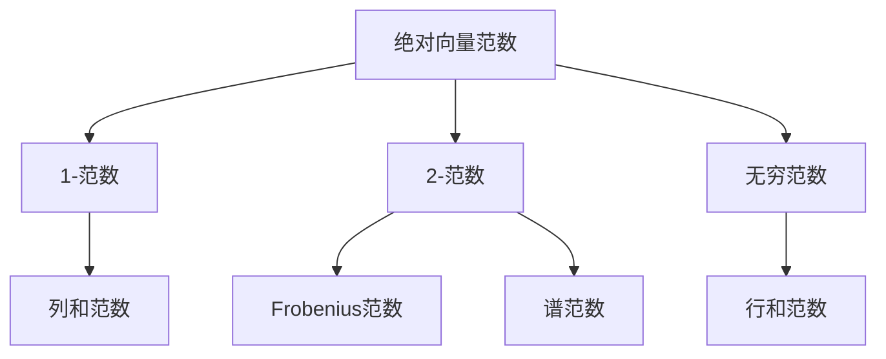

# 矩阵理论与应用：绝对向量范数及其导出的矩阵范数

## 1. 背景介绍

矩阵理论是数学和计算机科学中一个基础而重要的分支,在人工智能、图像处理、信号处理、控制理论、量子计算等众多领域有着广泛的应用。作为矩阵理论的重要组成部分,向量范数和矩阵范数在衡量向量和矩阵的大小、距离等方面扮演着不可或缺的角色。

本文将重点探讨绝对向量范数及其导出的矩阵范数。绝对向量范数因其良好的数学性质和物理意义而备受关注,基于绝对向量范数还可以导出一系列重要的矩阵范数。通过深入研究绝对向量范数及其导出的矩阵范数的定义、性质、计算方法以及应用,可以加深我们对矩阵理论的理解,并为解决实际问题提供有力的数学工具。

### 1.1 向量范数和矩阵范数概述

#### 1.1.1 向量范数的定义与性质

向量范数是一个函数,它将向量空间中的每个向量映射到非负实数,并满足以下性质:

1. 非负性:$\|x\| \geq 0$,当且仅当$x=0$时取等号;
2. 齐次性:$\|\alpha x\|=|\alpha|\|x\|,\forall \alpha \in \mathbb{R}$;  
3. 三角不等式:$\|x+y\| \leq \|x\|+\|y\|$。

向量范数可以度量向量的大小,不同的向量范数反映了向量在不同度量下的特性。

#### 1.1.2 矩阵范数的定义与性质

与向量范数类似,矩阵范数是一个函数,它将矩阵空间中的每个矩阵映射到非负实数,并满足以下性质:

1. 非负性:$\|A\| \geq 0$,当且仅当$A=0$时取等号;
2. 齐次性:$\|\alpha A\|=|\alpha|\|A\|,\forall \alpha \in \mathbb{R}$;
3. 三角不等式:$\|A+B\| \leq \|A\|+\|B\|$;
4. 相容性:$\|AB\| \leq \|A\|\|B\|$。

矩阵范数可以度量矩阵的大小,不同的矩阵范数反映了矩阵在不同度量下的特性。矩阵范数在矩阵分析、数值计算、优化理论等领域有着重要的应用。

### 1.2 绝对向量范数的重要性

绝对向量范数是一类特殊的向量范数,它在向量空间中具有重要的地位。绝对向量范数不仅具有良好的数学性质,而且具有明确的物理意义。例如,常见的1-范数(曼哈顿范数)、2-范数(欧几里得范数)、无穷范数(切比雪夫范数)都属于绝对向量范数。

绝对向量范数在许多领域有着广泛的应用:

1. 信号处理:利用不同的绝对向量范数可以度量信号的稀疏性、能量等特性;
2. 图像处理:绝对向量范数可以用于图像去噪、压缩等任务;
3. 机器学习:绝对向量范数常用于正则化项,以控制模型复杂度,防止过拟合;
4. 优化理论:许多优化问题可以转化为绝对向量范数的最小化问题。

此外,基于绝对向量范数还可以导出一系列重要的矩阵范数,如列和范数、行和范数、谱范数等。这些矩阵范数在矩阵分析、数值计算等领域有着重要的应用。

## 2. 核心概念与联系

### 2.1 绝对向量范数的定义

设$x=(x_1,x_2,\cdots,x_n)^T$为$n$维实向量,绝对向量范数定义为:

$$\|x\|_p=\left(\sum_{i=1}^n |x_i|^p\right)^{1/p}, \quad p \geq 1$$

其中,$p$为范数的阶数。当$p=1$时,称为1-范数或曼哈顿范数;当$p=2$时,称为2-范数或欧几里得范数;当$p \to \infty$时,称为无穷范数或切比雪夫范数。

### 2.2 绝对向量范数的性质

绝对向量范数满足向量范数的所有性质,此外还具有以下特殊性质:

1. $p$-范数的单调性:对于$1 \leq p \leq q \leq \infty$,有$\|x\|_p \geq \|x\|_q$;
2. 绝对向量范数之间的关系:对于$n$维向量$x$,有$\|x\|_\infty \leq \|x\|_2 \leq \|x\|_1 \leq \sqrt{n}\|x\|_2 \leq n\|x\|_\infty$。

这些性质反映了不同阶数的绝对向量范数之间的联系,为我们选择合适的范数提供了依据。

### 2.3 由绝对向量范数导出的矩阵范数

基于绝对向量范数,可以导出一系列重要的矩阵范数:

1. 列和范数(1-范数):$\|A\|_1=\max_{1 \leq j \leq n}\sum_{i=1}^m |a_{ij}|$;
2. 行和范数($\infty$-范数):$\|A\|_\infty=\max_{1 \leq i \leq m}\sum_{j=1}^n |a_{ij}|$;
3. Frobenius范数(2-范数):$\|A\|_F=\sqrt{\sum_{i=1}^m \sum_{j=1}^n |a_{ij}|^2}$;
4. 谱范数(2-范数):$\|A\|_2=\sqrt{\lambda_{\max}(A^TA)}$,其中$\lambda_{\max}(A^TA)$表示$A^TA$的最大特征值。

这些矩阵范数继承了绝对向量范数的良好性质,在矩阵分析、数值计算等领域有着重要的应用。

### 2.4 核心概念关系图

下图展示了绝对向量范数及其导出的矩阵范数之间的关系:

## 3. 核心算法原理具体操作步骤

### 3.1 绝对向量范数的计算

对于给定的$n$维实向量$x=(x_1,x_2,\cdots,x_n)^T$和范数阶数$p$,绝对向量范数$\|x\|_p$的计算步骤如下:

1. 计算每个分量的绝对值$|x_i|$;
2. 对每个分量的绝对值求$p$次方,得到$|x_i|^p$;
3. 对所有$|x_i|^p$求和,得到$\sum_{i=1}^n |x_i|^p$;
4. 对求和结果开$p$次方,得到$\left(\sum_{i=1}^n |x_i|^p\right)^{1/p}$,即为$\|x\|_p$。

对于特殊的$p$值,有以下简化计算方法:

1. 当$p=1$时,$\|x\|_1=\sum_{i=1}^n |x_i|$;
2. 当$p=2$时,$\|x\|_2=\sqrt{\sum_{i=1}^n x_i^2}$;
3. 当$p \to \infty$时,$\|x\|_\infty=\max_{1 \leq i \leq n} |x_i|$。

### 3.2 矩阵范数的计算

对于给定的$m \times n$矩阵$A=(a_{ij})$,不同矩阵范数的计算方法如下:

1. 列和范数(1-范数):$\|A\|_1=\max_{1 \leq j \leq n}\sum_{i=1}^m |a_{ij}|$,即每列绝对值之和的最大值;
2. 行和范数($\infty$-范数):$\|A\|_\infty=\max_{1 \leq i \leq m}\sum_{j=1}^n |a_{ij}|$,即每行绝对值之和的最大值;
3. Frobenius范数(2-范数):$\|A\|_F=\sqrt{\sum_{i=1}^m \sum_{j=1}^n |a_{ij}|^2}$,即矩阵元素绝对值的平方和的平方根;
4. 谱范数(2-范数):$\|A\|_2=\sqrt{\lambda_{\max}(A^TA)}$,其中$\lambda_{\max}(A^TA)$表示$A^TA$的最大特征值,可以通过幂法或QR算法等数值方法求解。

## 4. 数学模型和公式详细讲解举例说明

### 4.1 绝对向量范数的数学模型

绝对向量范数$\|x\|_p$的数学模型为:

$$\|x\|_p=\left(\sum_{i=1}^n |x_i|^p\right)^{1/p}, \quad p \geq 1$$

其中,$x=(x_1,x_2,\cdots,x_n)^T$为$n$维实向量,$p$为范数的阶数。

举例说明:

1. 1-范数(曼哈顿范数):$\|x\|_1=\sum_{i=1}^n |x_i|$,表示向量各分量绝对值之和。例如,对于向量$x=(1,-2,3)^T$,其1-范数为$\|x\|_1=|1|+|-2|+|3|=6$。

2. 2-范数(欧几里得范数):$\|x\|_2=\sqrt{\sum_{i=1}^n x_i^2}$,表示向量各分量平方和的平方根。例如,对于向量$x=(1,-2,3)^T$,其2-范数为$\|x\|_2=\sqrt{1^2+(-2)^2+3^2}=\sqrt{14}$。

3. 无穷范数(切比雪夫范数):$\|x\|_\infty=\max_{1 \leq i \leq n} |x_i|$,表示向量各分量绝对值的最大值。例如,对于向量$x=(1,-2,3)^T$,其无穷范数为$\|x\|_\infty=\max\{|1|,|-2|,|3|\}=3$。

### 4.2 矩阵范数的数学模型

1. 列和范数(1-范数):$\|A\|_1=\max_{1 \leq j \leq n}\sum_{i=1}^m |a_{ij}|$,表示矩阵每列绝对值之和的最大值。例如,对于矩阵$A=\begin{pmatrix} 1 & -2 \\ 3 & 4 \end{pmatrix}$,其列和范数为$\|A\|_1=\max\{|1|+|3|,|-2|+|4|\}=6$。

2. 行和范数($\infty$-范数):$\|A\|_\infty=\max_{1 \leq i \leq m}\sum_{j=1}^n |a_{ij}|$,表示矩阵每行绝对值之和的最大值。例如,对于矩阵$A=\begin{pmatrix} 1 & -2 \\ 3 & 4 \end{pmatrix}$,其行和范数为$\|A\|_\infty=\max\{|1|+|-2|,|3|+|4|\}=7$。

3. Frobenius范数(2-范数):$\|A\|_F=\sqrt{\sum_{i=1}^m \sum_{j=1}^n |a_{ij}|^2}$,表示矩阵元素绝对值的平方和的平方根。例如,对于矩阵$A=\begin{pmatrix} 1 & -2 \\ 3 & 4 \end{pmatrix}$,其Frobenius范数为$\|A\|_F=\sqrt{1^2+(-2)^2+3^2+4^2}=\sqrt{30}$。

4. 谱范数(2-范数):$\|A\|_2=\sqrt{\lambda_{\max}(A^TA)}$,表示矩阵$A^TA$的最大特征值的平方根。例如,对于矩阵$A=\begin{pmatrix} 1 & -2 \\ 3 & 4 \end{pmatrix}$,其$A^TA=\begin{pmatrix} 10 & 8 \\ 8 & 20 \end{pmatrix}$,最大