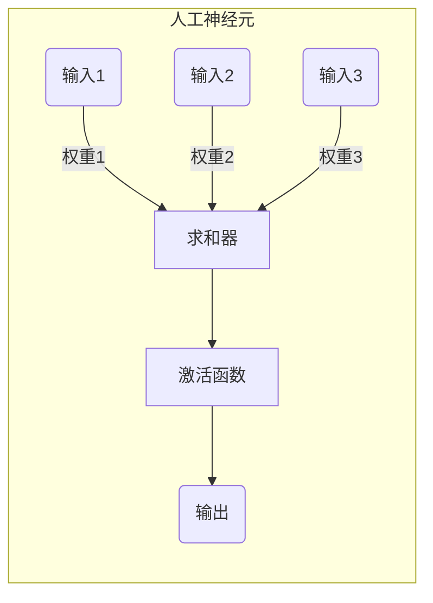
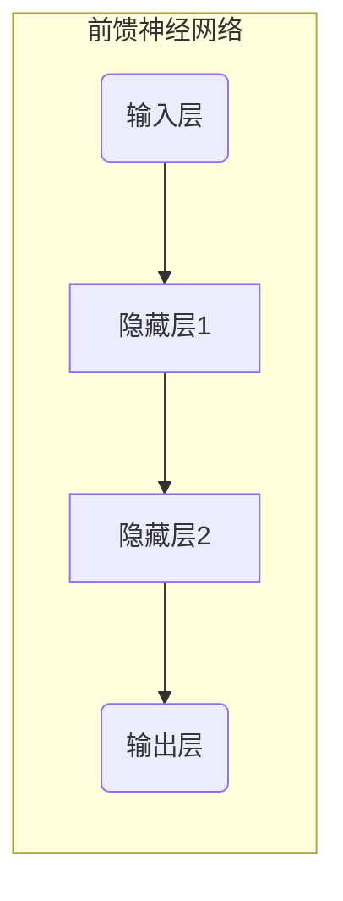
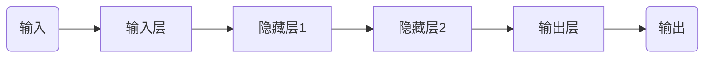
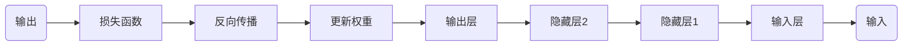
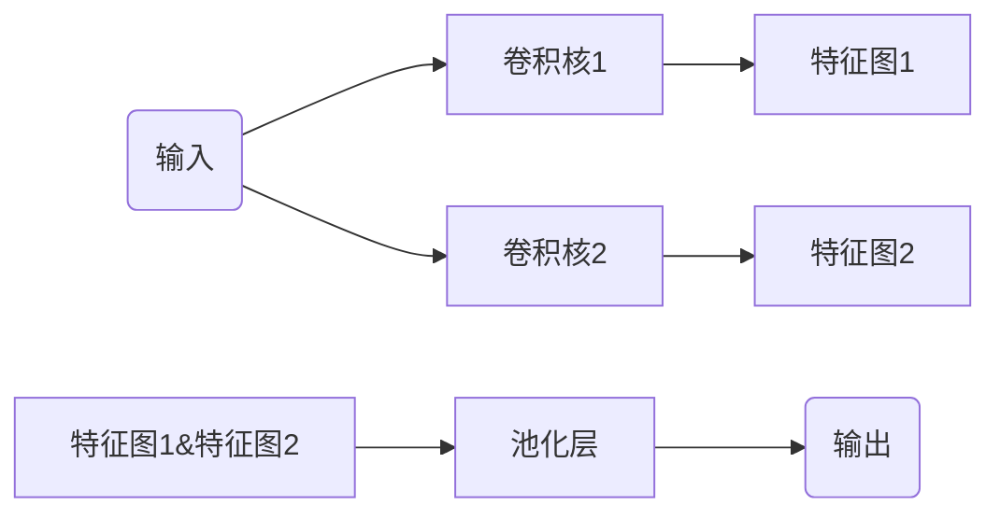
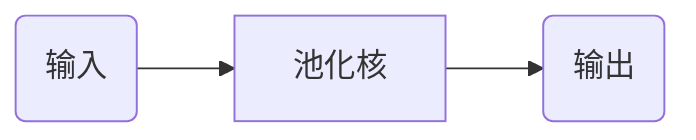
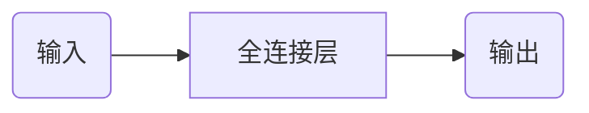
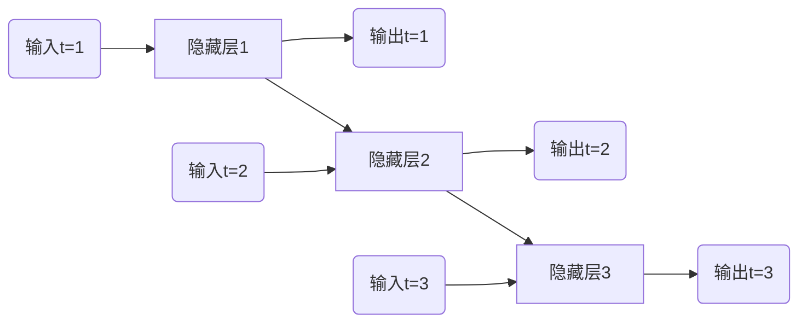

# 神经网络 原理与代码实例讲解

## 1. 背景介绍

### 1.1 神经网络的起源

神经网络(Neural Networks)是一种受生物神经系统启发而设计的计算模型,旨在模拟人脑的工作原理。其灵感来源于人类大脑中神经元的互连网络,通过构建人工神经元并连接成网络,从而实现对输入数据的处理和学习。

最早的神经网络概念可以追溯到20世纪40年代,当时生理学家沃伦·麦卡洛克(Warren McCulloch)和数学家沃尔特·皮茨(Walter Pitts)提出了第一个形式化的神经网络模型。随后,在1958年,心理学家弗兰克·罗森布拉特(Frank Rosenblatt)发明了第一个可以学习的神经网络模型--感知器(Perceptron)。

### 1.2 神经网络的发展历程

尽管早期的神经网络模型取得了一些进展,但由于计算能力的限制和理论上的局限性,神经网络的发展一度陷入停滞。直到20世纪80年代,受到统计学习理论的推动,神经网络才重新焕发生机。

1986年,David Rumelhart等人提出了反向传播算法(Backpropagation),使得多层神经网络的训练成为可能。同时,计算机硬件的快速发展也为神经网络的应用提供了必要的计算能力。随后,卷积神经网络(Convolutional Neural Networks, CNN)、循环神经网络(Recurrent Neural Networks, RNN)等新型神经网络模型不断涌现,推动了神经网络在计算机视觉、自然语言处理等领域的广泛应用。

近年来,深度学习(Deep Learning)的兴起进一步推动了神经网络的发展。通过构建更深层次的神经网络模型,并结合大规模数据和强大的计算能力,深度神经网络展现出了惊人的性能,在图像识别、语音识别、自然语言处理等领域取得了突破性的进展。

## 2. 核心概念与联系

### 2.1 人工神经元

人工神经元是神经网络的基本构建单元,它模拟了生物神经元的工作原理。每个神经元接收来自其他神经元或输入数据的信号,对这些信号进行加权求和,然后通过一个激活函数(Activation Function)进行非线性转换,产生该神经元的输出。

### 2.2 网络结构

神经网络是由多个人工神经元按照特定的拓扑结构相互连接而成的网络。根据神经元的连接方式和层次结构,神经网络可以分为不同的类型,例如前馈神经网络(Feedforward Neural Networks)、循环神经网络(Recurrent Neural Networks)和卷积神经网络(Convolutional Neural Networks)等。

### 2.3 学习算法

神经网络的核心能力在于通过学习来调整网络中的权重参数,从而使网络能够对输入数据做出正确的响应。常见的学习算法包括:

- 监督学习(Supervised Learning):使用带有标签的训练数据,通过最小化损失函数(Loss Function)来调整网络权重。
- 非监督学习(Unsupervised Learning):仅使用未标记的训练数据,通过发现数据中的模式和结构来调整网络权重。
- 强化学习(Reinforcement Learning):通过与环境的交互,根据获得的奖励信号来调整网络权重。

### 2.4 应用领域

神经网络在多个领域都有广泛的应用,包括:

- 计算机视觉(Computer Vision):图像识别、目标检测、图像分割等。
- 自然语言处理(Natural Language Processing):机器翻译、文本分类、情感分析等。
- 语音识别(Speech Recognition):语音转文本、语音合成等。
- 推荐系统(Recommender Systems):个性化推荐、协同过滤等。
- 金融领域:股票预测、欺诈检测等。
- 医疗领域:疾病诊断、药物发现等。

## 3. 核心算法原理具体操作步骤

### 3.1 前馈神经网络

前馈神经网络(Feedforward Neural Networks)是最基本的神经网络类型,信号在网络中只能单向传播,不存在回路。前馈神经网络通常由输入层、隐藏层和输出层组成,每一层由多个神经元组成。

1. **前向传播(Forward Propagation)**

前向传播是前馈神经网络的核心计算过程,它将输入数据从输入层一层一层地传递到输出层,每一层的神经元根据上一层的输出和连接权重计算自身的输出。具体步骤如下:

a. 输入层接收输入数据,并将其传递给第一个隐藏层。
b. 隐藏层中的每个神经元计算其输入的加权和,并通过激活函数产生输出。
c. 隐藏层的输出作为下一层的输入,重复上述过程,直到到达输出层。
d. 输出层的输出即为神经网络对输入数据的响应。

2. **反向传播(Backpropagation)**

反向传播是一种用于训练前馈神经网络的监督学习算法。它通过计算输出与期望输出之间的误差,并沿着网络反向传播误差梯度,调整每个连接权重,从而最小化损失函数。具体步骤如下:

a. 计算输出层的输出与期望输出之间的误差。
b. 计算输出层神经元的误差梯度。
c. 沿着网络反向传播误差梯度,计算每个隐藏层神经元的误差梯度。
d. 使用梯度下降法更新每个连接权重,以减小误差。
e. 重复上述步骤,直到网络收敛或达到最大迭代次数。

### 3.2 卷积神经网络

卷积神经网络(Convolutional Neural Networks, CNN)是一种专门用于处理网格结构数据(如图像)的神经网络,它通过卷积操作和池化操作来提取输入数据的局部特征,从而实现对输入数据的有效表示和分类。

1. **卷积层(Convolutional Layer)**

卷积层是CNN的核心部分,它通过在输入数据上滑动卷积核(Convolution Kernel)来提取局部特征。具体步骤如下:

a. 定义一个或多个卷积核,每个卷积核包含一组可学习的权重。
b. 将卷积核在输入数据上滑动,在每个位置计算卷积核与输入数据的元素wise乘积之和。
c. 对上述结果应用激活函数,得到该位置的特征值。
d. 重复上述过程,直到卷积核在整个输入数据上滑动完毕,从而得到一个特征图(Feature Map)。
e. 通过多个不同的卷积核,可以提取不同的特征图。

2. **池化层(Pooling Layer)**

池化层通常在卷积层之后,用于降低特征图的维度,从而减少计算量和防止过拟合。常见的池化操作包括最大池化(Max Pooling)和平均池化(Average Pooling)。

a. 在特征图上滑动一个池化核(Pooling Kernel),通常为2x2或3x3的矩形窗口。
b. 对池化核覆盖的区域进行最大值或平均值计算,得到该区域的代表值。
c. 将代表值作为池化层的输出,从而减小特征图的空间维度。

3. **全连接层(Fully Connected Layer)**

全连接层通常位于CNN的最后一层,它将前面层的特征映射到最终的输出空间。全连接层的工作原理与传统的前馈神经网络相似,每个神经元与上一层的所有神经元相连。

a. 将前面层的特征展平为一维向量。
b. 将展平后的向量输入到全连接层的神经元中。
c. 每个神经元计算其输入的加权和,并通过激活函数产生输出。
d. 全连接层的输出即为CNN对输入数据的响应。

### 3.3 循环神经网络

循环神经网络(Recurrent Neural Networks, RNN)是一种专门用于处理序列数据(如文本、语音、时间序列)的神经网络。与前馈神经网络不同,RNN在隐藏层中引入了循环连接,使得网络能够记住之前的状态,从而更好地捕捉序列数据中的时间依赖关系。

1. **基本RNN结构**

基本的RNN结构由一个输入层、一个隐藏层和一个输出层组成。隐藏层中的神经元不仅接收当前时间步的输入,还接收上一时间步的隐藏状态,从而能够捕捉序列数据中的时间依赖关系。

2. **前向计算**

RNN的前向计算过程与前馈神经网络类似,但需要考虑隐藏状态的传递。具体步骤如下:

a. 在时间步t=1时,将输入数据传递给隐藏层,计算隐藏层的输出和隐藏状态。
b. 在时间步t=2时,将输入数据和上一时间步的隐藏状态传递给隐藏层,计算当前时间步的隐藏层输出和隐藏状态。
c. 重复上述过程,直到处理完整个序列。
d. 每个时间步的隐藏层输出作为该时间步的网络输出。

3. **反向传播through Time(BPTT)**

BPTT是用于训练RNN的反向传播算法,它沿着时间步骤反向传播误差梯度,从而调整网络权重。具体步骤如下:

a. 计算最后一个时间步的输出与期望输出之间的误差。
b. 计算最后一个时间步的误差梯度。
c. 沿着时间步骤反向传播误差梯度,计算每个时间步的隐藏层误差梯度。
d. 使用梯度下降法更新每个连接权重,以减小误差。
e. 重复上述步骤,直到网络收敛或达到最大迭代次数。

### 3.4 长短期记忆网络(LSTM)

长短期记忆网络(Long Short-Term Memory, LSTM)是一种特殊的RNN,旨在解决传统RNN在处理长序列时容易出现梯度消失或梯度爆炸问题。LSTM通过引入门控机制(Gate Mechanism)和细胞状态(Cell State),使网络能够更好地捕捉长期依赖关系。

1. **LSTM单元结构**

LSTM单元由三个门