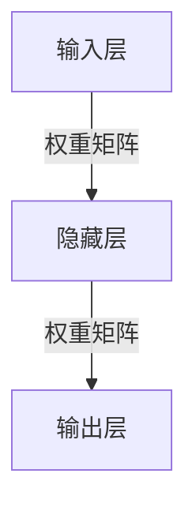
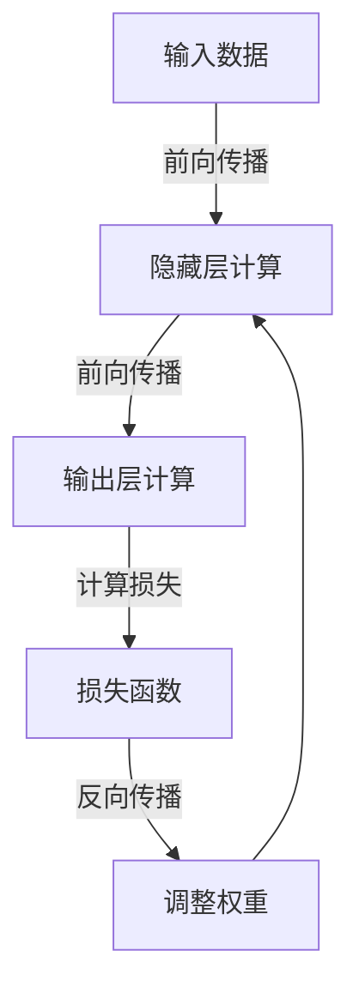

非常感谢您的邀请和机会,让我有幸为大家撰写这篇关于神经网络原理与实战案例的技术博客文章。作为一位计算机科学领域的研究者和实践者,神经网络是我非常热衷且投入了大量精力研究的一个领域。让我们正式开始探讨这个主题。

# 神经网络原理与代码实战案例讲解

## 1.背景介绍

### 1.1 神经网络的起源

神经网络(Neural Networks)的理论源于对生物神经系统的研究,旨在模拟人脑神经元之间复杂的网络拓扑结构和信息传递模式。最早可以追溯到1943年,神经生理学家沃伦·麦卡洛克(Warren McCulloch)和数理逻辑学家沃尔特·皮茨(Walter Pitts)提出了第一个人工神经网络数学模型。

### 1.2 神经网络发展历程

神经网络经历了一个起伏跌宕的发展历程。在20世纪50年代,神经网络研究曾一度被遗忘,直到1980年代反向传播(Backpropagation)算法的提出,神经网络研究重新受到关注。进入21世纪后,benefiting from大数据、强大的计算能力和优化算法的发展,神经网络取得了突破性进展,在计算机视觉、自然语言处理、语音识别等领域展现出卓越的性能。

### 1.3 神经网络的重要性

神经网络在当今人工智能领域扮演着至关重要的角色,是实现机器学习、深度学习等技术的核心算法和模型。它具有自主学习、模式识别、预测和决策等能力,可以从大量数据中自动提取特征,并对复杂的非线性问题进行建模和预测。神经网络已广泛应用于图像识别、语音识别、自然语言处理、推荐系统、金融预测等诸多领域。

## 2.核心概念与联系

### 2.1 神经网络的基本结构

神经网络是一种由大量互连的节点(神经元)组成的网络结构模型。每个神经元接收来自其他神经元或外部输入的信号,并通过激活函数对这些信号进行加权求和,产生自身的输出信号,传递给下一层神经元。



### 2.2 前向传播与反向传播

前向传播(Forward Propagation)是神经网络的基本工作原理,即将输入数据通过网络层层传递,最终得到输出结果。反向传播(Backpropagation)则是神经网络的核心训练算法,通过计算误差梯度,不断调整网络中每个权重的值,使得输出结果逐渐接近期望值。



### 2.3 激活函数

激活函数(Activation Function)是神经网络中的一个关键组成部分,它决定了神经元的输出值。常见的激活函数包括Sigmoid函数、Tanh函数、ReLU(整流线性单元)函数等。不同的激活函数具有不同的特性,适用于不同的场景和任务。

### 2.4 优化算法

在神经网络的训练过程中,需要使用优化算法来更新网络权重,使得损失函数的值最小化。常见的优化算法包括梯度下降(Gradient Descent)、随机梯度下降(Stochastic Gradient Descent)、动量优化(Momentum)、RMSProp、Adam等。选择合适的优化算法对于神经网络的收敛速度和性能至关重要。

### 2.5 正则化

正则化(Regularization)是一种用于防止神经网络过拟合的技术。常见的正则化方法包括L1正则化(Lasso Regression)、L2正则化(Ridge Regression)、Dropout等。正则化可以通过限制权重的大小或引入噪声来提高模型的泛化能力。

### 2.6 批量标准化

批量标准化(Batch Normalization)是一种用于加速神经网络训练过程的技术。它通过对每一层的输入进行标准化,使得数据分布更加稳定,从而提高了训练的收敛速度和模型的性能。

## 3.核心算法原理具体操作步骤

### 3.1 前向传播算法

前向传播算法是神经网络的基本工作原理,它将输入数据通过网络层层传递,最终得到输出结果。具体步骤如下:

1. 初始化网络权重和偏置项。
2. 对于每一个输入样本:
   a. 将输入数据传递给输入层。
   b. 对于每一个隐藏层:
      - 计算加权输入: $z = W^T x + b$
      - 计算激活值: $a = \sigma(z)$
      - 将激活值传递给下一层。
   c. 在输出层,计算最终输出。
3. 返回输出结果。

其中,$W$表示权重矩阵,$b$表示偏置项,$\sigma$表示激活函数。

### 3.2 反向传播算法

反向传播算法是神经网络的核心训练算法,它通过计算误差梯度,不断调整网络中每个权重的值,使得输出结果逐渐接近期望值。具体步骤如下:

1. 初始化网络权重和偏置项。
2. 对于每一个训练样本:
   a. 执行前向传播,计算输出值。
   b. 计算输出层的误差梯度: $\delta^L = \nabla_a C \odot \sigma'(z^L)$
   c. 对于每一个隐藏层 $l = L-1, L-2, ..., 1$:
      - 计算误差梯度: $\delta^l = ((W^{l+1})^T \delta^{l+1}) \odot \sigma'(z^l)$
      - 计算权重梯度: $\nabla_W C = \delta^l (a^{l-1})^T$
      - 计算偏置梯度: $\nabla_b C = \delta^l$
   d. 使用优化算法(如梯度下降)更新权重和偏置项。
3. 重复步骤2,直到收敛或达到最大迭代次数。

其中,$C$表示损失函数,$\nabla$表示梯度运算符,$\odot$表示元素wise乘积运算。

### 3.3 批量标准化算法

批量标准化算法旨在加速神经网络的训练过程,具体步骤如下:

1. 对于每一个小批量数据:
   a. 计算小批量数据的均值$\mu_B$和方差$\sigma_B^2$。
   b. 对每个输入$x$进行标准化: $\hat{x} = \frac{x - \mu_B}{\sqrt{\sigma_B^2 + \epsilon}}$
   c. 缩放和平移: $y = \gamma \hat{x} + \beta$
2. 在反向传播时,计算$\gamma$和$\beta$的梯度,并更新它们的值。

其中,$\epsilon$是一个很小的常数,用于避免除以0的情况,$\gamma$和$\beta$是可学习的缩放和平移参数。

## 4.数学模型和公式详细讲解举例说明

### 4.1 神经元数学模型

神经元是神经网络的基本计算单元,它接收来自其他神经元或外部输入的信号,并通过激活函数对这些信号进行加权求和,产生自身的输出信号。一个神经元的数学模型可以表示为:

$$
y = \phi\left(\sum_{i=1}^{n}w_ix_i + b\right)
$$

其中,$x_i$表示第$i$个输入,$w_i$表示对应的权重,$b$表示偏置项,$\phi$表示激活函数。

常见的激活函数包括:

- Sigmoid函数: $\phi(x) = \frac{1}{1 + e^{-x}}$
- Tanh函数: $\phi(x) = \frac{e^x - e^{-x}}{e^x + e^{-x}}$
- ReLU函数: $\phi(x) = \max(0, x)$

### 4.2 损失函数

在神经网络的训练过程中,我们需要定义一个损失函数(Loss Function)来衡量预测值与真实值之间的差距。常见的损失函数包括:

- 均方误差(Mean Squared Error, MSE): $\text{MSE} = \frac{1}{n}\sum_{i=1}^{n}(y_i - \hat{y}_i)^2$
- 交叉熵损失(Cross-Entropy Loss): $\text{CE} = -\frac{1}{n}\sum_{i=1}^{n}[y_i\log(\hat{y}_i) + (1 - y_i)\log(1 - \hat{y}_i)]$

其中,$y_i$表示真实值,$\hat{y}_i$表示预测值,$n$表示样本数量。

### 4.3 梯度下降算法

梯度下降算法是神经网络中最常用的优化算法之一,用于更新网络权重和偏置项。它的基本思想是沿着梯度的反方向更新参数,使得损失函数的值不断减小。

对于单个参数$\theta$,梯度下降算法的更新规则为:

$$
\theta_{t+1} = \theta_t - \eta \frac{\partial J}{\partial \theta}
$$

其中,$J$表示损失函数,$\eta$表示学习率(Learning Rate)。

在实际应用中,我们通常使用小批量梯度下降(Mini-batch Gradient Descent)或随机梯度下降(Stochastic Gradient Descent)等变体算法,以提高计算效率和模型性能。

### 4.4 反向传播算法的数学推导

反向传播算法的核心思想是通过链式法则计算误差梯度,并沿着梯度的反方向更新网络权重。

假设我们有一个单隐藏层的神经网络,输入为$x$,隐藏层输出为$h$,输出层输出为$\hat{y}$,真实标签为$y$,损失函数为$J$。我们需要计算$\frac{\partial J}{\partial W_1}$和$\frac{\partial J}{\partial W_2}$,其中$W_1$和$W_2$分别表示输入层到隐藏层和隐藏层到输出层的权重矩阵。

根据链式法则,我们有:

$$
\frac{\partial J}{\partial W_1} = \frac{\partial J}{\partial \hat{y}} \frac{\partial \hat{y}}{\partial h} \frac{\partial h}{\partial W_1}
$$

$$
\frac{\partial J}{\partial W_2} = \frac{\partial J}{\partial \hat{y}} \frac{\partial \hat{y}}{\partial W_2}
$$

其中,$\frac{\partial J}{\partial \hat{y}}$可以直接计算,$\frac{\partial \hat{y}}{\partial h}$和$\frac{\partial \hat{y}}{\partial W_2}$可以通过输出层的激活函数求导得到,$\frac{\partial h}{\partial W_1}$可以通过隐藏层的激活函数求导得到。

通过这种方式,我们可以递推地计算出每一层的梯度,并沿着梯度的反方向更新网络权重,从而实现反向传播算法。

## 5.项目实践:代码实例和详细解释说明

在本节中,我们将提供一个使用Python和TensorFlow构建简单神经网络的代码示例,并对关键部分进行详细解释。

### 5.1 导入所需库

```python
import tensorflow as tf
from tensorflow.keras.layers import Dense
from tensorflow.keras.models import Sequential
```

我们首先导入TensorFlow库,以及构建神经网络所需的层(Layer)和模型(Model)相关模块。

### 5.2 准备数据

```python
# 生成模拟数据
import numpy as np

X_train = np.random.random((1000, 10))  # 1000个样本,每个样本10个特征
y_train = np.random.randint(2, size=(1000, 1))  # 二分类问题,标签为0或1
X_test = np.random.random((100, 10))
y_test = np.random.randint(2, size=(100, 1))
```

在这个示例中,我们使用NumPy库生成模拟数据,包括1000个训练样本和100个测试样本。每个样本有10个特征,标签为0或1(二分类问题)。

### 5.3 构建神经网络模型

```python
# 构建模型
model = Sequential([
    Dense(32, activation='relu', input_shape=(10,)),
    Dense(16, activation='