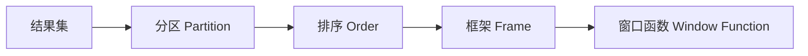

# 窗口函数 原理与代码实例讲解

## 1.背景介绍

### 1.1 什么是窗口函数

窗口函数(Window Function)，也称为OLAP函数(Online Analytical Processing)，是对一组值执行计算并为每一行返回一个结果的函数。与普通的聚合函数相比，窗口函数可以对结果集的不同子集(称为"窗口")执行计算，并且不会将结果集合并为单个输出行。

### 1.2 窗口函数的重要性

窗口函数是SQL中一个非常强大和灵活的特性，可以解决许多实际业务中的复杂问题。它在数据分析、报表生成、数据挖掘等领域有着广泛的应用。掌握窗口函数可以大大提高SQL的查询效率和代码的可读性。

### 1.3 常见的窗口函数

SQL中常见的窗口函数包括:

- 聚合函数，如SUM()、AVG()、COUNT()等
- 排序函数，如ROW_NUMBER()、RANK()、DENSE_RANK()等  
- 分析函数，如LEAD()、LAG()、FIRST_VALUE()等
- 分布函数，如PERCENT_RANK()、CUME_DIST()等

## 2.核心概念与联系

### 2.1 窗口的概念

窗口(Window)是窗口函数的核心概念。它定义了函数计算时所涉及的一组行(称为"框架")。每个窗口可以有不同的大小和滑动方式。窗口大小可以是固定的，也可以是可变的。

### 2.2 分区(Partition)

分区(Partition)将结果集划分为不同的组，窗口函数可以在每个分区内独立地进行计算。通过PARTITION BY子句指定分区列。如果省略该子句，整个结果集被视为单个分区。

### 2.3 排序(Order)  

ORDER BY子句指定窗口框架内的行按照特定的顺序排列。这决定了窗口函数计算时行的顺序。不同的窗口函数对排序的要求不同，有些要求必须指定ORDER BY，有些则不需要。

### 2.4 框架(Frame)

框架(Frame)是窗口内的一个子集，它规定了函数作用的行的范围。可以使用ROWS或RANGE关键字来定义框架的界限。ROWS表示物理上的行数，RANGE表示逻辑上的范围。

### 2.5 概念之间的联系

下图展示了窗口函数的几个核心概念之间的关系:



## 3.核心算法原理具体操作步骤

窗口函数在SQL执行过程中的一般步骤如下:

1. 根据查询语句生成初始的结果集。
2. 如果指定了PARTITION BY子句，将结果集按照分区列的值分成不同的分区。 
3. 在每个分区内，如果指定了ORDER BY子句，将行按照排序列的值排序。
4. 对于结果集中的每一行:
   a. 根据FRAME子句确定当前行的框架边界。
   b. 将框架内的行传递给窗口函数进行计算。
   c. 将函数的结果附加到当前行。
5. 输出最终的结果集。

可以看出，窗口函数是在查询的最后阶段执行的。它基于前面阶段产生的结果集进行计算，但不会减少或增加结果集的行数。

## 4.数学模型和公式详细讲解举例说明

以常见的排序函数ROW_NUMBER()为例，它可以为结果集中的每一行分配一个唯一的序号。假设有一个表格employee如下:

| id | name  | salary |
|----|-------|--------|
| 1  | Alice | 5000   |
| 2  | Bob   | 6000   |
| 3  | Chris | 5500   |
| 4  | David | 6000   |

现在我们要为每个员工分配一个按照工资排序的序号，可以使用如下的SQL语句:

```sql
SELECT id, name, salary, 
       ROW_NUMBER() OVER (ORDER BY salary) AS row_num
FROM employee;
```

这里的OVER子句定义了窗口函数的操作窗口。ORDER BY salary表示在整个结果集内按照salary列排序。ROW_NUMBER()会为每一行分配一个从1开始的连续整数。

数学上，可以将ROW_NUMBER()定义为一个函数:

$$
\text{ROW_NUMBER}(x) = |\{y \in S: y \prec x\}| + 1
$$

其中，$S$表示结果集，$\prec$表示排序关系，$|\cdot|$表示集合的基数(即元素个数)。这个公式的意思是，对于结果集中的每一行$x$，它的ROW_NUMBER就等于在它之前的行数加1。

应用上面的公式，我们可以得到最终的结果:

| id | name  | salary | row_num |
|----|-------|--------|---------|
| 1  | Alice | 5000   | 1       |
| 3  | Chris | 5500   | 2       |
| 2  | Bob   | 6000   | 3       |
| 4  | David | 6000   | 4       |

可以看到，ROW_NUMBER()为每一行分配了一个唯一的序号，而且是按照salary列排序的。如果有并列的情况(如Bob和David的工资都是6000)，ROW_NUMBER()会arbitrary地打破这种平衡。

## 5.项目实践：代码实例和详细解释说明

下面通过一个具体的例子来演示窗口函数的用法。假设我们有一个销售数据表sales，包含了不同销售员在不同日期的销售额:

```sql
CREATE TABLE sales (
  seller_id INT,
  sale_date DATE,
  amount DECIMAL(10,2)
);

INSERT INTO sales VALUES
  (1, '2023-01-01', 1000),
  (1, '2023-01-02', 1500),
  (2, '2023-01-01', 800),
  (2, '2023-01-02', 1200),
  (1, '2023-01-03', 2000),
  (2, '2023-01-03', 1800);
```

现在我们要完成以下几个任务:

1. 计算每个销售员的总销售额。
2. 计算每个销售员每天的累计销售额。
3. 找出每天销售额最高的销售员。

首先，计算每个销售员的总销售额，可以使用SUM()聚合函数和PARTITION BY子句:

```sql
SELECT seller_id, SUM(amount) AS total_amount
FROM sales
GROUP BY seller_id;
```

输出结果:

| seller_id | total_amount |
|-----------|--------------|
| 1         | 4500.00      |
| 2         | 3800.00      |

接下来，计算每个销售员每天的累计销售额，可以使用SUM()和ORDER BY子句:

```sql
SELECT seller_id, sale_date, amount,
       SUM(amount) OVER (PARTITION BY seller_id ORDER BY sale_date) AS cumulative_amount
FROM sales;  
```

输出结果:

| seller_id | sale_date  | amount | cumulative_amount |
|-----------|------------|--------|-------------------|
| 1         | 2023-01-01 | 1000.00| 1000.00           |
| 1         | 2023-01-02 | 1500.00| 2500.00           | 
| 1         | 2023-01-03 | 2000.00| 4500.00           |
| 2         | 2023-01-01 | 800.00 | 800.00            |
| 2         | 2023-01-02 | 1200.00| 2000.00           |
| 2         | 2023-01-03 | 1800.00| 3800.00           |

这里的PARTITION BY seller_id表示在每个销售员内独立计算，ORDER BY sale_date表示按照日期累加销售额。

最后，找出每天销售额最高的销售员，可以使用RANK()函数:

```sql
SELECT sale_date, seller_id, amount, 
       RANK() OVER (PARTITION BY sale_date ORDER BY amount DESC) AS rank
FROM sales;
```

输出结果:

| sale_date  | seller_id | amount | rank |
|------------|-----------|--------|------|
| 2023-01-01 | 1         | 1000.00| 1    |
| 2023-01-01 | 2         | 800.00 | 2    |
| 2023-01-02 | 1         | 1500.00| 1    |
| 2023-01-02 | 2         | 1200.00| 2    |
| 2023-01-03 | 1         | 2000.00| 1    |
| 2023-01-03 | 2         | 1800.00| 2    |

这里的PARTITION BY sale_date表示在每一天内独立排名，ORDER BY amount DESC表示按照销售额降序排列。RANK()会给每一组内的行分配一个从1开始的排名，如果有并列的情况，会占用下一个排名的位置。

通过这个例子，我们可以看到窗口函数在数据分析中的强大功能。它可以在结果集内进行分组、排序、累加等操作，而且可以同时保留原始的数据行，非常适合用于生成复杂的报表和统计信息。

## 6.实际应用场景

窗口函数在实际的业务场景中有非常广泛的应用，下面列举几个典型的例子:

1. 销售数据分析
   - 计算每个销售员的业绩排名
   - 统计每个产品的累计销量
   - 找出每个区域的top N销售员

2. 用户行为分析  
   - 统计每个用户的连续登录天数
   - 计算每个用户的平均访问间隔
   - 找出每个页面的访问量排名

3. 金融数据分析
   - 计算股票的移动平均价格 
   - 统计每个交易员的累计盈亏
   - 找出每天的top N交易量股票

4. 人力资源管理
   - 计算每个员工的年度绩效排名
   - 统计每个部门的平均工资水平  
   - 找出每个职级的top N高绩效员工

5. 物流运输管理
   - 计算每个运输路线的平均运输时间
   - 统计每个仓库的累计出货量  
   - 找出每天延误最多的top N运输线路

可以看到，窗口函数几乎可以应用于任何需要进行数据分组、排序、累计、排名等分析的场景。掌握窗口函数可以大大提高数据分析的效率和灵活性。

## 7.工具和资源推荐

如果你想进一步学习和掌握窗口函数，下面是一些有用的工具和资源:

1. SQL教程和文档
   - [W3Schools SQL Tutorial](https://www.w3schools.com/sql/)
   - [PostgreSQL Window Functions](https://www.postgresql.org/docs/current/tutorial-window.html)
   - [Oracle Database Window Functions](https://docs.oracle.com/en/database/oracle/oracle-database/19/sqlrf/Analytic-Functions.html)

2. 在线练习平台  
   - [LeetCode Database Questions](https://leetcode.com/problemset/database/)
   - [HackerRank SQL Challenges](https://www.hackerrank.com/domains/sql)
   - [SQLZoo Window Functions](https://sqlzoo.net/wiki/Window_functions)

3. 书籍推荐
   - 《SQL Cookbook》by Anthony Molinaro
   - 《Window Functions in SQL Server》by Itzik Ben-Gan
   - 《Effective SQL》by John L. Viescas, etc.

4. 博客和文章
   - [A Beginner's Guide to SQL Window Functions](https://www.analyticsvidhya.com/blog/2021/07/a-beginners-guide-to-sql-window-functions/)
   - [How to Use SQL Window Functions](https://www.datacamp.com/community/tutorials/sql-window-functions)
   - [The Ultimate Guide to SQL Window Functions](https://www.stratascratch.com/blog/the-ultimate-guide-to-sql-window-functions/)

5. 视频教程
   - [Window Functions in SQL Server](https://www.youtube.com/playlist?list=PLNIs-AWhQzcleQWADpUgriRxebFkTbJNM) by Itzik Ben-Gan
   - [SQL Window Functions for Data Analysis](https://www.datacamp.com/courses/sql-window-functions-for-data-analysis) by DataCamp

通过学习这些资源，你可以系统地掌握窗口函数的概念、语法和用法，并能够灵活地应用于实际的数据分析工作中。

## 8.总结：未来发展趋势与挑战

窗口函数是SQL中一个非常强大和灵活的特性，它极大地扩展了SQL的表达能力，使得许多复杂的分析问题都可以用简洁的SQL语句来解决。随着大数据时代的到来，数据分析的需求日益增长，窗口函数必将在未来的数据库应用中扮演越来越重要的角色。

未来窗口函数的发展趋势可能包括:

1. 更多的函数支持  
   除了目前已有的