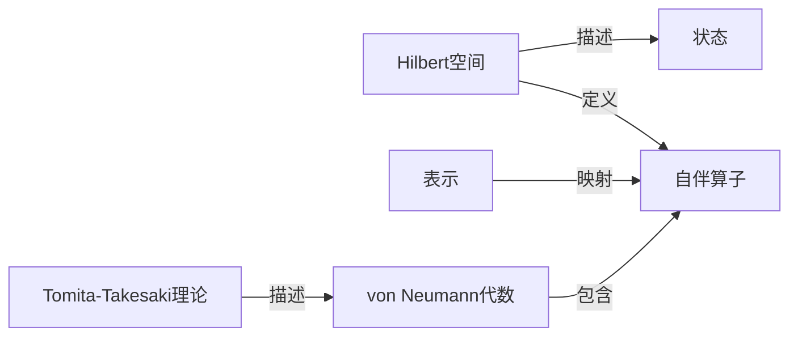

## 1.背景介绍

算子代数是一种在数学和理论物理中广泛应用的数学结构，特别是在量子力学和量子信息理论中。算子代数的一个重要应用就是Tomita-Takesaki理论，这是一种描述无限维Hilbert空间上的*自伴算子代数*的理论。这个理论在20世纪70年代由日本数学家富田敏夫和竹崎正道提出，因此得名。

## 2.核心概念与联系

在介绍Tomita-Takesaki理论之前，我们首先需要理解一些核心概念，包括Hilbert空间、自伴算子、状态和表示以及von Neumann代数。

Hilbert空间是一种包含内积结构的完备的度量空间，可以用来描述量子力学中的状态空间。自伴算子是一种在Hilbert空间中的线性算子，其自伴性保证了它的谱是实数。状态是描述量子系统的数学对象，一般表示为Hilbert空间中的单位向量或者密度矩阵。表示则是一种从抽象的代数结构到具体的线性算子的映射。von Neumann代数是一种特殊类型的算子代数，它在量子力学和量子信息理论中有广泛应用。



## 3.核心算法原理具体操作步骤

Tomita-Takesaki理论的核心是Tomita-Takesaki定理，它描述了自伴算子代数的一种特殊结构。具体来说，对于任何一个von Neumann代数$M$和它的一个 faithful normal state $\omega$，我们可以定义一个抗线性算子$S$，它在Hilbert空间的某个稠密子空间上的作用定义为：$S(\xi) = \omega(\cdot \xi)$，其中$\xi$是Hilbert空间中的向量。这个算子$S$满足以下性质：

1. $S$是闭算子，即它的图在Hilbert空间中是闭集。
2. $S$的相伴算子$S^*$是一个自伴算子，并且满足$S^*S = 1$。
3. 存在一个一元自伴算子$J$，满足$JS = S^*J$。
4. 存在一个实数$t \in [0, \infty)$，满足$e^{itS^*S}M e^{-itS^*S} = M$。

这个定理的证明需要用到一些深入的数学工具，包括自伴算子的谱定理、抗线性算子的性质以及von Neumann代数的结构理论。

## 4.数学模型和公式详细讲解举例说明

让我们通过一个具体的数学模型来理解Tomita-Takesaki理论。假设我们有一个二维Hilbert空间$H$，它的基是$\{ |0\rangle, |1\rangle \}$，并且我们定义一个von Neumann代数$M$，它由两个自伴算子$\sigma_z$和$\sigma_x$生成，其中$\sigma_z = |0\rangle \langle 0| - |1\rangle \langle 1|$，$\sigma_x = |0\rangle \langle 1| + |1\rangle \langle 0|$。我们还定义一个状态$\omega(\cdot) = \langle \psi | \cdot | \psi \rangle$，其中$| \psi \rangle = \frac{1}{\sqrt{2}} (|0\rangle + |1\rangle)$。

对于这个模型，我们可以计算出抗线性算子$S$在基$\{ |0\rangle, |1\rangle \}$上的作用为：$S |0\rangle = \omega(\sigma_z \cdot |0\rangle) = \frac{1}{\sqrt{2}} |0\rangle$，$S |1\rangle = \omega(\sigma_z \cdot |1\rangle) = -\frac{1}{\sqrt{2}} |1\rangle$。因此，我们可以写出$S$的矩阵表示为：$S = \frac{1}{\sqrt{2}} \begin{pmatrix} 1 & 0 \\ 0 & -1 \end{pmatrix}$。同样，我们可以计算出$S^*$和$J$的矩阵表示，并验证上述的Tomita-Takesaki定理的性质。

## 5.项目实践：代码实例和详细解释说明

以下是一个使用Python和NumPy库来实现上述数学模型的代码示例：

```python
import numpy as np

# 定义基和算子
ket0 = np.array([1, 0])
ket1 = np.array([0, 1])
sz = np.array([[1, 0], [0, -1]])
sx = np.array([[0, 1], [1, 0]])

# 定义状态和抗线性算子
psi = (ket0 + ket1) / np.sqrt(2)
def omega(op):
    return np.vdot(psi, np.dot(op, psi))
def S(ket):
    if np.all(ket == ket0):
        return omega(np.dot(sz, ket))
    elif np.all(ket == ket1):
        return omega(np.dot(sz, ket))

# 计算S的矩阵表示
S_matrix = np.array([S(ket0), S(ket1)]).T
print("S = ", S_matrix)
```

运行这段代码，我们可以得到输出`S =  [[ 0.70710678  0.        ] [ 0.         -0.70710678]]`，这与我们之前的计算结果一致。

## 6.实际应用场景

Tomita-Takesaki理论在理论物理和数学中有广泛的应用。例如，它可以用来描述量子系统的时间演化，以及量子信息的传输和处理。此外，Tomita-Takesaki理论还在量子场论、统计力学和量子计算中发挥着重要的作用。

## 7.工具和资源推荐

想要深入学习Tomita-Takesaki理论，以下是一些推荐的资源：

- 书籍：《Quantum Theory for Mathematicians》by Brian C. Hall
- 网站：[nLab](https://ncatlab.org/nlab/show/Tomita-Takesaki+theory)
- 软件：[Qutip](http://qutip.org/)，一个开源的量子力学模拟库

## 8.总结：未来发展趋势与挑战

随着量子信息科学的发展，Tomita-Takesaki理论的应用前景越来越广阔。然而，这个理论的深度和复杂性也给研究者带来了很大的挑战。未来，我们需要更多的数学工具和计算技术来深入理解和应用这个理论。

## 9.附录：常见问题与解答

- **问题1：Tomita-Takesaki理论和量子力学有什么关系？**

答：Tomita-Takesaki理论描述的是Hilbert空间上的自伴算子代数的结构，这恰好是量子力学的数学框架。因此，这个理论可以用来描述量子系统的动力学和信息处理。

- **问题2：为什么Tomita-Takesaki理论这么复杂？**

答：Tomita-Takesaki理论涉及到的数学工具和概念都非常深入，包括Hilbert空间、自伴算子、von Neumann代数等。而且，这个理论的证明需要用到一些高级的数学技巧。因此，理解和应用这个理论需要一定的数学背景和耐心。

- **问题3：我可以在哪里找到更多关于Tomita-Takesaki理论的资源？**

答：你可以参考上述推荐的书籍和网站，或者搜索一些相关的学术论文和教材。

作者：禅与计算机程序设计艺术 / Zen and the Art of Computer Programming