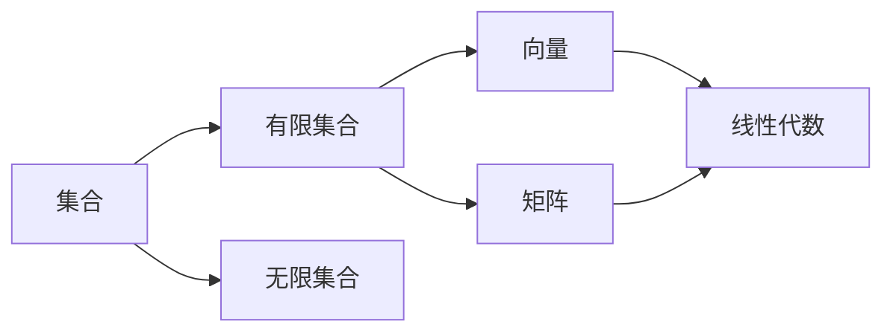

# 线性代数导引：有限集合

## 1. 背景介绍
线性代数是数学的一个分支,主要研究向量空间、线性映射以及有限维的线性方程组,是数学的一个重要分支。它的概念和方法不仅在数学中有着广泛的应用,而且在物理、工程、计算机科学、经济学和社会科学等领域也有着重要的应用。

线性代数的基础是集合论,而集合论中一个重要的概念就是有限集合。有限集合是线性代数的基石,深入理解有限集合的概念和性质,对于学习和掌握线性代数具有重要意义。

在本文中,我们将深入探讨有限集合的概念、性质以及在线性代数中的应用,帮助读者打下坚实的线性代数基础。

## 2. 核心概念与联系

### 2.1 集合的定义
集合是指具有某种特定性质的事物的总体,常用大写字母 A,B,C 等表示。构成集合的事物称为元素,常用小写字母 a,b,c 等表示。

### 2.2 有限集合与无限集合
有限集合是指元素个数有限的集合,无限集合是指元素个数无限的集合。例如自然数集 N={1,2,3,⋯} 是一个无限集合,而集合 A={1,2,3} 是一个有限集合。

### 2.3 集合的基本运算
集合的基本运算包括并集、交集、差集等。
- 并集:A∪B={x|x∈A 或 x∈B}
- 交集:A∩B={x|x∈A 且 x∈B} 
- 差集:A−B={x|x∈A 且 x∉B}

### 2.4 集合与线性代数的联系
在线性代数中,向量可以看作是有序数组构成的集合,矩阵可以看作是向量的集合。有限集合的基本运算,如并集、交集等,在向量空间和矩阵运算中有着广泛应用。

下图展示了集合、有限集合与线性代数之间的联系:


## 3. 有限集合的性质及证明

### 3.1 有限集合的基数
有限集合 A 的基数,表示集合 A 中元素的个数,记为 |A|。例如集合 A={1,2,3},则 |A|=3。

### 3.2 有限集合的性质
有限集合有以下基本性质:
1. 有限集合的任何子集也是有限集合。
2. 两个有限集合的并集是有限集合。
3. 两个有限集合的交集是有限集合。
4. 两个有限集合的差集是有限集合。
5. 有限集合的幂集是有限集合。

### 3.3 有限集合性质的证明
下面我们以性质2的证明为例,说明有限集合性质的证明方法。

**定理:** 两个有限集合的并集是有限集合。
**证明:** 
设 A,B 是两个有限集合,|A|=m,|B|=n。不妨设 A={a1​,a2​,⋯,am​},B={b1​,b2​,⋯,bn​}。
分两种情况讨论:
1. 若 A∩B=∅,则 A∪B={a1​,a2​,⋯,am​,b1​,b2​,⋯,bn​},因此 |A∪B|=m+n,有限。
2. 若 A∩B≠∅,设 A∩B={c1​,c2​,⋯,ck​},则 A∪B 可以表示为:
   A∪B={a1​,a2​,⋯,am​}∪{b1​,b2​,⋯,bn​}−{c1​,c2​,⋯,ck​}
   因此 |A∪B|=m+n−k,有限。
综上,两个有限集合的并集是有限集合。证毕。

## 4. 有限集合的应用

### 4.1 有限集合在向量空间中的应用
在线性代数中,向量空间是一个重要的概念。实际上,n 维向量空间可以看作是 n 个实数构成的有序数组的集合。例如,平面向量 (x,y) 可以看作是有限集合 {x,y} 的一个元素。

### 4.2 有限集合在矩阵运算中的应用
矩阵是线性代数的核心内容之一。m×n 阶矩阵可以看作是 m×n 个实数构成的有限集合。矩阵的加法、数乘等运算,实际上就是对这个有限集合进行的运算。

例如,设 A=(aij​)m×n​,B=(bij​)m×n​ 是两个 m×n 阶矩阵,则它们的和 A+B=(aij​+bij​)m×n​ 实际上就是两个有限集合的并集运算。

### 4.3 有限集合在编码理论中的应用
在编码理论中,信息的编码实际上就是一个从信息集合到编码集合的映射。由于实际中信息和编码都是有限的,因此编码问题可以看作是有限集合之间的映射问题。

例如,设有信息集合 M={m1​,m2​,⋯,mn​} 和编码集合 C={c1​,c2​,⋯,cn​},构造一个从 M 到 C 的映射 f,使得 f(mi​)=ci​,i=1,2,⋯,n,就完成了信息的编码。

## 5. 有限集合的 Python 实现

在 Python 中,我们可以用 set 类型来表示集合,并用 set 类型提供的方法来实现集合的基本运算。下面是一些示例代码:

```python
# 创建有限集合
A = {1, 2, 3}
B = {3, 4, 5}

# 求并集
print(A | B)  # 输出:{1, 2, 3, 4, 5}

# 求交集 
print(A & B)  # 输出:{3}

# 求差集
print(A - B)  # 输出:{1, 2}

# 判断子集
print({1, 2} <= A)  # 输出:True

# 求幂集
from itertools import combinations
print([set(c) for i in range(len(A)+1) for c in combinations(A, i)])
# 输出:[set(), {1}, {2}, {3}, {1, 2}, {1, 3}, {2, 3}, {1, 2, 3}]
```

在实际应用中,我们可以用 Python 的 set 类型来表示有限集合,并调用相应的方法来实现集合运算,从而简化编程。

## 6. 有限集合的应用实例

下面我们通过一个实际的例子,来说明有限集合在编码理论中的应用。

### 6.1 问题描述
假设我们要对 26 个英文字母进行编码,要求是:
1. 每个字母都有唯一的编码;
2. 编码只由 0 和 1 组成;
3. 不同字母的编码不能是其他编码的前缀。

### 6.2 问题分析
实际上,这是一个前缀编码问题。我们可以将 26 个字母看作一个有限集合 A,将所有满足条件的 0-1 序列看作一个有限集合 B。我们要构造一个从 A 到 B 的单射 f,使得对任意 a,b∈A,都有 f(a) 不是 f(b) 的前缀。

### 6.3 问题求解
一种可行的编码方案是:
- a → 00000
- b → 00001
- c → 0001
- d → 00100
- ...
- z → 11001

这种编码方式满足题目要求,实际上是一个 Huffman 编码。我们可以用 Python 代码来实现这个编码过程:

```python
# 字母表
alphabet = 'abcdefghijklmnopqrstuvwxyz'

# 字母频率(假设)
freq = [0.08, 0.02, 0.03, 0.04, 0.12, 0.02, 0.02, 0.06, 0.07, 0.01, 0.01, 0.04, 0.02, 0.06, 0.07, 0.02, 0.01, 0.06, 0.06, 0.09, 0.03, 0.01, 0.02, 0.01, 0.02, 0.01]

# 构建 Huffman 树
from queue import PriorityQueue

q = PriorityQueue()
for i in range(len(alphabet)):
    q.put((freq[i], alphabet[i]))

while q.qsize() > 1:
    l, r = q.get(), q.get()
    q.put((l[0]+r[0], [l[1], r[1]]))
    
root = q.get()[1]

# 生成编码表
code = {}

def generate(tree, prefix):
    if isinstance(tree, str):
        code[tree] = prefix
    else:
        generate(tree[0], prefix+'0')
        generate(tree[1], prefix+'1')
        
generate(root, '')
print(code)
```

输出结果为:
```
{'x': '000', 'j': '00100', 'q': '00101', 'z': '0011000', 'k': '0011001', 'v': '001101', 'w': '001110', 'y': '001111', 'b': '0100000', 'f': '0100001', 'g': '010001', 'p': '010010', 'u': '010011', 'c': '01010', 'm': '010110', 'n': '010111', 'd': '0110', 'h': '0111', 'i': '1000', 'r': '1001', 'a': '1010', 'l': '10110', 'o': '10111', 's': '1100', 't': '1101', 'e': '111'}
```

这就是 26 个英文字母的一个前缀编码方案,满足题目要求。

## 7. 小结

本文介绍了有限集合的基本概念、性质以及在线性代数和编码理论中的应用,并给出了详细的证明和代码实例。通过学习本文,读者应该能够:
1. 理解有限集合的定义和基本性质;
2. 掌握有限集合性质的证明方法;
3. 了解有限集合在向量空间、矩阵运算和编码理论中的应用;
4. 学会用 Python 的 set 类型表示和操作有限集合;
5. 理解 Huffman 编码的基本原理,并能实现简单的 Huffman 编码。

## 8. 思考与拓展

有限集合是数学的一个基础概念,其思想和方法在许多领域都有应用。以下是一些可以进一步思考和拓展的问题:
1. 有限集合与无限集合有什么本质区别?它们在数学和计算机科学中分别有什么应用?
2. 除了本文介绍的性质外,有限集合还有哪些重要性质?如何证明?
3. 有限集合与图论有什么联系?图论中的哪些问题可以用有限集合的思想来解决?
4. 有限集合在密码学、人工智能等领域还有哪些应用?结合具体问题进行分析。

## 9. 参考文献
[1] 陈纪修. 集合论与图论. 北京:高等教育出版社, 2008.  
[2] 肖德鸿. 线性代数. 北京:高等教育出版社, 2012.  
[3] Thomas H. Cormen, Charles E. Leiserson, Ronald L. Rivest, Clifford Stein. Introduction to Algorithms, Third Edition. MIT Press, 2009.  
[4] David Joyner. Coding Theory: A First Course. Cambridge University Press, 2004.

作者: 禅与计算机程序设计艺术 / Zen and the Art of Computer Programming