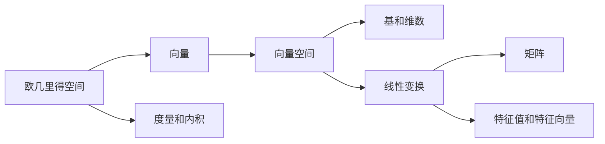

# 线性代数导引：欧几里得空间

## 1. 背景介绍

### 1.1 线性代数的起源与发展
线性代数是数学的一个分支,主要研究向量空间、线性映射以及有限维的线性方程组。它的概念和方法广泛应用于自然科学、工程技术和社会科学等领域。线性代数的起源可以追溯到公元前,古代数学家就已经开始研究线性方程组的求解问题。18世纪,欧拉和克莱姆等数学家对行列式理论进行了系统的研究。19世纪,哈密顿创立了四元数,为向量分析的发展奠定了基础。从19世纪末到20世纪初,矩阵理论得到了蓬勃发展,并逐步形成了线性代数的基本框架。

### 1.2 欧几里得空间的概念
欧几里得空间是以古希腊数学家欧几里得命名的数学概念,是一个有限维的内积空间。通俗地说,就是一个满足特定性质的向量空间,其中向量之间可以进行加法、数乘以及计算内积等运算。欧几里得空间是线性代数中的一个核心概念,在解析几何、物理学等领域有着广泛的应用。

### 1.3 线性代数与欧几里得空间的关系
线性代数是研究线性关系的数学分支,而欧几里得空间则提供了一个具体的线性结构模型。在欧几里得空间中,我们可以利用线性代数的工具和方法,如向量、矩阵、线性变换等,来刻画空间中的几何对象以及它们之间的关系。线性代数与欧几里得空间的结合,为解决许多实际问题提供了有力的数学工具。

## 2. 核心概念与联系

### 2.1 向量与向量空间
向量是欧几里得空间中的基本元素,它具有大小和方向两个属性。一组向量在加法和数乘运算下所构成的集合,称为向量空间。欧几里得空间就是一个特殊的向量空间,它还具有内积运算。

### 2.2 度量与内积
在欧几里得空间中,我们可以定义向量之间的距离,即度量。内积是计算向量之间夹角的一种方法,通过内积我们可以刻画向量之间的正交关系。内积也是欧几里得空间区别于一般向量空间的关键特征。

### 2.3 基与维数
向量空间中的一组向量如果满足线性无关且能够张成整个空间,我们就称其为一组基。空间的维数就是基中向量的个数。选取不同的基,可以得到向量的不同坐标表示。

### 2.4 线性变换与矩阵
线性变换是欧几里得空间中的一类特殊映射,它保持向量加法和数乘运算的结构。我们通常用矩阵来表示线性变换,矩阵的乘法对应着线性变换的复合。通过矩阵,我们可以将抽象的线性变换具体化为数值计算。

### 2.5 特征值与特征向量
对于一个线性变换,存在一些特殊的向量,在变换下只发生伸缩而不改变方向,这些向量称为特征向量,对应的伸缩因子称为特征值。特征值和特征向量反映了线性变换的本质属性,在矩阵对角化等问题中有重要应用。

以下是这些核心概念之间的联系图:



## 3. 核心算法原理具体操作步骤

### 3.1 Gram-Schmidt 正交化
Gram-Schmidt 正交化是一种将向量组转化为正交向量组的方法。它的基本步骤如下:
1. 取向量组的第一个向量 $v_1$,令 $e_1=\frac{v_1}{||v_1||}$。
2. 对于 $i=2,3,\cdots,n$,令 $e_i=v_i-\sum_{j=1}^{i-1}\frac{<v_i,e_j>}{<e_j,e_j>}e_j$,然后归一化 $e_i$。
3. 最终得到正交向量组 $\{e_1,e_2,\cdots,e_n\}$。

### 3.2 QR 分解
任意一个矩阵 $A$ 都可以分解为一个正交矩阵 $Q$ 和一个上三角矩阵 $R$ 的乘积,即 $A=QR$。QR 分解的步骤如下:
1. 将矩阵 $A$ 的列向量组施以 Gram-Schmidt 正交化,得到正交向量组 $\{e_1,e_2,\cdots,e_n\}$。
2. 令 $Q=(e_1,e_2,\cdots,e_n)$,则 $Q$ 为正交矩阵。 
3. 令 $R=Q^TA$,则 $R$ 为上三角矩阵,且满足 $A=QR$。

### 3.3 谱定理
谱定理说明了实对称矩阵的特征值和特征向量的性质。对于一个 $n$ 阶实对称矩阵 $A$:
1. $A$ 有 $n$ 个实数特征值 $\lambda_1,\lambda_2,\cdots,\lambda_n$。
2. 存在一组由 $A$ 的特征向量构成的正交基 $\{v_1,v_2,\cdots,v_n\}$。
3. $A$ 可以对角化为 $A=Q\Lambda Q^T$,其中 $Q$ 的列向量为 $A$ 的特征向量,$\Lambda=diag\{\lambda_1,\lambda_2,\cdots,\lambda_n\}$。

## 4. 数学模型和公式详细讲解举例说明

### 4.1 内积与长度
在欧几里得空间中,向量 $\mathbf{x}=(x_1,\cdots,x_n)$ 和 $\mathbf{y}=(y_1,\cdots,y_n)$ 的内积定义为
$$\langle\mathbf{x},\mathbf{y}\rangle=\sum_{i=1}^n x_iy_i$$
向量的长度可以用内积表示为
$$||\mathbf{x}||=\sqrt{\langle\mathbf{x},\mathbf{x}\rangle}=\sqrt{\sum_{i=1}^n x_i^2}$$

**举例**:在三维欧式空间中,向量 $\mathbf{a}=(1,2,3)$ 和 $\mathbf{b}=(4,5,6)$ 的内积为
$$\langle\mathbf{a},\mathbf{b}\rangle=1\times4+2\times5+3\times6=32$$
向量 $\mathbf{a}$ 的长度为 
$$||\mathbf{a}||=\sqrt{1^2+2^2+3^2}=\sqrt{14}$$

### 4.2 正交性
两个向量 $\mathbf{x}$ 和 $\mathbf{y}$ 正交是指它们的内积为零,即 $\langle\mathbf{x},\mathbf{y}\rangle=0$。一组两两正交且都是单位向量的向量称为标准正交基。

**举例**:在二维欧式平面内,向量 $\mathbf{e}_1=(1,0)$ 和 $\mathbf{e}_2=(0,1)$ 构成一组标准正交基。任意向量 $\mathbf{v}=(x,y)$ 都可以用它们的线性组合表示:
$$\mathbf{v}=x\mathbf{e}_1+y\mathbf{e}_2$$

### 4.3 线性变换的矩阵表示
设 $\mathbf{e}_1,\cdots,\mathbf{e}_n$ 是欧几里得空间 $V$ 的一组基,$\mathbf{f}_1,\cdots,\mathbf{f}_n$ 是 $V$ 的另一组基,线性变换 $T$ 满足
$$T(\mathbf{e}_j)=\sum_{i=1}^na_{ij}\mathbf{f}_i, j=1,2,\cdots,n$$
则 $T$ 在基 $\mathbf{e}_1,\cdots,\mathbf{e}_n$ 和 $\mathbf{f}_1,\cdots,\mathbf{f}_n$ 下的矩阵表示为
$$A=(a_{ij})_{n\times n}$$

**举例**:设 $T$ 是二维欧式平面上的一个线性变换,在标准正交基 $\mathbf{i}=(1,0),\mathbf{j}=(0,1)$ 下,有
$$T(\mathbf{i})=3\mathbf{i}-4\mathbf{j}, T(\mathbf{j})=2\mathbf{i}+\mathbf{j}$$
则 $T$ 在该基下的矩阵表示为
$$A=\begin{pmatrix}3&2\\-4&1\end{pmatrix}$$

## 5. 项目实践：代码实例和详细解释说明

下面我们用 Python 实现 Gram-Schmidt 正交化的算法。

```python
import numpy as np

def gram_schmidt(vectors):
    basis = []
    for v in vectors:
        w = v
        for b in basis:
            w = w - np.dot(v,b) / np.dot(b,b) * b
        if np.linalg.norm(w) > 1e-8:  # 处理数值误差
            basis.append(w / np.linalg.norm(w))
    return np.array(basis)
```

代码解释:
1. 函数 `gram_schmidt` 接受一个向量列表作为输入,返回正交化后的向量组。
2. 我们初始化一个空列表 `basis` 用于存储正交基。
3. 对于每一个输入向量 `v`,我们首先将其赋值给 `w`。
4. 然后我们将 `w` 减去它在已有正交基 `basis` 上的投影,实现正交化。
5. 如果正交化后的向量 `w` 的模长大于一个小的阈值(这里取 1e-8),我们就将其归一化后加入 `basis`。
6. 最后我们将 `basis` 转化为 Numpy 数组并返回。

下面是一个使用示例:

```python
vectors = np.array([[3,1], [2,2]])
orthogonal_basis = gram_schmidt(vectors)
print(orthogonal_basis)
```

输出结果:
```
[[0.9486833  0.31622777]
 [0.         0.9486833 ]]
```

可以看到,原始的向量组经过 Gram-Schmidt 正交化后,得到了一组正交基。

## 6. 实际应用场景

欧几里得空间和线性代数在许多领域都有广泛应用,下面列举几个典型的应用场景。

### 6.1 计算机图形学
在计算机图形学中,三维空间中的点、线、面等几何对象都可以用向量和矩阵来表示。通过线性变换如平移、旋转、缩放等,我们可以实现对三维物体的各种变换操作。例如,在三维游戏或动画制作中,角色和场景的运动都是通过矩阵变换来实现的。

### 6.2 机器学习与数据挖掘
在机器学习和数据挖掘领域,样本数据通常被表示为高维空间中的向量。许多经典的算法,如主成分分析(PCA)、支持向量机(SVM)等,都是建立在向量空间和线性代数的基础之上。通过对高维数据进行线性变换和降维处理,我们可以提取数据的主要特征,实现数据压缩和分类等任务。

### 6.3 量子计算
量子计算是利用量子力学原理进行信息处理和计算的新兴技术。在量子计算中,量子态是一个复向量空间,量子门操作则对应着这个空间上的酉矩阵。通过线性代数的工具,我们可以刻画量子算法的原理,分析量子电路的性质,为量子计算的发展提供理论基础。

### 6.4 信号处理
在信号处理领域,信号通常被表示为向量或函数。许多常用的变换,如傅里叶变换、小波变换等,都可以用线性代数的语言来描述。通过对信号进行变换和滤波处理,我们可以提取信号的特征,去除噪声干扰,实现信号的压缩和传输等任务。

### 6.5 计量经济学
在计量经济学中,经济数据通常被组织成矩阵的形式。通过线性回归、主成分分析等方法,我们可以刻画不同