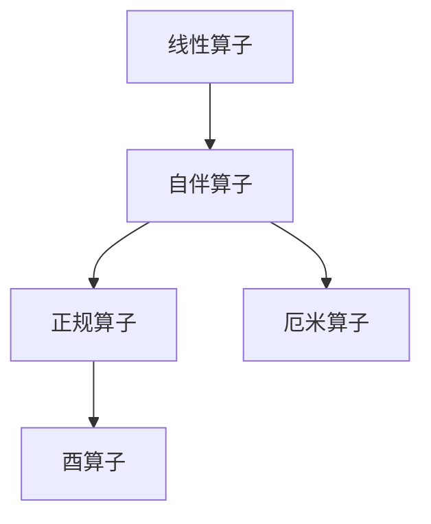

# 线性代数导引：自伴算子

## 1.背景介绍

线性代数是现代数学的一个重要分支,在各个科学领域都有着广泛的应用。自伴算子(Self-Adjoint Operator)是线性代数中一个非常重要的概念,在量子力学、信号处理、数值计算等诸多领域扮演着关键角色。本文将从线性代数的角度,深入探讨自伴算子的本质特征、性质及其应用,为读者提供一个全面的理解和把握自伴算子的机会。

## 2.核心概念与联系

### 2.1 线性算子

在线性代数中,算子(Operator)是一种作用于向量空间的函数变换。设 $\mathcal{V}$ 为一个向量空间,如果存在一个函数 $T:\mathcal{V}\rightarrow\mathcal{V}$,那么我们称 $T$ 为一个算子。算子的基本运算包括加法、数乘和乘法,满足以下性质:

$$
\begin{aligned}
(T_1 + T_2)(\vec{x}) &= T_1(\vec{x}) + T_2(\vec{x}) \\
(kT)(\vec{x}) &= k(T(\vec{x})) \\
(T_1T_2)(\vec{x}) &= T_1(T_2(\vec{x}))
\end{aligned}
$$

其中 $T_1$、$T_2$ 为算子, $k$ 为标量, $\vec{x}$ 为向量。

### 2.2 线性算子的特征

线性算子具有以下几个重要特征:

1. **值域(Range)**: 算子 $T$ 的值域是指所有 $T(\vec{x})$ 的集合,记为 $\mathcal{R}(T)$。
2. **核(Null Space)**: 算子 $T$ 的核是指所有使 $T(\vec{x})=\vec{0}$ 的向量 $\vec{x}$ 的集合,记为 $\mathcal{N}(T)$。
3. **秩(Rank)**: 算子 $T$ 的秩是指其值域 $\mathcal{R}(T)$ 的维数。

### 2.3 自伴算子

自伴算子(Self-Adjoint Operator)是一种特殊的线性算子,具有如下性质:对于任意向量 $\vec{x}$、$\vec{y}$ 以及标量 $\alpha$、$\beta$,都有

$$\langle T(\vec{x}),\vec{y}\rangle = \langle\vec{x},T(\vec{y})\rangle$$

其中 $\langle\cdot,\cdot\rangle$ 表示内积运算。自伴算子在线性代数中扮演着非常重要的角色,它们的特征向量彼此正交,并且可以通过谱定理对其进行特征分解。



自伴算子是一种更加一般的算子,它包含了正规算子(Normal Operator)和厄米算子(Hermitian Operator)两种特殊情况。正规算子满足 $TT^* = T^*T$,而厄米算子则要求算子等于它的共轭转置,即 $T = T^*$。

## 3.核心算法原理具体操作步骤

### 3.1 判断自伴性

判断一个算子是否为自伴算子,我们可以检验它是否满足自伴性质:

$$\langle T(\vec{x}),\vec{y}\rangle = \langle\vec{x},T(\vec{y})\rangle$$

对于矩阵形式的算子 $T$,我们有:

$$\langle T\vec{x},\vec{y}\rangle = \vec{x}^HT^H\vec{y} = \vec{x}^HT\vec{y} = \langle\vec{x},T\vec{y}\rangle$$

其中 $(\cdot)^H$ 表示共轭转置。因此,对于矩阵算子 $T$,它是自伴的当且仅当 $T = T^H$。

### 3.2 自伴算子的特征分解

由于自伴算子的特征向量彼此正交,我们可以对其进行特征分解。设 $T$ 为自伴算子,则存在一组正交基 $\{\vec{v}_1,\vec{v}_2,\cdots,\vec{v}_n\}$,使得:

$$T\vec{v}_i = \lambda_i\vec{v}_i,\quad i=1,2,\cdots,n$$

其中 $\lambda_i$ 为对应的特征值。于是我们可以将 $T$ 表示为:

$$T = \sum_{i=1}^n\lambda_iP_i$$

这里 $P_i$ 是投影到 $\vec{v}_i$ 上的算子,定义为:

$$P_i(\vec{x}) = \langle\vec{x},\vec{v}_i\rangle\vec{v}_i$$

利用特征分解,我们可以方便地计算自伴算子的各种性质,如特征值、特征向量、矩阵函数等。

```mermaid
graph TD
    A[自伴算子 T] -->|特征分解| B(T = &Sigma;&lambda;<sub>i</sub>P<sub>i</sub>)
    B --> C[特征值 &lambda;<sub>i</sub>]
    B --> D[特征向量 v<sub>i</sub>]
    B --> E[矩阵函数 f(T)]
```

### 3.3 自伴算子的性质

自伴算子还具有以下一些重要性质:

1. **实数特征值**: 自伴算子的所有特征值都是实数。
2. **正规性**: 自伴算子是正规算子,即满足 $TT^* = T^*T$。
3. **幂等性**: 若 $T^2 = T$,则 $T$ 为自伴算子。
4. **谱定理**: 自伴算子在有限维情况下可以用正交矩阵相似对角化;在无限维情况下,存在一组完备的正交特征向量。

利用这些性质,我们可以更好地理解和操作自伴算子。

## 4.数学模型和公式详细讲解举例说明

### 4.1 自伴算子的矩阵表示

设 $T$ 为 $n$ 阶自伴算子,在某一标准正交基 $\{\vec{e}_1,\vec{e}_2,\cdots,\vec{e}_n\}$ 下,它可以表示为:

$$T = \begin{bmatrix}
    a_{11} & a_{12} & \cdots & a_{1n} \\
    a_{21} & a_{22} & \cdots & a_{2n} \\
    \vdots & \vdots & \ddots & \vdots \\
    a_{n1} & a_{n2} & \cdots & a_{nn}
\end{bmatrix}$$

由于 $T$ 为自伴算子,所以它的矩阵表示是一个 Hermite 矩阵,即满足 $a_{ij} = \overline{a_{ji}}$,其中 $\overline{a_{ji}}$ 表示 $a_{ji}$ 的复数共轭。

作为例子,我们考虑一个 $3\times 3$ 的自伴矩阵:

$$T = \begin{bmatrix}
    2 & 1+i & 0 \\
    1-i & 3 & -2i \\
    0 & 2i & 5
\end{bmatrix}$$

我们可以验证该矩阵确实满足 $T = T^H$,因此它是一个自伴算子。

### 4.2 自伴算子的特征值和特征向量

对于上面的自伴矩阵 $T$,我们可以计算出它的特征值和特征向量:

$$\begin{aligned}
\lambda_1 &= 7, &\vec{v}_1 &= \begin{bmatrix}
    \frac{1}{\sqrt{2}} \\
    \frac{i}{\sqrt{2}} \\
    0
\end{bmatrix} \\
\lambda_2 &= 2, &\vec{v}_2 &= \begin{bmatrix}
    \frac{1}{\sqrt{3}} \\
    -\frac{1}{\sqrt{3}} \\
    \frac{1}{\sqrt{3}}
\end{bmatrix} \\
\lambda_3 &= 1, &\vec{v}_3 &= \begin{bmatrix}
    \frac{1}{2} \\
    \frac{i}{2} \\
    -\frac{1}{\sqrt{2}}
\end{bmatrix}
\end{aligned}$$

注意到特征值都是实数,并且特征向量彼此正交,这正是自伴算子的性质。利用这些特征值和特征向量,我们可以对 $T$ 进行特征分解:

$$T = 7P_1 + 2P_2 + P_3$$

其中 $P_i$ 是投影到对应特征向量 $\vec{v}_i$ 上的算子。

### 4.3 自伴算子的函数

由于自伴算子可以被对角化,我们可以方便地计算它的各种函数。设 $f$ 为一个实值函数,那么对于自伴算子 $T$,我们定义:

$$f(T) = \sum_{i=1}^nf(\lambda_i)P_i$$

其中 $\lambda_i$ 是 $T$ 的特征值, $P_i$ 是对应的投影算子。

例如,对于上面的自伴矩阵 $T$,我们可以计算出 $e^T$:

$$e^T = e^7P_1 + e^2P_2 + P_3$$

这种通过特征分解计算矩阵函数的方法,在数值计算中有着广泛的应用。

## 5.项目实践:代码实例和详细解释说明

为了帮助读者更好地理解自伴算子的概念和性质,我们提供了一个基于 Python 和 NumPy 库的实现示例。该示例包括判断一个矩阵是否为自伴算子、计算自伴算子的特征值和特征向量、以及计算自伴算子的矩阵函数。

```python
import numpy as np

def is_self_adjoint(A):
    """
    判断矩阵 A 是否为自伴算子
    """
    return np.allclose(A, A.conj().T)

def eigen_decomposition(A):
    """
    计算自伴算子 A 的特征值和特征向量
    """
    eigenvalues, eigenvectors = np.linalg.eigh(A)
    return eigenvalues, eigenvectors

def matrix_function(A, f):
    """
    计算自伴算子 A 的矩阵函数 f(A)
    """
    eigenvalues, eigenvectors = eigen_decomposition(A)
    f_A = np.zeros_like(A)
    for i in range(A.shape[0]):
        f_A += f(eigenvalues[i]) * np.outer(eigenvectors[:, i], eigenvectors[:, i])
    return f_A

# 示例用法
A = np.array([[2, 1+1j, 0], [1-1j, 3, -2j], [0, 2j, 5]])
print("矩阵 A 是否为自伴算子:", is_self_adjoint(A))

eigenvalues, eigenvectors = eigen_decomposition(A)
print("特征值:", eigenvalues)
print("特征向量:")
for ev in eigenvectors.T:
    print(ev)

import math
f_A = matrix_function(A, math.exp)
print("e^A =\n", f_A)
```

在上面的代码中,我们首先定义了三个函数:

1. `is_self_adjoint(A)`: 判断矩阵 `A` 是否为自伴算子,利用了自伴算子满足 $A = A^H$ 的性质。
2. `eigen_decomposition(A)`: 计算自伴算子 `A` 的特征值和特征向量,利用了 NumPy 中的 `np.linalg.eigh` 函数。
3. `matrix_function(A, f)`: 计算自伴算子 `A` 的矩阵函数 $f(A)$,利用了自伴算子的特征分解。

在示例用法部分,我们首先创建了一个 $3\times 3$ 的自伴矩阵 `A`。然后,我们分别调用上述三个函数,验证了 `A` 是自伴算子,计算了它的特征值和特征向量,并计算了 $e^A$。

通过这个示例,读者可以更好地理解自伴算子的相关概念和操作,并学习如何使用 Python 和 NumPy 库来实现相关的计算和操作。

## 6.实际应用场景

自伴算子在许多实际应用领域扮演着重要角色,下面我们列举几个典型的应用场景:

### 6.1 量子力学

在量子力学中,自伴算子被用于描述可观测量,如能量、动量、角动量等。根据量子力学的基本定理,任何可观测量都对应着一个自伴算子,并且该算子的特征值就是可观测量的可能测量值。因此,自伴算子在量子力学中具有fundamentally重要的地位。

### 6.2 信号处理

在