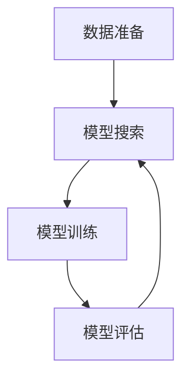
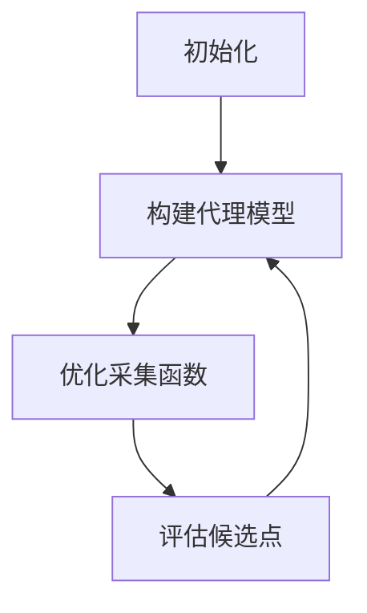
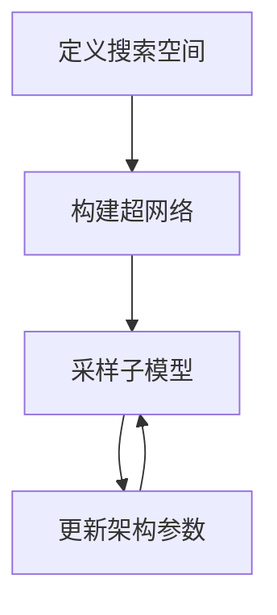

# 自动机器学习AutoML原理与代码实战案例讲解

## 1.背景介绍

### 1.1 机器学习的挑战

在过去的几十年里,机器学习取得了长足的进步,并被广泛应用于各个领域,如计算机视觉、自然语言处理、推荐系统等。然而,构建一个高质量的机器学习模型仍然是一项艰巨的挑战。它需要数据科学家和机器学习工程师投入大量的时间和精力来进行特征工程、模型选择、超参数调优等繁琐的工作。

### 1.2 AutoML的兴起

为了简化机器学习模型的构建过程,自动机器学习(AutoML)应运而生。AutoML旨在通过自动化的方式来执行机器学习流程中的各个步骤,从而降低机器学习模型构建的门槛,提高效率,并获得更优秀的模型性能。

### 1.3 AutoML的重要性

随着数据的快速增长和机器学习应用的扩展,AutoML变得越来越重要。它可以帮助企业和组织快速构建高质量的模型,缩短上线时间,降低成本。此外,AutoML还能够充分利用现有的计算资源,最大限度地发挥算力,提高模型的性能表现。

## 2.核心概念与联系

### 2.1 AutoML流程

AutoML的整个流程可以概括为四个主要步骤:

1. **数据准备**: 自动清洗和预处理原始数据,进行特征工程。
2. **模型搜索**: 自动搜索最优模型架构和超参数组合。
3. **模型训练**: 使用优化后的配置训练模型。
4. **模型评估**: 评估模型性能,并根据需要重复以上步骤。



### 2.2 关键技术

实现AutoML需要结合多种技术,包括:

- **贝叶斯优化**(Bayesian Optimization): 用于高效搜索最优超参数组合。
- **神经架构搜索**(Neural Architecture Search): 自动设计神经网络架构。
- **迁移学习**(Transfer Learning): 利用预训练模型加速训练。
- **元学习**(Meta Learning): 学习如何快速适应新任务。

### 2.3 AutoML框架

目前,已有多种开源和商业AutoML框架可供选择,例如:

- **Auto-Sklearn**: 基于scikit-learn库的AutoML工具。
- **Auto-Pytorch**: 用于图像、文本等任务的PyTorch版AutoML工具。
- **Google Cloud AutoML**: Google提供的基于云的AutoML服务。
- **Amazon SageMaker Autopilot**: AWS的AutoML解决方案。

## 3.核心算法原理具体操作步骤

### 3.1 贝叶斯优化

贝叶斯优化是AutoML中超参数优化的核心算法之一。它通过构建代理模型来近似目标函数,然后利用采集函数在代理模型上搜索新的候选点,从而有效缩小搜索空间。

1. 初始化:随机采样少量初始点,用于构建初始代理模型。
2. 构建代理模型:使用高斯过程或其他回归模型拟合观测数据,获得目标函数的近似。
3. 优化采集函数:在代理模型上优化采集函数(如期望改善量),以获得新的候选点。
4. 评估候选点:在真实目标函数上评估新的候选点,更新观测数据。
5. 重复2-4步骤,直到满足终止条件(如最大迭代次数或性能要求)。



### 3.2 神经架构搜索

神经架构搜索(NAS)旨在自动设计神经网络架构,以获得更高的性能和效率。常见的NAS算法包括:

1. **进化算法**(Evolutionary Algorithms)
2. **强化学习**(Reinforcement Learning)
3. **梯度优化**(Gradient-based Optimization)

以梯度优化为例,NAS的步骤如下:

1. 定义搜索空间:指定可搜索的操作(如卷积、池化等)及其连接方式。
2. 构建超网络:将所有可能的操作和连接组合成一个巨大的超网络。
3. 采样子模型:从超网络中采样一个子模型进行训练和评估。
4. 更新架构参数:根据子模型的性能,使用梯度下降法更新架构参数。
5. 重复3-4步骤,直到找到满意的架构。



## 4.数学模型和公式详细讲解举例说明

### 4.1 高斯过程回归

在贝叶斯优化中,高斯过程回归常被用作代理模型。高斯过程是一种非参数概率模型,它可以为任意有限集合的随机变量定义一致的联合概率分布。

对于输入 $\mathbf{x}$ 和输出 $y$,高斯过程回归假设:

$$y = f(\mathbf{x}) + \epsilon$$

其中 $f(\mathbf{x})$ 是一个高斯过程,服从先验分布:

$$f(\mathbf{x}) \sim \mathcal{GP}(m(\mathbf{x}), k(\mathbf{x}, \mathbf{x}'))$$

$m(\mathbf{x})$ 是均值函数, $k(\mathbf{x}, \mathbf{x}')$ 是核函数(如RBF核),描述了输入之间的相似性。 $\epsilon$ 是噪声项,服从 $\mathcal{N}(0, \sigma^2_n)$ 分布。

给定训练数据 $\mathcal{D} = \{(\mathbf{x}_i, y_i)\}_{i=1}^n$,我们可以计算出条件高斯过程的后验分布:

$$f(\mathbf{x}_*) | \mathbf{X}, \mathbf{y}, \mathbf{x}_* \sim \mathcal{N}(\mu(\mathbf{x}_*), \sigma^2(\mathbf{x}_*))$$

其中均值和方差分别为:

$$\begin{aligned}
\mu(\mathbf{x}_*) &= \mathbf{k}^T_*(\mathbf{K} + \sigma^2_n\mathbf{I})^{-1}\mathbf{y} \\
\sigma^2(\mathbf{x}_*) &= k(\mathbf{x}_*, \mathbf{x}_*) - \mathbf{k}^T_*(\mathbf{K} + \sigma^2_n\mathbf{I})^{-1}\mathbf{k}_*
\end{aligned}$$

这个后验分布就是我们所需的代理模型,可用于预测新输入的输出及其不确定性。

### 4.2 期望改善量(Expected Improvement)

期望改善量是一种常用的采集函数,用于在贝叶斯优化中平衡exploitation和exploration。对于最小化目标,期望改善量定义为:

$$\mathrm{EI}(\mathbf{x}) = \mathbb{E}\left[\max(f_{\min} - f(\mathbf{x}), 0)\right]$$

其中 $f_{\min}$ 是当前最优目标函数值。如果使用高斯过程回归作为代理模型,则期望改善量可以解析计算:

$$\mathrm{EI}(\mathbf{x}) = \begin{cases}
(f_{\min} - \mu(\mathbf{x}))\Phi\left(\frac{f_{\min} - \mu(\mathbf{x})}{\sigma(\mathbf{x})}\right) + \sigma(\mathbf{x})\phi\left(\frac{f_{\min} - \mu(\mathbf{x})}{\sigma(\mathbf{x})}\right) & \text{if } \sigma(\mathbf{x}) > 0 \\
0 & \text{if } \sigma(\mathbf{x}) = 0
\end{cases}$$

其中 $\Phi(\cdot)$ 和 $\phi(\cdot)$ 分别是标准正态分布的累积分布函数和概率密度函数。

通过最大化期望改善量,我们可以在exploitation(利用当前最优解附近的区域)和exploration(探索新的有前景区域)之间达成平衡。

## 5.项目实践:代码实例和详细解释说明

在这一部分,我们将使用Python中的AutoML框架Auto-Sklearn来构建一个分类模型,并对代码进行详细解释。

### 5.1 安装Auto-Sklearn

```python
pip install auto-sklearn
```

### 5.2 加载数据

我们使用Scikit-Learn中的鸢尾花数据集进行演示:

```python
from sklearn.datasets import load_iris
from sklearn.model_selection import train_test_split

iris = load_iris()
X, y = iris.data, iris.target

X_train, X_test, y_train, y_test = train_test_split(X, y, random_state=1)
```

### 5.3 配置Auto-Sklearn

```python
import autosklearn.classification
import sklearn.model_selection
import sklearn.datasets
import sklearn.metrics

automl = autosklearn.classification.AutoSklearnClassifier(
    time_left_for_this_task=120, # 总时间限制(秒)
    per_run_time_limit=30, # 单次运行时间限制(秒)
    tmp_folder='/tmp/autosklearn_examples_tmp', # 临时文件夹
    output_folder='/tmp/autosklearn_examples_out', # 输出文件夹
    delete_tmp_folder_after_terminate=False,
    resampling_strategy='cv', # 使用交叉验证
    resampling_strategy_arguments={'folds': 5}, # 5折交叉验证
)
```

### 5.4 训练模型

```python
automl.fit(X_train, y_train, dataset_name='iris')
```

在`fit`函数中,Auto-Sklearn会自动执行以下步骤:

1. 数据预处理(如缺失值填充、编码分类特征等)
2. 特征预处理(如特征选择、构造等)
3. 模型搜索(使用贝叶斯优化和其他技术搜索最优模型和超参数)
4. 模型集成(如Stacking等)

### 5.5 评估模型

```python
y_pred = automl.predict(X_test)
print("Accuracy score:", sklearn.metrics.accuracy_score(y_test, y_pred))
```

### 5.6 查看最优模型

```python
print(automl.show_models())
```

输出结果会显示Auto-Sklearn搜索到的最优模型及其超参数配置。

通过这个简单的示例,我们可以看到Auto-Sklearn的强大之处在于它能够自动完成机器学习流程中的各个步骤,而无需人工干预。当然,在实际应用中,我们还需要根据具体问题对Auto-Sklearn进行合理的配置和调优。

## 6.实际应用场景

AutoML技术可以应用于各种机器学习任务,包括但不限于:

### 6.1 计算机视觉

- **图像分类**: 利用AutoML自动构建图像分类模型,如识别手写数字、分类植物种类等。
- **目标检测**: 使用AutoML搜索最优的目标检测架构和超参数。
- **图像分割**: 将AutoML应用于图像分割任务,如医学图像分割、自动驾驶中的场景分割等。

### 6.2 自然语言处理

- **文本分类**: 使用AutoML快速构建文本分类模型,如新闻分类、垃圾邮件过滤等。
- **机器翻译**: 利用AutoML搜索最优的神经机器翻译模型架构。
- **问答系统**: 将AutoML应用于问答系统的构建,提高答复质量。

### 6.3 推荐系统

- **个性化推荐**: 使用AutoML优化推荐系统的模型和超参数,提供更精准的个性化推荐。
- **评分预测**: 利用AutoML预测用户对商品的评分,改进推荐策略。

### 6.4 金融领域

- **信用评分**: 使用AutoML构建信用评分模型,评估借款人的信用风险。
- **欺诈检测**: 将AutoML应用于金融欺诈检测,提高欺诈行为的识别准确率。
- **量化交易**: 优化量化交易策略中的机器学习模型,提高投资回报。

### 6.5 医疗健康

- **疾病诊断**: 利用AutoML从医疗影像数据中诊断疾病,提高诊断准确率。
- **药物发现**: 使用AutoML加速新药物的发现和开发过程。
- **基因组学**: 将AutoML应用于基因组学数据分析,发现基因与