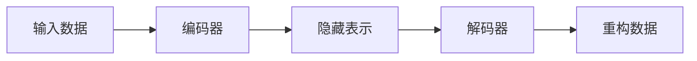

## 1.背景介绍

自动编码器（AutoEncoder）是一种无监督学习的神经网络模型，它的目标是学习输入数据的压缩表示，然后再通过这种表示重构输入数据。自动编码器的这种自我复制能力使其在许多领域都有着广泛的应用，如降维、特征学习、生成模型等。

## 2.核心概念与联系

自动编码器由编码器和解码器两部分组成。编码器负责将输入数据映射到一个隐藏表示，而解码器则从这个隐藏表示重构原始输入。编码器和解码器通常都是神经网络，它们可以是任何形式的神经网络，如全连接的、卷积的、循环的等。



## 3.核心算法原理具体操作步骤

自动编码器的训练过程包括以下步骤：

1. **前向传播**：输入数据通过编码器得到隐藏表示，然后通过解码器得到重构数据。
2. **计算损失**：使用一种损失函数（如均方误差）来衡量重构数据和原始输入数据的差异。
3. **反向传播**：根据损失函数计算出的梯度，更新编码器和解码器的参数。
4. **迭代优化**：重复以上步骤，直到达到预设的迭代次数，或者损失函数的值低于某个阈值。

## 4.数学模型和公式详细讲解举例说明

假设我们的输入数据是$x$，编码器的函数是$f$，解码器的函数是$g$，那么我们可以得到重构数据$\hat{x}=g(f(x))$。我们的目标是最小化重构数据和原始输入数据的差异，即最小化损失函数$L(x, \hat{x})$。

其中，$f$和$g$的参数是通过梯度下降法更新的，更新公式如下：

$$ \theta = \theta - \eta \frac{\partial L}{\partial \theta} $$

其中，$\theta$表示参数，$\eta$表示学习率，$\frac{\partial L}{\partial \theta}$表示损失函数$L$关于参数$\theta$的梯度。

## 5.项目实践：代码实例和详细解释说明

下面我们将使用Python和TensorFlow库来实现一个简单的自动编码器。

首先，我们导入所需的库：

```python
import tensorflow as tf
from tensorflow.keras.layers import Dense
from tensorflow.keras.models import Sequential
```

然后，我们定义编码器和解码器：

```python
encoder = Sequential([Dense(128, activation='relu', input_shape=(784,)), Dense(64, activation='relu')])
decoder = Sequential([Dense(128, activation='relu', input_shape=(64,)), Dense(784, activation='sigmoid')])
```

接下来，我们构建自动编码器模型，并定义损失函数和优化器：

```python
autoencoder = Sequential([encoder, decoder])
autoencoder.compile(loss='binary_crossentropy', optimizer='adam')
```

最后，我们可以使用MNIST数据集来训练我们的自动编码器：

```python
from tensorflow.keras.datasets import mnist
(x_train, _), (x_test, _) = mnist.load_data()
x_train, x_test = x_train / 255.0, x_test / 255.0
x_train, x_test = x_train.reshape(-1, 784), x_test.reshape(-1, 784)
autoencoder.fit(x_train, x_train, epochs=10, batch_size=256, validation_data=(x_test, x_test))
```

## 6.实际应用场景

自动编码器在许多领域都有着广泛的应用，例如：

- **数据降维**：自动编码器可以学习输入数据的低维表示，从而实现数据降维。
- **异常检测**：自动编码器可以用来检测异常数据，因为异常数据的重构误差通常会比正常数据大。
- **生成模型**：自动编码器可以用来生成新的数据，例如变分自动编码器（VAE）就是一种常用的生成模型。

## 7.工具和资源推荐

- **TensorFlow**：一个开源的机器学习框架，提供了丰富的API和工具来支持深度学习的研究和应用。
- **Keras**：一个高级的神经网络API，基于TensorFlow实现，提供了更简洁易用的接口。
- **MNIST数据集**：一个常用的手写数字识别数据集，非常适合用来入门深度学习。

## 8.总结：未来发展趋势与挑战

自动编码器作为一种强大的无监督学习模型，其在未来仍有很大的发展潜力。一方面，我们可以尝试更复杂的模型结构和训练策略，以提高自动编码器的性能；另一方面，我们还可以将自动编码器应用到更多的领域，如自然语言处理、推荐系统等。

然而，自动编码器的发展也面临着一些挑战，如如何选择合适的损失函数、如何避免过拟合、如何处理大规模的数据等。

## 9.附录：常见问题与解答

1. **自动编码器和PCA有什么区别？**

自动编码器和PCA都可以用来进行数据降维，但自动编码器是非线性的，而PCA是线性的。这意味着自动编码器可以学习更复杂的数据结构。

2. **自动编码器可以用来做分类任务吗？**

自动编码器本身不是一个分类器，但我们可以使用自动编码器学习到的隐藏表示来做分类任务。例如，我们可以在自动编码器的编码器部分后面接一个分类器，形成一个端到端的模型。

作者：禅与计算机程序设计艺术 / Zen and the Art of Computer Programming
