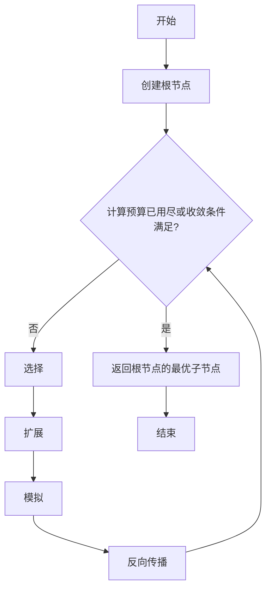
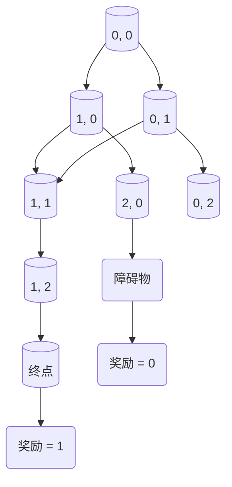

# 蒙特卡罗树搜索 (Monte Carlo Tree Search, MCTS) 原理与代码实例讲解

## 1.背景介绍

### 1.1 什么是蒙特卡罗树搜索

蒙特卡罗树搜索（Monte Carlo Tree Search，MCTS）是一种基于统计的决策过程，用于在具有离散的概率状态空间中寻找最优决策序列。它结合了经典的蒙特卡罗随机模拟和高效的树形结构搜索，在许多领域取得了卓越的成果，尤其是在复杂的决策问题和游戏中。

MCTS算法的核心思想是通过大量的随机模拟来构建一个统计树，该树逐步收敛于最优策略。与传统的搜索算法不同，MCTS不需要事先定义评估函数，而是通过实际模拟获取统计数据，从而逐步优化决策过程。

### 1.2 MCTS的应用领域

MCTS已被广泛应用于各个领域，包括但不限于：

- **游戏AI**：MCTS在国际象棋、围棋、扑克等复杂游戏中取得了巨大成功，成为游戏AI的主流算法之一。
- **机器人规划**：MCTS可用于机器人路径规划、动作决策等问题。
- **计算机辅助设计**：MCTS可用于优化设计参数、探索设计空间等。
- **组合优化**：MCTS可应用于旅行商问题、作业调度等组合优化问题。
- **自然语言处理**：MCTS可用于对话系统、机器翻译等任务。

## 2.核心概念与联系

### 2.1 MCTS的四个基本步骤

MCTS算法的执行过程可以概括为以下四个基本步骤：

1. **选择（Selection）**：从根节点开始，根据某种策略选择子节点，直到到达一个未被充分探索的节点。
2. **扩展（Expansion）**：从选定的节点创建一个或多个子节点，表示游戏的可能状态。
3. **模拟（Simulation）**：从新创建的节点开始，进行一次随机模拟，直到达到终止状态。
4. **反向传播（Backpropagation）**：将模拟的结果反向传播到树中的所有祖先节点，更新它们的统计数据。

这四个步骤循环执行，直到达到计算预算或收敛条件。

### 2.2 UCT公式

在选择步骤中，MCTS通常使用UCT（Upper Confidence Bound for Trees）公式来平衡exploitation（利用已知的好策略）和exploration（探索未知的策略）：

$$
\text{UCT}(v) = \frac{Q(v)}{N(v)} + C \sqrt{\frac{\ln N(p)}{N(v)}}
$$

其中：

- $Q(v)$是节点$v$的总奖励
- $N(v)$是节点$v$被访问的次数
- $N(p)$是父节点$p$被访问的次数
- $C$是一个常数，用于调节exploitation和exploration之间的平衡

UCT公式鼓励算法选择具有较高奖励和较少访问次数的节点，从而在exploitation和exploration之间寻求平衡。

## 3.核心算法原理具体操作步骤

下面是MCTS算法的具体操作步骤：



1. **创建根节点**：创建一个表示初始状态的根节点。
2. **选择**：从根节点开始，根据UCT公式选择子节点，直到到达一个未被充分探索的节点。
3. **扩展**：从选定的节点创建一个或多个子节点，表示游戏的可能状态。
4. **模拟**：从新创建的节点开始，进行一次随机模拟，直到达到终止状态。模拟过程中可以使用简单的策略或启发式方法。
5. **反向传播**：将模拟的结果反向传播到树中的所有祖先节点，更新它们的统计数据，如访问次数和累计奖励。
6. **检查终止条件**：检查是否已达到计算预算或收敛条件。如果条件满足，则算法终止；否则返回步骤2，继续进行下一次迭代。
7. **返回最优子节点**：在算法终止时，返回根节点的最优子节点作为最终决策。

通过多次迭代，MCTS算法逐步构建一个统计树，该树收敛于最优策略。

## 4.数学模型和公式详细讲解举例说明

### 4.1 UCT公式推导

UCT公式的推导基于赫夫丁不等式（Hoeffding's inequality），该不等式给出了样本均值与真实均值之间差异的上确界。

设$X_1, X_2, \ldots, X_n$是$n$个独立同分布的随机变量，取值范围为$[a, b]$，则对于任意正数$\epsilon$，有：

$$
P\left(\left|\frac{1}{n}\sum_{i=1}^{n}X_i - \mathbb{E}[X]\right| \geq \epsilon\right) \leq 2\exp\left(-\frac{2n^2\epsilon^2}{(b-a)^2}\right)
$$

我们希望找到一个上确界$\hat{\mu}$，使得$\hat{\mu} \geq \mathbb{E}[X]$的概率很高。根据赫夫丁不等式，可以得到：

$$
P\left(\mathbb{E}[X] \leq \frac{1}{n}\sum_{i=1}^{n}X_i + \epsilon\right) \geq 1 - 2\exp\left(-\frac{2n\epsilon^2}{(b-a)^2}\right)
$$

令$\epsilon = C\sqrt{\frac{(b-a)^2\ln n}{2n}}$，则上式可以化简为：

$$
P\left(\mathbb{E}[X] \leq \frac{1}{n}\sum_{i=1}^{n}X_i + C\sqrt{\frac{(b-a)^2\ln n}{2n}}\right) \geq 1 - \frac{1}{n^C}
$$

因此，我们可以将$\hat{\mu} = \frac{1}{n}\sum_{i=1}^{n}X_i + C\sqrt{\frac{(b-a)^2\ln n}{2n}}$作为$\mathbb{E}[X]$的上确界，且当$C$足够大时，$\hat{\mu} \geq \mathbb{E}[X]$的概率会非常高。

在MCTS中，我们将$X_i$看作是节点$v$的奖励，$\frac{1}{n}\sum_{i=1}^{n}X_i$就是节点$v$的平均奖励$\frac{Q(v)}{N(v)}$。由于奖励通常在$[0, 1]$范围内，我们可以令$a=0$，$b=1$，从而得到UCT公式：

$$
\text{UCT}(v) = \frac{Q(v)}{N(v)} + C \sqrt{\frac{\ln N(p)}{N(v)}}
$$

UCT公式给出了一个上确界，该上确界随着访问次数的增加而收敛于真实的平均奖励。通过选择具有较高UCT值的节点，MCTS算法在exploitation和exploration之间达到了平衡。

### 4.2 UCT公式在游戏中的应用示例

考虑一个简单的游戏示例：一个机器人需要在一个$3\times 3$的网格中从起点移动到终点。每一步，机器人可以向上、下、左或右移动一个单位格子，直到到达终点或遇到障碍物。我们使用MCTS算法来寻找从起点到终点的最优路径。

假设机器人的起点位于$(0, 0)$，终点位于$(2, 2)$，并且在$(1, 1)$处有一个障碍物。我们将网格中的每个位置表示为一个节点，并使用UCT公式来选择下一步的移动方向。

在模拟阶段，我们可以使用随机策略来进行模拟，直到到达终点或遇到障碍物。如果到达终点，则奖励为1；否则奖励为0。通过多次模拟，我们可以逐步构建一个统计树，该树收敛于最优路径。

下图展示了MCTS算法在该游戏中的运行过程：



在上图中，绿色节点表示到达终点的路径，红色节点表示遇到障碍物的路径。通过反向传播，我们可以更新每个节点的统计数据，如访问次数和累计奖励。

最终，MCTS算法将返回从根节点$(0, 0)$到终点$(2, 2)$的最优路径，即$(0, 0) \rightarrow (0, 1) \rightarrow (1, 1) \rightarrow (1, 2) \rightarrow (2, 2)$。

## 5.项目实践：代码实例和详细解释说明

下面是一个使用Python实现的MCTS算法示例，用于解决上述$3\times 3$网格游戏。

```python
import math
import random

class Node:
    def __init__(self, state, parent=None):
        self.state = state
        self.parent = parent
        self.children = []
        self.visits = 0
        self.reward = 0

    def is_terminal(self):
        # 判断当前状态是否为终止状态
        x, y = self.state
        if x < 0 or x > 2 or y < 0 or y > 2 or (x == 1 and y == 1):
            return True
        return False

    def get_reward(self):
        # 获取当前状态的奖励
        x, y = self.state
        if x == 2 and y == 2:
            return 1
        return 0

    def expand(self):
        # 扩展当前节点，创建子节点
        x, y = self.state
        actions = [(0, 1), (0, -1), (1, 0), (-1, 0)]
        for action in actions:
            new_x, new_y = x + action[0], y + action[1]
            new_state = (new_x, new_y)
            child_node = Node(new_state, self)
            self.children.append(child_node)

def select_node(node, c=1.4):
    # 使用UCT公式选择节点
    log_n_parent = math.log(node.parent.visits) if node.parent else 0
    return node.reward / node.visits + c * math.sqrt(log_n_parent / node.visits)

def mcts(root_node, num_simulations):
    for _ in range(num_simulations):
        node = root_node
        path = [node]

        # 选择阶段
        while node.children and not node.is_terminal():
            node = max(node.children, key=select_node)
            path.append(node)

        # 扩展和模拟阶段
        if not node.is_terminal():
            node.expand()
            path.append(node.children[0])
            node = path[-1]

        # 反向传播阶段
        reward = node.get_reward()
        for n in reversed(path):
            n.visits += 1
            n.reward += reward
            reward = 1 - reward  # 对手的奖励是相反的

    # 返回根节点的最优子节点
    return max(root_node.children, key=lambda n: n.visits)

# 创建根节点
root_node = Node((0, 0))

# 运行MCTS算法
num_simulations = 10000
best_child = mcts(root_node, num_simulations)

# 打印最优路径
path = [best_child.state]
node = best_child
while node.parent:
    node = node.parent
    path.append(node.state)
path.reverse()
print("最优路径:", " -> ".join(str(state) for state in path))
```

上述代码实现了MCTS算法的核心功能，包括节点表示、选择、扩展、模拟和反向传播。下面是对代码的详细解释：

1. `Node`类表示树中的节点，包含了当前状态、父节点、子节点列表、访问次数和累计奖励等属性。
2. `is_terminal`方法判断当前状态是否为终止状态，即是否到达了终点或遇到了障碍物。
3. `get_reward`方法获取当前状态的奖励，如果到达终点，则奖励为1，否则为0。
4. `expand`方