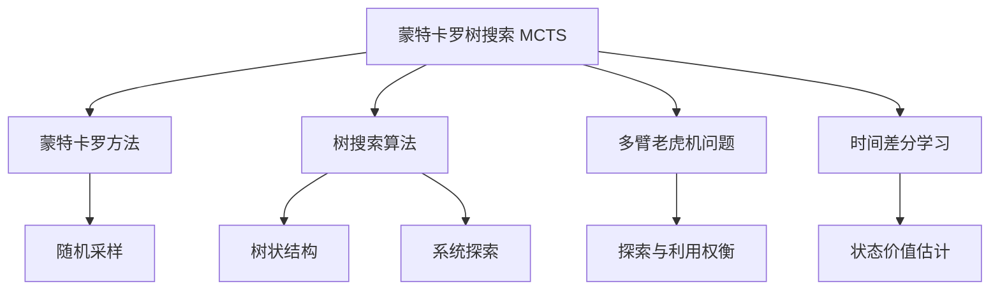
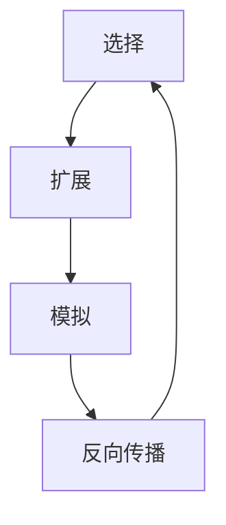
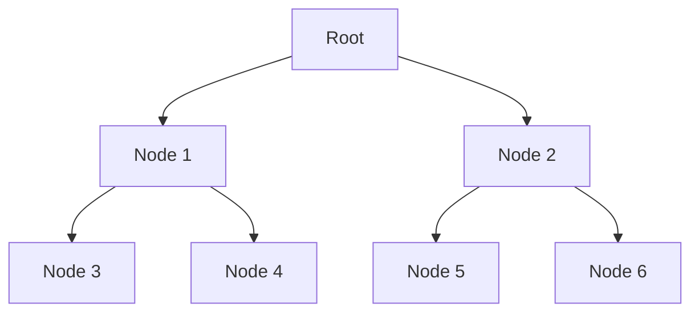

# 蒙特卡罗树搜索 (Monte Carlo Tree Search, MCTS) 原理与代码实例讲解

## 1. 背景介绍

### 1.1 什么是蒙特卡罗树搜索

蒙特卡罗树搜索 (Monte Carlo Tree Search, MCTS) 是一种基于采样的决策过程，用于在具有离散的动态环境中寻找最优决策序列。它结合了经典的蒙特卡罗随机采样和高效的树状结构搜索方法。MCTS 已被广泛应用于游戏人工智能、规划和优化、机器人控制等领域。

### 1.2 MCTS 发展历程

MCTS 最早由库茨、布鲁姆和其他人于 2006 年提出，用于计算机围棋程序 Crazy Stone 和 Go 程序 MoGo。随后在 2009 年，MCTS 被应用于计算机西洋棋程序 Cadia Player。近年来，MCTS 也被成功应用于其他领域，如实时策略游戏、一般游戏播放、机器人运动规划等。

### 1.3 MCTS 在人工智能领域的重要性

在人工智能领域，MCTS 是一种非常重要的技术，因为它能够在不完全信息和高度复杂的环境中做出近似最优的决策。与传统的搜索算法相比，MCTS 不需要事先计算所有可能的情况，而是通过智能采样来逐步构建搜索树，从而大大减少了计算量。此外，MCTS 还具有良好的异步并行性能，可以有效利用现代计算机的多核架构。

## 2. 核心概念与联系

### 2.1 蒙特卡罗方法

蒙特卡罗方法是一种基于重复随机采样的计算算法，用于模拟数学过程和估计确定性问题的解。在 MCTS 中，蒙特卡罗方法被用于评估游戏状态或决策序列的潜在结果。

### 2.2 树搜索算法

树搜索算法是一种系统地探索树状结构的方法。在 MCTS 中，搜索树表示了游戏或决策过程的所有可能状态和转移。MCTS 通过逐步构建和扩展这个搜索树来发现最优决策序列。

### 2.3 多臂老虎机问题

多臂老虎机问题是一种经典的探索与利用权衡问题。在 MCTS 中，它体现为在已知的最佳路径上继续搜索 (利用) 还是探索新的未知路径 (探索)。MCTS 使用特殊的策略来平衡这两者。

### 2.4 时间差分学习

时间差分学习是一种强化学习算法，用于估计给定状态的价值函数。在 MCTS 中，它被用于评估游戏状态或决策序列的潜在结果，从而指导搜索树的构建和扩展。

### 2.5 核心概念关系图



## 3. 核心算法原理具体操作步骤

MCTS 算法的核心思想是通过反复执行四个基本步骤来逐步构建和优化搜索树。这四个步骤组成了 MCTS 的主循环，通常被称为 "选择-扩展-模拟-反向传播" 循环。



### 3.1 选择 (Selection)

在这个步骤中，MCTS 从树根开始，沿着已有的节点向下遍历，直到到达一个未完全展开的节点。在遍历过程中，需要使用一种策略来选择下一步要遍历的子节点。常用的策略有 UCB1 (Upper Confidence Bound 1) 和渐进知识利用 (Progressive Knowledge Exploitation)。

UCB1 策略的公式如下:

$$
UCB1 = \frac{Q(n)}{N(n)} + C \sqrt{\frac{2 \ln N(p)}{N(n)}}
$$

其中:
- $Q(n)$ 是节点 $n$ 的总价值
- $N(n)$ 是节点 $n$ 被访问的次数
- $N(p)$ 是父节点 $p$ 被访问的次数
- $C$ 是一个常数，用于控制探索与利用的平衡

UCB1 策略通过权衡已知的价值和未探索的潜力来选择下一步要遍历的节点。

### 3.2 扩展 (Expansion)

当到达一个未完全展开的节点时,MCTS 会根据游戏规则或决策空间,创建一个或多个新的子节点,将它们添加到搜索树中。新节点的价值初始化为一个默认值或使用一个估计函数进行估计。

### 3.3 模拟 (Simulation)

从新扩展的节点开始,MCTS 会执行一个随机模拟,直到达到游戏终止状态或模拟步数上限。这个过程通常使用一个默认策略或随机策略来执行模拟。模拟的结果会被用于更新相应节点的价值估计。

### 3.4 反向传播 (Backpropagation)

在模拟结束后,MCTS 会将模拟的结果沿着模拟路径向上传播,更新每个经过节点的价值估计。常用的更新方式是增量平均,即将新的模拟结果与之前的估计值进行加权平均。

这四个步骤反复执行,直到达到计算资源的限制或收敛条件。最终,MCTS 会选择根节点的子节点中价值估计最高的那一个作为下一步的最优决策。

## 4. 数学模型和公式详细讲解举例说明

### 4.1 UCB1 公式推导

UCB1 公式源自于多臂老虎机问题的理论研究。它的目标是在探索与利用之间寻求一个平衡,从而最大化长期的累积回报。

设 $X_i$ 为第 $i$ 次模拟的回报值,那么节点 $n$ 的平均回报值可以表示为:

$$
\bar{X}_n = \frac{1}{N(n)} \sum_{i=1}^{N(n)} X_i
$$

根据 Hoeffding 不等式,我们可以得到以下结果:

$$
P\left\{ \bar{X}_n \geq \mu_n + \epsilon \right\} \leq \exp\left(-\frac{2 N(n) \epsilon^2}{(b - a)^2}\right)
$$

其中 $\mu_n$ 是真实的期望回报值, $a$ 和 $b$ 分别是回报值的上下界。

由此可以推导出置信区间:

$$
\bar{X}_n - \sqrt{\frac{\ln(1 / \delta)}{2 N(n)}} \leq \mu_n \leq \bar{X}_n + \sqrt{\frac{\ln(1 / \delta)}{2 N(n)}}
$$

UCB1 公式就是在这个置信区间的基础上,对探索项 $\sqrt{\frac{\ln N(p)}{N(n)}}$ 进行了调整,使其随着父节点访问次数的增加而增大,从而鼓励探索未被充分探索的节点。

### 4.2 UCB1 应用实例

假设我们正在玩一个简单的游戏,游戏树如下所示:



每个节点代表一个游戏状态,边代表可能的行动。我们的目标是找到从根节点到终止节点的最优路径。

假设目前的模拟结果如下:

- 节点 1: 访问次数 $N(1) = 6$, 平均回报 $\bar{X}_1 = 0.7$
- 节点 2: 访问次数 $N(2) = 4$, 平均回报 $\bar{X}_2 = 0.5$
- 节点 3: 访问次数 $N(3) = 3$, 平均回报 $\bar{X}_3 = 0.8$
- 节点 4: 访问次数 $N(4) = 3$, 平均回报 $\bar{X}_4 = 0.6$
- 节点 5: 访问次数 $N(5) = 2$, 平均回报 $\bar{X}_5 = 0.4$
- 节点 6: 访问次数 $N(6) = 2$, 平均回报 $\bar{X}_6 = 0.6$

我们将 $C = \sqrt{2}$ 代入 UCB1 公式,可以计算出每个节点的 UCB1 值:

- 节点 1: $UCB1_1 = 0.7 + \sqrt{2 \ln 10 / 6} \approx 1.13$
- 节点 2: $UCB1_2 = 0.5 + \sqrt{2 \ln 10 / 4} \approx 1.05$
- 节点 3: $UCB1_3 = 0.8 + \sqrt{2 \ln 6 / 3} \approx 1.36$
- 节点 4: $UCB1_4 = 0.6 + \sqrt{2 \ln 6 / 3} \approx 1.16$
- 节点 5: $UCB1_5 = 0.4 + \sqrt{2 \ln 4 / 2} \approx 1.10$
- 节点 6: $UCB1_6 = 0.6 + \sqrt{2 \ln 4 / 2} \approx 1.30$

根据 UCB1 值,MCTS 将选择节点 3 作为下一步要遍历的节点,因为它具有最大的 UCB1 值。这样可以在利用已知的高回报值和探索未充分探索的节点之间达成平衡。

## 5. 项目实践: 代码实例和详细解释说明

为了更好地理解 MCTS 算法,我们将使用 Python 实现一个简单的 TicTacToe (井字棋) 游戏 AI。

### 5.1 游戏规则

井字棋是一个在 3x3 的棋盘上进行的两人对战游戏。玩家轮流在棋盘上放置自己的棋子 (X 或 O),目标是先于对手在横向、纵向或对角线上连成一条线。

### 5.2 Node 类

我们首先定义一个 `Node` 类来表示搜索树中的节点:

```python
class Node:
    def __init__(self, state, player):
        self.state = state  # 当前棋盘状态
        self.player = player  # 当前玩家
        self.children = []  # 子节点列表
        self.visits = 0  # 访问次数
        self.value = 0  # 节点价值

    def is_terminal(self):
        # 判断当前状态是否为终止状态
        ...

    def find_children(self):
        # 找到当前状态的所有合法后继状态,并创建相应的子节点
        ...

    def rollout(self):
        # 从当前状态开始进行一次随机模拟,返回模拟的结果
        ...

    def backpropagate(self, result):
        # 将模拟结果向上传播,更新节点价值
        ...
```

### 5.3 MCTS 算法实现

接下来,我们实现 MCTS 算法的主循环:

```python
import math

def uct(node, c=sqrt(2)):
    # UCB1 公式
    return node.value / node.visits + c * sqrt(log(node.parent.visits) / node.visits)

def mcts(root, iterations):
    for _ in range(iterations):
        node = root
        
        # 选择阶段
        while not node.is_terminal():
            try:
                node = max(node.children, key=uct)
            except ValueError:
                break  # 没有子节点,进入扩展阶段
        
        # 扩展和模拟阶段
        if not node.is_terminal():
            node = node.find_children()[-1]  # 选择最后一个子节点
            result = node.rollout()
        else:
            result = node.state.evaluate()  # 终止状态,直接评估
        
        # 反向传播阶段
        while node is not None:
            node.visits += 1
            node.value += result
            node = node.parent
    
    # 选择根节点的最优子节点
    return max(root.children, key=lambda n: n.visits)
```

在上面的代码中,我们