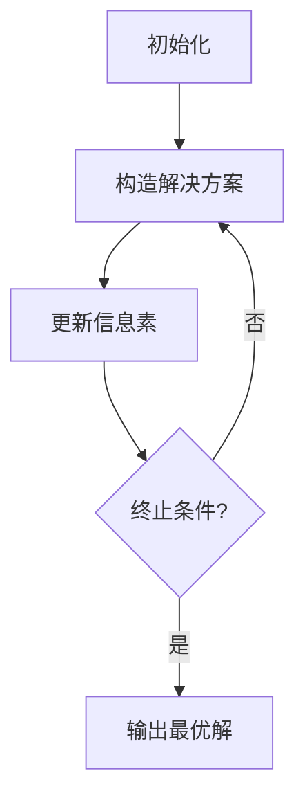

# 蚁群算法(Ant Colony Optimization) - 原理与代码实例讲解

## 1. 背景介绍

蚁群算法(Ant Colony Optimization, ACO)是一种基于群体智能的启发式优化算法,灵感来源于蚂蚁在寻找食物时释放信息素的行为。在自然界中,蚂蚁能够通过释放信息素并沿着信息素浓度较高的路径行走,最终找到从蚁穴到食物源的最短路径。

蚁群算法模拟了这种行为,将问题抽象为在图上寻找最优路径的过程。算法通过多次迭代,不断更新边缘上的信息素浓度,从而逐步收敛到最优解或近似最优解。由于其良好的分布式计算特性和积极的反馈机制,蚁群算法已广泛应用于组合优化、网络路由、任务调度等领域。

## 2. 核心概念与联系

蚁群算法的核心概念包括:

1. **蚂蚁(Ant)**: 代表一个简单的计算单元,用于构造解决方案。
2. **信息素(Pheromone)**: 一种虚拟的化学物质,用于记录历史信息并引导蚂蚁搜索。
3. **信息素更新(Pheromone Update)**: 根据当前迭代的最优解,增加相应边缘的信息素浓度,同时对所有边缘进行信息素挥发。
4. **启发式信息(Heuristic Information)**: 描述问题实例的一些先验知识,用于引导蚂蚁的搜索过程。

这些概念相互联系,共同构成了蚁群算法的基本框架。蚂蚁通过概率选择下一步的边缘,该概率取决于信息素浓度和启发式信息。在每次迭代后,算法会更新信息素,增强优良解的影响,从而逐步收敛到最优解。

## 3. 核心算法原理具体操作步骤

蚁群算法的核心步骤如下:

1. **初始化**:
   - 将信息素矩阵初始化为一个较小的常数值。
   - 生成一定数量的蚂蚁,并随机分配到图的节点上。

2. **构造解决方案**:
   - 对于每只蚂蚁,根据概率选择下一步的边缘。该概率由信息素浓度和启发式信息共同决定。
   - 蚂蚁按照选择的路径行走,直到构造出一个完整的解决方案。

3. **更新信息素**:
   - 计算当前迭代中所有蚂蚁构造的解决方案的质量。
   - 对于当前迭代中的最优解,增加其路径上边缘的信息素浓度。
   - 对所有边缘进行信息素挥发,降低其信息素浓度。

4. **判断终止条件**:
   - 如果满足终止条件(如最大迭代次数或收敛条件),则算法终止。
   - 否则,返回步骤2,进行下一次迭代。

5. **输出最优解**:
   - 输出当前迭代中的最优解作为算法的最终结果。

该算法通过反复迭代,不断增强优良解的影响,最终收敛到最优解或近似最优解。



## 4. 数学模型和公式详细讲解举例说明

蚁群算法的数学模型可以用以下公式表示:

1. **状态转移概率**:

蚂蚁从节点 $i$ 转移到节点 $j$ 的概率由以下公式给出:

$$
p_{ij}^k(t) = \begin{cases}
\frac{[\tau_{ij}(t)]^\alpha \cdot [\eta_{ij}]^\beta}{\sum\limits_{l \in N_i^k} [\tau_{il}(t)]^\alpha \cdot [\eta_{il}]^\beta}, & \text{if } j \in N_i^k\\
0, & \text{otherwise}
\end{cases}
$$

其中:

- $\tau_{ij}(t)$ 表示时刻 $t$ 时,边缘 $(i, j)$ 上的信息素浓度。
- $\eta_{ij}$ 表示边缘 $(i, j)$ 的启发式信息,通常取 $1/d_{ij}$,其中 $d_{ij}$ 是边缘的长度或代价。
- $\alpha$ 和 $\beta$ 分别是信息素和启发式信息的相对重要性参数。
- $N_i^k$ 表示蚂蚁 $k$ 在节点 $i$ 时可选择的下一步节点集合。

2. **信息素更新**:

在每次迭代后,算法会更新信息素矩阵,增强优良解的影响。信息素更新规则如下:

$$
\tau_{ij}(t+1) = (1-\rho) \cdot \tau_{ij}(t) + \sum\limits_{k=1}^m \Delta\tau_{ij}^k(t)
$$

其中:

- $\rho$ 是信息素挥发系数,用于避免过早收敛到次优解。
- $\Delta\tau_{ij}^k(t)$ 表示蚂蚁 $k$ 在时刻 $t$ 对边缘 $(i, j)$ 的信息素贡献,定义如下:

$$
\Delta\tau_{ij}^k(t) = \begin{cases}
\frac{Q}{L_k}, & \text{if } (i, j) \in T_k\\
0, & \text{otherwise}
\end{cases}
$$

其中:

- $Q$ 是一个常数,表示信息素的增强强度。
- $L_k$ 是蚂蚁 $k$ 构造的解决方案的长度或代价。
- $T_k$ 是蚂蚁 $k$ 构造的解决方案所经过的边缘集合。

通过这种信息素更新机制,算法可以逐步增强优良解的影响,并最终收敛到最优解或近似最优解。

让我们以著名的旅行商问题(Traveling Salesman Problem, TSP)为例,说明蚁群算法的应用。TSP的目标是找到一条最短的闭合路径,访问所有给定的城市并回到起点。

在蚁群算法中,我们可以将城市抽象为图的节点,边缘的长度表示两个城市之间的距离。每只蚂蚁从一个随机的城市出发,根据状态转移概率选择下一个城市,直到访问完所有城市并回到起点。

在每次迭代后,算法会更新信息素矩阵,增强当前迭代中最短路径的影响。经过多次迭代,算法将逐步收敛到最优解或近似最优解,即旅行商最短闭合路径。

## 5. 项目实践: 代码实例和详细解释说明

以下是使用 Python 实现蚁群算法求解 TSP 问题的代码示例:

```python
import random
import math

# 城市坐标
coords = [[65.0, 98.0], [59.0, 49.0], [73.0, 88.0], [85.0, 84.0], [64.0, 64.0]]
num_cities = len(coords)

# 参数设置
NUM_ANTS = 50  # 蚂蚁数量
MAX_ITER = 100  # 最大迭代次数
ALPHA = 1.0  # 信息素重要性参数
BETA = 5.0  # 启发式信息重要性参数
RHO = 0.5  # 信息素挥发系数
Q = 1.0  # 信息素增强强度

# 计算两个城市之间的距离
def distance(city1, city2):
    return math.sqrt((coords[city1][0] - coords[city2][0]) ** 2 + (coords[city1][1] - coords[city2][1]) ** 2)

# 初始化信息素矩阵
pheromone = [[1.0 / (num_cities * num_cities) for j in range(num_cities)] for i in range(num_cities)]

# 主函数
def solve_tsp():
    best_tour = None
    best_tour_length = float('inf')

    for iter in range(MAX_ITER):
        tours = []
        tour_lengths = []

        # 构造解决方案
        for ant in range(NUM_ANTS):
            tour = construct_tour()
            tour_length = tour_length_calculation(tour)
            tours.append(tour)
            tour_lengths.append(tour_length)

        # 更新最优解
        if min(tour_lengths) < best_tour_length:
            best_tour_length = min(tour_lengths)
            best_tour = tours[tour_lengths.index(min(tour_lengths))]

        # 更新信息素
        update_pheromone(tours, tour_lengths)

    return best_tour, best_tour_length

# 构造解决方案
def construct_tour():
    tour = [random.randint(0, num_cities - 1)]
    unvisited = list(range(num_cities))
    unvisited.remove(tour[0])

    while unvisited:
        current_city = tour[-1]
        next_city = select_next_city(current_city, unvisited)
        tour.append(next_city)
        unvisited.remove(next_city)

    return tour

# 选择下一个城市
def select_next_city(current_city, unvisited):
    probabilities = [
        (pheromone[current_city][city] ** ALPHA) * ((1.0 / distance(current_city, city)) ** BETA)
        for city in unvisited
    ]
    total_prob = sum(probabilities)
    probabilities = [p / total_prob for p in probabilities]
    next_city = random.choices(unvisited, weights=probabilities)[0]
    return next_city

# 计算路径长度
def tour_length_calculation(tour):
    tour_length = 0
    for i in range(len(tour) - 1):
        tour_length += distance(tour[i], tour[i + 1])
    tour_length += distance(tour[-1], tour[0])  # 回到起点
    return tour_length

# 更新信息素
def update_pheromone(tours, tour_lengths):
    global pheromone

    # 信息素挥发
    for i in range(num_cities):
        for j in range(num_cities):
            pheromone[i][j] *= (1 - RHO)

    # 增强优良解的影响
    for tour, tour_length in zip(tours, tour_lengths):
        for i in range(len(tour) - 1):
            city1, city2 = tour[i], tour[i + 1]
            pheromone[city1][city2] += Q / tour_length
        city1, city2 = tour[-1], tour[0]  # 回到起点
        pheromone[city1][city2] += Q / tour_length

# 运行算法
best_tour, best_tour_length = solve_tsp()
print(f"最优路径: {best_tour}")
print(f"最短距离: {best_tour_length}")
```

代码解释:

1. 首先定义城市坐标和算法参数,包括蚂蚁数量、最大迭代次数、信息素和启发式信息的重要性参数等。

2. `distance` 函数用于计算两个城市之间的欧几里得距离。

3. `solve_tsp` 函数是主函数,执行蚁群算法的迭代过程。在每次迭代中,它会构造多个解决方案,更新最优解,并根据最优解更新信息素矩阵。

4. `construct_tour` 函数用于构造一个解决方案(即一条路径)。它从一个随机城市出发,然后根据状态转移概率选择下一个城市,直到访问完所有城市并回到起点。

5. `select_next_city` 函数根据状态转移概率公式选择下一个城市。

6. `tour_length_calculation` 函数计算一条路径的总长度。

7. `update_pheromone` 函数根据当前迭代的最优解,更新信息素矩阵。首先进行信息素挥发,然后增强优良解的影响。

8. 最后,输出算法得到的最优路径和最短距离。

通过这个示例,你可以看到蚁群算法是如何模拟蚂蚁行为,通过反复迭代和信息素更新,逐步收敛到最优解或近似最优解。

## 6. 实际应用场景

蚁群算法由于其分布式计算特性和良好的鲁棒性,已被广泛应用于各种组合优化问题,包括但不限于:

1. **旅行商问题(TSP)**: 寻找访问一系列城市的最短闭合路径。

2. **车辆路径规划**: 确定多辆车辆的最优路径,以最小化总行驶距离或时间。

3. **网络路由**: 在计算机网络中寻找最优路径,实现数据包的高效传输。

4. **任务调度**: 在并行计算环境中,合理分配任务到不同的处理器,以最小化总执行时间。

5. **电