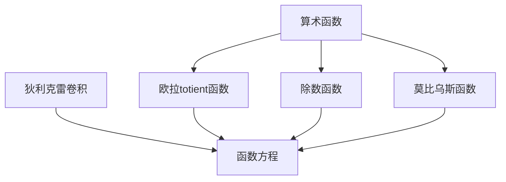

# 解析数论基础：函数方程（一）

## 1. 背景介绍

### 1.1 数论的重要性

数论是一门研究整数及其性质的纯粹数学分支。尽管数论源远流长,可追溯至古希腊时期,但它在现代计算机科学和密码学中扮演着关键角色。事实上,许多现代加密系统的安全性都依赖于数论难题的复杂性,例如大数的因数分解和离散对数问题。

### 1.2 函数方程在数论中的作用

函数方程是数论中一个重要的工具和概念。它们为研究算术函数及其性质提供了强有力的框架。函数方程描述了算术函数之间的关系,揭示了它们的内在结构,从而帮助我们更深入地理解和分析这些函数的行为。

## 2. 核心概念与联系

### 2.1 算术函数

算术函数是定义在正整数集合上的函数。一些著名的算术函数包括:

- 欧拉totient函数 $\phi(n)$:小于等于 $n$ 且与 $n$ 互质的正整数的个数。
- 除数函数 $\sigma_k(n)$:将 $n$ 的所有正除数的 $k$ 次方求和。
- 莫比乌斯函数 $\mu(n)$:如果 $n$ 是平方因子的乘积,则为 $0$;如果 $n$ 是无平方因子的乘积,则根据因子个数的奇偶性为 $1$ 或 $-1$。

这些函数在数论中扮演着重要角色,并且它们之间存在着许多有趣的关系。

### 2.2 狄利克雷卷积

狄利克雷卷积是两个算术函数的一种特殊卷积运算,定义如下:

$$
(f * g)(n) = \sum_{d|n} f(d)g\left(\frac{n}{d}\right)
$$

其中,求和范围是 $n$ 的所有正除数 $d$。狄利克雷卷积具有许多有趣的性质,例如可交换性和结合性。它为研究算术函数之间的关系提供了一个强有力的工具。

### 2.3 Mermaid 流程图



## 3. 核心算法原理具体操作步骤

### 3.1 欧拉totient函数 $\phi(n)$

欧拉totient函数 $\phi(n)$ 计算小于等于 $n$ 且与 $n$ 互质的正整数的个数。它可以通过以下步骤计算:

1. 将 $n$ 分解为质因数的乘积: $n = p_1^{a_1} p_2^{a_2} \cdots p_r^{a_r}$。
2. 对于每个不同的质因数 $p_i$,计算 $\phi(p_i^{a_i}) = p_i^{a_i} - p_i^{a_i-1}$。
3. 由于 $\phi$ 函数满足乘法原理,因此 $\phi(n) = \phi(p_1^{a_1}) \phi(p_2^{a_2}) \cdots \phi(p_r^{a_r})$。

例如,对于 $n = 20$,我们有:

1. $20 = 2^2 \cdot 5^1$
2. $\phi(2^2) = 2^2 - 2^1 = 2$, $\phi(5^1) = 5^1 - 5^0 = 4$
3. $\phi(20) = \phi(2^2) \cdot \phi(5^1) = 2 \cdot 4 = 8$

因此,小于等于 $20$ 且与 $20$ 互质的正整数有 $8$ 个。

### 3.2 除数函数 $\sigma_k(n)$

除数函数 $\sigma_k(n)$ 计算 $n$ 的所有正除数的 $k$ 次方之和。它可以通过以下步骤计算:

1. 将 $n$ 分解为质因数的乘积: $n = p_1^{a_1} p_2^{a_2} \cdots p_r^{a_r}$。
2. 对于每个不同的质因数 $p_i$,计算 $\sum_{j=0}^{a_i} (p_i^j)^k$。
3. 由于 $\sigma_k$ 函数满足乘法原理,因此 $\sigma_k(n) = \prod_{i=1}^r \left(\sum_{j=0}^{a_i} (p_i^j)^k\right)$。

例如,对于 $n = 20$ 和 $k = 2$,我们有:

1. $20 = 2^2 \cdot 5^1$
2. $\sum_{j=0}^2 (2^j)^2 = 1 + 2^2 + 2^4 = 21$, $\sum_{j=0}^1 (5^j)^2 = 1 + 5^2 = 26$
3. $\sigma_2(20) = 21 \cdot 26 = 546$

因此, $20$ 的所有正除数的平方之和为 $546$。

### 3.3 莫比乌斯函数 $\mu(n)$

莫比乌斯函数 $\mu(n)$ 是一个重要的算术函数,定义如下:

- 如果 $n = 1$,则 $\mu(n) = 1$。
- 如果 $n$ 是无平方因子的乘积,则 $\mu(n) = (-1)^k$,其中 $k$ 是不同质因数的个数。
- 如果 $n$ 含有平方因子,则 $\mu(n) = 0$。

计算 $\mu(n)$ 的步骤如下:

1. 将 $n$ 分解为质因数的乘积: $n = p_1^{a_1} p_2^{a_2} \cdots p_r^{a_r}$。
2. 如果存在 $a_i \geq 2$,则 $\mu(n) = 0$。
3. 否则,令 $k$ 为不同质因数的个数,则 $\mu(n) = (-1)^k$。

例如,对于 $n = 20$,我们有:

1. $20 = 2^2 \cdot 5^1$
2. 由于存在 $a_1 = 2 \geq 2$,因此 $\mu(20) = 0$。

而对于 $n = 15$,我们有:

1. $15 = 3 \cdot 5$
2. 不存在平方因子,且有两个不同的质因数,因此 $\mu(15) = (-1)^2 = 1$。

## 4. 数学模型和公式详细讲解举例说明

### 4.1 狄利克雷卷积与函数方程

狄利克雷卷积为研究算术函数之间的关系提供了一个强有力的工具。事实上,许多著名的函数方程都可以通过狄利克雷卷积来表示。

#### 4.1.1 欧拉totient函数方程

$$
\phi(n) = n \prod_{p|n} \left(1 - \frac{1}{p}\right)
$$

其中,乘积范围是 $n$ 的所有不同质因数 $p$。这个方程可以通过狄利克雷卷积来证明:

$$
\phi(n) = n * 1 = \sum_{d|n} \mu\left(\frac{n}{d}\right) \frac{n}{d}
$$

利用莫比乌斯函数的性质,我们可以得到上面的表达式。

#### 4.1.2 除数函数方程

对于任意正整数 $k$,我们有:

$$
\sigma_k(n) = \sum_{d|n} d^k
$$

这个方程也可以通过狄利克雷卷积来表示:

$$
\sigma_k(n) = \zeta(k+1) * n^k
$$

其中 $\zeta(s)$ 是著名的黎曼zeta函数。这种表示为研究除数函数的性质提供了新的视角。

### 4.2 莫比乌斯反演公式

莫比乌斯反演公式是一个重要的数论工具,它将一个算术函数与其狄利克雷卷积反演之间建立了联系。具体来说,对于任意算术函数 $f$ 和 $g$,如果它们满足 $f = g * 1$,则我们有:

$$
g(n) = \sum_{d|n} \mu\left(\frac{n}{d}\right) f(d)
$$

这个公式在分析算术函数时非常有用,因为它允许我们从一个已知的函数推导出另一个函数。例如,我们可以利用这个公式来推导出欧拉totient函数和除数函数的表达式。

### 4.3 例子:利用莫比乌斯反演计算欧拉totient函数

我们将利用莫比乌斯反演公式来推导欧拉totient函数的表达式。首先,定义一个新的算术函数 $g(n)$ 如下:

$$
g(n) = \begin{cases}
n, & \text{if } n = 1 \\
1, & \text{if } n > 1 \text{ and } \mu(n) \neq 0 \\
0, & \text{if } n > 1 \text{ and } \mu(n) = 0
\end{cases}
$$

显然,对于任意正整数 $n$,我们有 $\phi(n) = g(n) * 1$。利用莫比乌斯反演公式,我们可以得到:

$$
\begin{aligned}
g(n) &= \sum_{d|n} \mu\left(\frac{n}{d}\right) \phi(d) \\
     &= \sum_{d|n} \mu\left(\frac{n}{d}\right) d \prod_{p|d} \left(1 - \frac{1}{p}\right) \\
     &= n \prod_{p|n} \left(1 - \frac{1}{p}\right) \sum_{d|n} \frac{\mu(d)}{d}
\end{aligned}
$$

由于 $\sum_{d|n} \frac{\mu(d)}{d} = 1$ (当 $n = 1$ 时为 $1$,其他情况为 $0$),因此我们得到了欧拉totient函数的著名表达式:

$$
\phi(n) = n \prod_{p|n} \left(1 - \frac{1}{p}\right)
$$

这个例子展示了莫比乌斯反演公式在推导和分析算术函数时的强大作用。

## 5. 项目实践:代码实例和详细解释说明

在这一部分,我们将提供一些Python代码示例,用于计算前面介绍的几个重要算术函数。这些代码不仅能帮助读者加深对算法原理的理解,而且还可以作为实际项目中的代码参考。

### 5.1 计算欧拉totient函数

```python
def gcd(a, b):
    """
    计算两个正整数的最大公约数
    """
    while b != 0:
        a, b = b, a % b
    return a

def phi(n):
    """
    计算欧拉totient函数 phi(n)
    """
    result = n
    for i in range(2, int(n**0.5) + 1):
        if n % i == 0:
            result -= result // i
            while n % i == 0:
                n //= i
    if n > 1:
        result -= result // n
    return result
```

在上面的代码中,我们首先定义了一个 `gcd` 函数,用于计算两个正整数的最大公约数(使用了欧几里德算法)。然后,我们定义了 `phi` 函数,用于计算欧拉totient函数的值。

`phi` 函数的工作原理如下:

1. 初始化 `result` 为 `n`。
2. 遍历所有小于等于 $\sqrt{n}$ 的质数 `i`。
3. 如果 `n` 能被 `i` 整除,则将 `result` 减去 `result // i`。这是因为每个 `i` 的幂次 `i^k` 都会贡献 `i^k - i^(k-1)` 个与 `n` 互质的数。
4. 继续除去 `n` 中的所有 `i` 的幂次。
5. 如果 `n` 最后还大于 $1$,则将 `result` 再减去 `result // n`。
6. 返回 `result` 作为 $\phi(n)$ 的值。

这个实现的时间复杂度为 $O(\sqrt{n})$,对于大多数情况下已经足够高效。

### 5.2 计算除数函数

```python
def sigma(n, k):
    """
    计算除数函数 sigma_k(n)
    """
    result = 1
    for i in range(2, int(n**0.5) + 1):
        if