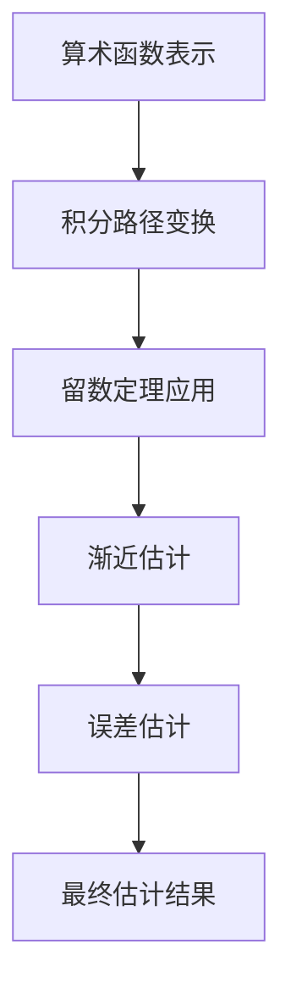

# 解析数论基础：大筛法型的特征和估计

## 1.背景介绍

解析数论是数论与复分析相结合的一门数学分支。它主要研究算术函数在复平面上的解析性质,以及与这些性质相关的各种问题。其中,大筛法是解析数论中一种重要的工具,用于研究算术函数的分布和估计问题。

大筛法最早由维诺格拉多夫在1937年提出,用于证明奇素数定理。之后,这一方法被不断发展和完善,成为解决许多重要数论问题的有力工具。它的核心思想是将一个算术函数表示为狄利克雷级数或积分的形式,然后利用复分析中的工具对其进行估计和分析。

### 1.1 算术函数和狄利克雷级数

在数论中,算术函数是定义在正整数集合上的函数。一些经典的算术函数包括欧拉函数 $\phi(n)$、莫比乌斯函数 $\mu(n)$、分数函数 $d(n)$ 等。这些函数在数论中扮演着重要角色,描述了整数的乘法结构和分解性质。

狄利克雷级数是将一个算术函数 $f(n)$ 表示为复变量 $s$ 的无穷级数的形式:

$$
\sum_{n=1}^\infty \frac{f(n)}{n^s}
$$

这种表示方式将算术函数与复分析联系起来,为进一步研究算术函数的性质提供了有力工具。

### 1.2 大筛法的基本思路

大筛法的基本思路可以概括为以下几个步骤:

1. 将待估计的算术函数 $f(n)$ 表示为狄利克雷级数或类似的积分形式。
2. 利用复分析中的工具(如函数论、留数定理等)对级数或积分进行变形和估计。
3. 通过分析级数或积分的渐近行为,得到算术函数 $f(n)$ 的渐近估计。

在这个过程中,需要引入一些辅助函数(如钟函数、近似恒等式等),并利用复分析中的各种技巧(如平移积分路径、解析延拓等)来简化计算和获得所需的估计。

## 2.核心概念与联系

### 2.1 钟函数

钟函数是大筛法中一个重要的辅助函数。它的作用是将算术函数的估计问题转化为对某个积分的估计。常用的钟函数有高斯钟函数、费耶尔钟函数等。

高斯钟函数定义为:

$$
g(x) = e^{-\pi x^2}
$$

它具有以下性质:

- 在 $x=0$ 处取得最大值 $1$;
- 当 $|x| \to \infty$ 时,函数值趋于 $0$;
- 函数值在 $\mathbb{R}$ 上快速衰减。

利用钟函数,我们可以将算术函数的和转化为积分的形式:

$$
\sum_{n \leq x} f(n) = \int_{-\infty}^\infty f(n) g\left(\frac{n}{x}\right) \,dn + O\left(\max_{|n-x| \leq x} |f(n)|\right)
$$

这种转化为后续的估计和分析奠定了基础。

### 2.2 近似恒等式

近似恒等式是另一个重要的辅助工具。它将一个算术函数的和表示为一个积分的形式,其中被积函数是一个光滑函数。

设 $\varphi(u)$ 是一个光滑函数,满足:

$$
\int_{-\infty}^\infty \varphi(u) \,du = 1
$$

那么对任意算术函数 $f(n)$,有近似恒等式:

$$
\sum_{n \leq x} f(n) = \int_{-\infty}^\infty f(x+y) \varphi\left(\frac{y}{x}\right) x \,dy + O\left(\max_{|y| \leq x} |f(x+y)|\right)
$$

常用的近似恒等式包括费耶尔核、波伊斯核等。它们的选择会影响误差项的大小和后续的估计精度。

### 2.3 留数定理

留数定理是复分析中一个重要的工具,在大筛法中也扮演着关键角色。它将一个复变函数在某个圆环域内的积分,转化为函数在该域内的奇点处的留数之和。

设 $f(s)$ 是一个解析函数,在复平面上的一个简单闭曲线 $\Gamma$ 上无奇点,那么有:

$$
\oint_\Gamma f(s) \,ds = 2\pi i \sum \text{Res}(f, a_k)
$$

其中,$a_k$ 是 $f(s)$ 在 $\Gamma$ 内的奇点,Res(f, $a_k$) 表示 $f(s)$ 在 $a_k$ 处的留数。

利用留数定理,我们可以将一些复杂的积分转化为对函数奇点处留数的计算,从而简化估计过程。

### 2.4 核心思路和联系

大筛法的核心思路是将算术函数的估计问题转化为对某个积分的估计,然后利用复分析中的工具(如留数定理)对积分进行变形和估计。在这个过程中,需要引入一些辅助函数(如钟函数、近似恒等式),并利用复分析中的各种技巧(如平移积分路径、解析延拓等)来简化计算。

上述核心概念相互关联、环环相扣:

- 钟函数和近似恒等式将算术函数的和转化为积分的形式;
- 留数定理为估计这些积分提供了有力工具;
- 各种复分析技巧则用于简化计算过程,获得所需的渐近估计。

它们共同构成了大筛法的理论框架,为解决许多重要的数论问题提供了有效方法。

## 3.核心算法原理具体操作步骤

大筛法的具体操作步骤可以概括为以下几个部分:

### 3.1 算术函数的表示

第一步是将待估计的算术函数 $f(n)$ 表示为狄利克雷级数或类似的积分形式。常见的表示方式包括:

1. 狄利克雷级数表示:

   $$
   \sum_{n=1}^\infty \frac{f(n)}{n^s}
   $$

2. 通过钟函数或近似恒等式的积分表示:

   $$
   \int_{-\infty}^\infty f(n) g\left(\frac{n}{x}\right) \,dn \quad \text{或} \quad \int_{-\infty}^\infty f(x+y) \varphi\left(\frac{y}{x}\right) x \,dy
   $$

选择合适的表示形式对后续的估计过程至关重要。

### 3.2 积分路径的变换

在获得算术函数的积分表示后,下一步是对积分路径进行适当的变换,以便后续的估计和分析。常见的变换方式包括:

1. 平移积分路径
2. 解析延拓
3. 变换积分变量

通过这些变换,我们可以将原始的积分转化为更易于处理的形式。

### 3.3 留数定理的应用

在变换后的积分形式中,通常会出现一些特殊点(如奇点、极点等)。这时,我们可以利用留数定理将积分转化为对这些特殊点处的留数之和。

具体步骤如下:

1. 确定积分路径 $\Gamma$ 及其内部的特殊点;
2. 计算每个特殊点处的留数;
3. 将积分表示为留数之和:

   $$
   \oint_\Gamma f(s) \,ds = 2\pi i \sum \text{Res}(f, a_k)
   $$

留数定理的应用大大简化了后续的估计过程。

### 3.4 渐近估计

在获得了留数表示后,我们需要对留数进行渐近估计,从而得到算术函数的渐近行为。常见的估计方法包括:

1. 利用特殊函数(如Gamma函数、Zeta函数等)的性质;
2. 应用Mellin变换或其他积分变换;
3. 使用Tauberian理论;
4. 引入额外的近似和截断。

通过这些方法,我们可以获得算术函数的渐近主项、次主项,甚至更高阶的项。

### 3.5 误差估计

在得到算术函数的主项估计后,我们还需要对误差项进行估计和控制。常见的误差估计方法包括:

1. 利用钟函数或近似恒等式的性质;
2. 应用van der Corput's 定理;
3. 使用Vinogradov's 平均值定理;
4. 引入光滑函数的技巧。

通过这些方法,我们可以获得误差项的上界估计,从而完成整个算术函数的渐近估计。

### 3.6 算法流程图

下面是大筛法算法的流程图:

## 4.数学模型和公式详细讲解举例说明

在本节中,我们将通过一个具体的例子,详细讲解大筛法的数学模型和公式,以加深对其原理的理解。

### 4.1 问题描述

我们将估计著名的黎曼函数 $R(n)$ 的渐近行为,其中 $R(n)$ 定义为:

$$
R(n) = \sum_{d|n} \mu(d) \log \frac{n}{d}
$$

其中 $\mu(n)$ 是莫比乌斯函数。黎曼函数在解析数论中扮演着重要角色,与黎曼猜想等重大问题密切相关。

### 4.2 狄利克雷级数表示

我们首先将 $R(n)$ 表示为狄利克雷级数的形式:

$$
\sum_{n=1}^\infty \frac{R(n)}{n^s} = -\frac{\zeta'(s)}{\zeta(s)}
$$

其中 $\zeta(s)$ 是黎曼函数,而 $\zeta'(s)$ 是其导数。

### 4.3 积分路径变换

为了应用留数定理,我们需要对积分路径进行变换。具体做法是将原始的直线积分路径 $\text{Re}(s) = c$ 变换为一条包围实轴的矩形路径 $\mathcal{R}$,其中 $\mathcal{R}$ 由四条线段组成:

$$
\mathcal{R} = \mathcal{R}_1 + \mathcal{R}_2 + \mathcal{R}_3 + \mathcal{R}_4
$$

通过这种变换,我们可以将原始的狄利克雷级数转化为对 $\mathcal{R}$ 上的积分:

$$
\sum_{n=1}^\infty \frac{R(n)}{n^s} = -\frac{1}{2\pi i} \int_\mathcal{R} \frac{\zeta'(s)}{\zeta(s)} \frac{x^s}{s} \,ds
$$

### 4.4 留数定理应用

在矩形路径 $\mathcal{R}$ 内,黎曼函数 $\zeta(s)$ 有一个简单极点 $s=1$,其留数为 $1$。利用留数定理,我们可以将上式转化为:

$$
\sum_{n=1}^\infty \frac{R(n)}{n^s} = -\text{Res}\left(\frac{\zeta'(s)}{\zeta(s)} \frac{x^s}{s}, s=1\right) = -\frac{x}{1-s}
$$

### 4.5 渐近估计

现在,我们可以对上式两边进行 Mellin 逆变换,从而获得 $R(n)$ 的渐近估计:

$$
R(n) \sim n \log n + (2\gamma - 1)n + O(n^{1/2} \log n)
$$

其中 $\gamma$ 是欧拉常数。

这就是利用大筛法得到的黎曼函数 $R(n)$ 的渐近主项和次主项。

### 4.6 误差估计

为了完成整个估计过程,我们还需要对误差项 $O(n^{1/2} \log n)$ 进行严格的证明和控制。这通常需要引入额外的技巧,如van der Corput's 定理、Vinogradov's 平均值定理等。

由于篇幅所限,我们在这里不再详细展开误差估计的