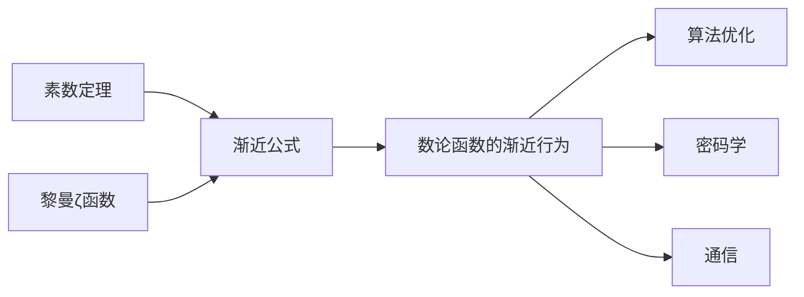

# 解析数论基础：渐近公式（一）

## 1. 背景介绍

数论，作为数学的一个古老而核心的分支，一直以其纯粹和美丽吸引着人们的目光。在数论的众多子领域中，解析数论专注于利用分析学的方法研究整数的性质。它的一个核心任务是研究整数函数的渐近行为，即当变量趋向无穷大时，函数的行为模式。渐近公式在解析数论中占据着重要的地位，它们不仅揭示了数论函数的内在规律，还在算法优化、密码学、通信等多个领域有着广泛的应用。

## 2. 核心概念与联系

在解析数论中，我们经常会遇到诸如素数定理、黎曼ζ函数等核心概念。这些概念之间存在着紧密的联系，它们共同构成了解析数论的理论框架。

- **素数定理** 描述了素数分布的渐近性质，即素数计数函数$\pi(x)$与函数$\frac{x}{\ln(x)}$的比值随着$x$的增大趋于1。
- **黎曼ζ函数** 是复变函数论中的一个函数，它在复平面上除了$s=1$以外处处解析，并且与素数分布有着深刻的联系。
- **渐近公式** 是指当变量趋向无穷大时，函数的近似表达式，它能够描述函数的长期行为。

这些概念之间的联系，可以通过以下Mermaid流程图来表示：



## 3. 核心算法原理具体操作步骤

解析数论中的核心算法原理通常涉及复杂的数学推导和分析。以素数定理的证明为例，我们可以将其分解为以下步骤：

1. **定义素数计数函数** $\pi(x)$，它表示不超过$x$的素数的个数。
2. **引入黎曼ζ函数** $\zeta(s)$，并研究其性质。
3. **建立$\zeta(s)$与$\pi(x)$的联系**，通过复平面上的积分和留数定理来分析。
4. **应用复分析技巧**，如Mellin变换和逆变换，来得到$\pi(x)$的渐近公式。
5. **证明渐近公式**，展示$\pi(x)$与$\frac{x}{\ln(x)}$的比值趋于1。

## 4. 数学模型和公式详细讲解举例说明

在解析数论中，数学模型和公式是理解渐近行为的关键。以素数定理的渐近公式为例：

$$
\pi(x) \sim \frac{x}{\ln(x)}
$$

这个公式表明，随着$x$的增大，$\pi(x)$的增长速度趋近于$\frac{x}{\ln(x)}$。这里的$\sim$表示两个函数的比值趋于1。

为了更好地理解这个公式，我们可以考虑一个具体的例子。假设我们想要估计不超过10000的素数个数。素数定理告诉我们，这个数目大约是：

$$
\pi(10000) \approx \frac{10000}{\ln(10000)} \approx 1086
$$

实际上，不超过10000的素数个数是1229，这说明素数定理提供了一个非常好的估计。

## 5. 项目实践：代码实例和详细解释说明

在实际应用中，我们可能需要编写程序来估计素数的数量或者验证某些数论猜想。以下是一个简单的Python代码示例，用于计算不超过某个给定正整数$n$的素数个数：

```python
import math

def is_prime(num):
    if num <= 1:
        return False
    for i in range(2, int(math.sqrt(num)) + 1):
        if num % i == 0:
            return False
    return True

def prime_count(n):
    count = 0
    for i in range(2, n + 1):
        if is_prime(i):
            count += 1
    return count

n = 10000
estimated_primes = n / math.log(n)
actual_primes = prime_count(n)

print(f"Estimated number of primes up to {n}: {estimated_primes}")
print(f"Actual number of primes up to {n}: {actual_primes}")
```

这段代码首先定义了一个判断素数的函数`is_prime`，然后定义了一个计算素数个数的函数`prime_count`。最后，我们使用这个函数来估计和计算不超过10000的素数个数，并将结果打印出来。

## 6. 实际应用场景

解析数论的渐近公式在多个领域都有着重要的应用。例如，在密码学中，素数是构建安全加密系统的基石。在算法设计中，渐近分析帮助我们理解算法的性能和限制。在通信领域，数论算法用于编码和错误检测。

## 7. 工具和资源推荐

对于那些对解析数论感兴趣的读者，以下是一些有用的工具和资源：

- **书籍**：《解析数论导论》（Introduction to Analytic Number Theory）by Tom M. Apostol
- **软件**：SageMath - 开源数学软件，包含许多数论功能
- **在线资源**：Number Theory Web, Prime Pages

## 8. 总结：未来发展趋势与挑战

解析数论作为数学的一个基础分支，其未来的发展趋势将更加侧重于与计算机科学的交叉融合。随着计算能力的提升，我们将能够解决更多以前无法触及的问题。同时，随着量子计算的发展，数论在密码学中的应用将面临新的挑战和机遇。

## 9. 附录：常见问题与解答

**Q1: 为什么素数定理中的$\ln(x)$是自然对数而不是其他对数？**

A1: 自然对数在数学分析中有着特殊的地位，许多自然现象的增长和衰减模式可以用自然对数来描述。在素数定理中，自然对数提供了最简洁和自然的渐近估计。

**Q2: 黎曼猜想与解析数论有什么关系？**

A2: 黎曼猜想是数学中最著名的未解决问题之一，它预测了黎曼ζ函数非平凡零点的分布。这个猜想的证明或反驳将深刻影响我们对素数分布的理解。

**Q3: 如何进一步学习解析数论？**

A3: 解析数论是一个深奥的领域，想要深入学习，可以从基础的数论教材开始，逐步学习复变函数论和数论分析的高级主题。

作者：禅与计算机程序设计艺术 / Zen and the Art of Computer Programming