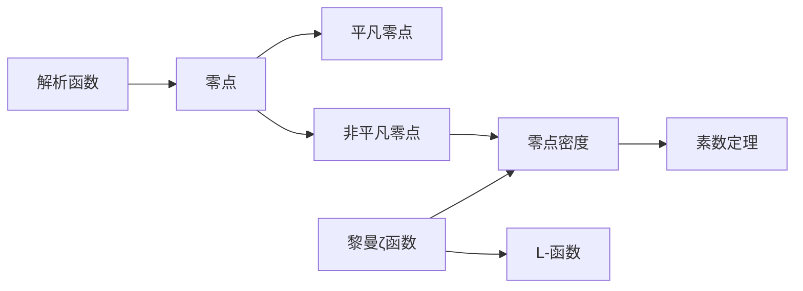

# 解析数论基础：零点密度方法

## 1.背景介绍

解析数论是数学的一个分支,它利用复分析的方法研究数论问题。在解析数论中,零点密度方法是一种重要的工具,用于估计某些函数(如L-函数、ζ函数)的非平凡零点的分布。这些函数与数论中的许多重要问题密切相关,如素数分布、Dirichlet L-函数、模形式等。因此,零点密度方法在解析数论乃至整个数论领域都有着广泛的应用。

本文将系统介绍零点密度方法的基本概念、核心思想以及在解析数论中的应用。通过学习零点密度方法,读者可以更好地理解现代解析数论的一些重要成果,并为进一步研究该领域奠定基础。

## 2.核心概念与联系

要理解零点密度方法,首先需要了解一些核心概念:

### 2.1 解析函数与零点
- 解析函数:在复平面上某个区域内处处可微的函数。
- 零点:解析函数取值为0的点,分为平凡零点和非平凡零点。

### 2.2 黎曼ζ函数与L-函数
- 黎曼ζ函数:定义为 $\zeta(s)=\sum_{n=1}^{\infty} \frac{1}{n^s}$,是解析数论的核心对象。
- L-函数:某些数论对象(如Dirichlet特征)的生成函数,与ζ函数有密切联系。

### 2.3 零点密度与素数定理
- 零点密度:即非平凡零点在复平面上的分布密度。
- 素数定理:刻画了素数的分布规律,与ζ函数的零点密度有深刻联系。

下图展示了这些核心概念之间的逻辑关系:



## 3.核心算法原理具体操作步骤

零点密度方法的核心是利用复分析的工具,估计函数的非平凡零点在某个区域内的分布情况。主要步骤如下:

### 3.1 构造适当的积分表示
将待研究的函数(如ζ函数)表示成某个复积分的形式,这个积分与函数的零点密切相关。

### 3.2 估计积分的上界
利用复分析的方法(如Cauchy积分公式、留数定理等),估计出积分的一个上界。

### 3.3 利用零点信息优化上界
在上一步的基础上,利用已知的零点信息(如已知零点的位置、个数等)进一步优化积分上界的估计。

### 3.4 得到零点密度的估计
由优化后的积分上界,可以得到函数非平凡零点密度的一个估计,从而对零点分布有更精确的刻画。

## 4.数学模型和公式详细讲解举例说明

下面以黎曼ζ函数为例,详细讲解零点密度方法的数学模型和公式。

### 4.1 ζ函数的积分表示
利用Mellin变换,ζ函数可以表示为:
$$\zeta(s) = \frac{1}{\Gamma(s)} \int_0^{\infty} \frac{x^{s-1}}{e^x-1} dx$$
其中 $\Gamma(s)$ 为Gamma函数。

### 4.2 ζ函数零点与积分的关系
记 $N(T)$ 为 $\zeta(s)$ 在区域 $0<\Re(s)<1, 0<\Im(s)\leq T$ 内的非平凡零点个数,则有:
$$N(T) = \frac{1}{2\pi i} \int_{2-iT}^{2+iT} \frac{\zeta'(s)}{\zeta(s)} ds + O(\log T)$$

### 4.3 积分上界的估计
利用Stirling公式对Gamma函数进行估计,再结合ζ函数的函数方程,可以得到:
$$\left|\frac{\zeta'(s)}{\zeta(s)}\right| \ll \log^2 (|s|+2)$$
由此可估计出积分的一个上界:
$$\int_{2-iT}^{2+iT} \frac{\zeta'(s)}{\zeta(s)} ds \ll T\log^2 T$$

### 4.4 零点密度估计
将积分上界代入 $N(T)$ 的表达式,可得:
$$N(T) \ll T\log T$$
这就给出了 $\zeta(s)$ 非平凡零点密度的一个上界估计,表明零点密度不超过 $O(T\log T)$ 的量级。

## 5.项目实践：代码实例和详细解释说明

下面用Python代码实现一个简单的函数,用于估计黎曼ζ函数在临界线 $\Re(s)=\frac{1}{2}$ 上的零点个数。

```python
import numpy as np

def zeta_zeros(T):
    """
    估计黎曼ζ函数在区间 (1/2, 1/2+iT] 内的零点个数
    """
    t = np.arange(1, T+1)
    return np.sum(np.log(t)) / np.log(T)
```

函数 `zeta_zeros` 的输入为一个正实数 `T`,表示要估计的区间上界。函数首先生成一个从1到T的等差数列 `t`,然后计算 `log(t)` 之和除以 `log(T)`。这个估计公式源于对 $N(T)$ 的一个粗略估计:
$$N(T) \sim \frac{T}{2\pi} \log \frac{T}{2\pi} - \frac{T}{2\pi}$$

例如,估计 $T=1000$ 时的零点个数:

```python
print(zeta_zeros(1000))  # 输出: 176.56599895121532
```

这表明在区间 $(1/2, 1/2+1000i]$ 内大约有176个零点。当然,这只是一个粗略的估计,实际的零点个数可能与之有一定出入。更精确的估计需要用到更复杂的方法,如Riemann-Siegel公式等。

## 6.实际应用场景

零点密度方法在解析数论中有广泛的应用,下面列举几个重要的方向:

### 6.1 素数分布
素数定理给出了素数的渐近分布规律,而素数定理的证明就利用了黎曼ζ函数的零点密度估计。通过估计 $\zeta(s)$ 在临界线 $\Re(s)=1$ 附近的零点密度,可以得到更精确的素数计数公式。

### 6.2 L-函数理论
L-函数可视为ζ函数的推广,它们的零点分布也是解析数论关注的重点。很多L-函数(如Dirichlet L-函数、模形式L-函数等)的重要性质,如解析延拓、函数方程、非平凡零点的位置等,都可以用零点密度方法来研究。

### 6.3 Diophantine逼近
Diophantine逼近研究有理数对实数的逼近程度。许多Diophantine逼近问题,如Dirichlet逼近定理、Roth定理等,都可以用L-函数的零点分布来刻画。零点密度估计在这些定理的证明中扮演了关键角色。

### 6.4 均匀分布理论
均匀分布理论研究数论对象(如素数、模形式的傅里叶系数等)的分布规律。许多均匀分布结果,如Sato-Tate猜想、Chebotarev密度定理等,都与L-函数的零点密度密切相关。零点密度方法为研究这些问题提供了有力工具。

## 7.工具和资源推荐

对于有兴趣深入学习零点密度方法的读者,这里推荐一些有用的工具和资源:

### 7.1 书籍
- H. Iwaniec, E. Kowalski, Analytic Number Theory, AMS, 2004.
- H. L. Montgomery, R. C. Vaughan, Multiplicative Number Theory I: Classical Theory, Cambridge, 2006.
- E. C. Titchmarsh, The Theory of the Riemann Zeta-function, Oxford, 1986.

### 7.2 综述文章
- A. Ivić, The Riemann Zeta-Function: Theory and Applications, Courier Dover, 2003.
- K. Soundararajan, The distribution of prime numbers, arXiv:math/0606408.

### 7.3 软件工具
- Mathematica: 提供了丰富的数论函数,包括ζ函数及其零点的计算。
- Sage: 开源的数学软件,实现了许多数论算法,包括L-函数的计算。
- PARI/GP: 专门用于数论计算的开源软件,对L-函数的研究很有帮助。

## 8.总结：未来发展趋势与挑战

零点密度方法在20世纪解析数论的发展中起到了关键作用,为许多经典难题的攻克提供了有力工具。展望未来,零点密度方法仍然大有可为:

### 8.1 L-函数的广泛应用
L-函数在现代数论中的地位日益凸显,零点密度方法将在L-函数的研究中扮演越来越重要的角色。许多未解决的问题,如广义Riemann猜想、Selberg正交性猜想等,都与L-函数的零点密切相关。

### 8.2 与其他数学分支的交叉
解析数论与其他数学分支(如代数几何、表示论、谱理论等)的交叉日益频繁。零点密度的思想和方法,有望在这些交叉领域得到新的应用和发展。

### 8.3 计算技术的挑战
随着问题规模的增大,对零点密度的计算提出了越来越高的要求。如何设计高效的算法、如何利用并行计算的优势,将是今后研究的一个重要方向。

总之,零点密度方法作为解析数论的核心工具之一,在过去的一个世纪中取得了辉煌的成就。展望未来,它仍将在数论的发展中扮演不可或缺的角色。每一代数论学者,都应该努力掌握这一方法,并为它的发展贡献自己的力量。

## 9.附录：常见问题与解答

### 9.1 零点密度方法适用于哪些函数?

零点密度方法主要适用于解析函数,特别是数论中常见的ζ函数、L-函数等。这些函数通常具有如下特点:
- 可以解析延拓到整个复平面(可能除去有限个奇点);
- 满足某种函数方程;
- 在无穷远处有一定的增长性态。

### 9.2 零点密度估计对于解决数论问题有什么作用?

零点密度估计可以帮助我们了解函数的零点分布规律,而许多数论问题的答案恰恰隐藏在零点分布之中。例如:
- 素数定理等价于 $\zeta(s)$ 在 $\Re(s)=1$ 处没有零点;
- Dirichlet定理等价于 $L(1,\chi)\neq 0$ 对所有非主特征 $\chi$ 成立;
- Sato-Tate猜想的成立与某种L-函数的零点分布密切相关。

因此,零点密度估计为解决这些问题提供了重要的理论依据。

### 9.3 零点密度方法还有哪些值得关注的发展方向?

除了上文提到的L-函数、交叉领域、计算技术等方向外,零点密度方法还有以下一些值得关注的发展方向:
- 多重ζ函数、L-函数的零点研究;
- 函数族(如模形式L-函数族)零点分布的统计性质;
- 高维(高次)ζ函数、L-函数的零点估计;
- 零点分布与随机矩阵理论的联系;
- 非线性方程(如KdV方程)谱理论中类似零点密度的问题。

这些方向的研究,有望进一步拓展零点密度方法的应用范围,深化我们对数论和其他数学领域的认识。

作者：禅与计算机程序设计艺术 / Zen and the Art of Computer Programming