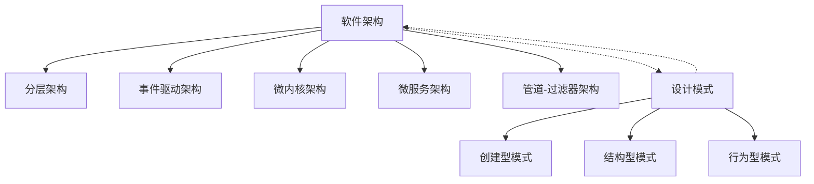

# 设计模式与软件架构原理与代码实战案例讲解

## 1. 背景介绍
### 1.1 软件设计的复杂性不断增加
在现代软件开发中,随着软件规模和复杂度的不断增加,软件设计面临着越来越多的挑战。如何设计出高质量、可维护、可扩展的软件系统,成为每个软件工程师必须思考和解决的问题。

### 1.2 设计模式和软件架构的重要性
设计模式和软件架构是应对软件复杂性,提高软件质量的两大利器。设计模式为常见的软件设计问题提供了经过验证的解决方案,而软件架构则从更高的层次上指导软件系统的整体设计。

### 1.3 理论结合实践的必要性
要真正掌握设计模式和软件架构,仅仅了解理论是远远不够的,还需要在实际项目中多加练习。通过理论学习和代码实践的结合,才能深刻领会设计模式和架构原理,并将其灵活运用到实际开发中。

## 2. 核心概念与联系
### 2.1 设计模式
设计模式是对软件设计中普遍存在的各种问题,提出的通用的、可重用的解决方案。它将这些经过验证的设计经验总结成模式,供开发人员在特定场景下参考使用。
#### 2.1.1 创建型模式
专注于对象创建,包括单例、工厂、建造者、原型等模式。
#### 2.1.2 结构型模式 
描述如何组合类和对象形成更大的结构,包括适配器、桥接、组合、装饰、外观、享元、代理等模式。
#### 2.1.3 行为型模式
关注对象之间的通信,包括责任链、命令、解释器、迭代器、中介者、备忘录、观察者、状态、策略、模板方法、访问者等模式。

### 2.2 软件架构
软件架构是有关软件整体结构与组件的抽象描述,用于指导大型软件系统各个方面的设计。
#### 2.2.1 架构风格
常见的架构风格包括分层架构、事件驱动架构、微内核架构、微服务架构、管道-过滤器架构等。
#### 2.2.2 架构设计原则
基本的架构设计原则有关注点分离、模块化、高内聚低耦合等。

### 2.3 设计模式与软件架构的关系
设计模式是对具体问题的解决方案,而软件架构是从宏观层面对系统进行把控。它们相辅相成:
- 设计模式为软件架构的实现提供了具体的设计方法。
- 软件架构为设计模式的使用提供了全局性指导。
二者结合,能够从整体到局部、从抽象到具体地指导软件设计。



## 3. 核心算法原理具体操作步骤
以下以几个常见的设计模式为例,介绍其核心算法原理和具体操作步骤。

### 3.1 单例模式
单例模式确保一个类只有一个实例,并提供一个全局访问点。
#### 3.1.1 懒汉式-线程不安全
```java
public class Singleton {  
    private static Singleton instance;  
    private Singleton (){}  
    public static Singleton getInstance() {  
        if (instance == null) {  
            instance = new Singleton();  
        }  
        return instance;  
    }  
}
```
步骤:
1. 构造函数私有化
2. 提供一个静态的公有方法用于创建/获取单例对象
3. 在静态方法中判断单例对象是否已经创建,如未创建则new一个新对象并返回,已创建则直接返回

#### 3.1.2 饿汉式-线程安全
```java
public class Singleton {  
    private static Singleton instance = new Singleton();  
    private Singleton (){}  
    public static Singleton getInstance() {  
        return instance;  
    }  
}
```
步骤:
1. 构造函数私有化  
2. 在类内部实例化一个私有静态对象
3. 提供公有静态方法返回该实例

#### 3.1.3 双检锁-线程安全
```java
public class Singleton {  
    private volatile static Singleton instance;  
    private Singleton (){}  
    public static Singleton getInstance() {  
        if (instance == null) {  
            synchronized (Singleton.class) {  
                if (instance == null) {  
                    instance = new Singleton();  
                }  
            }  
        }  
        return instance;  
    }  
}
```
步骤:
1. 构造函数私有化
2. 提供一个静态的公有方法用于创建/获取单例对象,方法中使用双重检查
3. 第一次检查instance是否为null,避免不必要的同步
4. 对类对象进行加锁,保证线程安全 
5. 第二次检查instance是否为null,避免多次创建实例
6. 创建实例并返回

### 3.2 观察者模式
观察者模式定义了对象之间的一对多依赖,让多个观察者对象同时监听一个主题对象,当主题对象状态发生变化时,会通知所有观察者,使它们能自动更新。
```java
public interface Subject {
    void registerObserver(Observer o);
    void removeObserver(Observer o);
    void notifyObservers();
}

public interface Observer {
    void update(String message);
}

public class ConcreteSubject implements Subject {
    private List<Observer> observers = new ArrayList<Observer>();
    private String message;
    
    @Override
    public void registerObserver(Observer o) {
        observers.add(o);
    }
    
    @Override
    public void removeObserver(Observer o) {
        observers.remove(o);
    }
    
    @Override
    public void notifyObservers() {
        for(Observer o: observers) {
            o.update(message);
        }
    }
    
    public void setMessage(String message) {
        this.message = message;
        notifyObservers();
    }
}

public class ConcreteObserverA implements Observer {
    @Override
    public void update(String message) {
        System.out.println("ConcreteObserverA received: " + message);
    }
}

public class ConcreteObserverB implements Observer {
    @Override
    public void update(String message) {
        System.out.println("ConcreteObserverB received: " + message);
    }
}
```
步骤:
1. 定义 Subject 接口,声明注册、删除、通知观察者的方法
2. 定义 Observer 接口,声明更新数据的方法
3. 创建 ConcreteSubject 类,实现 Subject 接口,在其中维护一个观察者列表,实现注册、删除、通知观察者的方法
4. 创建 ConcreteObserver 类,实现 Observer 接口,在其中实现更新数据的方法
5. Subject 状态发生变化时,调用 notifyObservers 方法通知各个观察者
6. 各个观察者收到通知后,调用各自的 update 方法更新数据

## 4. 数学模型和公式详细讲解举例说明
在软件设计中,很多设计模式和架构原则都蕴含着数学模型和思想。

### 4.1 分形与软件设计
分形是一种递归的几何形状,在不同的尺度上都有相似的结构。这启发我们在软件设计中应用分而治之、逐层细化的方法,将大问题分解为结构相似的子问题来解决。
软件架构和模块化设计都体现了这一思想。系统被递归地分解为子系统和模块,高层模块定义了系统的整体结构,低层模块实现具体功能,整个系统呈现出自相似的层次结构。
数学上,分形维数 $D$ 的计算公式为:
$$D=\frac{\ln N}{\ln S}$$
其中 $N$ 是子部分的个数, $S$ 是缩小的倍数。这启示我们,模块的数量和粒度需要合理控制,过多的模块会增加系统复杂度,过大的模块又会影响可维护性。

### 4.2 幂律分布与软件演化
幂律分布在自然界和人类社会中广泛存在。研究发现,软件系统的演化也遵循幂律分布。例如,代码修改的频率、模块的依赖关系等,都呈现出幂律分布的特点。
幂律分布的数学模型为:
$$y=ax^{-k}$$
其中 $x$ 是度量特征, $y$ 是频率, $a$ 和 $k$ 为常数。
这意味着,少部分的模块会承担大部分的修改和依赖,在软件维护中需要重点关注。同时,应尽量避免引入不必要的依赖,降低系统的复杂度。

### 4.3 隐马尔可夫模型与设计模式
隐马尔可夫模型(HMM)是一种用于描述含有隐含未知参数的马尔可夫过程的统计模型,在语音识别、自然语言处理等领域有广泛应用。
设计模式中的状态模式和策略模式,都能用HMM来建模。以状态模式为例,系统在某个状态下,根据输入事件,以一定的概率转移到另一个状态,并执行相应的操作,整个过程可用HMM描述。
HMM的三要素为:
- 状态转移概率矩阵 $A=[a_{ij}]$,表示从状态 $i$ 转移到状态 $j$ 的概率。
- 观测概率矩阵 $B=[b_{j}(k)]$,表示在状态 $j$ 下生成观测 $k$ 的概率。
- 初始状态概率向量 $\pi=[\pi_i]$,表示初始时刻处于状态 $i$ 的概率。
利用HMM,我们可以通过观测序列求解最可能的状态序列,或计算某状态序列的概率,用于评估和优化基于状态的软件设计。

## 5. 项目实践：代码实例和详细解释说明
下面以一个简单的项目为例,演示如何在实践中应用设计模式和架构原则。
项目需求:开发一个电商系统,支持不同类型的用户(普通用户、VIP用户)登录,浏览商品,下订单。系统需要能够灵活扩展新的用户类型和商品类别,同时要保证高可用。

### 5.1 架构设计
采用分层架构,将系统分为表现层、业务逻辑层、数据访问层三个层次。表现层负责用户交互,业务逻辑层负责核心业务流程,数据访问层负责数据存储和访问。分层架构的好处是实现了关注点分离,各层之间通过接口通信,降低了耦合度,使系统更加灵活和可维护。

### 5.2 设计模式应用
#### 5.2.1 工厂方法模式
在业务逻辑层,使用工厂方法模式来创建不同类型的用户对象。
```java
public interface User {
    void login();
    void browseProducts();
    void placeOrder();
}

public class NormalUser implements User {
    // 实现User接口的方法
}

public class VipUser implements User {
    // 实现User接口的方法
}

public interface UserFactory {
    User createUser();
}

public class NormalUserFactory implements UserFactory {
    public User createUser() {
        return new NormalUser();
    }
}

public class VipUserFactory implements UserFactory {
    public User createUser() {
        return new VipUser();
    }
}
```
这样,如果需要添加新的用户类型,只需要创建新的User子类和对应的工厂类即可,不需要修改已有代码。

#### 5.2.2 策略模式
在VIP用户下单时,需要根据不同的商品类别提供不同的折扣策略。此时可以使用策略模式:
```java
public interface DiscountStrategy {
    double calculateDiscount(double price);
}

public class NormalDiscountStrategy implements DiscountStrategy {
    public double calculateDiscount(double price) {
        return price * 0.9; // 普通商品打9折
    }
}

public class LuxuryDiscountStrategy implements DiscountStrategy {
    public double calculateDiscount(double price) {
        return price * 0.8; // 奢侈品打8折
    }
}

// VipUser中使用策略模式
public class VipUser implements User {
    private DiscountStrategy discountStrategy;
    
    public void setDiscountStrategy(DiscountStrategy discountStrategy) {
        this.discountStrategy = discountStrategy;
    }
    
    public void placeOrder(Product product) {
        double price = discountStrategy.calculateDiscount(product.getPrice());
        //