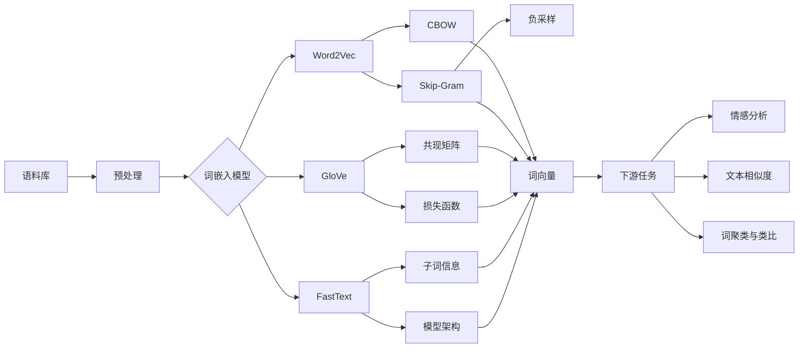

# 词嵌入 (Word Embeddings) 原理与代码实例讲解

## 1. 背景介绍
### 1.1 词嵌入的起源与发展
#### 1.1.1 早期的词表示方法
#### 1.1.2 神经网络语言模型的出现
#### 1.1.3 词嵌入技术的兴起

### 1.2 词嵌入的重要性
#### 1.2.1 自然语言处理中的应用
#### 1.2.2 词嵌入对模型性能的影响
#### 1.2.3 词嵌入在其他领域的应用

## 2. 核心概念与联系
### 2.1 分布式表示
#### 2.1.1 分布式假设
#### 2.1.2 词的分布式表示
#### 2.1.3 分布式表示的优势

### 2.2 词向量
#### 2.2.1 词向量的定义
#### 2.2.2 词向量的维度
#### 2.2.3 词向量的性质

### 2.3 词嵌入模型
#### 2.3.1 基于计数的模型
#### 2.3.2 基于预测的模型
#### 2.3.3 两类模型的比较

## 3. 核心算法原理具体操作步骤
### 3.1 Word2Vec
#### 3.1.1 CBOW (Continuous Bag-of-Words)
#### 3.1.2 Skip-Gram
#### 3.1.3 负采样 (Negative Sampling)

### 3.2 GloVe (Global Vectors for Word Representation)
#### 3.2.1 共现矩阵
#### 3.2.2 损失函数
#### 3.2.3 训练过程

### 3.3 FastText
#### 3.3.1 子词信息
#### 3.3.2 模型架构
#### 3.3.3 训练与推理

## 4. 数学模型和公式详细讲解举例说明
### 4.1 Word2Vec 的数学原理
#### 4.1.1 CBOW 的目标函数与优化
#### 4.1.2 Skip-Gram 的目标函数与优化
#### 4.1.3 负采样的数学解释

### 4.2 GloVe 的数学原理
#### 4.2.1 共现概率与词向量的关系
#### 4.2.2 损失函数的推导
#### 4.2.3 优化算法

### 4.3 FastText 的数学原理
#### 4.3.1 子词嵌入的数学表示
#### 4.3.2 模型的目标函数
#### 4.3.3 优化过程

## 5. 项目实践：代码实例和详细解释说明
### 5.1 使用 Gensim 训练 Word2Vec 模型
#### 5.1.1 数据预处理
#### 5.1.2 模型训练
#### 5.1.3 模型评估与应用

### 5.2 使用 PyTorch 实现 GloVe 模型
#### 5.2.1 构建共现矩阵
#### 5.2.2 定义模型架构
#### 5.2.3 训练与测试

### 5.3 使用 FastText 进行文本分类
#### 5.3.1 数据准备
#### 5.3.2 模型训练
#### 5.3.3 模型评估与预测

## 6. 实际应用场景
### 6.1 情感分析
#### 6.1.1 情感词嵌入
#### 6.1.2 基于词嵌入的情感分类
#### 6.1.3 案例分析

### 6.2 文本相似度计算
#### 6.2.1 词向量的余弦相似度
#### 6.2.2 句子向量的计算
#### 6.2.3 应用实例

### 6.3 词聚类与词类比
#### 6.3.1 词嵌入空间中的聚类
#### 6.3.2 词类比任务
#### 6.3.3 实际案例

## 7. 工具和资源推荐
### 7.1 词嵌入工具包
#### 7.1.1 Gensim
#### 7.1.2 FastText
#### 7.1.3 TensorFlow/Keras Embedding Layer

### 7.2 预训练词向量
#### 7.2.1 Google News Word2Vec
#### 7.2.2 GloVe Pre-trained Vectors
#### 7.2.3 FastText Pre-trained Vectors

### 7.3 相关学习资源
#### 7.3.1 在线课程
#### 7.3.2 书籍推荐
#### 7.3.3 论文与博客

## 8. 总结：未来发展趋势与挑战
### 8.1 词嵌入技术的局限性
#### 8.1.1 词义的多样性
#### 8.1.2 上下文信息的缺失
#### 8.1.3 语言的动态性

### 8.2 contextualized word embeddings
#### 8.2.1 ELMo
#### 8.2.2 BERT
#### 8.2.3 其他预训练语言模型

### 8.3 未来研究方向
#### 8.3.1 多语言词嵌入
#### 8.3.2 知识增强的词嵌入
#### 8.3.3 动态词嵌入

## 9. 附录：常见问题与解答
### 9.1 如何选择合适的词嵌入模型？
### 9.2 词向量的维度对模型性能的影响？
### 9.3 如何处理未登录词 (OOV)？
### 9.4 词嵌入在小数据集上的应用？
### 9.5 词嵌入的可解释性问题？

---

词嵌入技术是自然语言处理领域中一项重要的基础工作，它将词语映射到低维稠密向量空间中，使得词语之间的语义关系能够通过向量运算来体现。本文从背景介绍、核心概念、算法原理、数学模型、代码实践、应用场景等多个角度对词嵌入技术进行了详细阐述。

词嵌入的核心思想是基于分布式假设，即词语的语义由其上下文决定。早期的词表示方法如 one-hot 编码虽然简单，但无法刻画词语间的语义关系。随着神经网络语言模型的出现，研究者们开始探索将词语映射到低维空间的方法，词嵌入技术应运而生。

Word2Vec 是最经典的词嵌入模型之一，它包括 CBOW 和 Skip-Gram 两种架构。CBOW 根据上下文词预测中心词，而 Skip-Gram 则根据中心词预测上下文词。这两种方法都利用了词语共现的信息，并通过极大化似然函数来优化词向量。负采样技术的引入，则大大提高了训练效率。

GloVe 模型从另一个角度出发，通过构建词语共现矩阵，并设计合适的损失函数，直接优化词向量使其满足共现概率的某种关系。相比 Word2Vec，GloVe 更多地利用了全局的统计信息。

FastText 在 Word2Vec 的基础上引入了子词信息，使得模型能够更好地处理未登录词，并在语言结构丰富的场景下取得了不错的效果。

词嵌入技术在情感分析、文本相似度计算、词聚类等任务中得到了广泛应用。但词嵌入也存在一些局限性，如词义的多样性、上下文信息的缺失等。近年来，contextualized word embeddings 如 ELMo、BERT 等预训练语言模型的出现，在一定程度上缓解了这些问题。未来，多语言词嵌入、知识增强的词嵌入、动态词嵌入等研究方向值得进一步探索。

总之，词嵌入技术为自然语言处理任务提供了重要的基础支持。理解词嵌入的原理并掌握其使用方法，对于从事相关研究和应用的人员来说至关重要。希望本文能够为读者提供一个全面而深入的词嵌入技术指南，帮助大家更好地理解和运用这一强大的工具。

作者：禅与计算机程序设计艺术 / Zen and the Art of Computer Programming