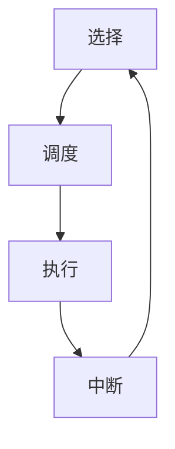

## 1.背景介绍

调度器，这个在计算机领域中至关重要的角色，承担着系统资源分配的重任。尤其在并发环境中，调度器的作用更为突出，它决定了哪个任务应该在何时何地执行，以达到最大化利用系统资源的目的。然而，调度器的原理和实现方式却并不为大多数开发者所熟知。本文将详细介绍调度器的基本原理，以及通过代码示例展示如何实现一个简单的调度器。

## 2.核心概念与联系

### 2.1 调度器的定义

调度器是操作系统中负责决定处理器运行哪个进程的部分。在多任务环境下，调度器需要根据一定的策略来决定资源的分配，以保证系统的公平性和效率。

### 2.2 调度策略

调度策略是调度器决定进程运行顺序的规则，常见的调度策略有先来先服务(FCFS)、短作业优先(SJF)、优先级调度(Priority Scheduling)、轮转法(Round Robin)等。

### 2.3 调度器的分类

根据调度的粒度，调度器可以分为长程调度器、中程调度器和短程调度器。长程调度器负责决定哪些进程可以被加载到内存中；中程调度器负责决定哪些进程应该暂时被挂起以释放内存资源；短程调度器负责决定哪些进程应该被执行。

### 2.4 进程和线程

进程是操作系统分配资源的基本单位，线程是操作系统调度的基本单位。每个进程至少有一个线程，称为主线程。线程共享进程的资源，如内存空间、文件句柄等。

## 3.核心算法原理具体操作步骤

调度器的核心算法原理可以概括为以下几个步骤：

1. 选择：根据调度策略选择一个合适的任务进行执行。
2. 调度：将处理器的控制权交给选定的任务。
3. 执行：任务开始执行，直到完成或被中断。
4. 中断：任务被中断，调度器重新选择新的任务执行。



## 4.数学模型和公式详细讲解举例说明

对于调度器的性能评价，我们通常关注以下几个指标：平均等待时间、平均周转时间和吞吐量。这些指标可以通过以下公式计算：

- 平均等待时间：$W = \frac{1}{n} \sum_{i=1}^{n} w_i$，其中 $w_i$ 是第 $i$ 个任务的等待时间，$n$ 是任务数量。
- 平均周转时间：$T = \frac{1}{n} \sum_{i=1}^{n} t_i$，其中 $t_i$ 是第 $i$ 个任务的周转时间，即完成时间减去到达时间。
- 吞吐量：$P = \frac{n}{T}$，其中 $n$ 是完成的任务数量，$T$ 是总的时间。

## 5.项目实践：代码实例和详细解释说明

接下来，我们将通过一个简单的 Python 代码示例来实现一个基于轮转法的调度器。

```python
import queue

class Task:
    def __init__(self, id, burst_time):
        self.id = id
        self.burst_time = burst_time

class Scheduler:
    def __init__(self, time_slice):
        self.time_slice = time_slice
        self.tasks = queue.Queue()

    def add_task(self, task):
        self.tasks.put(task)

    def schedule(self):
        while not self.tasks.empty():
            task = self.tasks.get()
            if task.burst_time > self.time_slice:
                task.burst_time -= self.time_slice
                print(f"Task {task.id} is running for {self.time_slice} units")
                self.tasks.put(task)
            else:
                print(f"Task {task.id} is running for {task.burst_time} units and then finished")
```

## 6.实际应用场景

调度器在计算机系统中的应用广泛，如操作系统的进程调度、数据库的查询调度、网络的数据包调度等。通过合理的调度策略，可以提高系统的性能，提升用户的体验。

## 7.工具和资源推荐

- 操作系统原理相关书籍，如《现代操作系统》、《深入理解计算机系统》等。
- Python 编程语言，适合初学者快速入门编程。
- 网络资源，如 GitHub、Stack Overflow 等，可以找到大量的相关项目和问题解答。

## 8.总结：未来发展趋势与挑战

随着计算机系统的复杂性增加，调度器面临着更大的挑战。如何在保证公平性的同时提高系统的性能，如何在多核环境下进行有效的调度，如何处理实时系统的调度等问题都需要我们进一步探索和研究。未来的调度器可能需要引入更多的人工智能技术，以实现自适应的调度策略。

## 9.附录：常见问题与解答

1. 问：调度器和调度策略有什么区别？
答：调度器是实现调度策略的工具，调度策略是决定调度器如何进行调度的规则。

2. 问：为什么需要多级调度器？
答：多级调度器可以根据不同的调度粒度进行资源分配，以提高系统的性能。

3. 问：如何选择合适的调度策略？
答：选择调度策略需要根据系统的具体需求，如对响应时间的要求、对系统吞吐量的要求等。

作者：禅与计算机程序设计艺术 / Zen and the Art of Computer Programming