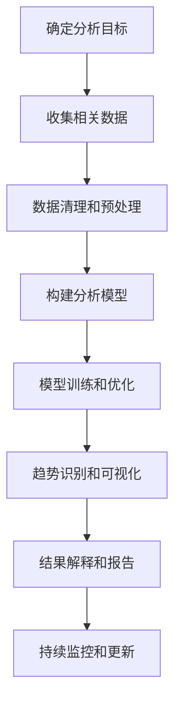
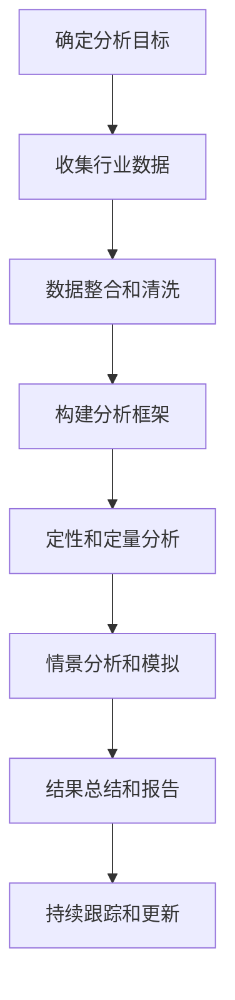

# 跟踪研究和分析科技行业的发展趋势，为公司在技术创新和科技发展方面的决策提供支持

## 1.背景介绍

### 1.1 科技行业的重要性

在当今快节奏的商业环境中，科技已经成为推动经济发展和社会进步的关键动力。无论是新兴的创新技术还是传统行业的数字化转型,科技都扮演着至关重要的角色。因此,及时跟踪和分析科技行业的发展趋势,对于企业制定战略决策、把握市场机遇、保持竞争优势至关重要。

### 1.2 科技发展的驱动力

科技行业的发展主要受以下几个驱动力的推动:

- 新理论和技术突破
- 用户需求的不断变化
- 政府政策和法规的调整
- 商业模式和竞争格局的演变
- 全球化和跨界融合的加速

### 1.3 科技发展对企业的影响

科技的快速发展对企业的运营和发展产生了深远的影响:

- 颠覆性创新改变了行业格局
- 新技术提高了运营效率和用户体验
- 新商业模式重塑了价值链条
- 新兴市场带来了巨大的增长机遇
- 数字化转型成为企业发展的必由之路

## 2.核心概念与联系

### 2.1 技术发展趋势分析

技术发展趋势分析旨在识别和理解影响特定技术领域发展的关键驱动力和模式。它包括以下几个核心概念:

1. **技术生命周期**
   - 新兴阶段
   - 发展/成熟阶段
   - 衰退阶段

2. **技术替代**
   - 新技术取代旧技术
   - 技术融合和集成

3. **技术扩散**
   - 技术在不同领域的应用
   - 技术普及和采用率

4. **技术路线图**
   - 技术发展的时间线和里程碑
   - 技术发展的关键挑战和障碍

5. **生态系统发展**
   - 相关技术、产品和服务的协同发展
   - 行业参与者和利益相关方的角色

### 2.2 行业发展趋势分析

行业发展趋势分析关注于特定行业的宏观环境、竞争格局和商业模式的变化,包括以下核心概念:

1. **市场需求和用户偏好**
   - 用户需求的变化
   - 新兴市场和细分市场

2. **竞争格局**
   - 现有参与者的策略和动向
   - 新进入者的威胁
   - 并购、合作和战略联盟

3. **商业模式创新**
   - 新的收入来源和盈利模式
   - 价值链条的重构
   - 平台化和生态系统建设

4. **监管环境和政策影响**
   - 政府政策和法规的变化
   - 行业标准和认证要求
   - 社会责任和可持续发展

5. **全球化和本地化**
   - 全球市场机遇和挑战
   - 本地化策略和文化适应性

### 2.3 核心概念的联系

技术发展趋势和行业发展趋势密切相关,相互影响:

- 新技术推动行业变革,改变商业模式
- 行业需求和竞争格局驱动技术创新
- 生态系统的发展需要技术和商业模式的协同
- 政策法规影响技术发展方向和行业格局

因此,全面把握技术和行业发展趋势,需要综合考虑这些核心概念之间的相互联系和影响。

## 3.核心算法原理具体操作步骤

### 3.1 技术发展趋势分析流程



1. **确定分析目标**: 明确需要分析的技术领域和关键问题。

2. **收集相关数据**: 从多个渠道收集相关的技术数据,包括科技文献、专利、产品发布、新闻报道等。

3. **数据清理和预处理**: 对收集的原始数据进行清洗、规范化和结构化,为后续分析做准备。

4. **构建分析模型**: 根据分析目标和数据特征,选择合适的机器学习或统计模型,如主题建模、时间序列分析、社交网络分析等。

5. **模型训练和优化**: 使用训练数据集对模型进行训练,并通过调参和迭代优化模型性能。

6. **趋势识别和可视化**: 利用训练好的模型对新数据进行分析,识别技术发展趋势,并使用可视化工具呈现结果。

7. **结果解释和报告**: 对分析结果进行解释和评估,生成可读性强的报告,为决策提供支持。

8. **持续监控和更新**: 持续监控技术发展的新动向,定期更新数据和模型,保证分析结果的时效性。

### 3.2 行业发展趋势分析流程  



1. **确定分析目标**: 明确需要分析的行业领域和关键问题。

2. **收集行业数据**: 从多个渠道收集相关的行业数据,包括市场研究报告、财务数据、用户反馈、政策法规等。

3. **数据整合和清洗**: 对收集的原始数据进行整合、清洗和标准化,为后续分析做准备。

4. **构建分析框架**: 根据分析目标和数据特征,建立合适的分析框架,包括关键指标、分析维度和方法论。

5. **定性和定量分析**: 结合定性和定量分析方法,对行业现状、竞争格局、用户需求等进行深入分析。

6. **情景分析和模拟**: 构建不同发展情景,模拟行业发展的可能路径和影响。

7. **结果总结和报告**: 总结分析结果,生成可读性强的报告,为决策提供支持。

8. **持续跟踪和更新**: 持续跟踪行业发展的新动向,定期更新数据和模型,保证分析结果的时效性。

## 4.数学模型和公式详细讲解举例说明

### 4.1 技术生命周期模型

技术生命周期模型描述了技术从出现到被替代的整个过程,通常可以用 Bass 扩散模型来表示:

$$
N(t) = m \left[ 1 - \exp\left(-(\alpha+\beta)t\right) \right] \left/ \left[ 1 + (\beta/\alpha)\exp\left(-(\alpha+\beta)t\right) \right] \right]
$$

其中:
- $N(t)$ 表示在时间 $t$ 时已采用该技术的用户数量
- $m$ 表示潜在的最大用户数量
- $\alpha$ 表示创新系数,反映了早期采用者的影响
- $\beta$ 表示模仿系数,反映了后期采用者的影响

通过对历史数据的拟合,可以估计出模型参数,并预测技术在未来的采用情况。

### 4.2 技术替代模型

当新技术出现时,它会逐渐取代旧技术。技术替代过程可以用 Lotka-Volterra 竞争模型来描述:

$$
\begin{aligned}
\frac{dN_1}{dt} &= r_1 N_1 \left(1 - \frac{N_1 + \alpha_{12}N_2}{K_1}\right) \\
\frac{dN_2}{dt} &= r_2 N_2 \left(1 - \frac{N_2 + \alpha_{21}N_1}{K_2}\right)
\end{aligned}
$$

其中:
- $N_1$ 和 $N_2$ 分别表示旧技术和新技术的用户数量
- $r_1$ 和 $r_2$ 分别表示旧技术和新技术的增长率
- $K_1$ 和 $K_2$ 分别表示旧技术和新技术的carrying capacity
- $\alpha_{12}$ 和 $\alpha_{21}$ 分别表示新技术对旧技术和旧技术对新技术的影响程度

通过数值求解,可以模拟两种技术在未来的发展趋势和替代过程。

### 4.3 社交网络分析

在技术扩散和生态系统发展中,社交网络分析可以帮助识别关键参与者和影响力。常用的指标包括:

- **中心性**
  - 度中心性 (Degree Centrality): $C_D(v) = \frac{deg(v)}{n-1}$
  - 介数中心性 (Betweenness Centrality): $C_B(v) = \sum_{s\neq v\neq t}\frac{\sigma_{st}(v)}{\sigma_{st}}$
  - 接近中心性 (Closeness Centrality): $C_C(v) = \frac{n-1}{\sum_{u\neq v}d(v,u)}$

- **紧密中心性** (Core-Periphery Structure)
  - 核心节点具有高度相互连接
  - 外围节点主要与核心节点相连

- **社区检测** (Community Detection)
  - 基于模ул度最大化: $Q = \frac{1}{2m}\sum_{ij}\left[A_{ij} - \frac{k_ik_j}{2m}\right]\delta(c_i,c_j)$
  - 基于随机游走、谱聚类等算法

通过分析技术生态系统中各个参与者的网络位置和角色,可以洞察技术发展的动态过程。

## 5.项目实践:代码实例和详细解释说明

### 5.1 技术生命周期模型拟合

以下是使用 Python 中的 lmfit 库对 Bass 扩散模型进行拟合的示例代码:

```python
import numpy as np
from lmfit import Model

# 定义 Bass 扩散模型函数
def bass_diffusion(t, m, alpha, beta):
    exp_value = np.exp(-(alpha + beta) * t)
    numerator = m * (1 - exp_value)
    denominator = 1 + (beta / alpha) * exp_value
    return numerator / denominator

# 加载历史数据
data = np.loadtxt('tech_adoption.csv', delimiter=',', skiprows=1, unpack=True)
t = data[0]  # 时间
y = data[1]  # 采用量

# 构建模型并进行拟合
gmodel = Model(bass_diffusion)
params = gmodel.make_params(m=np.max(y), alpha=1.0, beta=1.0)
result = gmodel.fit(y, params, t=t)

# 输出拟合参数和结果
print(result.fit_report())

# 绘制拟合曲线
import matplotlib.pyplot as plt
t_fitted = np.linspace(min(t), max(t), 100)
y_fitted = result.eval(t=t_fitted)
plt.plot(t, y, 'o', label='Historical Data')
plt.plot(t_fitted, y_fitted, '-', label='Bass Diffusion Model')
plt.legend()
plt.show()
```

在这个示例中,我们首先定义了 Bass 扩散模型的数学表达式。然后,我们加载了技术采用量的历史数据,并使用 lmfit 库构建了非线性最小二乘拟合模型。通过优化模型参数 `m`、`alpha` 和 `beta`,我们可以获得最佳拟合曲线。最后,我们可以绘制历史数据和拟合曲线,直观地评估模型的拟合效果。

根据拟合结果,我们可以预测技术在未来的采用情况,为产品规划和市场策略制定提供依据。

### 5.2 技术替代模型仿真

以下是使用 Python 中的 scipy.integrate 库对 Lotka-Volterra 竞争模型进行数值求解的示例代码:

```python
import numpy as np
from scipy.integrate import odeint
import matplotlib.pyplot as plt

# 定义 Lotka-Volterra 竞争模型函数
def lotka_volterra(X, t, r1, r2, K1, K2, alpha12, alpha21):
    N1, N2 = X
    dN1_dt = r1 * N1 * (1 - (N1 + alpha12 * N2) / K1)
    dN2_dt = r2 *