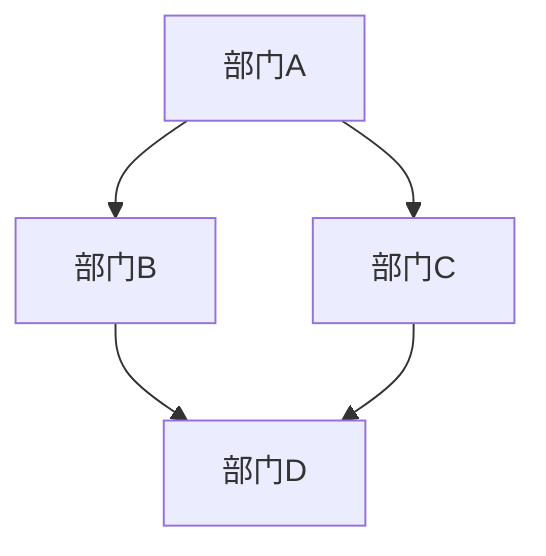

## 1. 背景介绍

在现代企业中，跨部门协调资源是非常重要的一项工作。特别是在IT领域，不同部门之间的协调和合作对于项目的成功实施至关重要。在这个过程中，对业务的理解和对需求的排序和把控也是非常关键的。本文将介绍如何跨部门协调资源，依赖对业务的理解对需求进行排序和把控落地节奏。

## 2. 核心概念与联系

跨部门协调资源是指不同部门之间的协调和合作，以实现共同的目标。在IT领域中，跨部门协调资源通常涉及到不同的技术和工具，需要对业务有深入的理解，以便更好地满足需求。

对业务的理解是指对业务流程和业务需求的深入理解。只有深入理解业务，才能更好地满足需求，从而更好地协调资源。对需求的排序和把控是指对需求进行优先级排序和把控落地节奏，以确保项目的顺利实施。

## 3. 核心算法原理具体操作步骤

跨部门协调资源的核心算法原理是协作和沟通。在跨部门协调资源的过程中，需要不断地协作和沟通，以确保各个部门之间的工作顺利进行。具体操作步骤如下：

1. 确定项目目标和需求：在项目开始之前，需要明确项目目标和需求，以便各个部门能够有针对性地进行工作。

2. 制定项目计划：制定项目计划是跨部门协调资源的关键步骤之一。在制定项目计划时，需要考虑各个部门的工作量和工作进度，以便更好地协调资源。

3. 分配任务和责任：在制定项目计划之后，需要分配任务和责任。在分配任务和责任时，需要考虑各个部门的专业性和能力，以便更好地协调资源。

4. 沟通和协作：在项目实施过程中，需要不断地沟通和协作，以确保各个部门之间的工作顺利进行。在沟通和协作时，需要考虑各个部门的需求和利益，以便更好地协调资源。

5. 监控和控制：在项目实施过程中，需要不断地监控和控制，以确保项目按照计划进行。在监控和控制时，需要考虑各个部门的工作进度和工作质量，以便更好地协调资源。

## 4. 数学模型和公式详细讲解举例说明

跨部门协调资源的过程中，需要考虑各个部门之间的关系和依赖。这可以用图论中的有向图来表示。有向图中的节点表示部门，边表示部门之间的依赖关系。例如，下图表示了一个跨部门协调资源的例子：

在这个例子中，部门A依赖于部门B和部门C，部门B和部门C都依赖于部门D。这个有向图可以帮助我们更好地理解各个部门之间的关系和依赖。

## 5. 项目实践：代码实例和详细解释说明

在跨部门协调资源的过程中，需要使用各种工具和技术。例如，可以使用项目管理工具来制定项目计划和分配任务，可以使用协作工具来进行沟通和协作，可以使用监控工具来监控和控制项目进度和质量。

下面是一个使用JIRA作为项目管理工具的例子。在这个例子中，我们使用JIRA来制定项目计划和分配任务，以便更好地协调资源。具体操作步骤如下：

1. 创建项目：在JIRA中创建一个新的项目，以便更好地管理项目。

2. 制定项目计划：在JIRA中制定项目计划，包括项目目标、需求、任务和时间表等。

3. 分配任务和责任：在JIRA中分配任务和责任，以便各个部门能够有针对性地进行工作。

4. 沟通和协作：在JIRA中进行沟通和协作，以确保各个部门之间的工作顺利进行。

5. 监控和控制：在JIRA中监控和控制项目进度和质量，以确保项目按照计划进行。

## 6. 实际应用场景

跨部门协调资源的应用场景非常广泛。在IT领域中，跨部门协调资源通常涉及到软件开发、系统集成、数据分析等方面。例如，在软件开发过程中，需要跨部门协调资源，以确保软件按照需求进行开发。在系统集成过程中，需要跨部门协调资源，以确保系统能够顺利集成。在数据分析过程中，需要跨部门协调资源，以确保数据能够被正确地分析和利用。

## 7. 工具和资源推荐

在跨部门协调资源的过程中，有很多工具和资源可以使用。以下是一些常用的工具和资源：

1. 项目管理工具：JIRA、Trello等。

2. 协作工具：Slack、Microsoft Teams等。

3. 监控工具：Nagios、Zabbix等。

4. 数据分析工具：Python、R等。

## 8. 总结：未来发展趋势与挑战

跨部门协调资源是IT领域中非常重要的一项工作。随着技术的不断发展和应用场景的不断扩大，跨部门协调资源的工作也将变得更加复杂和困难。未来，我们需要更好地利用技术和工具，以便更好地协调资源。同时，我们也需要更好地理解业务和需求，以便更好地满足需求。

## 9. 附录：常见问题与解答

Q: 跨部门协调资源的过程中，如何解决部门之间的冲突？

A: 在跨部门协调资源的过程中，部门之间的冲突是不可避免的。解决冲突的关键是沟通和协商。在冲突出现时，需要及时进行沟通和协商，以找到解决问题的最佳方案。

Q: 跨部门协调资源的过程中，如何确保项目按照计划进行？

A: 在跨部门协调资源的过程中，需要不断地监控和控制项目进度和质量，以确保项目按照计划进行。可以使用监控工具来监控项目进度和质量，以便及时发现问题并进行调整。

Q: 跨部门协调资源的过程中，如何确保各个部门之间的工作顺利进行？

A: 在跨部门协调资源的过程中，需要不断地沟通和协作，以确保各个部门之间的工作顺利进行。可以使用协作工具来进行沟通和协作，以便更好地协调资源。