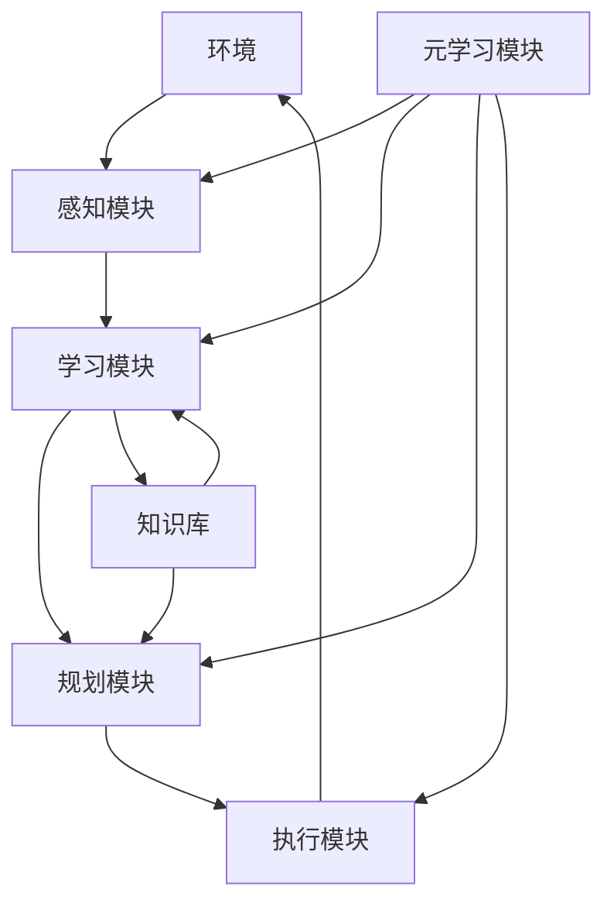

# 跨领域AI代理工作流模型：灵活应用于不同场景

## 1.背景介绍

### 1.1 AI代理的兴起

近年来,人工智能(AI)技术的快速发展推动了智能代理的崛起。AI代理是一种软件实体,能够根据特定目标和环境自主地感知、规划和采取行动。这些代理被广泛应用于各种领域,如自动驾驶、机器人控制、游戏AI、智能助理等。

随着AI算法和计算能力的提高,AI代理变得越来越复杂和智能。然而,大多数现有的AI代理系统都是为特定领域和任务而设计的,缺乏通用性和灵活性。因此,开发一种能够跨领域应用、适应不同环境的通用AI代理工作流模型就显得尤为重要。

### 1.2 跨领域AI代理的挑战

设计一个通用的AI代理工作流模型面临着诸多挑战:

1. **环境多样性**: 不同领域的环境可能存在巨大差异,如状态空间、动态特性、不确定性等,需要代理能够灵活适应。

2. **任务多样性**: 不同领域的任务目标和约束条件各不相同,代理需具备通用的任务规划和决策能力。

3. **知识迁移**: 如何有效地将代理在一个领域学习到的知识和经验迁移到新的领域,避免从头开始学习。

4. **可解释性**: 代理的决策过程应当具有可解释性,以确保其行为的透明性和可控性。

5. **鲁棒性**: 代理需要具备足够的鲁棒性,能够处理异常情况和意外输入,避免失效或产生不可预测的行为。

### 1.3 本文概述

本文将介绍一种新颖的跨领域AI代理工作流模型,旨在解决上述挑战。该模型采用模块化设计,包含感知、学习、规划和执行等核心模块,并引入了元学习和知识库等关键组件。我们将详细阐述模型的核心概念、算法原理、数学模型,并通过实例代码和应用场景说明其实现和应用。最后,我们将讨论该模型的未来发展趋势和面临的挑战。

## 2.核心概念与联系

### 2.1 AI代理的基本概念

在介绍跨领域AI代理工作流模型之前,我们先回顾一下AI代理的基本概念。一个AI代理可以形式化定义为一个元组 $\langle S, A, T, R, \gamma \rangle$,其中:

- $S$ 表示环境的状态空间
- $A$ 表示代理可执行的动作空间
- $T(s, a, s')$ 是状态转移概率,表示在状态 $s$ 下执行动作 $a$ 将转移到状态 $s'$ 的概率
- $R(s, a)$ 是奖励函数,表示在状态 $s$ 下执行动作 $a$ 获得的即时奖励
- $\gamma \in [0, 1)$ 是折现因子,用于权衡即时奖励和长期累积奖励

代理的目标是学习一个策略 $\pi: S \rightarrow A$,将状态映射到动作,以最大化其预期的长期累积奖励。

### 2.2 跨领域AI代理工作流模型概览

我们提出的跨领域AI代理工作流模型由以下几个核心模块组成:

1. **感知模块**: 从环境中获取原始数据,并将其处理为代理可理解的状态表示。
2. **学习模块**: 基于状态和奖励信号,学习环境的动态特性和最优策略。
3. **规划模块**: 根据学习到的环境模型和任务目标,生成行动序列计划。
4. **执行模块**: 将规划好的行动序列执行到环境中,并观察执行结果。
5. **知识库**: 存储代理在不同领域学习到的知识和经验,供其他模块查询和利用。
6. **元学习模块**: 根据代理在不同领域的表现,调整各模块的参数和策略,实现跨领域的知识迁移和自我优化。

这些模块通过有序的工作流相互协作,形成一个闭环的智能决策系统。下面我们将详细介绍每个模块的原理和实现。

## 3.核心算法原理具体操作步骤

### 3.1 感知模块

感知模块的主要任务是从环境中获取原始数据,并将其转换为代理可理解的状态表示。这通常涉及以下几个步骤:

1. **数据采集**: 根据环境的特性,选择合适的传感器或数据源,获取原始数据。例如,对于视觉任务,可以使用摄像头采集图像或视频数据;对于自然语言处理任务,可以从文本语料库中获取文本数据。

2. **数据预处理**: 对采集到的原始数据进行必要的预处理,如去噪、标准化、特征提取等,以提高数据质量和计算效率。

3. **状态编码**: 将预处理后的数据转换为代理可理解的状态表示。常用的状态编码方式包括一维或多维特征向量、图像张量、符号序列等。

4. **状态嵌入(可选)**: 为了提高状态表示的质量和泛化能力,可以使用深度学习模型(如自编码器、变分自编码器等)对状态进行嵌入,将其映射到一个低维的连续空间。

感知模块的设计需要考虑环境的特性、任务需求和计算资源等因素,选择合适的数据采集方式、预处理算法和状态编码方式。同时,感知模块还需要具备一定的鲁棒性,能够处理异常输入和噪声干扰。

### 3.2 学习模块

学习模块的核心任务是基于代理与环境的交互数据,学习环境的动态特性和最优策略。根据所采用的学习范式,可以分为以下几种常见的学习算法:

1. **监督学习**: 当存在一组标注好的状态-动作对作为训练数据时,可以将策略学习建模为一个监督学习问题,使用深度神经网络等模型直接从数据中学习策略映射函数。

2. **强化学习**: 如果没有标注数据,代理需要通过与环境的在线交互来学习策略。常用的强化学习算法包括Q-Learning、策略梯度、Actor-Critic等。

3. **模型学习**: 除了直接学习策略,代理还可以先学习环境的动态模型(即状态转移概率和奖励函数),然后基于学习到的环境模型计算最优策略。常用的模型学习算法包括高斯过程回归、变分自编码器等。

4. **逆强化学习**: 当缺乏明确的奖励函数时,代理可以通过观察专家示范的行为,推断出潜在的奖励函数,然后基于推断出的奖励函数学习策略。

5. **元学习**: 为了实现跨领域的知识迁移,代理可以采用元学习的范式,从多个任务中学习一种通用的学习策略,加快在新环境下的学习速度。

不同的学习算法适用于不同的场景,需要根据具体问题的特点选择合适的算法。同时,也可以将多种算法相结合,发挥各自的优势。学习模块的设计还需要考虑算法的收敛性、计算效率和泛化能力等因素。

### 3.3 规划模块  

规划模块的任务是根据学习到的环境模型和任务目标,生成行动序列计划。常用的规划算法包括:

1. **经典搜索算法**: 如A*、IDA*等启发式搜索算法,适用于离散、确定性环境。

2. **采样优化算法**: 如蒙特卡罗树搜索(MCTS)、交叉熵方法(CEM)等,通过采样和优化技术在连续、随机环境中进行规划。

3. **动态规划算法**: 如值迭代、策略迭代等,适用于求解马尔可夫决策过程(MDP)和部分可观测马尔可夫决策过程(POMDP)。

4. **层次规划算法**: 如选项框架(Option Framework)、层次抽象机器(HAM)等,通过构建层次结构来简化复杂任务的规划。

5. **约束规划算法**: 如线性规划、二次规划等,在满足一定约束条件下寻找最优解。

规划算法的选择取决于环境的特性(如离散还是连续、确定性还是随机性)、任务目标的复杂程度、计算资源等因素。在实际应用中,通常需要将多种规划算法相结合,以发挥各自的优势。

此外,规划模块还需要具备一定的鲁棒性和可解释性。鲁棒性保证了规划算法能够处理异常情况和意外输入;可解释性则有助于人类监督和控制代理的行为。

### 3.4 执行模块

执行模块的职责是将规划好的行动序列执行到环境中,并观察执行结果。这通常包括以下几个步骤:

1. **动作解码**: 将规划模块生成的抽象动作序列解码为可执行的低级动作指令,如机器人的关节运动指令、游戏AI的按键操作序列等。

2. **动作执行**: 通过相应的执行器(如机械臂、游戏模拟器等)将动作指令执行到环境中。

3. **状态观测**: 观察动作执行后环境的反馈,获取新的状态信息。

4. **奖励计算**: 根据任务目标和环境反馈,计算当前状态下的即时奖励。

5. **结果存储**: 将当前状态、执行动作、观测到的新状态和奖励等信息存储到经验池中,供学习模块使用。

执行模块需要与感知模块、规划模块以及环境紧密配合,确保动作的正确执行和状态观测的准确性。同时,执行模块还需要具备一定的容错和恢复能力,以应对执行过程中可能出现的异常情况。

### 3.5 知识库

知识库是跨领域AI代理工作流模型的一个关键组件,用于存储代理在不同领域学习到的知识和经验,供其他模块查询和利用。知识库的设计需要考虑以下几个方面:

1. **知识表示**: 知识库需要采用一种通用的知识表示形式,能够存储各种类型的知识,如环境模型、策略、规划算法、元学习器等。常用的知识表示方式包括符号逻辑、语义网络、神经网络等。

2. **知识组织**: 为了高效地存储和检索知识,需要对知识进行合理的组织和索引,如基于任务类型、环境特征等维度进行分类和标注。

3. **知识共享**: 知识库需要提供一种标准的接口,允许各个模块访问和共享知识。这可以通过定义统一的数据格式和通信协议来实现。

4. **知识更新**: 知识库应当支持动态地更新和扩展知识,以适应新的任务和环境。这可能需要引入知识融合、知识蒸馏等技术。

5. **知识安全**: 为了防止知识被恶意篡改或滥用,知识库需要采取一定的安全措施,如访问控制、加密存储等。

知识库的设计直接影响着代理的学习效率和泛化能力。一个优秀的知识库不仅能够高效地存储和共享知识,还应当具备一定的智能,能够主动发现知识间的关联、整合冲突的知识、生成新的知识等。

### 3.6 元学习模块

元学习模块是实现跨领域知识迁移和自我优化的关键。它的主要任务是根据代理在不同领域的表现,调整各个模块的参数和策略,以提高代理的整体性能。元学习模块通常包括以下几个核心组件:

1. **元学习器**: 根据代理在不同任务上的表现,学习一种通用的学习策略或优化算法,用于指导其他模块的参数更新。常用的元学习器包括优化器LSTM、