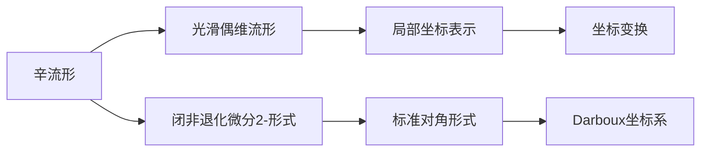

# 辛几何引论：第二章辛流形

## 1.背景介绍

### 1.1 辛几何的起源与发展

辛几何(Symplectic Geometry)是研究辛流形及其相关结构的一门数学分支。它源于18世纪哈密顿在研究经典力学时引入的哈密顿方程,后由雅可比、普朗克、狄拉克等人在量子力学和量子场论中的工作进一步发展。20世纪中叶,随着现代几何的崛起,辛几何开始被视为一个独立的研究领域。

辛流形是辛几何研究的核心对象,它是一个偶维光滑流形,赋予了一个闭非退化的微分2-形式(称为辛形式)。辛流形在数学物理学中扮演着重要角色,例如哈密顿力学系统、电磁场、量子态等都可以用辛流形来描述。

### 1.2 辛流形在数学物理中的应用

辛流形在数学物理中有着广泛的应用,包括但不限于:

- **经典力学**: 辛流形为研究哈密顿系统提供了坚实的数学基础,哈密顿方程可以自然地在辛流形上定义。
- **量子力学**: 量子态空间天生就是一个辛流形,量子力学的许多概念和结构都可以从辛几何的角度得到深刻阐释。
- **量子场论**: 辛几何为研究规范场论提供了有力的数学工具,如规范理论的幺正化、手征结构等。
- **弦理论**: 辛流形在描述弦理论中的目标空间扮演着关键角色。

除此之外,辛几何还在很多其他领域有重要应用,如微分拓扑学、代数几何、李群与李代数等。

## 2.核心概念与联系

### 2.1 辛流形的定义

辛流形(Symplectic Manifold)是一个偶维光滑流形 $(M, \omega)$,其中 $\omega$ 是定义在 $M$ 上的一个闭非退化的微分2-形式,称为辛形式(Symplectic Form)。更精确地,辛形式满足:

1. $\omega$ 是一个光滑的微分2-形式,即 $\omega \in \Omega^2(M)$。
2. $\omega$ 是闭的,即 $d\omega = 0$。
3. $\omega$ 是非退化的,也就是对任意非零切矢量场 $X$,总存在另一个切矢量场 $Y$,使得 $\omega(X, Y) \neq 0$。

非退化性保证了辛形式在每一点都可以诱导出一个同构映射将切空间映射到余切空间,这个映射被称为辛形式的逆。

### 2.2 辛流形的局部坐标表示

在局部坐标邻域 $(U, \varphi)$ 中,辛形式可以表示为:

$$\omega = \sum_{i,j=1}^n \omega_{ij}(x) dx^i \wedge dx^j$$

其中 $\omega_{ij}(x)$ 是辛形式的局部坐标分量,它们必须满足:

1. $\omega_{ij} = -\omega_{ji}$ (反对称性)
2. $\sum_{i,j} \frac{\partial \omega_{ij}}{\partial x^k} = 0$ (闭性)
3. 矩阵 $(\omega_{ij})$ 在每一点都是非退化的。

通常,我们可以找到一个坐标系,使得辛形式在该坐标系下具有标准对角形式:

$$\omega = \sum_{i=1}^{n} dp_i \wedge dq^i$$

这种坐标系被称为辛标架或Darboux坐标系。

### 2.3 Mermaid 流程图



## 3.核心算法原理具体操作步骤

### 3.1 辛流形上的向量场

在辛流形 $(M, \omega)$ 上,我们可以定义一个特殊的向量场,称为辛向量场(Symplectic Vector Field)或哈密顿向量场(Hamiltonian Vector Field)。对于任意光滑函数 $H: M \rightarrow \mathbb{R}$,它对应的辛向量场 $X_H$ 定义为:

$$\omega(X_H, \cdot) = dH(\cdot)$$

其中 $dH$ 是 $H$ 的外微分。这个定义隐含了 $X_H$ 的存在性和唯一性,因为辛形式是非退化的。

辛向量场 $X_H$ 描述了辛流形上的"流动",它们生成辛流形上的一个李代数,称为辛李代数或哈密顿李代数。

### 3.2 哈密顿方程与辛流

令 $\phi_t$ 为辛向量场 $X_H$ 生成的流,则对任意光滑函数 $F: M \rightarrow \mathbb{R}$,我们有:

$$\frac{d}{dt}(F \circ \phi_t) = \{F, H\} \circ \phi_t$$

其中 $\{\cdot, \cdot\}$ 是辛括号(Symplectic Bracket)或泊松括号(Poisson Bracket),定义为:

$$\{F, H\} = \omega(X_F, X_H)$$

这个方程就是著名的哈密顿方程,描述了经典力学系统的运动规律。

辛流(Symplectic Flow)是辛向量场生成的流,它在辛流形上保持辛结构不变。具体来说,如果 $\phi_t$ 是 $X_H$ 生成的流,则对任意 $t \in \mathbb{R}$,有:

$$\phi_t^*\omega = \omega$$

这就是辛流的不变性质。

### 3.3 Mermaid 流程图


## 4.数学模型和公式详细讲解举例说明

### 4.1 辛形式的非退化性

辛形式的非退化性是辛几何的一个关键性质。对于一个辛流形 $(M, \omega)$,辛形式 $\omega$ 在每一点 $p \in M$ 诱导出一个同构映射:

$$\omega_p^\flat: T_pM \rightarrow T_p^*M$$

定义为 $\omega_p^\flat(X) = \omega(X, \cdot)$。由于 $\omega$ 是非退化的,因此这个映射是一个同构。

我们可以构造 $\omega_p^\flat$ 的逆映射 $\omega_p^\sharp: T_p^*M \rightarrow T_pM$,对任意 $\alpha \in T_p^*M$,有:

$$\omega_p^\sharp(\alpha)(Y) = \alpha(\omega_p^\flat(Y))$$

这个映射被称为辛形式的逆。利用这个映射,我们可以将余切空间中的对象(如微分形式)映射到切空间中的对象(如向量场)。

作为一个例子,考虑标准辛形式 $\omega_0 = \sum_{i=1}^n dp_i \wedge dq^i$ 在某一点 $(p_0, q_0)$ 处的情形。对任意切矢量 $X = \sum_i a_i \frac{\partial}{\partial p_i} + b_i \frac{\partial}{\partial q^i}$,我们有:

$$\omega_0^\flat(X) = \sum_i a_i dq^i - b_i dp_i$$

因此,对任意余切矢量 $\alpha = \sum_i c_i dp_i + d_i dq^i$,有:

$$\omega_0^\sharp(\alpha) = \sum_i d_i \frac{\partial}{\partial p_i} - c_i \frac{\partial}{\partial q^i}$$

这说明了辛形式的逆在标准坐标系下的具体表达式。

### 4.2 辛流的生成

设 $X_H$ 是光滑函数 $H$ 对应的辛向量场,则 $X_H$ 生成的流 $\phi_t$ 可以通过解微分方程组来获得:

$$\frac{d}{dt}\phi_t(x) = X_H(\phi_t(x))$$

其中 $x \in M$ 是初始点。利用局部坐标表示,这个方程组可以写为:

$$\frac{d}{dt}x^i(t) = X_H^i(x(t))$$

这里 $X_H^i$ 是 $X_H$ 在局部坐标系下的分量。

在标准坐标系 $(p, q)$ 下,利用 $X_H$ 的定义以及辛形式的逆,我们有:

$$X_H = \omega_0^\sharp(dH) = \sum_i \frac{\partial H}{\partial q^i}\frac{\partial}{\partial p_i} - \frac{\partial H}{\partial p_i}\frac{\partial}{\partial q^i}$$

代入上面的微分方程组,可以得到哈密顿方程:

$$\begin{align*}
\frac{dp_i}{dt} &= -\frac{\partial H}{\partial q^i}\\
\frac{dq^i}{dt} &= \frac{\partial H}{\partial p_i}
\end{align*}$$

这个方程组描述了经典力学系统在相空间中的运动轨迹。

### 4.3 Mermaid 流程图


## 5.项目实践：代码实例和详细解释说明

为了更好地理解辛流形的概念,我们可以通过编程来模拟一些简单的辛系统。以下是一个使用Python和SymPy库实现的示例代码,用于模拟一个简单的质点在二维平面中的运动。

```python
import sympy as sp
import numpy as np
import matplotlib.pyplot as plt

# 定义符号变量
t, m, k = sp.symbols('t m k', real=True, positive=True)
x, y, px, py = sp.symbols('x y px py', real=True)

# 定义哈密顿函数
H = (px**2 + py**2) / (2 * m) + k * (x**2 + y**2) / 2

# 计算哈密顿方程
dxdt = sp.diff(H, px)
dydt = sp.diff(H, py)
dpxdt = -sp.diff(H, x)
dpydt = -sp.diff(H, y)

# 将符号表达式转换为Lambda函数
dxdt_lambda = sp.lambdify((t, x, y, px, py, m, k), dxdt)
dydt_lambda = sp.lambdify((t, x, y, px, py, m, k), dydt)
dpxdt_lambda = sp.lambdify((t, x, y, px, py, m, k), dpxdt)
dpydt_lambda = sp.lambdify((t, x, y, px, py, m, k), dpydt)

# 初始条件
x0, y0 = 1, 0
px0, py0 = 0, 1
m_value, k_value = 1, 1

# 时间步长和总时间
dt = 0.01
T = 20

# 数值求解
t_values = np.arange(0, T, dt)
x_values, y_values = [x0], [y0]
px_values, py_values = [px0], [py0]

for t_val in t_values[1:]:
    x_new = x_values[-1] + dxdt_lambda(t_val, x_values[-1], y_values[-1], px_values[-1], py_values[-1], m_value, k_value) * dt
    y_new = y_values[-1] + dydt_lambda(t_val, x_values[-1], y_values[-1], px_values[-1], py_values[-1], m_value, k_value) * dt
    px_new = px_values[-1] + dpxdt_lambda(t_val, x_values[-1], y_values[-1], px_values[-1], py_values[-1], m_value, k_value) * dt
    py_new = py_values[-1] + dpydt_lambda(t_val, x_values[-1], y_values[-1], px_values[-1], py_values[-1], m_value, k_value) * dt
    
    x_values.append(x_new)
    y_values.append(y_new)
    px_values.append(px_new)
    py_values.append(py_new)

# 绘制轨迹
plt.figure(figsize=(8, 6))
plt.plot(x_values, y_values)
plt.xlabel('x')
plt.ylabel('y')
plt.title('Trajectory of a Particle in