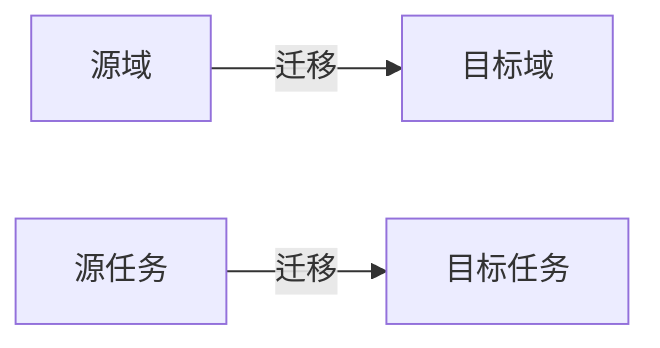

# 迁移学习 (Transfer Learning) 原理与代码实例讲解

## 1. 背景介绍
在人工智能的发展历程中，迁移学习已经成为了一种重要的学习方式。它允许我们将在一个任务上学到的知识迁移到另一个相关任务上，从而节省大量的数据收集和模型训练时间。这种方法在数据不足或者计算资源有限的情况下尤其有价值。

## 2. 核心概念与联系
迁移学习涉及到几个核心概念：源域（Source Domain）、目标域（Target Domain）、源任务（Source Task）和目标任务（Target Task）。源域和源任务是我们已经训练好的模型和数据集，而目标域和目标任务则是我们希望模型能够适应和优化的新环境和任务。



## 3. 核心算法原理具体操作步骤
迁移学习的核心算法原理可以分为三个步骤：选择合适的源域和源任务、确定迁移学习的策略、微调模型以适应目标任务。

### 3.1 选择合适的源域和源任务
选择与目标任务相似度高的源域和源任务是迁移学习成功的关键。

### 3.2 确定迁移学习的策略
迁移学习策略通常包括基于实例的迁移、基于特征的迁移、基于模型的迁移和基于关系的迁移。

### 3.3 微调模型以适应目标任务
微调是通过继续训练模型的方式，使其更好地适应目标任务的数据。

## 4. 数学模型和公式详细讲解举例说明
迁移学习的数学模型通常涉及到损失函数的设计，其中一个常见的例子是使用带有正则化项的损失函数，以避免过拟合。

$$ L(\theta) = L_{target}(\theta) + \lambda L_{source}(\theta) $$

其中，$L_{target}(\theta)$ 是目标任务上的损失函数，$L_{source}(\theta)$ 是源任务上的损失函数，$\lambda$ 是正则化参数。

## 5. 项目实践：代码实例和详细解释说明
在本节中，我们将通过一个具体的例子来展示如何使用迁移学习。我们将使用Python和TensorFlow来实现一个图像分类任务的迁移学习。

```python
# 导入必要的库
import tensorflow as tf
from tensorflow.keras.applications import VGG16
from tensorflow.keras.layers import Dense, Flatten
from tensorflow.keras.models import Model

# 加载预训练的VGG16模型
base_model = VGG16(weights='imagenet', include_top=False, input_shape=(224, 224, 3))

# 冻结基模型的层
for layer in base_model.layers:
    layer.trainable = False

# 添加自定义层
x = Flatten()(base_model.output)
x = Dense(1024, activation='relu')(x)
predictions = Dense(10, activation='softmax')(x)

# 构建最终模型
model = Model(inputs=base_model.input, outputs=predictions)

# 编译模型
model.compile(optimizer='adam', loss='categorical_crossentropy', metrics=['accuracy'])

# 在新的数据集上训练模型
# model.fit(...)
```

在这个例子中，我们使用了VGG16模型作为基模型，并在其上添加了自定义的全连接层来适应新的图像分类任务。

## 6. 实际应用场景
迁移学习在许多领域都有应用，例如图像识别、自然语言处理、语音识别等。在这些领域，迁移学习可以帮助我们快速适应新任务，提高模型的性能。

## 7. 工具和资源推荐
- TensorFlow和PyTorch：两个流行的深度学习框架，都支持迁移学习。
- Model Zoo：提供了许多预训练模型，可以用于迁移学习。
- Papers With Code：一个收集了最新研究论文和相应代码的网站，可以用来了解迁移学习的最新进展。

## 8. 总结：未来发展趋势与挑战
迁移学习作为一种有效的学习方式，未来有着广阔的发展前景。但同时，如何选择合适的源任务和源域、如何设计更有效的迁移策略等问题仍然是迁移学习面临的挑战。

## 9. 附录：常见问题与解答
Q1: 迁移学习适用于哪些类型的任务？
A1: 迁移学习适用于大多数机器学习和深度学习任务，尤其是在数据稀缺或者计算资源有限的情况下。

Q2: 如何判断源任务和目标任务的相似度？
A2: 可以通过分析两个任务的数据分布、特征空间和任务目标来判断它们的相似度。

作者：禅与计算机程序设计艺术 / Zen and the Art of Computer Programming