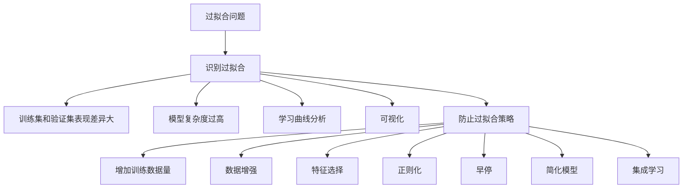

# 过拟合 (Overfitting)

## 1.背景介绍

在机器学习和深度学习领域中,过拟合是一个常见且极为重要的问题。当模型过于复杂时,它可能会过度捕捉训练数据中的噪声和细节,导致在新的未见过的数据上表现不佳。这种现象被称为过拟合。过拟合会严重影响模型的泛化能力,从而限制了模型在实际应用中的效果。因此,了解过拟合的根源、识别过拟合的迹象以及采取有效的防止过拟合的策略对于构建鲁棒和高性能的机器学习模型至关重要。

## 2.核心概念与联系

### 2.1 什么是过拟合?

过拟合是指机器学习模型在训练数据上表现良好,但在新的未见过的数据上表现不佳的现象。换句话说,模型过于专注于学习训练数据中的细节和噪声,以至于无法很好地捕捉数据的一般模式。这种过度拟合训练数据的行为会导致模型在新数据上的泛化能力下降。

### 2.2 欠拟合与过拟合

欠拟合和过拟合是机器学习模型中两种常见的问题。欠拟合指模型过于简单,无法捕捉数据中的重要模式,导致在训练数据和测试数据上的性能都较差。相反,过拟合则表示模型过于复杂,捕捉了训练数据中的噪声和细节,导致在训练数据上表现良好,但在新数据上表现不佳。

理想情况下,我们希望模型能够在训练数据和测试数据上都表现良好,这需要在模型复杂度和训练数据拟合程度之间寻找一个适当的平衡。

### 2.3 过拟合的危害

过拟合会导致以下几个主要危害:

1. **泛化能力下降**: 过拟合模型在新的未见过的数据上表现不佳,无法很好地推广到新的情况。
2. **模型复杂度增加**: 为了拟合训练数据中的噪声和细节,模型往往变得过于复杂,增加了计算开销和存储需求。
3. **可解释性降低**: 过于复杂的模型难以解释和理解,降低了模型的透明度和可解释性。
4. **鲁棒性降低**: 过拟合模型对噪声和异常值更加敏感,鲁棒性较差。

因此,防止过拟合对于构建高质量的机器学习模型至关重要。

## 3.核心算法原理具体操作步骤

### 3.1 识别过拟合

识别过拟合是防止过拟合的第一步。以下是一些常见的识别过拟合的方法:

1. **训练集和验证集表现差异大**: 如果模型在训练集上表现良好,但在验证集或测试集上表现较差,则可能存在过拟合。
2. **模型复杂度过高**: 如果模型过于复杂,包含大量参数或层次,则更容易过拟合。
3. **学习曲线分析**: 绘制训练损失和验证损失随着训练迭代的变化曲线,如果两条曲线存在明显的divergence,则可能存在过拟合。
4. **可视化**: 对于简单的模型,可以尝试可视化模型在训练数据和测试数据上的拟合情况,直观观察是否存在过拟合。

### 3.2 防止过拟合的策略

一旦识别出过拟合的存在,我们可以采取以下策略来防止过拟合:

1. **增加训练数据量**: 增加训练数据量可以提供更多的信息,帮助模型捕捉数据的一般模式,而不是过度拟合噪声和细节。
2. **数据增强**: 通过一些数据增强技术(如旋转、翻转、裁剪等)人为地增加训练数据的多样性,可以减少过拟合。
3. **特征选择**: 通过特征选择技术剔除冗余和无关的特征,降低模型复杂度,从而减少过拟合。
4. **正则化**: 正则化技术(如L1、L2正则化、Dropout等)通过引入惩罚项或随机性,限制模型的复杂度,防止过拟合。
5. **早停(Early Stopping)**: 通过监控验证集上的性能,在过拟合开始出现时提前停止训练,防止过度拟合。
6. **简化模型**: 降低模型复杂度,如减少层数、节点数或模型参数,可以有效防止过拟合。
7. **集成学习**: 通过组合多个弱学习器(如Bagging、Boosting等),可以减少单一模型的方差,从而降低过拟合风险。

这些策略可以单独使用,也可以组合使用,具体选择取决于具体问题和数据集的特点。



## 4.数学模型和公式详细讲解举例说明

### 4.1 正则化

正则化是防止过拟合的一种常用技术。它通过在损失函数中引入惩罚项,限制模型的复杂度,从而防止过拟合。常见的正则化方法包括L1正则化(Lasso回归)和L2正则化(Ridge回归)。

#### 4.1.1 L1正则化(Lasso回归)

L1正则化在损失函数中加入了模型参数的绝对值之和作为惩罚项,公式如下:

$$J(\theta) = \frac{1}{2m}\sum_{i=1}^{m}(h_\theta(x^{(i)}) - y^{(i)})^2 + \lambda\sum_{j=1}^{n}|\theta_j|$$

其中:
- $J(\theta)$是需要最小化的损失函数
- $m$是训练样本数量
- $h_\theta(x^{(i)})$是模型对第$i$个样本的预测值
- $y^{(i)}$是第$i$个样本的真实值
- $\lambda$是正则化系数,用于控制正则化强度
- $n$是特征数量
- $\theta_j$是第$j$个特征的权重系数

L1正则化可以产生一个稀疏模型,即一些特征的权重系数会被完全置为0,从而达到特征选择的效果,有助于降低过拟合风险。

#### 4.1.2 L2正则化(Ridge回归)

L2正则化在损失函数中加入了模型参数的平方和作为惩罚项,公式如下:

$$J(\theta) = \frac{1}{2m}\sum_{i=1}^{m}(h_\theta(x^{(i)}) - y^{(i)})^2 + \lambda\sum_{j=1}^{n}\theta_j^2$$

其中符号含义与L1正则化相同,只是惩罚项的计算方式不同。

L2正则化会使得模型参数的值变小,但不会将其完全置为0,因此不能实现特征选择。相比L1正则化,L2正则化更容易优化,也更常用于神经网络等复杂模型中。

### 4.2 Dropout

Dropout是一种常用于神经网络中的正则化技术,它通过在训练过程中随机删除一些神经元连接,从而减少过拟合风险。

具体来说,在每次迭代中,Dropout会随机选择一些神经元,并将它们的输出临时设置为0。这种随机性可以防止神经元之间过度协调,从而提高了模型的泛化能力。

Dropout的数学表达式如下:

$$y = f(W^{(l)}(x \odot r^{(l)}) + b^{(l)})$$

其中:
- $x$是当前层的输入
- $r^{(l)}$是一个与输入$x$同形状的二值掩码向量,其中每个元素都是以概率$p$独立随机生成的0或1
- $\odot$表示元素wise乘积
- $W^{(l)}$和$b^{(l)}$分别是当前层的权重矩阵和偏置向量
- $f$是激活函数

在测试或推理阶段,我们不再使用Dropout,而是将每个神经元的输出乘以保留概率$p$,以确保输出的期望值保持不变。

Dropout通过引入随机性,可以有效防止神经网络对训练数据过度拟合,提高了模型的泛化能力。

## 5.项目实践:代码实例和详细解释说明

以下是一个使用Python和TensorFlow实现的简单示例,演示了如何在训练神经网络时应用Dropout来防止过拟合。

```python
import tensorflow as tf
from tensorflow.keras.layers import Dense, Dropout
from tensorflow.keras.models import Sequential

# 准备数据
(x_train, y_train), (x_test, y_test) = tf.keras.datasets.mnist.load_data()
x_train = x_train.reshape(-1, 784).astype('float32') / 255.0
x_test = x_test.reshape(-1, 784).astype('float32') / 255.0

# 构建模型
model = Sequential([
    Dense(512, activation='relu', input_shape=(784,)),
    Dropout(0.2), # 应用Dropout正则化
    Dense(256, activation='relu'),
    Dropout(0.2), # 应用Dropout正则化
    Dense(10, activation='softmax')
])

# 编译模型
model.compile(optimizer='adam',
              loss='sparse_categorical_crossentropy',
              metrics=['accuracy'])

# 训练模型
model.fit(x_train, y_train, epochs=10, batch_size=128, validation_data=(x_test, y_test))
```

在这个示例中,我们构建了一个简单的全连接神经网络,用于在MNIST手写数字识别任务上进行训练。为了防止过拟合,我们在第一个和第二个全连接层之后应用了Dropout正则化,删除率为0.2。

在训练过程中,Dropout会随机将20%的神经元输出设置为0,从而引入随机性,防止神经元之间过度协调。通过这种方式,模型可以更好地捕捉数据的一般模式,而不是过度拟合训练数据中的噪声和细节。

在测试或推理阶段,我们不再使用Dropout,而是将每个神经元的输出乘以保留概率0.8,以确保输出的期望值保持不变。

通过应用Dropout正则化,我们可以有效防止神经网络过拟合,提高模型在测试数据上的泛化能力。

## 6.实际应用场景

过拟合是机器学习和深度学习中的一个普遍问题,因此防止过拟合的策略在各种实际应用场景中都有广泛的应用。以下是一些典型的应用场景:

1. **计算机视觉**: 在图像分类、目标检测、语义分割等计算机视觉任务中,常常会使用深度卷积神经网络。由于这些模型通常包含大量参数,因此容易过拟合。通过数据增强、Dropout、正则化等技术可以有效防止过拟合。

2. **自然语言处理**: 在文本分类、机器翻译、语言模型等自然语言处理任务中,也经常使用深度神经网络模型。为了防止过拟合,可以采用数据增强、正则化、早停等策略。

3. **推荐系统**: 推荐系统中常常使用协同过滤或深度学习模型来预测用户对物品的偏好。由于训练数据通常存在噪声和冷门问题,因此容易过拟合。通过正则化、特征选择等方法可以减少过拟合风险。

4. **金融预测**: 在股票价格预测、贷款风险评估等金融领域,机器学习模型也被广泛应用。由于金融数据通常具有噪声和不确定性,因此需要采取防止过拟合的措施,如正则化、集成学习等。

5. **医疗健康**: 在疾病诊断、药物开发等医疗健康领域,机器学习模型可以帮助分析复杂的生物医学数据。但由于数据量有限、噪声较多,过拟合风险较高。因此,需要采用适当的防止过拟合策略,如数据增强、正则化等。

总的来说,无论在何种应用场景,只要