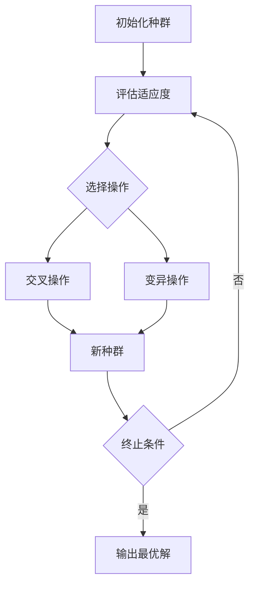

# 遗传算法(Genetic Algorithms) - 原理与代码实例讲解

## 1.背景介绍

### 1.1 什么是遗传算法?

遗传算法(Genetic Algorithms, GA)是一种启发式搜索和优化技术,源于生物进化理论。它模拟自然界生物进化过程中的遗传、变异、选择和交叉等机制,用于寻找可以解决特定问题的优化解。

遗传算法属于进化算法的一种,是计算机借鉴生物进化规律而形成的一类随机搜索算法。它通过模拟自然界生物进化的过程,对问题的可能解集合进行遗传操作,使群体的后代逐渐优于前代,最终获得最优解或近似最优解。

### 1.2 遗传算法发展历程

遗传算法的理论基础可以追溯到19世纪中期,当时查尔斯·达尔文提出了著名的"物竞天择、适者生存"的进化论。1859年,达尔文在其著作《物种起源》中阐述了生物进化的基本原理。

1960年,美国学者约翰·霍兰德在密歇根大学开始了对遗传算法的研究工作,并在1975年出版了开创性著作《适应性系统理论》,正式提出了遗传算法的概念和基本理论框架。

1980年代,随着计算机技术的快速发展,遗传算法开始在各个领域得到广泛应用,如组合优化、机器学习、控制系统、电路设计等。

### 1.3 遗传算法的特点

1. **全局优化能力强**:遗传算法通过对种群中个体进行选择、交叉和变异操作,可以有效避免陷入局部最优解,从而具有全局寻优的能力。

2. **无需确定性知识**:遗传算法不需要问题的确定性知识,只需要对目标函数进行评估,从而适用于各种复杂的优化问题。

3. **适应性强**:遗传算法具有很强的适应性,可以应用于各种不同的问题领域。

4. **并行性好**:遗传算法的种群结构使其很容易实现并行计算,从而提高计算效率。

5. **鲁棒性强**:遗传算法对初始种群的选择不太敏感,具有较强的鲁棒性。

## 2.核心概念与联系

遗传算法中有几个核心概念,它们之间存在着密切的联系。下面我们将详细介绍这些概念及其相互关系。

### 2.1 个体(Individual)

个体是遗传算法中的基本单位,表示问题的一个可能解。在遗传算法中,通常使用一个固定长度的字符串(如二进制串或实数向量)来编码个体。

### 2.2 种群(Population)

种群是由多个个体组成的集合。遗传算法通过对种群中的个体进行选择、交叉和变异操作,产生新一代的种群,从而逐步优化问题的解。

### 2.3 适应度函数(Fitness Function)

适应度函数用于评估个体的优劣程度。它根据问题的目标函数,为每个个体赋予一个适应度值,表示该个体解决问题的能力。适应度值越高,表示个体越优秀。

### 2.4 选择(Selection)

选择操作根据个体的适应度值,从当前种群中选择出一些优秀个体,用于产生下一代种群。常见的选择方法有轮盘赌选择、锦标赛选择、排名选择等。

### 2.5 交叉(Crossover)

交叉操作通过对选择出的优秀个体进行基因重组,产生新的个体。它模拟了生物进化中的基因交换过程,有助于保持种群的多样性,并产生更优秀的后代。

### 2.6 变异(Mutation)

变异操作通过对个体的基因进行微小的随机改变,产生新的个体。它模拟了生物进化中的基因突变过程,有助于维持种群的多样性,并探索新的解空间。

这些核心概念相互关联,共同构成了遗传算法的基本框架。下面我们将通过一个流程图来直观地展示它们之间的关系。



## 3.核心算法原理具体操作步骤

遗传算法的基本流程如下:

1. **初始化种群**:随机生成一个初始种群,每个个体表示问题的一个可能解。

2. **评估适应度**:根据适应度函数计算每个个体的适应度值,表示其解决问题的能力。

3. **选择操作**:根据个体的适应度值,从当前种群中选择出一些优秀个体,用于产生下一代种群。

4. **交叉操作**:对选择出的优秀个体进行基因重组,产生新的个体。

5. **变异操作**:对个体的基因进行微小的随机改变,产生新的个体。

6. **新种群替代**:用交叉和变异产生的新个体替代旧种群中的一部分个体,形成新一代种群。

7. **终止条件判断**:检查是否满足终止条件(如最大迭代次数或目标函数值),若满足则输出最优解并结束算法,否则返回步骤2,继续进行下一轮迭代。

下面是遗传算法的伪代码:

```
初始化种群P(t)
评估种群P(t)中每个个体的适应度
while (终止条件未满足) {
    t = t + 1
    从P(t-1)中选择优秀个体,形成新种群P'(t)
    对P'(t)中的个体进行交叉操作,产生新个体
    对P'(t)中的个体进行变异操作,产生新个体
    用新产生的个体替换P'(t)中的部分个体,形成新种群P(t)
    评估P(t)中每个个体的适应度
}
输出最优解
```

## 4.数学模型和公式详细讲解举例说明

### 4.1 编码方式

在遗传算法中,我们需要将问题的可能解编码为适合遗传操作的形式,通常使用二进制串或实数向量。编码方式的选择会影响算法的性能和收敛速度。

对于二进制编码,每个个体由固定长度的二进制串表示,例如:

$$
x = (x_1, x_2, \ldots, x_l)
$$

其中 $x_i \in \{0, 1\}$,  $l$ 为编码长度。

对于实数编码,每个个体由一个实数向量表示,例如:

$$
x = (x_1, x_2, \ldots, x_n)
$$

其中 $x_i \in \mathbb{R}$,  $n$ 为向量维数。

### 4.2 适应度函数

适应度函数用于评估个体的优劣程度,通常根据问题的目标函数来定义。对于最小化问题,适应度函数可以定义为:

$$
f(x) = \frac{1}{1 + F(x)}
$$

其中 $F(x)$ 为目标函数。对于最大化问题,适应度函数可以直接使用目标函数:

$$
f(x) = F(x)
$$

### 4.3 选择操作

常见的选择操作有以下几种:

1. **轮盘赌选择(Roulette Wheel Selection)**

每个个体被选择的概率与其适应度值成正比。设个体 $x_i$ 的适应度为 $f(x_i)$,则被选择的概率为:

$$
p(x_i) = \frac{f(x_i)}{\sum_{j=1}^{N} f(x_j)}
$$

其中 $N$ 为种群大小。

2. **锦标赛选择(Tournament Selection)**

随机选择一些个体进行比赛,适应度值最高的个体被选中。

3. **排名选择(Ranking Selection)**

根据个体的适应度值排名,排名越高的个体被选择的概率越大。

### 4.4 交叉操作

交叉操作通过对选择出的优秀个体进行基因重组,产生新的个体。常见的交叉操作有:

1. **单点交叉**

选择一个随机位置作为交叉点,交换两个父代个体的部分基因,产生两个子代个体。

例如,对于两个二进制编码的父代个体:

$$
P_1 = (1, 0, 1, \mathbf{1}, 0, 1, 1, 0) \\
P_2 = (0, 1, 0, \mathbf{0}, 1, 0, 0, 1)
$$

在第4位进行单点交叉,产生两个子代个体:

$$
C_1 = (1, 0, 1, \mathbf{0}, 1, 0, 0, 1) \\
C_2 = (0, 1, 0, \mathbf{1}, 0, 1, 1, 0)
$$

2. **多点交叉**

选择多个随机位置作为交叉点,交换两个父代个体的部分基因,产生两个子代个体。

3. **均匀交叉**

对于每一个基因位,随机选择父代个体的基因,产生子代个体。

### 4.5 变异操作

变异操作通过对个体的基因进行微小的随机改变,产生新的个体。常见的变异操作有:

1. **基本位变异**

对于二进制编码,随机选择一些基因位,将0变为1或将1变为0。

2. **均匀变异**

对于实数编码,在一个小范围内随机改变基因值。

3. **高斯变异**

对于实数编码,根据高斯分布在一个小范围内随机改变基因值。

变异操作的目的是维持种群的多样性,避免过早收敛到局部最优解。变异概率通常设置为一个较小的值,以防止过度变异导致算法失去收敛性。

## 5.项目实践:代码实例和详细解释说明

下面我们将通过一个具体的代码实例,来演示如何使用Python实现一个简单的遗传算法,求解一元函数的最大值问题。

### 5.1 问题描述

给定一个一元函数 $f(x) = x \sin(10 \pi x) + 2.0$,  $x \in [-1, 2]$,求函数在该区间内的最大值。

### 5.2 编码方式

我们使用实数编码,每个个体由一个实数表示,对应函数的自变量 $x$。

### 5.3 适应度函数

由于我们要求函数的最大值,因此适应度函数直接使用目标函数:

$$
f(x) = x \sin(10 \pi x) + 2.0
$$

### 5.4 选择、交叉和变异操作

- 选择操作:使用锦标赛选择
- 交叉操作:使用算术交叉
- 变异操作:使用高斯变异

### 5.5 Python代码实现

```python
import numpy as np

# 目标函数
def fitness_func(x):
    return x * np.sin(10 * np.pi * x) + 2.0

# 初始化种群
def init_population(pop_size, bound):
    population = np.random.uniform(bound[0], bound[1], pop_size)
    return population

# 锦标赛选择
def tournament_selection(population, fitness, k=3):
    selection_indices = np.random.randint(len(population), size=k)
    selections = [population[i] for i in selection_indices]
    selection_fitness = [fitness[i] for i in selection_indices]
    best_idx = np.argmax(selection_fitness)
    return selections[best_idx]

# 算术交叉
def arithmetic_crossover(parent1, parent2):
    alpha = np.random.uniform()
    child1 = alpha * parent1 + (1 - alpha) * parent2
    child2 = (1 - alpha) * parent1 + alpha * parent2
    return [child1, child2]

# 高斯变异
def gaussian_mutation(individual, mu, sigma):
    return individual + np.random.normal(mu, sigma)

# 遗传算法主函数
def genetic_algorithm(pop_size, bound, max_generations, mutation_rate, mutation_sigma):
    population = init_population(pop_size, bound)
    fitness = [fitness_func(individual) for individual in population]

    for generation in range(max_generations):
        new_population = []

        # 选择操作
        for _ in range(pop_size):
            parent1 = tournament_selection(population, fitness)
            parent2 = tournament_selection(population, fitness)

            # 交叉操作
            children = arithmetic_crossover(parent1, parent2