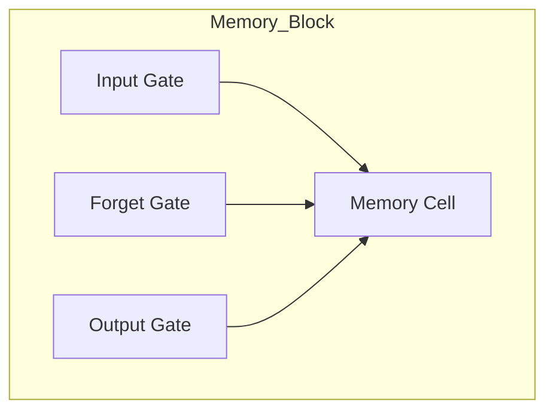

以下是关于"长短时记忆网络 (LSTM) 原理与代码实例讲解"的技术博客文章正文内容：

# 长短时记忆网络 (LSTM) 原理与代码实例讲解

## 1. 背景介绍

### 1.1 序列数据处理的挑战

在自然语言处理、语音识别、时间序列预测等领域中,我们经常会遇到需要处理序列数据的情况。序列数据是指一系列按时间顺序排列的数据,例如一句话中的单词序列、一段音频中的音频帧序列等。

传统的神经网络模型如前馈神经网络在处理序列数据时存在一些固有的缺陷:

1. 输入输出维度固定,难以处理变长序列
2. 无法很好地捕捉序列数据中的长期依赖关系

为了更好地解决序列数理解问题,循环神经网络(Recurrent Neural Networks, RNNs)应运而生。

### 1.2 循环神经网络的局限性

循环神经网络通过在神经网络中引入循环连接,使得网络具有"记忆"能力,能够更好地捕捉序列数据中的长期依赖关系。然而,在实践中,由于梯度消失和梯度爆炸的问题,循环神经网络在捕捉长期依赖关系时仍然存在一些局限性。

为了克服这一问题,研究人员提出了长短时记忆网络(Long Short-Term Memory, LSTM),作为循环神经网络的一种改进变体。

## 2. 核心概念与联系

### 2.1 LSTM 网络结构

LSTM 网络由一系列的记忆块(Memory Blocks)组成,每个记忆块包含一个记忆细胞(Memory Cell)和三个控制门(Gates):输入门(Input Gate)、遗忘门(Forget Gate)和输出门(Output Gate)。



### 2.2 记忆细胞和控制门

- 记忆细胞(Memory Cell): 用于存储长期状态信息,可以看作是网络的"长期记忆"。
- 输入门(Input Gate): 控制当前时间步的输入信息对记忆细胞的影响程度。
- 遗忘门(Forget Gate): 控制从上一时间步传递过来的记忆细胞状态被遗忘的程度。
- 输出门(Output Gate): 控制当前时间步的记忆细胞状态对隐藏状态的输出影响程度。

### 2.3 LSTM 与其他模型的关系

LSTM 可以看作是一种特殊的递归神经网络(RNN),与简单的 RNN 相比,LSTM 通过引入记忆细胞和控制门的结构,更好地解决了梯度消失和梯度爆炸的问题,能够更有效地捕捉长期依赖关系。

除了 LSTM,还有其他一些改进的 RNN 变体,如门控循环单元(Gated Recurrent Unit, GRU)等。这些变体在结构上与 LSTM 有一些差异,但都旨在解决 RNN 在处理长期依赖关系时存在的问题。

## 3. 核心算法原理具体操作步骤

### 3.1 LSTM 前向传播过程

LSTM 网络在处理序列数据时,会按时间步逐个处理每个输入,并更新记忆细胞和隐藏状态。具体的前向传播过程如下:

1. 遗忘门计算:
   $$f_t = \sigma(W_f \cdot [h_{t-1}, x_t] + b_f)$$
   其中 $f_t$ 表示遗忘门的激活值向量, $\sigma$ 是 Sigmoid 激活函数, $W_f$ 和 $b_f$ 分别是遗忘门的权重矩阵和偏置向量, $h_{t-1}$ 是上一时间步的隐藏状态, $x_t$ 是当前时间步的输入。

2. 输入门计算:
   $$i_t = \sigma(W_i \cdot [h_{t-1}, x_t] + b_i)$$
   $$\tilde{C}_t = \tanh(W_C \cdot [h_{t-1}, x_t] + b_C)$$
   其中 $i_t$ 表示输入门的激活值向量, $\tilde{C}_t$ 表示当前时间步的候选记忆细胞状态向量, $W_i$、$W_C$ 和 $b_i$、$b_C$ 分别是输入门和候选记忆细胞的权重矩阵和偏置向量。

3. 记忆细胞状态更新:
   $$C_t = f_t \odot C_{t-1} + i_t \odot \tilde{C}_t$$
   其中 $C_t$ 表示当前时间步的记忆细胞状态向量, $\odot$ 表示元素wise乘积操作。新的记忆细胞状态是上一时间步的记忆细胞状态 $C_{t-1}$ 通过遗忘门 $f_t$ 控制保留的部分,与当前时间步通过输入门 $i_t$ 控制的候选记忆细胞状态 $\tilde{C}_t$ 的组合。

4. 输出门计算:
   $$o_t = \sigma(W_o \cdot [h_{t-1}, x_t] + b_o)$$
   $$h_t = o_t \odot \tanh(C_t)$$
   其中 $o_t$ 表示输出门的激活值向量, $h_t$ 表示当前时间步的隐藏状态向量, $W_o$ 和 $b_o$ 分别是输出门的权重矩阵和偏置向量。隐藏状态 $h_t$ 是当前记忆细胞状态 $C_t$ 通过 $\tanh$ 激活函数处理后,再与输出门 $o_t$ 进行元素wise乘积得到的。

以上步骤按时间步依次进行,直到处理完整个序列。

### 3.2 LSTM 反向传播过程

LSTM 的反向传播过程与标准的反向传播算法类似,只是需要额外计算记忆细胞状态和各个门的梯度。具体步骤如下:

1. 计算输出层的损失函数相对于隐藏状态 $h_t$ 的梯度。
2. 根据链式法则,计算损失函数相对于记忆细胞状态 $C_t$、输出门 $o_t$、输入门 $i_t$、遗忘门 $f_t$ 和候选记忆细胞状态 $\tilde{C}_t$ 的梯度。
3. 将这些梯度值用于更新相应的权重和偏置。

需要注意的是,由于 LSTM 网络中存在循环连接,因此在反向传播时需要通过时间反向传播梯度,以捕捉序列数据中的长期依赖关系。

## 4. 数学模型和公式详细讲解举例说明

### 4.1 LSTM 数学模型

LSTM 网络的数学模型可以用以下公式表示:

$$\begin{aligned}
f_t &= \sigma(W_f \cdot [h_{t-1}, x_t] + b_f) \\
i_t &= \sigma(W_i \cdot [h_{t-1}, x_t] + b_i) \\
\tilde{C}_t &= \tanh(W_C \cdot [h_{t-1}, x_t] + b_C) \\
C_t &= f_t \odot C_{t-1} + i_t \odot \tilde{C}_t \\
o_t &= \sigma(W_o \cdot [h_{t-1}, x_t] + b_o) \\
h_t &= o_t \odot \tanh(C_t)
\end{aligned}$$

其中:

- $f_t$: 遗忘门的激活值向量
- $i_t$: 输入门的激活值向量
- $\tilde{C}_t$: 当前时间步的候选记忆细胞状态向量
- $C_t$: 当前时间步的记忆细胞状态向量
- $o_t$: 输出门的激活值向量
- $h_t$: 当前时间步的隐藏状态向量
- $W_f$、$W_i$、$W_C$、$W_o$: 分别为遗忘门、输入门、候选记忆细胞状态和输出门的权重矩阵
- $b_f$、$b_i$、$b_C$、$b_o$: 分别为遗忘门、输入门、候选记忆细胞状态和输出门的偏置向量
- $\sigma$: Sigmoid 激活函数
- $\odot$: 元素wise乘积操作

### 4.2 LSTM 门控机制举例说明

为了更好地理解 LSTM 的门控机制,我们可以通过一个简单的例子来说明。假设我们要处理一个包含 5 个单词的句子:"The cat sat on the mat"。

1. 遗忘门:
   遗忘门决定了上一时间步的记忆细胞状态中,有多少信息需要被遗忘或保留。对于这个例子,当处理到第三个单词"sat"时,遗忘门可能会选择遗忘之前关于动物的信息(如"cat"),而保留关于位置的信息(如"the")。

2. 输入门和候选记忆细胞状态:
   输入门决定了当前时间步的输入信息对记忆细胞状态的影响程度,而候选记忆细胞状态则是根据当前输入和上一隐藏状态计算得到的新的记忆细胞状态候选值。对于这个例子,当处理到"sat"时,输入门可能会决定将动作"sat"的信息存储到记忆细胞中。

3. 记忆细胞状态更新:
   新的记忆细胞状态是上一时间步的记忆细胞状态通过遗忘门控制保留的部分,与当前时间步通过输入门控制的候选记忆细胞状态的组合。在处理到"sat"时,记忆细胞状态可能会保留之前关于位置的信息,并添加新的动作信息。

4. 输出门和隐藏状态:
   输出门决定了当前时间步的记忆细胞状态对隐藏状态的输出影响程度。对于这个例子,当处理到"sat"时,输出门可能会决定输出与动作相关的隐藏状态信息。

通过上述门控机制的协同工作,LSTM 网络能够有选择地保留、更新和输出记忆细胞中的信息,从而更好地捕捉序列数据中的长期依赖关系。

## 5. 项目实践:代码实例和详细解释说明

为了更好地理解 LSTM 的工作原理,我们可以通过一个实际的代码示例来演示。在这个示例中,我们将使用 PyTorch 库构建一个基本的 LSTM 模型,并在一个简单的序列数据集上进行训练和测试。

### 5.1 准备数据集

我们将使用一个简单的序列数据集,其中每个序列由一系列随机生成的数字组成。我们的目标是训练一个 LSTM 模型,能够根据前几个数字预测序列的下一个数字。

```python
import torch
import random

# 生成训练数据
def generate_data(num_sequences=1000):
    input_sequences = []
    output_sequences = []
    
    for _ in range(num_sequences):
        sequence = [random.randint(0, 9) for _ in range(10)]
        input_sequences.append(sequence[:-1])
        output_sequences.append(sequence[1:])
    
    input_sequences = torch.tensor(input_sequences, dtype=torch.float32)
    output_sequences = torch.tensor(output_sequences, dtype=torch.float32)
    
    return input_sequences, output_sequences

# 生成训练和测试数据
train_input, train_output = generate_data(800)
test_input, test_output = generate_data(200)
```

### 5.2 构建 LSTM 模型

接下来,我们将使用 PyTorch 构建一个简单的 LSTM 模型。

```python
import torch.nn as nn

class LSTMModel(nn.Module):
    def __init__(self, input_size, hidden_size, output_size):
        super(LSTMModel, self).__init__()
        self.hidden_size = hidden_size
        self.lstm = nn.LSTM(input_size, hidden_size, batch_first=True)
        self.fc = nn.Linear(hidden_size, output_size)
    
    def forward(self, x):
        batch_size = x.size(0)
        h_0 = torch.zeros(1, batch_size, self.hidden_size)
        c_0 = torch.zeros(1, batch_size, self.hidden_size)
        
        output, _ = self.lstm(x, (h_0, c_0))
        output = self.fc(output