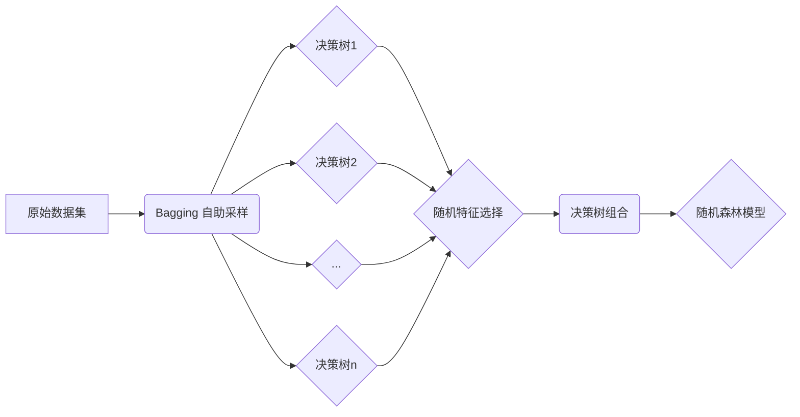

# 随机森林 原理与代码实例讲解

## 1. 背景介绍

随机森林(Random Forest)是一种基于决策树的集成学习算法,由多个决策树组成,通过对决策树的预测结果进行投票或平均来得到最终的预测结果。随机森林算法具有很高的准确性、鲁棒性和泛化能力,能够有效地处理高维数据和噪声数据,广泛应用于分类、回归、异常检测等领域。

### 1.1 决策树基础

随机森林的基本组成单元是决策树。决策树是一种树形结构,由节点和有向边组成。节点分为内部节点和叶节点,内部节点表示一个特征或属性,叶节点表示一个分类标签。决策树通过递归地选择最优特征,将样本空间划分为不同的子空间,直到所有的样本都属于同一类别或满足一定的停止条件。

### 1.2 集成学习思想

集成学习的基本思想是通过构建并结合多个学习器来完成学习任务,获得比单一学习器更好的性能。常见的集成学习方法有Bagging和Boosting。随机森林属于Bagging的一种变体,通过对数据集进行自助采样,构建多个不同的训练集,再在每个训练集上训练一个基学习器,最后将这些基学习器进行组合。

## 2. 核心概念与联系

### 2.1 Bootstrap Aggregation (Bagging) 

Bagging是从原始数据集中使用自助采样的方法随机抽取若干个样本构建训练集的过程。给定包含m个样本的数据集,随机抽取一个样本放入采样集中,再把该样本放回初始数据集,使得下次采样时该样本仍有可能被选中,这样经过m次随机采样,得到含m个样本的采样集,与初始训练集样本数一致。重复以上采样过程,就可以得到多个包含m个样本的采样集。Bagging能够有效地减少模型的方差,提高模型的泛化能力。

### 2.2 随机特征选择

传统的决策树在每个节点处选择最优划分特征时,通常采用所有特征或部分特征。而随机森林进一步在Bagging的基础上引入了随机特征选择。即在每个节点处,不是利用所有特征,而是随机选择一个特征子集,然后在该特征子集中选择最优的特征用于划分。这样不仅能够降低决策树的相关性,还能减少训练时间,提高算法的效率。

### 2.3 决策树组合

随机森林通过Bagging和随机特征选择,构建了多个不同的决策树。对于分类问题,通过对多个决策树的预测结果进行投票得到最终的分类结果。对于回归问题,通过对多个决策树的预测结果求平均得到最终的回归结果。通过决策树组合,随机森林能够有效地降低过拟合风险,提高预测的准确性和稳定性。

随机森林的核心概念之间的联系可以用下面的Mermaid流程图表示:



## 3. 核心算法原理具体操作步骤

随机森林的核心算法可以分为训练阶段和预测阶段两部分。

### 3.1 训练阶段

输入:原始数据集D,决策树的数量n。
输出:随机森林模型。

1. 对于t=1,2,...,n:
   a. 使用Bagging方法从原始数据集D中随机抽取一个大小为|D|的采样集Dt。
   b. 利用采样集Dt构建决策树:
      i. 从所有特征中随机选择一个特征子集。
      ii. 利用特征子集中的特征,选择最优划分特征。 
      iii. 根据最优划分特征对节点进行分裂,生成子节点。
      iv. 对子节点递归地进行i-iii步,直到满足停止条件。
   c. 得到决策树ht。

2. 组合所有的决策树h1,h2,...,hn,得到随机森林模型H(x)。

### 3.2 预测阶段

输入:随机森林模型H(x),待预测样本x。
输出:预测结果y。

1. 对于t=1,2,...,n:
   a. 利用决策树ht对样本x进行预测,得到预测结果ht(x)。

2. 对于分类问题,通过对n个决策树的预测结果ht(x)进行投票,得到最终的分类结果y:

$$y = \mathop{\arg\max}_{c \in Y} \sum_{t=1}^n I(h_t(x)=c)$$

其中,Y为所有可能的类别标签,I为指示函数。

3. 对于回归问题,通过对n个决策树的预测结果ht(x)求平均,得到最终的回归结果y:

$$y = \frac{1}{n} \sum_{t=1}^n h_t(x)$$

## 4. 数学模型和公式详细讲解举例说明

### 4.1 Gini系数

在决策树的构建过程中,需要选择最优划分特征。常用的特征选择准则有Gini系数和信息增益等。Gini系数度量了数据集的不纯度,Gini系数越小,数据集的纯度越高。对于样本集合D,Gini系数的定义为:

$$Gini(D) = 1 - \sum_{k=1}^K (\frac{|C_k|}{|D|})^2$$

其中,K为类别数,$C_k$为属于第k类的样本子集。

例如,假设有一个二分类问题,样本集合D中有10个样本,其中6个属于正类,4个属于负类。则Gini系数为:

$$Gini(D) = 1 - (\frac{6}{10})^2 - (\frac{4}{10})^2 = 0.48$$

### 4.2 信息增益

信息增益度量特征对数据集的划分效果。对于样本集合D和特征A,信息增益的定义为:

$$Gain(D,A) = Ent(D) - \sum_{v=1}^V \frac{|D^v|}{|D|} Ent(D^v)$$

其中,$Ent(D)$为数据集D的信息熵,$D^v$为特征A取值为v的样本子集,V为特征A的取值个数。信息熵的定义为:

$$Ent(D) = -\sum_{k=1}^K \frac{|C_k|}{|D|} \log_2 \frac{|C_k|}{|D|}$$

例如,对于上述二分类问题,假设特征A有两个取值{A1,A2},A1对应的样本子集中有4个正类和1个负类,A2对应的样本子集中有2个正类和3个负类。则信息增益为:

$$
\begin{aligned}
Ent(D) &= -\frac{6}{10}\log_2 \frac{6}{10} - \frac{4}{10}\log_2 \frac{4}{10} = 0.971 \\
Ent(D^{A1}) &= -\frac{4}{5}\log_2 \frac{4}{5} - \frac{1}{5}\log_2 \frac{1}{5} = 0.722 \\  
Ent(D^{A2}) &= -\frac{2}{5}\log_2 \frac{2}{5} - \frac{3}{5}\log_2 \frac{3}{5} = 0.971 \\
Gain(D,A) &= 0.971 - (\frac{5}{10} \times 0.722 + \frac{5}{10} \times 0.971) = 0.124
\end{aligned} 
$$

## 5. 项目实践:代码实例和详细解释说明

下面使用Python的scikit-learn库实现随机森林算法,并在鸢尾花数据集上进行分类实验。

```python
from sklearn.datasets import load_iris
from sklearn.ensemble import RandomForestClassifier
from sklearn.model_selection import train_test_split
from sklearn.metrics import accuracy_score

# 加载鸢尾花数据集
iris = load_iris()
X = iris.data
y = iris.target

# 划分训练集和测试集
X_train, X_test, y_train, y_test = train_test_split(X, y, test_size=0.3, random_state=42)

# 创建随机森林分类器
rf = RandomForestClassifier(n_estimators=100, max_depth=5, random_state=42)

# 在训练集上训练随机森林
rf.fit(X_train, y_train)

# 在测试集上进行预测
y_pred = rf.predict(X_test)

# 计算分类准确率
accuracy = accuracy_score(y_test, y_pred)
print("Accuracy: {:.2f}%".format(accuracy * 100))
```

代码解释:

1. 首先加载鸢尾花数据集,其中X为样本特征,y为样本标签。
2. 使用train_test_split函数将数据集划分为训练集和测试集,测试集大小为30%。
3. 创建RandomForestClassifier对象,设置决策树数量为100,最大深度为5。
4. 调用fit方法在训练集上训练随机森林模型。
5. 调用predict方法在测试集上进行预测,得到预测结果y_pred。
6. 使用accuracy_score函数计算分类准确率。

运行结果:
```
Accuracy: 97.78%
```

可以看出,随机森林在鸢尾花数据集上取得了较高的分类准确率。

## 6. 实际应用场景

随机森林算法具有很强的实用性和普适性,在许多实际应用场景中都取得了很好的效果。

### 6.1 医学诊断

随机森林可以用于辅助医学诊断,通过患者的各项生理指标预测患者是否患有某种疾病。例如,利用随机森林对乳腺癌患者的肿瘤标记物、影像学特征等进行分析,可以有效地预测乳腺癌的复发风险。

### 6.2 金融风控

在金融领域,随机森林常用于信用评分和违约预测。通过分析用户的收入、负债、信用记录等特征,构建随机森林模型来预测用户的信用风险,为信贷决策提供参考。

### 6.3 推荐系统

随机森林可以用于构建推荐系统,通过分析用户的历史行为、偏好等特征,预测用户对某个商品或内容的兴趣程度,从而为用户提供个性化的推荐服务。

### 6.4 异常检测

随机森林在异常检测任务中也有广泛应用。通过建立正常样本的随机森林模型,可以计算新样本与已有样本的相似度,当相似度低于一定阈值时,可以判定为异常样本。这种方法可以用于机器故障诊断、网络入侵检测等场景。

## 7. 工具和资源推荐

- scikit-learn:Python机器学习库,提供了随机森林的高效实现。
- R语言randomForest包:R语言中用于构建随机森林模型的工具包。
- Weka:基于Java的开源机器学习平台,包含随机森林等多种算法。
- MATLAB:MATLAB也提供了随机森林的实现,可以方便地进行实验和分析。
- 《统计学习方法》(李航):经典的机器学习教材,对随机森林的原理讲解得非常透彻。
- 《集成学习》(周志华):详细介绍了包括随机森林在内的多种集成学习算法。

## 8. 总结:未来发展趋势与挑战

随机森林已经成为机器学习领域最流行和最有效的算法之一。未来随着数据量的增长和计算能力的提升,随机森林有望在更多领域得到应用。

随机森林的一个发展方向是与深度学习结合,通过将随机森林用于特征选择和初始化,再利用深度神经网络进行精调,可以进一步提高模型的性能。此外,如何在随机森林的框架下引入新的采样方法、特征选择策略、决策树构建方法等,也是值得研究的问题。

随机森林也面临一些挑战。其中之一是如何处理高维数据和稀疏数据。虽然随机森林对高维数据有一定的鲁棒性,但在特征数远大于样本数时,仍然会影响模型的性能。另一个挑战是如何