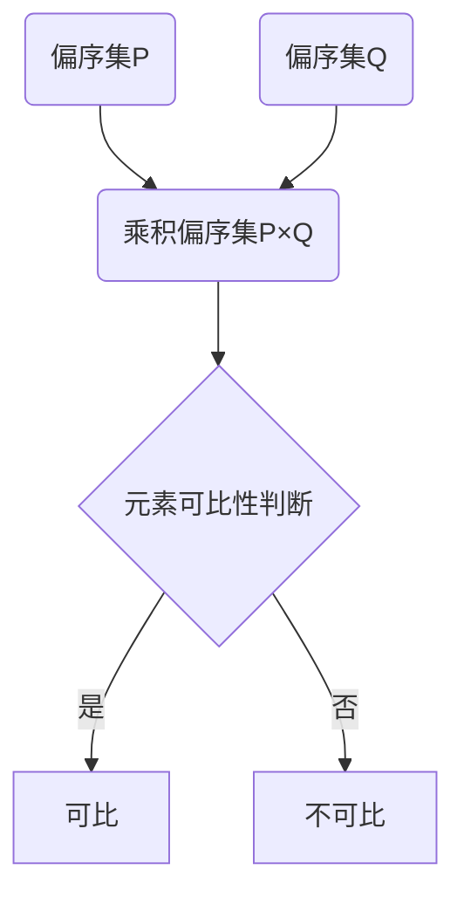

# 集合论导引：乘积偏序集

## 1. 背景介绍
### 1.1 集合论的起源与发展
集合论是现代数学的基础,其思想可以追溯到古希腊时期。然而,直到19世纪末,德国数学家康托尔(Georg Cantor)才系统地建立了集合论。康托尔引入了集合的概念,并研究了无限集合的性质,开创了数学的新纪元。

### 1.2 偏序集的重要性
在集合论中,偏序集是一类重要的结构。偏序关系在许多数学分支中都有广泛应用,如序理论、格论、拓扑学等。特别地,计算机科学中的很多概念,如语义域、类型系统等,都与偏序集密切相关。因此,深入理解偏序集的性质,对于学习和应用数学、计算机科学等学科具有重要意义。

### 1.3 乘积偏序集的应用
乘积偏序集作为偏序集的一种,在诸多领域有着广泛的应用。例如在函数式编程语言的类型系统设计中,常常使用乘积类型(Product Type)来表示多个类型的组合。此外,在形式化验证、并发理论、领域理论等方面,乘积偏序集也发挥着关键作用。

## 2. 核心概念与联系
### 2.1 集合的基本概念
- 集合:由一些确定的、不同的对象组成的整体。
- 元素:组成集合的对象。
- 子集:A是B的子集(A⊆B),若A的每个元素都是B的元素。
- 幂集:集合X的所有子集组成的集合,记为P(X)或2^X。

### 2.2 二元关系与偏序关系
- 二元关系:笛卡尔积A×B的子集R称为从A到B的二元关系。
- 自反性:∀a∈A,aRa。
- 反对称性:∀a,b∈A,若aRb且bRa,则a=b。  
- 传递性:∀a,b,c∈A,若aRb且bRc,则aRc。
- 偏序关系:满足自反性、反对称性和传递性的二元关系。

### 2.3 偏序集的定义与性质
- 偏序集:设(P,≤)是一个二元组,其中P是非空集合,≤是P上的偏序关系,则称(P,≤)为偏序集。
- 可比元素:设(P,≤)是偏序集,a,b∈P,若a≤b或b≤a,则称a与b可比。
- 极大元、极小元:设(P,≤)是偏序集,m∈P,若∀x∈P,x≤m均有x=m,则称m为极大元;若∀x∈P,m≤x均有x=m,则称m为极小元。

### 2.4 乘积偏序集的构造
设(P,≤P)和(Q,≤Q)是两个偏序集,在笛卡尔积P×Q上定义关系≤:
$$(p_1,q_1) ≤ (p_2,q_2) \Leftrightarrow p_1 ≤_P p_2 \wedge q_1 ≤_Q q_2$$
则≤是P×Q上的偏序关系,称(P×Q,≤)为乘积偏序集。

## 3. 核心算法原理具体操作步骤
### 3.1 构造乘积偏序集的算法
输入:偏序集(P,≤P)和(Q,≤Q)
输出:乘积偏序集(P×Q,≤)

1. 构造笛卡尔积P×Q。
2. 对任意(p1,q1),(p2,q2)∈P×Q,若p1≤Pp2且q1≤Qq2,则令(p1,q1)≤(p2,q2)。
3. 输出(P×Q,≤)。

### 3.2 判断乘积偏序集元素可比性的算法
输入:乘积偏序集(P×Q,≤),元素(p1,q1),(p2,q2)∈P×Q
输出:若(p1,q1)与(p2,q2)可比,则输出true;否则输出false

1. 若p1≤Pp2且q1≤Qq2,或p2≤Pp1且q2≤Qq1,则输出true。
2. 否则,输出false。

## 4. 数学模型和公式详细讲解举例说明
### 4.1 乘积偏序集的数学模型
设(P,≤P)和(Q,≤Q)是两个偏序集,它们的乘积偏序集(P×Q,≤)定义为:
$$P \times Q = \{(p,q) | p \in P \wedge q \in Q\}$$
其中,偏序关系≤定义为:
$$(p_1,q_1) ≤ (p_2,q_2) \Leftrightarrow p_1 ≤_P p_2 \wedge q_1 ≤_Q q_2$$

### 4.2 乘积偏序集的示例
考虑两个偏序集(P,≤P)和(Q,≤Q),其中:
$$P=\{a,b\},\quad a ≤_P b$$
$$Q=\{1,2\},\quad 1 ≤_Q 2$$
则它们的乘积偏序集(P×Q,≤)为:
$$P \times Q = \{(a,1),(a,2),(b,1),(b,2)\}$$
其中,偏序关系≤满足:
$$(a,1) ≤ (a,2),\quad (a,1) ≤ (b,1),\quad (a,1) ≤ (b,2)$$
$$(a,2) ≤ (b,2),\quad (b,1) ≤ (b,2)$$

## 5. 项目实践：代码实例和详细解释说明
下面给出了使用Python实现乘积偏序集的示例代码:

```python
class PartialOrder:
    def __init__(self, elements, relation):
        self.elements = elements
        self.relation = relation

    def __le__(self, other):
        return self.relation(self, other)

def product_order(P, Q):
    elements = [(p, q) for p in P.elements for q in Q.elements]
    def relation(a, b):
        return a[0] <= P.relation and a[1] <= Q.relation
    return PartialOrder(elements, relation)

# 示例用法
P = PartialOrder(['a', 'b'], lambda x, y: x <= y)
Q = PartialOrder([1, 2], lambda x, y: x <= y)
PQ = product_order(P, Q)

print(PQ.elements)  # 输出: [('a', 1), ('a', 2), ('b', 1), ('b', 2)]
print(('a', 1) <= PQ.relation)  # 输出: True
print(('b', 1) <= PQ.relation)  # 输出: False
```

在这个示例中:
- `PartialOrder`类表示一个偏序集,包含元素集合`elements`和偏序关系`relation`。
- `product_order`函数接受两个偏序集`P`和`Q`,返回它们的乘积偏序集。
- 乘积偏序集的元素是`P.elements`和`Q.elements`的笛卡尔积。
- 乘积偏序集的关系满足:(p1,q1)≤(p2,q2)当且仅当p1≤Pp2且q1≤Qq2。

## 6. 实际应用场景
### 6.1 函数式编程中的类型系统
在函数式编程语言(如Haskell、ML等)的类型系统中,乘积类型(Product Type)用于表示多个类型的组合。例如,类型`(Int, Bool)`表示一个整数和一个布尔值的组合。这些类型之间的子类型关系构成了一个乘积偏序集。

### 6.2 并发理论中的事件结构
在并发理论中,事件结构(Event Structure)是一种用于描述并发系统行为的数学模型。事件结构通常由事件集合和事件之间的偏序关系组成。多个事件结构的组合可以用乘积偏序集来表示,从而刻画更复杂的并发系统。

### 6.3 形式化验证中的谓词抽象
在形式化验证领域,谓词抽象(Predicate Abstraction)是一种常用的技术,用于将具体状态空间抽象为有限的谓词空间。多个谓词之间的蕴含关系构成了一个偏序集。对多个谓词进行组合抽象时,可以使用乘积偏序集来刻画它们之间的关系。

## 7. 工具和资源推荐
- Haskell编程语言:一种纯函数式编程语言,支持代数数据类型和类型类等特性,适合学习和实践偏序集相关概念。
- Coq证明助手:一个交互式定理证明器,基于依赖类型理论,可用于形式化验证偏序集的性质。
- Isabelle/HOL定理证明器:另一个广泛使用的交互式定理证明器,支持高阶逻辑,可用于偏序集的形式化推理。
- "Lattice Theory with Applications"(Vijay K. Garg):一本全面介绍格论及其应用的书籍,涵盖了偏序集的相关内容。
- "Introduction to Lattices and Order"(B.A. Davey, H.A. Priestley):另一本经典的格论和偏序理论教材,适合作为入门参考。

## 8. 总结：未来发展趋势与挑战
乘积偏序集作为偏序理论的重要内容,在诸多数学分支和计算机科学领域都有广泛应用。未来,随着形式化验证、并发理论、类型系统等研究的不断深入,乘积偏序集的相关理论和应用有望得到进一步发展。

然而,乘积偏序集的研究也面临一些挑战:
- 高维乘积偏序集的组合爆炸问题:当偏序集的数量增多时,它们的乘积偏序集将变得非常庞大,给理论分析和实际计算带来困难。
- 乘积偏序集的推理自动化:如何设计有效的算法,自动推理乘积偏序集的性质,仍是一个有待探索的问题。
- 乘积偏序集在新领域的应用拓展:将乘积偏序集的理论运用到新的研究领域,如量子计算、机器学习等,可能会带来新的挑战和机遇。

## 9. 附录：常见问题与解答
### Q1: 偏序集与全序集有何区别?
A1: 偏序集只要求任意两个元素之间可比或不可比,而全序集要求任意两个元素之间都必须可比。因此,全序集是偏序集的特例。

### Q2: 乘积偏序集的元素个数如何计算?
A2: 设偏序集(P,≤P)和(Q,≤Q)的元素个数分别为n和m,则它们的乘积偏序集(P×Q,≤)的元素个数为n×m。

### Q3: 乘积偏序集的最大元和最小元如何求解?
A3: 设(P,≤P)和(Q,≤Q)的最大元分别为pmax和qmax,最小元分别为pmin和qmin,则乘积偏序集(P×Q,≤)的最大元为(pmax,qmax),最小元为(pmin,qmin)。

### Q4: 乘积偏序集的应用领域还有哪些?
A4: 除了文中提到的函数式编程、并发理论、形式化验证等领域外,乘积偏序集在其他方面也有应用,如偏序集拓扑、多目标优化、概念格等。

以上就是关于"集合论导引：乘积偏序集"的全部内容。通过系统学习乘积偏序集的基本概念、性质、应用等,可以加深我们对偏序理论的理解,并为进一步探索其在计算机科学等领域的应用打下基础。

作者：禅与计算机程序设计艺术 / Zen and the Art of Computer Programming

