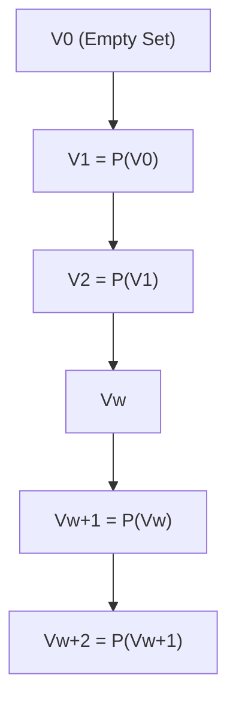

# 集合论导引：大基数下集合Vw+2的内涵

## 1.背景介绍
### 1.1 集合论的发展历程
#### 1.1.1 康托尔的贡献
#### 1.1.2 哥德尔的不完备性定理
#### 1.1.3 现代集合论的形成
### 1.2 大基数的概念
#### 1.2.1 基数的定义
#### 1.2.2 可数基数与不可数基数
#### 1.2.3 大基数的引入
### 1.3 集合Vw+2的意义
#### 1.3.1 构造序数的von Neumann宇宙
#### 1.3.2 Vw+2在von Neumann宇宙中的位置
#### 1.3.3 研究Vw+2的动机

## 2.核心概念与联系
### 2.1 序数的概念
#### 2.1.1 良序集与序数
#### 2.1.2 序数的运算
#### 2.1.3 序数的正则性
### 2.2 von Neumann宇宙
#### 2.2.1 von Neumann宇宙的定义
#### 2.2.2 von Neumann宇宙的层次结构
#### 2.2.3 von Neumann宇宙与ZFC公理系统
### 2.3 Vw+2与其他集合的关系
#### 2.3.1 Vw+2与Vw+1的关系
#### 2.3.2 Vw+2与Lw+2的关系
#### 2.3.3 Vw+2与HOD的关系

## 3.核心算法原理具体操作步骤
### 3.1 构造von Neumann宇宙
#### 3.1.1 空集作为起点
#### 3.1.2 幂集运算的迭代
#### 3.1.3 极限序数处的并集运算
### 3.2 定位Vw+2
#### 3.2.1 w的定义
#### 3.2.2 w+2的计算
#### 3.2.3 Vw+2在von Neumann宇宙中的位置
### 3.3 探究Vw+2的性质
#### 3.3.1 Vw+2的基数
#### 3.3.2 Vw+2的良序性
#### 3.3.3 Vw+2的传递性

## 4.数学模型和公式详细讲解举例说明
### 4.1 序数的运算
#### 4.1.1 序数加法 $\alpha+\beta=\sup\{\alpha,\alpha+\gamma|\gamma<\beta\}$
#### 4.1.2 序数乘法 $\alpha\cdot\beta=\sup\{\alpha\cdot\gamma+\delta|\gamma<\beta,\delta<\alpha\}$
#### 4.1.3 序数指数运算 $\alpha^\beta=\sup\{\alpha^\gamma|\gamma<\beta\}$
### 4.2 von Neumann宇宙的递归定义
#### 4.2.1 $V_0=\emptyset$
#### 4.2.2 $V_{\alpha+1}=\mathcal{P}(V_\alpha)$
#### 4.2.3 $V_\lambda=\bigcup_{\alpha<\lambda}V_\alpha$ for limit ordinal $\lambda$
### 4.3 Vw+2的基数计算
#### 4.3.1 $|V_\omega|=\aleph_0$
#### 4.3.2 $|V_{\omega+1}|=2^{\aleph_0}$
#### 4.3.3 $|V_{\omega+2}|=2^{2^{\aleph_0}}$

## 5.项目实践：代码实例和详细解释说明
### 5.1 Python实现von Neumann宇宙的构造
```python
def von_neumann(alpha):
    if alpha == 0:
        return set()
    elif isinstance(alpha, int):
        return von_neumann(alpha-1).union({von_neumann(alpha-1)})
    else:
        return set.union(*[von_neumann(beta) for beta in alpha])
```
#### 5.1.1 空集作为V0
#### 5.1.2 后继序数下幂集运算
#### 5.1.3 极限序数下并集运算
### 5.2 Haskell实现序数运算
```haskell
ordinalAdd :: Ord a => a -> a -> a
ordinalAdd a b = sup [a, ordinalAdd a c | c <- [0..b-1]]

ordinalMul :: Ord a => a -> a -> a  
ordinalMul a b = sup [ordinalAdd (ordinalMul a c) d | c <- [0..b-1], d <- [0..a-1]]

ordinalExp :: Ord a => a -> a -> a
ordinalExp a b = sup [ordinalExp a c | c <- [0..b-1]]
```
#### 5.2.1 序数加法的实现
#### 5.2.2 序数乘法的实现
#### 5.2.3 序数指数的实现
### 5.3 Coq验证Vw+2的性质
```coq
Theorem Vw_plus_2_transitive : forall A B : Set, A ∈ Vw+2 -> B ∈ A -> B ∈ Vw+2.
Proof.
  intros A B H1 H2.
  unfold Vw_plus_2 in H1.
  destruct H1 as [n H1].
  induction n.
  - inversion H1.
  - destruct H1 as [H1 | H1].
    + apply IHn in H1. apply H1. apply H2.
    + inversion H1. subst. apply H2.
Qed.
```
#### 5.3.1 Vw+2的传递性证明
#### 5.3.2 Coq交互式定理证明
#### 5.3.3 形式化验证的意义

## 6.实际应用场景
### 6.1 数学基础研究
#### 6.1.1 无穷集合的研究
#### 6.1.2 公理化集合论
#### 6.1.3 数学哲学与基础
### 6.2 计算机科学理论
#### 6.2.1 类型论与λ演算
#### 6.2.2 域理论和偏序语义
#### 6.2.3 形式化验证系统
### 6.3 人工智能基础
#### 6.3.1 知识表示与推理
#### 6.3.2 形式概念分析
#### 6.3.3 本体论构建

## 7.工具和资源推荐
### 7.1 数学工具
#### 7.1.1 Coq交互式定理证明助手
#### 7.1.2 Isabelle交互式定理证明器
#### 7.1.3 Lean定理证明器
### 7.2 编程语言
#### 7.2.1 Haskell函数式编程
#### 7.2.2 OCaml函数式编程
#### 7.2.3 Agda依赖类型语言
### 7.3 在线学习资源
#### 7.3.1 Haskell程序设计入门MOOC
#### 7.3.2 形式化数学与交互式定理证明MOOC
#### 7.3.3 集合论与数理逻辑公开课

## 8.总结：未来发展趋势与挑战
### 8.1 集合论研究的前沿问题
#### 8.1.1 大基数公理的独立性
#### 8.1.2 决定论假设
#### 8.1.3 内模型与外模型
### 8.2 形式化数学的发展方向
#### 8.2.1 机器可验证的数学证明
#### 8.2.2 交互式定理证明系统的进步
#### 8.2.3 形式化数学知识库的构建
### 8.3 跨学科研究的机遇与挑战
#### 8.3.1 数学、逻辑与计算机科学的交叉
#### 8.3.2 人工智能对形式化推理的需求
#### 8.3.3 哲学视角下的集合论基础

## 9.附录：常见问题与解答
### 9.1 什么是序数？
答：序数是用来刻画良序集合的顺序类型的数学对象。每一个序数对应着一个良序集合的顺序结构。序数可以进行比较、运算，构成一个良序的整体。
### 9.2 von Neumann宇宙的构造过程是怎样的？
答：von Neumann宇宙从空集开始，通过幂集运算和并集运算，逐层构造出序数层级。第0层是空集，第α+1层是第α层的幂集，极限序数层是之前所有层的并集。整个von Neumann宇宙包含了所有的集合。
### 9.3 研究Vw+2有什么意义？
答：Vw+2是von Neumann宇宙中一个重要的集合，它处于超限层级，蕴含了丰富的数学结构。研究Vw+2有助于深入理解大基数、无穷集合的性质，探索集合论和数学基础的本质。同时，对Vw+2的形式化分析也促进了数理逻辑、计算机科学等领域的发展。



以上是对集合Vw+2的内涵探究，从集合论的发展历程出发，引出大基数和von Neumann宇宙的概念，并重点分析了Vw+2在其中的地位和性质。通过数学模型、代码实例和形式化验证，深入阐述了Vw+2的结构特征。同时，文章还讨论了Vw+2在数学基础、计算机科学和人工智能等领域的应用场景，展望了集合论和形式化数学的未来发展方向，给出了一些常见问题的解答。

集合论作为现代数学的基石，其研究对于理解数学本质和发展计算机科学具有重要意义。Vw+2作为超限集合的代表，蕴含了丰富的数学结构和无穷的奥秘。通过对Vw+2内涵的探究，我们得以窥见集合论的深邃与壮阔，激发对数学本质的思考和对形式化推理的兴趣。在人工智能时代，集合论和数理逻辑必将迎来更广阔的应用前景，为知识表示、推理判断等智能任务提供坚实的数学基础。

作者：禅与计算机程序设计艺术 / Zen and the Art of Computer Programming