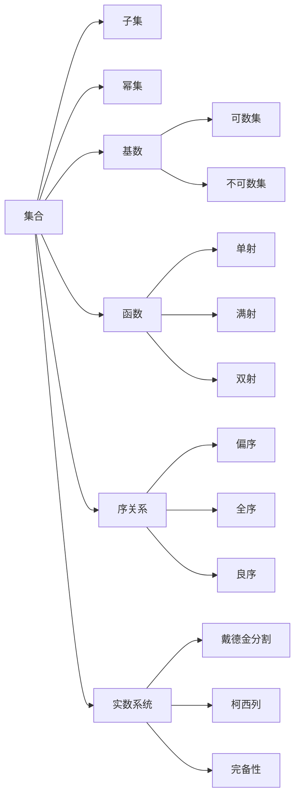

# 集合论导引：实数集可定义子集分析

## 1. 背景介绍
### 1.1 集合论的起源与发展
#### 1.1.1 康托尔的贡献
#### 1.1.2 希尔伯特的公理化
#### 1.1.3 哥德尔的不完备性定理

### 1.2 实数集的重要性
#### 1.2.1 实数在数学中的地位
#### 1.2.2 实数在物理和工程中的应用
#### 1.2.3 实数的完备性和连续性

### 1.3 可定义子集的概念
#### 1.3.1 直观理解
#### 1.3.2 形式化定义
#### 1.3.3 可定义子集的重要性

## 2. 核心概念与联系
### 2.1 集合的基本概念
#### 2.1.1 集合的定义
#### 2.1.2 子集与真子集
#### 2.1.3 幂集

### 2.2 函数与映射
#### 2.2.1 函数的定义
#### 2.2.2 单射、满射与双射
#### 2.2.3 函数的复合

### 2.3 基数与可数性
#### 2.3.1 等势与基数
#### 2.3.2 可数集与不可数集
#### 2.3.3 康托尔对角线法

### 2.4 良序与选择公理
#### 2.4.1 偏序与全序
#### 2.4.2 良序集的定义
#### 2.4.3 选择公理及其等价形式

### 2.5 实数系统的构造
#### 2.5.1 戴德金分割
#### 2.5.2 柯西列与实数的定义
#### 2.5.3 实数的完备性



## 3. 核心算法原理具体操作步骤
### 3.1 构造实数系统的步骤
#### 3.1.1 定义有理数集Q
#### 3.1.2 定义柯西列与等价关系
#### 3.1.3 定义实数集R与运算
#### 3.1.4 验证实数系统的基本性质

### 3.2 证明实数集的不可数性
#### 3.2.1 康托尔对角线法的基本思想  
#### 3.2.2 证明区间(0,1)与实数集等势
#### 3.2.3 推广到任意区间与整个实数集

### 3.3 构造实数集的可定义子集
#### 3.3.1 可定义集的形式化定义
#### 3.3.2 构造代数数集
#### 3.3.3 构造超越数集

## 4. 数学模型和公式详细讲解举例说明
### 4.1 实数完备性的 $\epsilon-N$ 语言
#### 4.1.1 收敛数列的定义
$$\forall \epsilon>0, \exists N\in \mathbb{N}, \forall n>N, |x_n-a|<\epsilon$$
#### 4.1.2 柯西列的定义  
$$\forall \epsilon>0, \exists N\in \mathbb{N}, \forall n,m>N, |x_n-x_m|<\epsilon$$
#### 4.1.3 实数系统的完备性定理
$$\text{每个柯西列都收敛于某个实数}$$

### 4.2 康托尔对角线法证明实数集不可数
#### 4.2.1 反证法假设实数集可数
#### 4.2.2 构造实数集的一个列举 $\{r_n\}$
#### 4.2.3 构造新实数 $x$ 使得 $\forall n\in \mathbb{N}, x\neq r_n$
$$x=0.a_1a_2a_3\cdots, \text{其中} a_n=\begin{cases}1, & \text{如果} r_{nn}\neq 1\\ 2, & \text{如果} r_{nn}= 1\end{cases}$$

### 4.3 选择公理与良序定理
#### 4.3.1 选择公理的表述
$$\forall X\neq \emptyset, \exists f:2^X\to X, \forall A\in 2^X\setminus\{\emptyset\}, f(A)\in A$$
#### 4.3.2 良序定理的表述
$$\text{每个集合都可以赋予一个良序}$$
#### 4.3.3 选择公理与良序定理的等价性

## 5. 项目实践：代码实例和详细解释说明
### 5.1 Python 实现有理数与实数的基本运算
#### 5.1.1 有理数的表示与运算
```python
from fractions import Fraction

a = Fraction(1, 3)  # 创建有理数 1/3
b = Fraction(2, 5)  # 创建有理数 2/5

print(a + b)  # 有理数加法
print(a - b)  # 有理数减法  
print(a * b)  # 有理数乘法
print(a / b)  # 有理数除法
```
#### 5.1.2 实数的近似表示与运算
```python
import math

x = 1.414213562373095  # 实数 sqrt(2) 的近似值
y = 2.718281828459045  # 实数 e 的近似值

print(x + y)  # 实数加法
print(x - y)  # 实数减法
print(x * y)  # 实数乘法  
print(x / y)  # 实数除法
print(math.sqrt(x))  # 实数开方
print(math.exp(x))   # 实数指数函数
```

### 5.2 Sage 实现代数数与超越数的构造
#### 5.2.1 代数数的构造
```python
sage: x = polygen(QQ)
sage: K.<a> = NumberField(x^3 - 2)
sage: a
a
sage: a^3
2
sage: a.minpoly()
x^3 - 2
```
#### 5.2.2 超越数的构造
```python
sage: pi.n(digits=50)  # 圆周率 pi 的近似值
3.1415926535897932384626433832795028841971693993751
sage: e.n(digits=50)   # 自然常数 e 的近似值 
2.7182818284590452353602874713526624977572470937000
sage: sqrt(2).n(digits=50)  # sqrt(2) 的近似值
1.4142135623730950488016887242096980785696718753769
```

## 6. 实际应用场景
### 6.1 实数完备性在数学分析中的应用
#### 6.1.1 确保函数极限存在性
#### 6.1.2 保证微积分基本定理成立
#### 6.1.3 证明中值定理、介值定理

### 6.2 实数在物理和工程中的应用
#### 6.2.1 描述连续的物理量
#### 6.2.2 微分方程建模
#### 6.2.3 信号处理与傅里叶分析

### 6.3 实数在计算机科学中的应用
#### 6.3.1 浮点数系统与数值计算
#### 6.3.2 数值优化算法
#### 6.3.3 计算几何与图形学

## 7. 工具和资源推荐
### 7.1 数学软件与编程语言
#### 7.1.1 Mathematica
#### 7.1.2 Maple
#### 7.1.3 Sage
#### 7.1.4 Python(NumPy/SciPy/SymPy)

### 7.2 在线教育资源
#### 7.2.1 Khan Academy 集合论课程
#### 7.2.2 Coursera 数学分析课程
#### 7.2.3 MIT OpenCourseWare 实分析课程

### 7.3 经典书籍推荐
#### 7.3.1 《数学分析原理》 - 华罗庚
#### 7.3.2 《实分析及复分析》 - 陈纪修
#### 7.3.3 《集合论与点集拓扑讲义》 - 熊金城

## 8. 总结：未来发展趋势与挑战
### 8.1 实数系统的扩张
#### 8.1.1 复数系统与复分析
#### 8.1.2 p-adic数系统与非阿基米德分析
#### 8.1.3 超实数系统与非标准分析

### 8.2 集合论的进一步发展
#### 8.2.1 大基数公理与集合论模型  
#### 8.2.2 描述集论与内模型理论
#### 8.2.3 集合论在其他数学分支中的应用

### 8.3 可计算性理论的挑战
#### 8.3.1 图灵度与相对可计算性
#### 8.3.2 构造不可判定集与问题
#### 8.3.3 逻辑基础与数学哲学的思考

## 9. 附录：常见问题与解答
### 9.1 实数系统的公理化
#### 9.1.1 实数系统的序公理
#### 9.1.2 实数系统的代数运算公理
#### 9.1.3 实数系统的完备性公理

### 9.2 选择公理的独立性
#### 9.2.1 ZF集合论与ZFC集合论  
#### 9.2.2 选择公理的独立性证明
#### 9.2.3 选择公理的应用与争议

### 9.3 康托尔-舒德-伯恩赛悖论
#### 9.3.1 全体集合的集合不存在
#### 9.3.2 全体序数的序数不存在
#### 9.3.3 悖论的解释与集合论的限制

作者：禅与计算机程序设计艺术 / Zen and the Art of Computer Programming