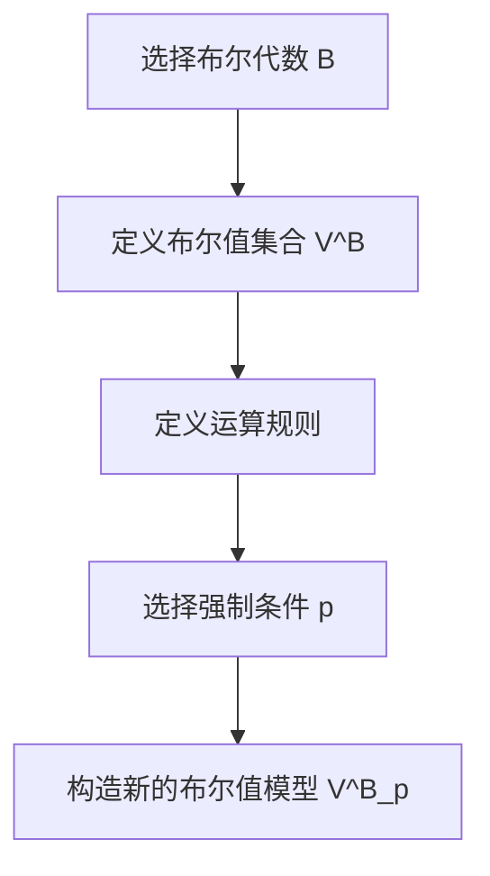

# 集合论导引：布尔值模型VB

## 1.背景介绍

集合论是数学的一个基础分支，研究集合的性质和关系。布尔值模型（Boolean-valued models，简称VB）是集合论中的一个重要工具，用于研究集合的结构和性质。布尔值模型通过引入布尔代数的概念，提供了一种灵活的方式来处理集合论中的复杂问题。

布尔值模型最早由Paul Cohen在1960年代引入，用于证明连续统假设的独立性。此后，布尔值模型在数学逻辑、计算机科学和人工智能等领域得到了广泛应用。本文将深入探讨布尔值模型的核心概念、算法原理、数学模型、实际应用以及未来发展趋势。

## 2.核心概念与联系

### 2.1 集合与布尔代数

集合是数学中最基本的概念之一，表示一组对象的集合。布尔代数是一种代数结构，用于处理逻辑运算。布尔代数中的元素可以是0和1，表示逻辑上的假和真。

### 2.2 布尔值模型

布尔值模型是一种扩展的集合模型，其中每个集合的元素都与一个布尔值相关联。布尔值模型通过引入布尔代数，允许我们在集合论中处理不确定性和模糊性。

### 2.3 强制法与布尔值模型

强制法（Forcing）是布尔值模型中的一个重要技术，用于构造新的集合。通过强制法，我们可以在现有集合的基础上，构造出满足特定性质的新集合。

## 3.核心算法原理具体操作步骤

### 3.1 布尔值模型的构造

构造布尔值模型的步骤如下：

1. 选择一个布尔代数 $B$。
2. 定义一个布尔值集合 $V^B$，其中每个元素都是一个布尔值。
3. 定义布尔值模型的运算规则，包括并集、交集和补集等。

### 3.2 强制法的应用

强制法的步骤如下：

1. 选择一个布尔代数 $B$ 和一个布尔值模型 $V^B$。
2. 定义一个强制条件 $p \in B$。
3. 构造一个新的布尔值模型 $V^B_p$，使其满足特定性质。

### 3.3 算法流程图



## 4.数学模型和公式详细讲解举例说明

### 4.1 布尔代数的定义

布尔代数是一个三元组 $(B, \land, \lor, \neg)$，其中 $B$ 是一个集合，$\land$ 和 $\lor$ 是二元运算，$\neg$ 是一元运算，满足以下公理：

1. 结合律：$a \land (b \land c) = (a \land b) \land c$ 和 $a \lor (b \lor c) = (a \lor b) \lor c$
2. 交换律：$a \land b = b \land a$ 和 $a \lor b = b \lor a$
3. 分配律：$a \land (b \lor c) = (a \land b) \lor (a \land c)$ 和 $a \lor (b \land c) = (a \lor b) \land (a \lor c)$
4. 吸收律：$a \land (a \lor b) = a$ 和 $a \lor (a \land b) = a$
5. 补元律：$a \land \neg a = 0$ 和 $a \lor \neg a = 1$

### 4.2 布尔值模型的定义

布尔值模型 $V^B$ 是一个集合，其中每个元素都是一个布尔值。布尔值模型的运算规则如下：

1. 并集：$A \cup B = \{x \mid x \in A \lor x \in B\}$
2. 交集：$A \cap B = \{x \mid x \in A \land x \in B\}$
3. 补集：$\neg A = \{x \mid x \notin A\}$

### 4.3 强制法的数学模型

强制法的数学模型如下：

1. 选择一个布尔代数 $B$ 和一个布尔值模型 $V^B$。
2. 定义一个强制条件 $p \in B$。
3. 构造一个新的布尔值模型 $V^B_p$，使其满足以下性质：
   - $V^B_p = \{x \mid x \in V^B \land p \leq x\}$

### 4.4 示例说明

假设我们有一个布尔代数 $B = \{0, 1\}$，其中 $0$ 表示假，$1$ 表示真。定义一个布尔值集合 $V^B = \{0, 1\}$。选择一个强制条件 $p = 1$，则新的布尔值模型 $V^B_p = \{1\}$。

## 5.项目实践：代码实例和详细解释说明

### 5.1 Python实现布尔代数

```python
class BooleanAlgebra:
    def __init__(self):
        self.values = {0, 1}

    def AND(self, a, b):
        return a & b

    def OR(self, a, b):
        return a | b

    def NOT(self, a):
        return 1 - a

# 示例
ba = BooleanAlgebra()
print(ba.AND(1, 0))  # 输出 0
print(ba.OR(1, 0))   # 输出 1
print(ba.NOT(1))     # 输出 0
```

### 5.2 Python实现布尔值模型

```python
class BooleanValuedModel:
    def __init__(self, algebra):
        self.algebra = algebra
        self.model = {0, 1}

    def union(self, A, B):
        return {x for x in self.model if x in A or x in B}

    def intersection(self, A, B):
        return {x for x in self.model if x in A and x in B}

    def complement(self, A):
        return {x for x in self.model if x not in A}

# 示例
bvm = BooleanValuedModel(ba)
A = {1}
B = {0}
print(bvm.union(A, B))        # 输出 {0, 1}
print(bvm.intersection(A, B)) # 输出 set()
print(bvm.complement(A))      # 输出 {0}
```

### 5.3 强制法的实现

```python
class Forcing:
    def __init__(self, model, condition):
        self.model = model
        self.condition = condition

    def force(self):
        return {x for x in self.model.model if self.condition <= x}

# 示例
forcing = Forcing(bvm, 1)
print(forcing.force())  # 输出 {1}
```

## 6.实际应用场景

### 6.1 数学逻辑

布尔值模型在数学逻辑中有广泛应用，特别是在证明集合论中的独立性结果方面。通过布尔值模型，我们可以构造出满足特定性质的集合，从而证明某些命题的独立性。

### 6.2 计算机科学

在计算机科学中，布尔值模型用于处理不确定性和模糊性。例如，在数据库查询优化中，布尔值模型可以用于表示和处理不确定的查询条件。

### 6.3 人工智能

在人工智能领域，布尔值模型用于处理模糊逻辑和不确定性推理。例如，在专家系统中，布尔值模型可以用于表示和处理不确定的知识。

## 7.工具和资源推荐

### 7.1 工具

1. **Python**：Python是一种强大的编程语言，适用于实现布尔代数和布尔值模型。
2. **SymPy**：SymPy是一个Python库，用于符号数学计算，适用于处理布尔代数和逻辑运算。
3. **Jupyter Notebook**：Jupyter Notebook是一个交互式计算环境，适用于编写和运行Python代码。

### 7.2 资源

1. **《集合论导引》**：这本书详细介绍了集合论的基本概念和方法，是学习布尔值模型的基础。
2. **《布尔代数与其应用》**：这本书详细介绍了布尔代数的基本概念和应用，是学习布尔值模型的重要参考。
3. **在线课程**：Coursera和edX等平台上有许多关于集合论和布尔代数的在线课程，适合自学。

## 8.总结：未来发展趋势与挑战

布尔值模型作为集合论中的重要工具，具有广泛的应用前景。未来，随着数学逻辑、计算机科学和人工智能的发展，布尔值模型将继续发挥重要作用。然而，布尔值模型的研究和应用也面临一些挑战，例如如何处理更复杂的布尔代数结构，如何提高算法的效率等。

### 8.1 未来发展趋势

1. **更复杂的布尔代数结构**：未来的研究将探索更复杂的布尔代数结构，以处理更复杂的集合论问题。
2. **算法优化**：随着计算机科学的发展，布尔值模型的算法将不断优化，以提高计算效率。
3. **跨学科应用**：布尔值模型将在更多学科中得到应用，例如生物信息学、金融工程等。

### 8.2 挑战

1. **复杂性**：布尔值模型的复杂性是一个主要挑战，特别是在处理大规模数据时。
2. **计算效率**：提高布尔值模型的计算效率是另一个重要挑战，特别是在实时应用中。
3. **理论研究**：布尔值模型的理论研究仍然有许多未解之谜，需要进一步探索。

## 9.附录：常见问题与解答

### 9.1 什么是布尔值模型？

布尔值模型是一种扩展的集合模型，其中每个集合的元素都与一个布尔值相关联。布尔值模型通过引入布尔代数，允许我们在集合论中处理不确定性和模糊性。

### 9.2 布尔值模型的应用有哪些？

布尔值模型在数学逻辑、计算机科学和人工智能等领域有广泛应用。例如，在数学逻辑中，布尔值模型用于证明集合论中的独立性结果；在计算机科学中，布尔值模型用于处理不确定性和模糊性；在人工智能中，布尔值模型用于处理模糊逻辑和不确定性推理。

### 9.3 如何构造布尔值模型？

构造布尔值模型的步骤包括选择一个布尔代数，定义一个布尔值集合，并定义布尔值模型的运算规则。通过这些步骤，我们可以构造出满足特定性质的布尔值模型。

### 9.4 什么是强制法？

强制法是布尔值模型中的一个重要技术，用于构造新的集合。通过强制法，我们可以在现有集合的基础上，构造出满足特定性质的新集合。

### 9.5 布尔值模型的未来发展趋势是什么？

布尔值模型的未来发展趋势包括探索更复杂的布尔代数结构、优化算法以提高计算效率，以及在更多学科中应用布尔值模型。

---

作者：禅与计算机程序设计艺术 / Zen and the Art of Computer Programming