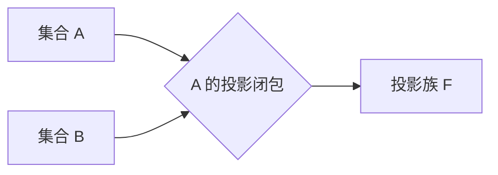

# 集合论导引：投影荟萃集光影原理

## 1. 背景介绍

集合论是数学的一个基础分支,是研究集合及其运算的数学理论。它为其他数学分支如代数、拓扑、逻辑等奠定了坚实的基础。近年来,集合论在计算机科学领域也发挥着越来越重要的作用,特别是在程序语言的语义学、数据库理论、形式化方法等方面。

投影荟萃集(Projective Cluster Set)是集合论中一个新兴的概念,它将投影原理与集合论紧密结合,为研究复杂系统的行为提供了有力的数学工具。投影荟萃集的核心思想是将一个复杂系统分解为多个子系统,然后研究子系统之间的投影关系,从而揭示整个系统的内在规律。

### 1.1 投影原理简介

投影原理源于光学领域,描述了光线在不同介质之间传播时的行为规律。在数学中,投影原理被广泛应用于线性代数、几何学等领域,用于研究向量空间、流形等数学对象之间的映射关系。

### 1.2 集合论与复杂系统建模

复杂系统是当代科学研究的热点领域,涉及物理、化学、生物、社会等多个学科。由于复杂系统内部存在大量的相互作用和反馈机制,传统的建模方法往往难以准确描述其行为。集合论为复杂系统建模提供了新的思路,将系统抽象为集合及其运算,从而简化问题并揭示其本质特征。

## 2. 核心概念与联系

### 2.1 投影荟萃集的形式定义

投影荟萃集是一个有序对 $\mathcal{P} = (X, \mathcal{F})$,其中 $X$ 是一个非空集合,称为基集;$\mathcal{F}$ 是 $X$ 上的一族子集,称为投影族,满足以下条件:

1. 空集 $\emptyset \in \mathcal{F}$;
2. 对任意 $A, B \in \mathcal{F}$,都有 $A \cap B \in \mathcal{F}$;
3. 对任意 $A \in \mathcal{F}$,存在一个最小的集合 $\overline{A} \in \mathcal{F}$,使得 $A \subseteq \overline{A}$,称为 $A$ 的投影闭包。

investmentClosureSet 

上图展示了投影闭包的概念,即对于投影族 $\mathcal{F}$ 中的任意集合 $A$,都存在一个最小的超集 $\overline{A}$ 也属于 $\mathcal{F}$,称为 $A$ 的投影闭包。

### 2.2 投影运算

对于投影荟萃集 $\mathcal{P} = (X, \mathcal{F})$,在集合 $X$ 上定义了一个闭包运算 $cl: 2^X \rightarrow \mathcal{F}$,将 $X$ 的任意子集 $A$ 映射到其投影闭包 $cl(A) = \overline{A}$。这个闭合运算满足以下性质:

1. 增长性: $A \subseteq cl(A)$
2. 单调性: 若 $A \subseteq B$,则 $cl(A) \subseteq cl(B)$
3. 幂等性: $cl(cl(A)) = cl(A)$

利用投影运算,可以将集合论中的一些基本概念推广到投影荟萃集的框架下,例如:

- 内部: 集合 $A$ 的内部是 $A^\circ = \bigcup\{B \in \mathcal{F} | B \subseteq A\}$
- 边界: 集合 $A$ 的边界是 $\partial A = cl(A) \setminus A^\circ$
- 闭集: 集合 $A$ 是闭集当且仅当 $A = cl(A)$

### 2.3 投影荟萃集与拓扑空间

经典的拓扑空间是由一个非空集合 $X$ 及其开集族 $\mathcal{T}$ 构成。而投影荟萃集 $\mathcal{P} = (X, \mathcal{F})$ 可以看作是一种广义的拓扑空间,其中 $\mathcal{F}$ 的元素被称为投影开集。

事实上,任何一个拓扑空间 $(X, \mathcal{T})$ 都可以诱导出一个投影荟萃集 $\mathcal{P}_\mathcal{T} = (X, \mathcal{F})$,其中 $\mathcal{F}$ 由所有可表示为开集并的形式构成。反之,对于任意投影荟萃集 $\mathcal{P} = (X, \mathcal{F})$,令 $\mathcal{T} = \{X \setminus cl(A) | A \in \mathcal{F}\}$,则 $(X, \mathcal{T})$ 就形成了一个拓扑空间。

这种对应关系表明,投影荟萃集理论实际上是经典拓扑学的一种推广,为研究更一般的"近似空间"提供了有力工具。

## 3. 核心算法原理具体操作步骤 

投影荟萃集理论的核心算法是基于投影闭包运算,用于从给定的集合族中构造满足投影公理的投影族。具体操作步骤如下:

输入: 集合 $X$ 上的一个集合族 $\mathcal{A}$

步骤1: 令 $\mathcal{F}_0 = \mathcal{A}$

步骤2: 对任意 $n \ge 0$,构造 $\mathcal{F}_{n+1}$ 如下:
$$
\mathcal{F}_{n+1} = \mathcal{F}_n \cup \{A \cap B | A, B \in \mathcal{F}_n\} \cup \{\overline{A} | A \in \mathcal{F}_n\}
$$
其中 $\overline{A}$ 表示 $A$ 在 $\mathcal{F}_n$ 中的投影闭包,即 $\overline{A} = \bigcap\{B \in \mathcal{F}_n | A \subseteq B\}$。

步骤3: 重复步骤2直到 $\mathcal{F}_{n+1} = \mathcal{F}_n$,此时令 $\mathcal{F} = \mathcal{F}_n$。

输出: $\mathcal{F}$ 即为由 $\mathcal{A}$ 生成的最小投影族。

该算法的正确性由以下事实保证:对任意集合族 $\mathcal{A}$,上述迭代过程终止时得到的 $\mathcal{F}$ 一定满足投影公理,且是包含 $\mathcal{A}$ 的最小投影族。

算法复杂度分析:
- 时间复杂度: 假设集合 $X$ 的基数为 $n$,则最坏情况下算法需要 $O(3^n)$ 次迭代才能终止。
- 空间复杂度: $O(3^n)$,因为最终的投影族 $\mathcal{F}$ 最多包含 $3^n$ 个集合。

对于一般的有限集合 $X$,该算法的效率是可以接受的。但对于无限集合或特殊结构的集合族,往往需要设计更高效的专门算法。

## 4. 数学模型和公式详细讲解举例说明

投影荟萃集理论中有许多重要的数学模型和公式,下面将对其中的几个代表性概念进行详细讲解。

### 4.1 投影测度

经典测度论研究可测集与测度在集合上的性质,而投影测度则将这种研究推广到了投影荟萃集的框架下。

给定投影荟萃集 $\mathcal{P} = (X, \mathcal{F})$,一个集值函数 $\mu: \mathcal{F} \rightarrow [0, \infty]$ 称为 $\mathcal{P}$ 上的投影测度,如果它满足以下条件:

1. 空集测度为0,即 $\mu(\emptyset) = 0$;
2. 单调性: 若 $A \subseteq B$,则 $\mu(A) \le \mu(B)$;
3. 可数可加性: 对任意不相交的可数集合列 $\{A_n\}_{n=1}^\infty \subseteq \mathcal{F}$,有
   $$
   \mu\left(\bigcup_{n=1}^\infty A_n\right) = \sum_{n=1}^\infty \mu(A_n)
   $$

与经典测度论类似,投影测度也可以定义在更一般的 $\sigma$-代数上。此时第3条被替换为:

3'. 连续性: 若 $\{A_n\}_{n=1}^\infty$ 是单调递增的集合列,且 $A = \bigcup_{n=1}^\infty A_n$,则 $\lim_{n\rightarrow\infty}\mu(A_n) = \mu(A)$。

投影测度的一个重要例子是由经典测度诱导而来的测度。具体地,设 $(X, \Sigma, \mu)$ 是一个经典的测度空间,定义 $\mathcal{F} = \{A \subseteq X | \exists B \in \Sigma, A \subseteq B\}$,则 $\mathcal{P} = (X, \mathcal{F})$ 是一个投影荟萃集,并且 $\mu|_\mathcal{F}$ 就构成了 $\mathcal{P}$ 上的一个投影测度。

投影测度的理论不仅推广了经典测度论,而且为研究非加性测度等新型测度提供了数学基础。

### 4.2 投影分形

分形理论是20世纪后期兴起的一个新的数学分支,用于研究自相似不规则几何对象。投影荟萃集理论为分形理论提供了一个自然的数学模型——投影分形。

给定投影荟萃集 $\mathcal{P} = (X, \mathcal{F})$,如果存在一个有限集合 $\mathcal{A} \subseteq \mathcal{F}$ 及一个连续函数 $f: X \rightarrow X$,使得对任意 $A \in \mathcal{F}$,有
$$
A = \bigcup_{B \in \mathcal{A}} f(B \cap A)
$$
则称 $\mathcal{A}$ 为 $\mathcal{P}$ 的一个投影分形,而 $f$ 被称为相应的投影分形函数。

这个定义刻画了自相似性的本质:一个集合可以被分解为有限个小部分的并,而这些小部分与整体具有相同的几何结构。经典的分形集合如Cantor集、谢尔宾斯基三角形等,都可以自然地嵌入到投影荟萃集的框架中。

值得一提的是,投影分形理论不仅可以处理经典的自相似分形,还可以很自然地推广到研究更一般的非自相似分形。这些非自相似分形在自然界中普遍存在,如海岸线、山脉轮廓、蜂窝等,传统的分形理论难以有效描述它们的复杂结构。

投影分形理论为分形几何提供了一个更一般、更精确的数学模型,必将在复杂系统的分析和建模中发挥重要作用。

### 4.3 投影动力系统

动力系统是研究确定性过程演化规律的一个重要数学工具,广泛应用于物理、化学、生物等诸多领域。投影荟萃集理论为动力系统的研究提供了一个新的视角。

给定一个投影荟萃集 $\mathcal{P} = (X, \mathcal{F})$,以及 $X$ 上的一个连续映射 $f: X \rightarrow X$,则 $f$ 就自然诱导出一个投影动力系统 $(X, \mathcal{F}, f)$。我们研究 $f$ 在投影族 $\mathcal{F}$ 中的不变集合、周期点、吸引子等动力学性质。

与经典动力系统相比,投影动力系统具有以下独特之处:

1. 投影运算使得动力系统具有一定的"模糊性",从而能够更好地描述现实世界中的不确定性。
2. 投影族 $\mathcal{F}$ 赋予了状态空间 $X$ 一种新的拓扑结构,这种结构常常比经典拓扑更能刻画复杂系统的本质特征。
3. 投影动力系统理论自然包含了经典动力系统作为一个特例,从而