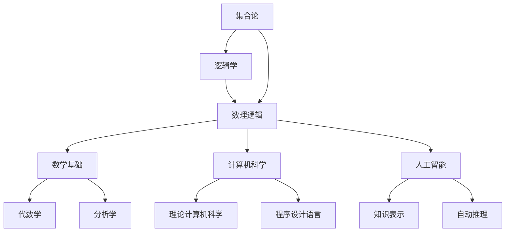

# 集合论导引：植入逻辑学概念

## 1.背景介绍
### 1.1 集合论的起源与发展
#### 1.1.1 康托尔的贡献
#### 1.1.2 现代集合论的形成
#### 1.1.3 集合论在数学中的地位
### 1.2 逻辑学的起源与发展  
#### 1.2.1 亚里士多德的三段论
#### 1.2.2 布尔代数的建立
#### 1.2.3 谓词逻辑与一阶逻辑
### 1.3 集合论与逻辑学的交叉
#### 1.3.1 集合论为逻辑学提供了基础
#### 1.3.2 逻辑学为集合论提供了工具
#### 1.3.3 两者在数理逻辑中的结合

## 2.核心概念与联系
### 2.1 集合的定义与表示
#### 2.1.1 集合的直观定义
#### 2.1.2 集合的数学定义
#### 2.1.3 集合的表示方法
### 2.2 命题、联结词与真值表
#### 2.2.1 命题及其类型
#### 2.2.2 联结词及其真值表
#### 2.2.3 复合命题的真值求解
### 2.3 谓词与量词
#### 2.3.1 谓词的定义与分类
#### 2.3.2 全称量词与存在量词
#### 2.3.3 量化命题及其意义
### 2.4 集合运算与逻辑联结词的对应
#### 2.4.1 交集运算与合取联结词
#### 2.4.2 并集运算与析取联结词 
#### 2.4.3 补集运算与否定联结词

## 3.核心算法原理具体操作步骤
### 3.1 集合的基本运算算法
#### 3.1.1 并集运算算法
#### 3.1.2 交集运算算法 
#### 3.1.3 补集运算算法
### 3.2 命题公式的真值判定算法
#### 3.2.1 联结词优先级
#### 3.2.2 运算顺序
#### 3.2.3 括号的处理
### 3.3 谓词公式的真值判定算法
#### 3.3.1 量词的辖域
#### 3.3.2 嵌套量词的处理
#### 3.3.3 量化变元的赋值

## 4.数学模型和公式详细讲解举例说明
### 4.1 集合代数模型
#### 4.1.1 幂集的概念与计算
#### 4.1.2 集合代数定律
#### 4.1.3 集合代数在逻辑中的应用
### 4.2 命题逻辑的数学模型 
#### 4.2.1 命题公式及其文法
#### 4.2.2 命题逻辑等价公式
#### 4.2.3 命题逻辑推理定律
### 4.3 一阶逻辑的数学模型
#### 4.3.1 一阶语言及其文法
#### 4.3.2 一阶逻辑等价公式
#### 4.3.3 一阶逻辑推理定律

## 5.项目实践：代码实例和详细解释说明
### 5.1 集合类的实现
#### 5.1.1 集合的表示
#### 5.1.2 集合运算的实现
#### 5.1.3 集合类的应用
### 5.2 命题公式求值器的实现
#### 5.2.1 命题公式的表示 
#### 5.2.2 命题公式的解析
#### 5.2.3 命题公式的求值
### 5.3 一阶逻辑公式求值器的实现
#### 5.3.1 一阶逻辑公式的表示
#### 5.3.2 一阶逻辑公式的解析
#### 5.3.3 一阶逻辑公式的求值

## 6.实际应用场景
### 6.1 数据库系统中的集合运算
#### 6.1.1 关系代数
#### 6.1.2 SQL中的集合运算
#### 6.1.3 NoSQL数据库中的集合
### 6.2 人工智能中的逻辑推理
#### 6.2.1 基于规则的专家系统
#### 6.2.2 基于逻辑程序设计的智能系统
#### 6.2.3 基于描述逻辑的知识表示
### 6.3 形式化验证中的逻辑应用
#### 6.3.1 命题逻辑在模型检测中的应用
#### 6.3.2 一阶逻辑在定理证明中的应用
#### 6.3.3 时序逻辑在并发系统验证中的应用

## 7.工具和资源推荐
### 7.1 数学工具软件
#### 7.1.1 Mathematica
#### 7.1.2 MATLAB
#### 7.1.3 Maple
### 7.2 逻辑推理引擎
#### 7.2.1 Prolog
#### 7.2.2 Z3定理证明器
#### 7.2.3 Coq交互式定理证明助手
### 7.3 在线学习资源
#### 7.3.1 Coursera公开课程
#### 7.3.2 MIT公开课程
#### 7.3.3 知名大学的数理逻辑课程

## 8.总结：未来发展趋势与挑战
### 8.1 大数据时代的集合论应用
#### 8.1.1 超大规模数据集的表示与处理
#### 8.1.2 集合论在数据挖掘中的应用
#### 8.1.3 集合论在机器学习中的应用
### 8.2 逻辑学在人工智能领域的前景
#### 8.2.1 基于逻辑的知识表示与推理
#### 8.2.2 神经-符号混合智能系统
#### 8.2.3 可解释人工智能
### 8.3 集合论与逻辑学的研究方向
#### 8.3.1 大型形式化数学库的构建
#### 8.3.2 逻辑学与范畴论的融合
#### 8.3.3 构造主义数学的发展

## 9.附录：常见问题与解答
### 9.1 为什么要学习集合论与逻辑学？
### 9.2 集合论与逻辑学的前置知识要求是什么？
### 9.3 学习集合论与逻辑学有哪些参考书籍？

集合论与逻辑学是数学和哲学领域的两大基石，它们为现代数学和计算机科学的发展提供了坚实的理论基础。集合论研究对象的抽象汇集，刻画事物的一般性质；而逻辑学则研究推理的一般规律，揭示思维的基本形式。两者相互交织，构成了数理逻辑这一独特的学科，并在数学基础、计算机科学、人工智能等领域得到广泛应用。

集合论诞生于19世纪末，德国数学家康托尔开创性地提出了集合的概念，并系统地研究了无穷集合的性质，奠定了现代数学的基石。集合论不仅统一了数学的各个分支，更为数学提供了一种通用语言。今天，集合论已经渗透到数学的各个领域，成为数学王国的"宪法"。

另一方面，逻辑学的起源可以追溯到古希腊时期。亚里士多德首先系统地总结了推理的三段论，开创了形式逻辑的先河。此后，莱布尼茨、布尔等学者将代数引入逻辑，建立了命题逻辑的代数模型。直到19世纪末，弗雷格开创了谓词逻辑，将逻辑学推向了一个新的高度。

集合论为逻辑学提供了一个严格的数学模型。命题可以看作是元素的集合，联结词对应着集合的运算。谓词可以看作是元素到真值的映射，量词则刻画了元素的范围。在数理逻辑中，集合论与逻辑学完美地结合在一起，形成了一个严谨而完备的体系。

在计算机科学中，集合是一种重要的数据结构，广泛应用于各种算法和程序设计中。数据库系统的关系代数以集合论为基础，SQL语言中也包含了丰富的集合运算。同时，命题逻辑和一阶逻辑是人工智能领域知识表示与推理的重要工具。例如，基于规则的专家系统使用命题逻辑来表示领域知识，使用逻辑推理来解决问题；而基于描述逻辑的知识表示系统，如OWL，则采用了一阶逻辑的子集。

在形式化验证领域，逻辑学更是不可或缺的利器。命题逻辑常用于对有限状态系统进行模型检测，而一阶逻辑则用于对一般程序的性质进行定理证明。各种定理证明器和验证工具，如Z3、Coq等，都以数理逻辑为理论基础。

随着大数据时代的到来，集合论在超大规模数据集的表示与处理中将扮演越来越重要的角色。同时，逻辑学在人工智能领域的应用也方兴未艾。基于逻辑的知识表示与推理技术，与深度学习等数据驱动的方法相结合，有望实现更加高效、可解释的混合智能系统。

当然，集合论与逻辑学的发展也面临着诸多挑战。构建大型形式化数学库，研究逻辑学与范畴论的融合，发展构造主义数学等，都是当前数理逻辑领域的重要课题。这需要数学家、计算机科学家、哲学家的共同努力。

总之，集合论与逻辑学是数学和哲学的两大基石，它们不仅推动了数学和哲学的发展，更为计算机科学和人工智能提供了理论支撑。深入学习和研究集合论与逻辑学，对于培养严谨的数学思维和计算思维，提高逻辑推理和抽象建模能力，都有着重要的意义。站在巨人的肩膀上，让我们携手探索数理逻辑的奥秘，为人类认识世界、改造世界贡献自己的一份力量。

作者：禅与计算机程序设计艺术 / Zen and the Art of Computer Programming