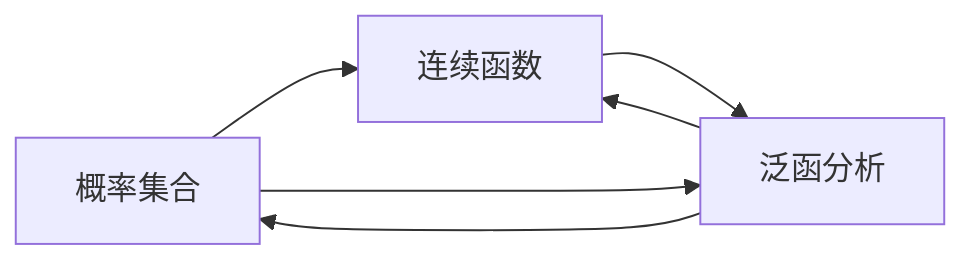

# 集合论导引：模型分析应用：谢旯pcf理论

## 1. 背景介绍
### 1.1 集合论的发展历史
#### 1.1.1 康托尔的贡献
#### 1.1.2 哥德尔的不完备性定理  
#### 1.1.3 现代集合论的发展
### 1.2 谢旯pcf理论的提出
#### 1.2.1 谢旯pcf理论的起源
#### 1.2.2 谢旯pcf理论的主要内容
#### 1.2.3 谢旯pcf理论的意义
### 1.3 本文的研究目的和意义
#### 1.3.1 深入理解谢旯pcf理论
#### 1.3.2 探索谢旯pcf理论的应用
#### 1.3.3 推动集合论在实际问题中的应用

集合论是现代数学的基础，它的发展可以追溯到19世纪末。德国数学家康托尔(Georg Cantor)在研究无限集合时，创立了集合论的基础。他提出了基数和序数的概念，证明了实数集的基数大于自然数集的基数，开创了现代集合论的先河。

然而，康托尔的理论也引发了一些悖论，如罗素悖论等。为了解决这些悖论，数学家们提出了各种公理化集合论体系，如ZFC公理系统等。哥德尔不完备性定理则说明，任何包含初等数论的形式系统，如果是相容的，则它是不完备的；如果是完备的，则它是不相容的。这一定理对现代数理逻辑和计算机科学都有深远影响。

在此基础上，现代集合论得到了长足发展。除了公理化集合论外，还形成了各种非标准模型、巨基数假设等分支。集合论已经渗透到数学的各个分支，成为现代数学不可或缺的一部分。

谢旯pcf理论是在这一背景下提出的。该理论由谢旯教授在20世纪90年代提出，旨在将集合论应用于实际问题的建模和求解。谢旯pcf理论主要包括三个部分：概率集合(Probability sets)、连续函数(Continuous functions)和泛函分析(Functional analysis)。它试图用集合论的方法来刻画不确定性、连续性等特征，为实际问题提供数学模型和解决方案。

本文的主要目的是深入理解谢旯pcf理论的内涵，探索其在实际问题中的应用。通过系统阐述谢旯pcf理论的核心概念、算法原理、数学模型等，展示集合论在实际建模和问题求解中的价值。同时，本文也将推荐相关工具和资源，讨论谢旯pcf理论未来的发展方向和面临的挑战，为集合论走向应用提供参考。

## 2. 核心概念与联系
### 2.1 概率集合
#### 2.1.1 概率集合的定义
#### 2.1.2 概率集合的性质
#### 2.1.3 概率集合的运算
### 2.2 连续函数  
#### 2.2.1 连续函数的定义
#### 2.2.2 连续函数的性质
#### 2.2.3 连续函数与概率集合的关系
### 2.3 泛函分析
#### 2.3.1 泛函的定义
#### 2.3.2 泛函空间
#### 2.3.3 泛函分析与概率集合、连续函数的关系

谢旯pcf理论的核心概念包括概率集合、连续函数和泛函分析三个部分，它们之间相互关联、相互支撑。

概率集合是谢旯pcf理论的基础。它是指一类赋予了概率测度的集合，可以用来刻画事件的不确定性。形式化地，概率集合可定义为一个三元组$(X,\mathcal{A},P)$，其中$X$是样本空间，$\mathcal{A}$是$X$上的$\sigma$-代数，$P$是概率测度。概率集合具有非负性、规范性、可列可加性等基本性质。对于概率集合，可以定义并、交、补等运算，从而构造出更复杂的事件。

连续函数是描述确定性过程的重要工具。谢旯pcf理论中的连续函数，主要指定义在拓扑空间上的连续映射。连续函数保持领域的拓扑结构，具有局部性、介值性等重要性质。概率集合与连续函数之间也有密切联系。概率集合中的随机变量，往往可以看作从样本空间到实数集的连续函数。概率集合上的期望、方差等特征量，也可以用连续函数来刻画。

泛函分析是研究泛函空间结构及其上的映射(算子)的理论。泛函是定义在函数空间上的函数，即"函数的函数"。泛函空间包括希尔伯特空间、巴拿赫空间等，它们都是无穷维线性空间。谢旯pcf理论利用泛函分析来研究概率集合和连续函数。例如，概率密度函数可以看作概率集合上的泛函；随机过程可以嵌入到适当的泛函空间中研究。泛函分析为概率集合、连续函数的深入研究提供了有力工具。

下图展示了谢旯pcf理论核心概念之间的关系：

概率集合、连续函数、泛函分析三者相互交织、相互促进，共同构成了谢旯pcf理论的核心内容。深入理解三者的内涵及其联系，是掌握谢旯pcf理论的关键。

## 3. 核心算法原理具体操作步骤
### 3.1 概率集合的构造算法
#### 3.1.1 样本空间的构造
#### 3.1.2 sigma-代数的生成
#### 3.1.3 概率测度的定义
### 3.2 连续函数的逼近算法
#### 3.2.1 多项式逼近
#### 3.2.2 三角级数逼近
#### 3.2.3 样条函数逼近
### 3.3 泛函分析的计算方法  
#### 3.3.1 泛函的数值计算
#### 3.3.2 算子的谱分析
#### 3.3.3 变分问题的求解

谢旯pcf理论的核心算法，主要包括概率集合的构造、连续函数的逼近和泛函分析的计算三个方面。

对于概率集合$(X,\mathcal{A},P)$，其构造一般分三步进行：

1. 确定样本空间$X$。这需要根据问题的背景，选取合适的集合作为基础。常见的样本空间包括有限集、可列集、实数集等。

2. 生成样本空间$X$上的$\sigma$-代数$\mathcal{A}$。$\sigma$-代数是$X$的一个子集族，对并、交、补运算封闭，包含$X$本身。通常可以从$X$的一个子集类出发，通过取并、取交、取余等操作生成$\sigma$-代数。

3. 定义概率测度$P$。$P$是定义在$\sigma$-代数$\mathcal{A}$上的集函数，满足非负性、规范性和可列可加性。对于有限样本空间，可以直接定义每个基本事件的概率；对于无限样本空间，往往需要先定义概率密度函数，再由积分导出概率测度。

连续函数的精确表达往往比较困难，实际应用中常用逼近方法来处理。典型的逼近算法包括：

1. 多项式逼近。通过构造一个多项式函数序列，使其在给定区间上一致收敛于目标函数。代表方法有泰勒展开、最佳一致逼近等。

2. 三角级数逼近。通过构造三角函数项的级数，使其收敛于目标函数。常用的是傅里叶级数，基于正交函数系展开。

3. 样条函数逼近。通过分段多项式函数来逼近目标函数，在节点处满足一定光滑性条件。样条函数具有良好的局部性和稳定性。

泛函分析的计算往往涉及无穷维空间，需要借助函数解析和数值分析的方法。一些常用的计算方法包括：

1. 泛函的数值计算。对于给定的泛函，通过离散化、插值、数值积分等方法，化为有限维问题求解。例如，变分问题可以转化为求极值的最优化问题。

2. 算子的谱分析。对于线性算子，研究其谱分解、本征值和本征函数的性质。谱分析是研究算子性质的重要工具，与积分方程、微分方程等密切相关。 

3. 变分问题的求解。很多物理问题可以表示为泛函的极值问题，即变分问题。典型的方法有变分法、有限元方法、梯度下降法等。

以上算法和计算方法，是谢旯pcf理论的核心内容。通过对概率集合、连续函数、泛函分析的深入研究，可以将集合论的抽象概念与实际问题紧密结合，提供有效的建模和求解工具。

## 4. 数学模型和公式详细讲解举例说明
### 4.1 概率集合的数学模型
#### 4.1.1 有限概率空间
#### 4.1.2 Lebesgue测度空间
#### 4.1.3 随机变量及其分布
### 4.2 连续函数的数学刻画
#### 4.2.1 epsilon-delta语言
#### 4.2.2 初等连续函数  
#### 4.2.3 一致连续性与一致收敛
### 4.3 泛函分析的数学基础
#### 4.3.1 赋范线性空间
#### 4.3.2 Hilbert空间与Banach空间
#### 4.3.3 有界线性算子及其谱理论

谢旯pcf理论涉及了丰富的数学模型和公式，这里选取几个典型的例子进行详细讲解。

在概率集合的数学模型中，最基本的是有限概率空间。设$X=\{x_1,x_2,\cdots,x_n\}$是一个有限集合，$\mathcal{A}=2^X$是它的幂集，$P$是满足以下条件的集函数：

$$
\begin{aligned}
& P(\emptyset)=0,\ P(X)=1 \\
& 对任意A\in\mathcal{A},\ P(A)\geq 0 \\
& 对任意不相交的A,B\in\mathcal{A},\ P(A\cup B)=P(A)+P(B)
\end{aligned}
$$

则称$(X,\mathcal{A},P)$为有限概率空间。这里$P$称为概率测度，它将每个事件映射为$[0,1]$区间内的实数，表示该事件发生的概率。

对于更一般的情况，样本空间$X$可以是无限集。一个重要的例子是Lebesgue测度空间。设$X=\mathbb{R}$为实数集，$\mathcal{A}$为$\mathbb{R}$上的Lebesgue可测集族，$\mu$为Lebesgue测度，则$(\mathbb{R},\mathcal{A},\mu)$为一个Lebesgue测度空间。Lebesgue测度是体积概念的推广，对应了通常意义下的"长度"、"面积"等。

在概率空间$(X,\mathcal{A},P)$中，随机变量是从样本空间到实数集的可测函数，即$X$到$\mathbb{R}$的映射$\xi$，使得对任意实数$a$，集合$\{\xi\leq a\}=\{x\in X|\xi(x)\leq a\}$都是$\mathcal{A}$中的元素。随机变量$\xi$导出了一个$\mathbb{R}$上的概率测度$P_\xi$，称为$\xi$的分布。若$\xi$有概率密度函数$f(x)$，则有：

$$
P(\xi\in B)=\int_B f(x)dx,\ \forall B\in \mathcal{B}(\mathbb{R})
$$

其中$\mathcal{B}(\mathbb{R})$表示$\mathbb{R}$上的Borel $\sigma$-代数。

在连续函数的数学刻画中，最常用的是$\epsilon-\delta$语言。设$X$为一个度量空间，$f:X\to \mathbb{R}$为定义在$X$上的实值函数。称$f$在点$x_0\in X$处连续，如果对任意$\epsilon>0$，存在$\