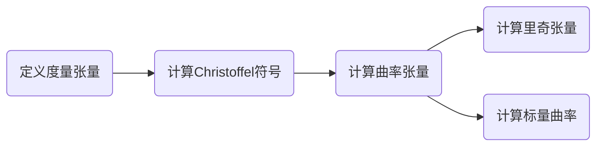

# 黎曼几何引论：正文对称李代数

## 1. 背景介绍

黎曼几何是研究曲面或流形上的几何结构的数学分支，它是由19世纪的数学家伯纳德·黎曼提出的。在物理学中，黎曼几何是广义相对论的数学基础，描述了时空的弯曲。而李代数则是研究对称性和守恒律的代数结构，它在量子力学和粒子物理学中扮演着重要角色。正文对称李代数是一类特殊的李代数，它们与黎曼几何有着深刻的联系。

## 2. 核心概念与联系

### 2.1 黎曼流形与度量张量

黎曼流形是一个光滑流形，其上赋予了一个正定的度量张量。度量张量可以用来测量流形上的距离和角度，是研究流形几何性质的基础。

### 2.2 李代数的定义

李代数是一个带有李括号的向量空间，李括号是一个满足双线性、反对称和雅可比恒等式的二元运算。

### 2.3 正文对称性

正文对称性是指李代数的一个性质，它要求李括号与度量张量兼容，即李括号的操作保持度量张量不变。

### 2.4 黎曼几何与李代数的联系

黎曼几何与李代数的联系主要体现在对称性的研究上。黎曼流形的等距同构群可以通过其李代数来描述，而正文对称李代数则是研究这些对称性的有力工具。

## 3. 核心算法原理具体操作步骤

在黎曼几何中，计算曲率张量、里奇张量和标量曲率是理解流形几何性质的关键。这些张量的计算涉及到Christoffel符号和度量张量的导数。



## 4. 数学模型和公式详细讲解举例说明

### 4.1 度量张量

度量张量 $g_{ij}$ 定义了流形上的内积，其表达式为：

$$
ds^2 = g_{ij} dx^i dx^j
$$

其中 $ds$ 是流形上两点之间的无穷小距离，$dx^i$ 是坐标的无穷小变化。

### 4.2 Christoffel符号

Christoffel符号 $\Gamma^k_{ij}$ 是度量张量的函数，用于描述流形上的联络，其表达式为：

$$
\Gamma^k_{ij} = \frac{1}{2} g^{kl} \left( \frac{\partial g_{jl}}{\partial x^i} + \frac{\partial g_{il}}{\partial x^j} - \frac{\partial g_{ij}}{\partial x^l} \right)
$$

### 4.3 曲率张量

曲率张量 $R^l_{ijk}$ 描述了流形的弯曲程度，其表达式为：

$$
R^l_{ijk} = \frac{\partial \Gamma^l_{ij}}{\partial x^k} - \frac{\partial \Gamma^l_{ik}}{\partial x^j} + \Gamma^m_{ij} \Gamma^l_{mk} - \Gamma^m_{ik} \Gamma^l_{mj}
$$

### 4.4 里奇张量和标量曲率

里奇张量 $R_{ij}$ 是曲率张量的迹，标量曲率 $R$ 是里奇张量的迹，它们分别描述了流形的平均弯曲程度和总体弯曲程度。

$$
R_{ij} = R^k_{ikj}, \quad R = g^{ij} R_{ij}
$$

## 5. 项目实践：代码实例和详细解释说明

在实际项目中，我们可以使用Python的SymPy库来计算黎曼几何中的各种张量。以下是一个简单的例子：

```python
from sympy import symbols, Function, diff
from sympy.tensor.array import Array
from sympy.diffgeom import Manifold, Patch, CoordSystem

# 定义流形和坐标系
m = Manifold('M', 2)
patch = Patch('P', m)
rect = CoordSystem('rect', patch)
x, y = rect.coord_functions()

# 定义度量张量
g = Array([[1, 0], [0, 1]])

# 计算Christoffel符号
Gamma = [[[diff(g[i, j], rect.coord_function(k)) +
           diff(g[i, k], rect.coord_function(j)) -
           diff(g[j, k], rect.coord_function(i)) for k in range(2)]
          for j in range(2)] for i in range(2)]

# 输出Christoffel符号
for i in range(2):
    for j in range(2):
        for k in range(2):
            print(f'Gamma^{i}_{j}{k} = {Gamma[i][j][k]}')
```

这段代码定义了一个二维流形和一个度量张量，然后计算了Christoffel符号。

## 6. 实际应用场景

黎曼几何和李代数在多个领域有着广泛的应用，例如：

- 广义相对论中的时空模型
- 机器学习中的流形学习
- 机器人学中的运动规划
- 计算机视觉中的形状分析

## 7. 工具和资源推荐

- SymPy：一个Python库，用于符号计算，包括黎曼几何的计算。
- SageMath：一个开源的数学软件系统，包含黎曼几何的工具。
- Mathematica：一个强大的计算软件，提供了丰富的黎曼几何计算功能。

## 8. 总结：未来发展趋势与挑战

黎曼几何和李代数的研究仍然是数学和物理学中的热点领域。随着计算能力的提升和算法的发展，我们可以期待在这些领域有更多的突破，尤其是在理解宇宙的基本结构和开发新的机器学习算法方面。

## 9. 附录：常见问题与解答

Q1: 黎曼几何和欧几里得几何有什么区别？
A1: 黎曼几何研究的是曲面或流形上的几何结构，而欧几里得几何研究的是平坦空间中的几何结构。

Q2: 李代数在物理学中有什么应用？
A2: 李代数在量子力学和粒子物理学中用于描述对称性和守恒律。

Q3: 什么是正文对称李代数？
A3: 正文对称李代数是一类特殊的李代数，它要求李括号与度量张量兼容，即李括号的操作保持度量张量不变。

作者：禅与计算机程序设计艺术 / Zen and the Art of Computer Programming