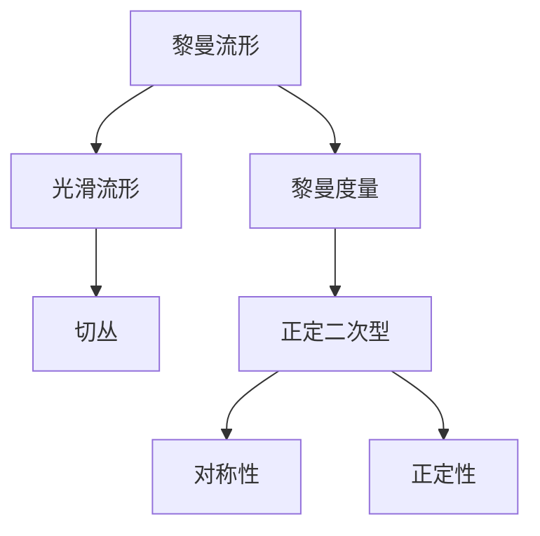
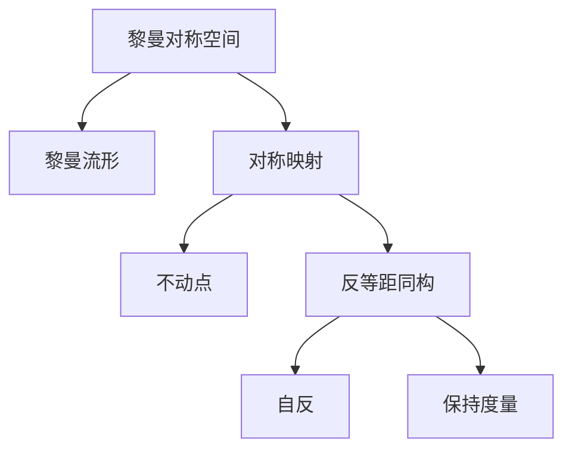

# 黎曼几何引论：黎曼对称空间的性质

## 1.背景介绍

黎曼几何是现代数学中一个极其重要的分支,它源于19世纪卡尔·黎曼对欧几里德几何的推广和发展。黎曼几何研究了在更一般的流形(manifold)上的几何结构,而不仅仅局限于欧几里得空间。这种推广使得黎曼几何在数学、物理学和其他科学领域有着广泛的应用。

其中,黎曼对称空间(Riemannian symmetric space)是黎曼几何中一个特殊而重要的概念。它是指在某种意义下具有对称性质的黎曼流形。黎曼对称空间在许多数学领域扮演着重要角色,如微分几何、黎曼几何、李群和李代数理论等。同时,它们也在物理学中有着应用,如相对论、量子场论和超弦理论等。

本文将系统地介绍黎曼对称空间的基本概念、性质和重要应用,为读者揭示这一几何结构的本质和内在联系。

## 2.核心概念与联系

### 2.1 黎曼流形

在介绍黎曼对称空间之前,我们需要先了解黎曼流形的概念。一个黎曼流形是一个赋予了黎曼度量的光滑流形。更精确地说,设 $M$ 是一个 $n$ 维光滑流形, $TM$ 是其切丛(tangent bundle)。一个黎曼度量 $g$ 是一个光滑分配的正定二次型,即对于每一点 $p \in M$,有 $g_p: T_pM \times T_pM \rightarrow \mathbb{R}$ 满足:

1. $g_p(u, v) = g_p(v, u)$ (对称性)
2. $g_p(u, u) > 0, \forall u \neq 0$ (正定性)

这样的对 $(M, g)$ 就称为一个黎曼流形。黎曼度量赋予了流形一个内在的距离度量,使得我们可以在流形上定义长度、角度、曲率等几何概念。



### 2.2 对称性

对称性是黎曼对称空间的核心概念。一个黎曼流形 $(M, g)$ 被称为黎曼对称空间,如果对于每一点 $p \in M$,存在一个等距同构射 $s_p: M \rightarrow M$ 满足:

1. $s_p(p) = p$ (不动点)
2. $s_p$ 是一个反等距同构射,即 $s_p^2 = id$ 且 $s_p^*g = g$ (保持度量)

这个等距同构射 $s_p$ 被称为对应于点 $p$ 的对称映射。它的存在保证了流形在该点处具有一定的对称性。



黎曼对称空间具有许多良好的几何和代数性质,使得它们在数学和物理学中扮演着重要角色。

## 3.核心算法原理具体操作步骤

虽然黎曼对称空间的定义看似简单,但要构造和研究它们并不容易。下面我们将介绍一些关键的算法原理和操作步骤。

### 3.1 构造黎曼对称空间

#### 3.1.1 李群和李代数

构造黎曼对称空间的一个重要工具是利用李群和李代数的理论。给定一个李群 $G$ 及其李代数 $\mathfrak{g}$,我们可以考虑 $G$ 在自身上的伴随作用 $Ad: G \rightarrow Aut(\mathfrak{g})$。对于 $\mathfrak{g}$ 中的任意元素 $X$,存在唯一的不变子空间 $\mathfrak{m}$,满足:

$$\mathfrak{g} = \mathfrak{k} \oplus \mathfrak{m}$$

其中 $\mathfrak{k} = \{Y \in \mathfrak{g} | [Y, X] = 0\}$ 是 $X$ 在 $\mathfrak{g}$ 中的中心化子代数。

#### 3.1.2 对称代数

定义 $\mathfrak{g}$ 上的新括号运算:

$$[X, Y]_X = [X, [X, Y]]$$

则 $(\mathfrak{m}, [\cdot, \cdot]_X)$ 构成一个李代数,被称为 $X$ 的对称代数,记作 $\mathfrak{m}_X$。

#### 3.1.3 生成黎曼对称空间

对于任意 $X \in \mathfrak{g}$,考虑李群 $G$ 的等价类:

$$G/K = \{gK | g \in G\}$$

其中 $K$ 是 $\mathfrak{k}$ 对应的子群。在 $G/K$ 上引入左不变度量,使得 $T_o(G/K) \cong \mathfrak{m}$,这里 $o = eK$ 是 $G/K$ 上的标准原点。则 $(G/K, g)$ 就构成了一个黎曼对称空间,称为 $G/K$ 的对称空间模型。

这个构造过程可以总结为以下流程图:

```mermaid
graph TD
  A[李群 G] -->B[李代数 g]
  B -->C[选取元素 X]
  C -->D[对称代数 m_X]
  D -->E[商空间 G/K]
  E -->F[引入左不变度量]
  F -->G[黎曼对称空间 (G/K, g)]
```

### 3.2 黎曼对称空间的性质

经过上述构造,我们得到了一个黎曼对称空间 $(G/K, g)$。它具有以下重要性质:

1. 曲率张量具有很好的代数性质,例如是并行的、循环的等。
2. 曲率算子在切空间上的特征值是常数,因此曲率表现出一定的同构性。
3. 任意两点可以通过一个等距同构射连接,即存在对称映射使得空间具有一定的对称性。
4. 切空间在某种意义下是"曲面上的平面",可以在切空间上研究许多局部性质。
5. 存在丰富的等距同构射群作用,使得空间具有很好的变换性质。

这些性质使得黎曼对称空间在几何分析、微分方程、表示论等领域有着重要应用。

## 4.数学模型和公式详细讲解举例说明

在上一节中,我们已经介绍了构造黎曼对称空间的基本算法流程。现在让我们来具体分析其中涉及的数学模型和公式。

### 4.1 李代数分解

回顾一下李代数分解的过程。给定一个李代数 $\mathfrak{g}$ 和其中的元素 $X$,我们有:

$$\mathfrak{g} = \mathfrak{k} \oplus \mathfrak{m}$$

其中 $\mathfrak{k} = \{Y \in \mathfrak{g} | [Y, X] = 0\}$ 是 $X$ 的中心化子,而 $\mathfrak{m}$ 是 $\mathfrak{k}$ 的补空间。

这个分解对于构造黎曼对称空间是至关重要的。事实上,对于任意 $Y \in \mathfrak{m}$,我们有:

$$[X, [X, Y]] \in \mathfrak{m}$$

也就是说,对称代数 $\mathfrak{m}_X = (\mathfrak{m}, [\cdot, \cdot]_X)$ 是一个李代数。

### 4.2 曲率张量

在黎曼对称空间 $(G/K, g)$ 中,曲率张量 $R$ 具有很好的代数性质。具体来说,对于任意 $X, Y, Z \in \mathfrak{m}$,有:

$$
\begin{align*}
R(X, Y)Z &= [[X, Y], Z] \\
(R(X, Y)Z, W) &= -(R(X, Y)W, Z)
\end{align*}
$$

第一个等式表明曲率张量是并行的(parallel),第二个等式表明它是循环的(cyclic)。这些性质使得曲率张量在黎曼对称空间中有着特殊的结构。

### 4.3 曲率算子

定义曲率算子 $\rho: \mathfrak{m} \rightarrow \mathfrak{gl}(\mathfrak{m})$ 为:

$$\rho(X)Y = R(X, Y)X$$

其中 $R$ 是黎曼曲率张量。对于黎曼对称空间,曲率算子具有以下重要性质:

1. $\rho(X)$ 是自伴的,即对于任意 $Y, Z \in \mathfrak{m}$,有 $(\rho(X)Y, Z) = (Y, \rho(X)Z)$。
2. $\rho(X)$ 的特征值是常数,即存在常数 $\lambda_1, \ldots, \lambda_k$,使得对任意 $Y \in \mathfrak{m}$,有 $\rho(X)Y = \sum_{i=1}^k \lambda_i \operatorname{proj}_{\mathfrak{m}_i}Y$。其中 $\mathfrak{m} = \mathfrak{m}_1 \oplus \cdots \oplus \mathfrak{m}_k$ 是 $\mathfrak{m}$ 关于 $\rho(X)$ 的特征空间分解。

这种曲率算子的性质反映了黎曼对称空间曲率的同构性,对于研究空间的几何性质是非常有用的。

### 4.4 举例:实射影空间

作为一个具体例子,让我们来看看实射影空间 $\mathbb{RP}^n$ 的黎曼对称空间结构。

$\mathbb{RP}^n$ 可以看作是李群 $O(n+1)$ 在标准球面 $S^n \subset \mathbb{R}^{n+1}$ 上的等距作用的轨道空间。具体来说,对于任意 $x \in S^n$,有:

$$\mathbb{RP}^n = O(n+1)/O(n)$$

其中 $O(n)$ 是 $O(n+1)$ 中 $x$ 的等分子群。

在这个模型下,实射影空间 $\mathbb{RP}^n$ 自然成为一个黎曼对称空间。它的曲率算子 $\rho$ 在标准切空间 $\mathfrak{m} \cong T_x S^n$ 上的特征值为:

$$\lambda_1 = \cdots = \lambda_n = n, \quad \lambda_{n+1} = 0$$

这反映了 $\mathbb{RP}^n$ 作为对称空间的曲率同构性。

## 5.项目实践:代码实例和详细解释说明

为了帮助读者更好地理解黎曼对称空间的概念和性质,我们将通过一个实际的代码项目来演示如何计算和可视化这些空间的几何量。

在这个项目中,我们将使用 Python 和一些常用的科学计算库,如 NumPy、SciPy 和 Matplotlib。我们将重点关注两个具体的黎曼对称空间:球面 $S^n$ 和实射影空间 $\mathbb{RP}^n$。

### 5.1 表示李群和李代数

首先,我们需要一种方式来表示李群和李代数。对于特殊正交群 $SO(n)$,我们可以使用旋转矩阵来表示群元素。而对于其李代数 $\mathfrak{so}(n)$,我们可以使用反对称矩阵来表示。

下面是一个实现 $\mathfrak{so}(3)$ 的 Python 代码示例:

```python
import numpy as np

def so3_basis():
    """返回 so(3) 的基底"""
    e1 = np.array([[0, 0, 0], [0, 0, -1], [0, 1, 0]])
    e2 = np.array([[0, 0, 1], [0, 0, 0], [-1, 0, 0]])
    e3 = np.array([[0, -1, 0], [1, 0, 0], [0, 0, 0]])
    return [e1, e2, e3]

def so3_bracket(X, Y):
    """计算 so(3) 中两个元素的括号乘积"""
    return np.matmul(X, Y) - np.matmul(Y, X)
```

这个代码定义了 $